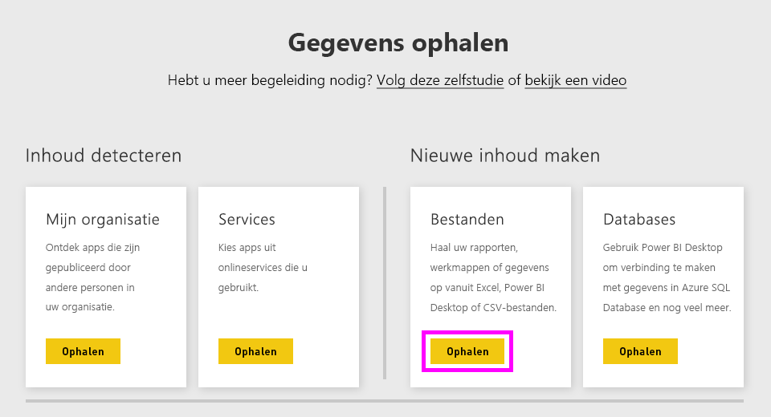
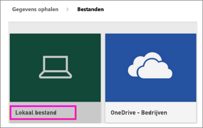
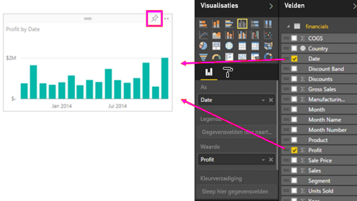
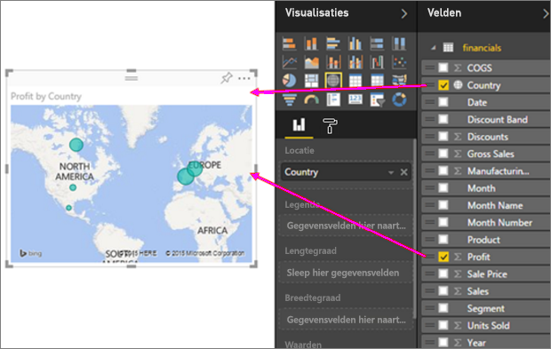
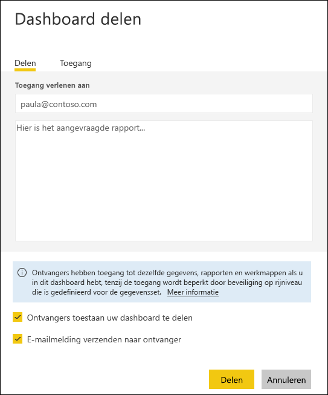

# Aantrekkelijke rapporten van Excel-werkmappen maken in de Power BI-service
Uw manager wil een rapport zien met recente verkoopcijfers gecombineerd met uw laatste campagne-indrukken aan het einde van de dag. De recentste gegevens bevinden zich echter op verschillende systemen van derden en in bestanden op uw laptop. In het verleden duurde het uren om visuals en een rapport te maken, en u begint zich zorgen te maken.

Nergens voor nodig. Met Power BI maakt u in een mum van tijd een geweldig rapport.

In dit voorbeeld uploaden we een Excel-bestand van een lokaal systeem, maken we een nieuw rapport en delen het met collega's, allemaal vanuit Power BI.

## Uw gegevens voorbereiden
We nemen een eenvoudig Excel-bestand als voorbeeld. 

1. Voordat u uw Excel-bestand in Power BI kunt laden, moet u uw gegevens indelen in een platte tabel. In een platte tabel bevat elke kolom hetzelfde gegevenstype, bijvoorbeeld tekst, datum, getal of valuta. Als het goed is, bevat uw tabel een rij met veldnamen, maar geen kolommen of rijen met totalen.

   

2. Maak vervolgens uw gegevens op als een tabel. Selecteer in Excel op het tabblad **Start** in de groep **Stijlen** de optie **Opmaken als tabel**. 

3. Selecteer een tabelstijl die u op het werkblad wilt toepassen. 

   Uw Excel-werkblad is nu gereed om te laden in Power BI.

   

## Uw Excel-bestand naar de Power BI-service uploaden
In de Power BI-service wordt verbinding gemaakt met veel gegevensbronnen, waaronder Excel-bestanden die op uw computer aanwezig zijn. 

 > [!NOTE] 
 > Gebruikt de [werkmap Financieel voorbeeld](sample-financial-download.md) voor de rest van deze zelfstudie.

1. Meld u aan bij de Power BI-service om te beginnen. Als u zich nog niet hebt aangemeld, [kunt u dit gratis doen](https://powerbi.com).

2. U wilt een nieuw dashboard maken. Open **Mijn werkruimte** en selecteer het pictogram **Maken**.

   

3. Selecteer **Dashboard**, voer een naam in en selecteer vervolgens **Maken**. 

   Het nieuwe dashboard wordt zonder gegevens weergegeven.

   

4. Selecteer **Gegevens ophalen** onderaan het navigatievenster. 

5. Selecteer op de pagina **Gegevens ophalen** in het vak **Bestanden** onder **Nieuwe inhoud maken** de optie **Ophalen**.

   

6. Selecteer op de pagina **Bestanden** de optie **Lokaal bestand**. Navigeer naar het Excel-werkmapbestand op uw computer en selecteer **Openen** om het in de Power BI-service te laden. 

   

7. Selecteer op de pagina **Lokaal bestand** de optie **Importeren**.

## Uw rapport maken
Nadat de Power BI-service uw Excel-bestand heeft geïmporteerd, kunt u beginnen met het bouwen van uw rapport. 

1. Wanneer het bericht **Uw gegevensset is gereed** verschijnt, selecteert u **Gegevensset weergeven**.  

   Power BI opent in de bewerkweergave en geeft het rapportcanvas weer. Aan de rechterkant staan de deelvensters **Visualisaties**, **Filters** en **Velden**. U ziet dat de tabelgegevens van uw Excel-werkmap in het deelvenster **Velden** worden weergegeven. Onder de naam van de tabel geeft Power BI de kolomkoppen weer als afzonderlijke velden.

   

2. U kunt nu beginnen met het maken van visualisaties. Stel dat uw manager de winst over een bepaalde periode wil bekijken. Sleep in het deelvenster **Velden** de optie **Winst** naar het rapportcanvas. 

   Power BI geeft standaard een staafdiagram weer. 

3. Sleep **Datum** naar het rapportcanvas. 

   Power BI werkt het staafdiagram bij en geeft de winst op datum weer.

   

   > [!TIP]
   > Als uw grafiek er niet uitziet zoals verwacht, controleert u de aggregaties. Klik bijvoorbeeld in de bron **Waarde** met de rechtermuisknop op het veld dat u zojuist hebt toegevoegd en controleer of de gegevens op de gewenste manier worden geaggregeerd. In dit voorbeeld gebruiken we **Som**.
   > 

Uw manager wil weten welke landen het meest winstgevend zijn. Maak indruk op hen met een kaartvisualisatie. 

1. Selecteer een leeg gebied op het rapportcanvas. 

2. Sleep in het deelvenster **Velden** de velden **Land** en **Opbrengst** naar het rapportcanvas.

   Power BI maakt een kaartvisualisatie met bellen die de relatieve winst per locatie aangeven.

   

En hoe kan een visualisatie met verkoop per product en marktsegment worden weergegeven? Simpel. 

1. Selecteer in het deelvenster **Velden** de velden **Verkoop**, **Product** en **Segment**. 
   
   Power BI maakt direct een staafdiagram. 

2. Wijzig het type van de grafiek door een van de pictogrammen in het menu **Visualisaties** te kiezen. Wijzig het type bijvoorbeeld in een **Gestapeld kolomdiagram**. 

3. Als u de grafiek wilt sorteren, selecteert u **Meer opties** (...) > **Sorteren op**.

   

Maak al uw visuals vast aan uw dashboard. U kunt het nu delen met uw collega's.

   

## Uw dashboard delen
Stel dat u uw dashboard wilt delen met uw manager. U kunt uw dashboard en het bijbehorende rapport delen met een collega die een Power BI-account heeft. Deze kan met uw rapport werken, maar geen wijzigingen opslaan.

1. Als u uw rapport wilt delen, selecteert u **Delen** aan de bovenkant van het dashboard.

   

   Power BI geeft de pagina **Dashboard delen** weer. 

2. Voer de e-mailadressen van de ontvangers in het vak **E-mailadressen invoeren** in en voeg een bericht toe aan het vak eronder. 

3. Als u wilt toestaan dat ontvangers uw dashboard kunnen delen met anderen, selecteert u **Ontvangers toestaan uw dashboard te delen**. Selecteer **Delen**.

   

## Volgende stappen

* [Aan de slag met de Power BI-service](service-get-started.md)
* [Aan de slag met Power BI Desktop](desktop-getting-started.md)
* [Basisconcepten voor ontwerpers in de Power BI-service](service-basic-concepts.md)

Nog vragen? [Misschien dat de Power BI-community het antwoord weet](https://community.powerbi.com/)

