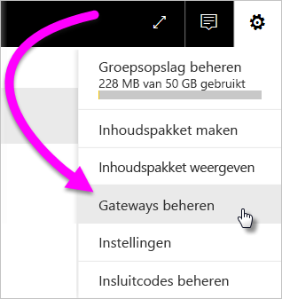
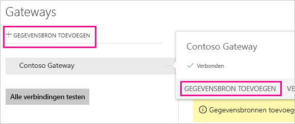
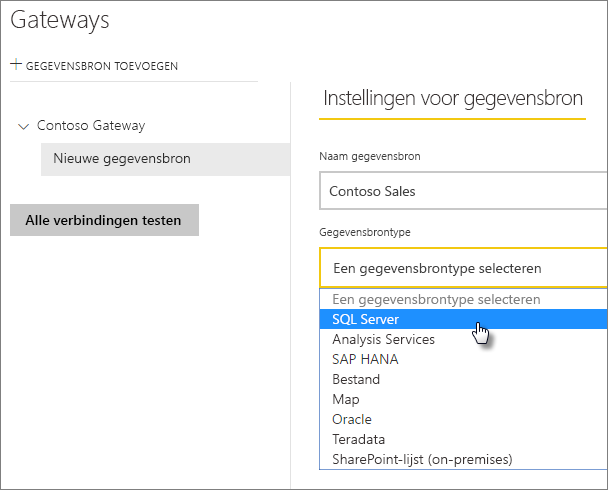
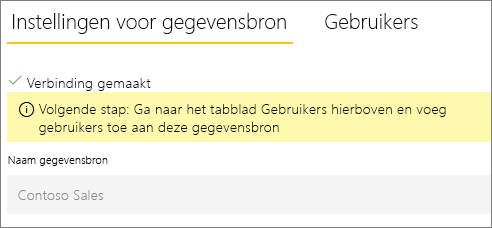
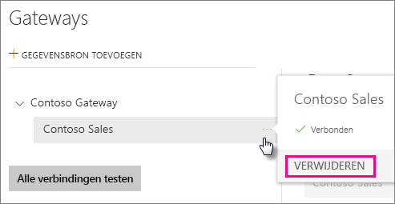
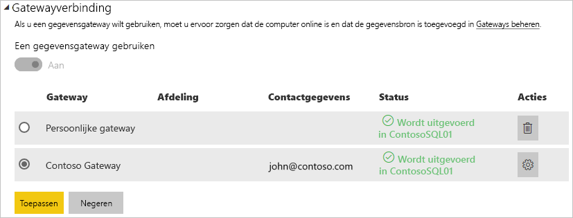
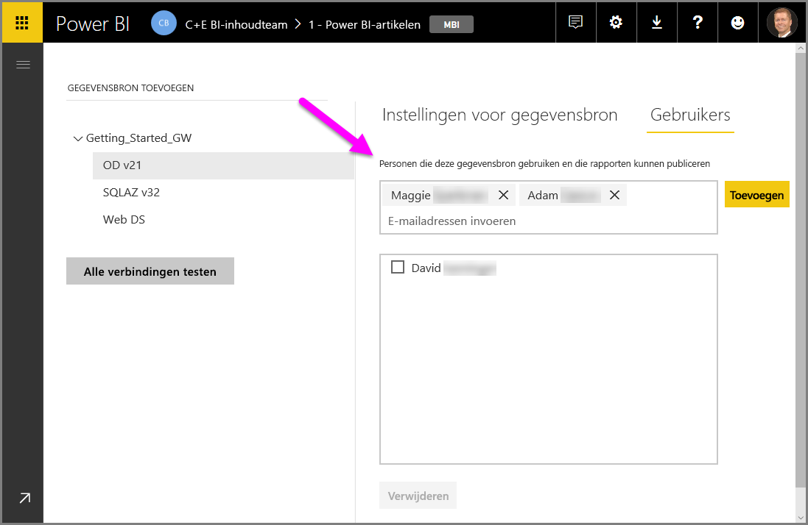
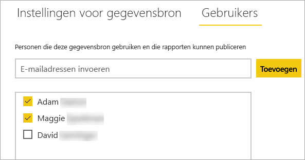
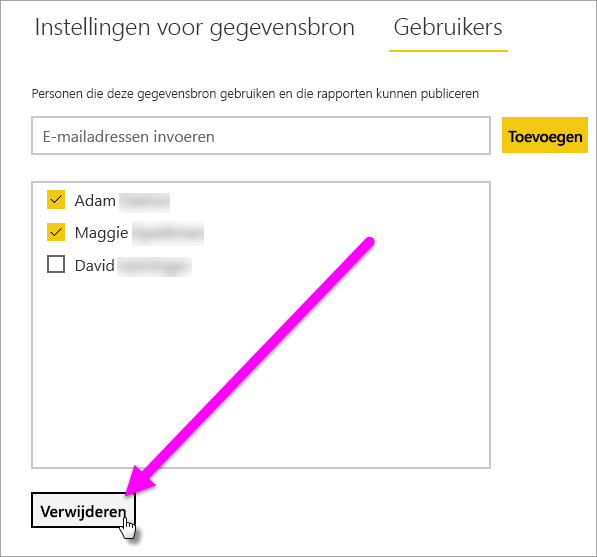

# Gegevensbronnen beheren

[!INCLUDE [gateway-rewrite](includes/gateway-rewrite.md)]

Power BI biedt ondersteuning voor veel on-premises gegevensbronnen en elke bron heeft zijn eigen vereisten. Een gateway kan worden gebruikt voor een enkele gegevensbron of meerdere gegevensbronnen. In dit voorbeeld laten we u zien hoe u SQL Server als gegevensbron kunt toevoegen. De stappen zijn ongeveer hetzelfde bij andere gegevensbronnen.

De meeste beheerbewerkingen voor gegevensbronnen kunnen ook worden uitgevoerd met behulp van API's. Zie [REST API's (gateways)](/rest/api/power-bi/gateways) voor meer informatie.

## Een gegevensbron toevoegen

1. Selecteer rechtsboven in de Power BI-service het tandwielpictogram  > **Gateways beheren**.

    

2. Selecteer een gateway en selecteer vervolgens **Gegevensbron toevoegen**. Of ga naar **Gateways** > **Gegevensbron toevoegen**.

    

3. Selecteer het **type gegevensbron**.

    

4. Voer gegevens voor de gegevensbron in. In dit voorbeeld zijn deze **Server**, **Database** en overige gegevens. 

    

5. Voor SQL Server kiest u voor **Verificatiemethode** van **Windows** of **Basic** (SQL-verificatie). Als u **Basic** kiest, voert u de referenties voor de gegevensbron in.

6. Onder **Geavanceerde instellingen** kunt u optioneel het [privacyniveau](https://support.office.com/article/Privacy-levels-Power-Query-CC3EDE4D-359E-4B28-BC72-9BEE7900B540) voor uw gegevensbron configureren (geldt niet voor [DirectQuery](desktop-directquery-about.md)).

    

7. Selecteer **Toevoegen**. U ziet *Verbinding gemaakt* als de procedure is voltooid.

    

U kunt deze gegevensbron nu gebruiken om gegevens uit SQL Server op te nemen in uw Power BI-dashboards en -rapporten.

## Een gegevensbron verwijderen

U kunt een gegevensbron verwijderen als u deze niet meer nodig hebt. Als u een gegevensbron verwijdert, werken de dashboards en rapporten die afhankelijk zijn van de gegevensbron niet meer.

Ga naar de gegevensbron en selecteer **Verwijderen** als u een gegevensbron wilt verwijderen.

## De gegevensbron gebruiken voor geplande vernieuwing of DirectQuery

Nadat u de gegevensbron hebt gemaakt, is deze beschikbaar voor gebruik met zowel DirectQuery-verbindingen als via geplande vernieuwing.

> [!NOTE]
>De servernaam en databasenaam die worden gebruikt voor Power BI Desktop en de gegevensbron in de on-premises gegevensgateway moeten overeenkomen.

De koppeling tussen uw gegevensset en de gegevensbron in de gateway is gebaseerd op uw server- en databasenaam. Deze namen moeten overeenkomen. Als u bijvoorbeeld een IP-adres als servernaam gebruikt, moet u dit IP-adres in Power BI Desktop gebruiken voor de gegevensbron in de gatewayconfiguratie. Als u in Power BI Desktop *SERVER\EXEMPLAAR* gebruikt, moet u daar ook gebruik van maken in de gegevensbron die u voor de gateway configureert.

Als u wordt vermeld op het tabblad **Gebruikers** voor de gegevensbron die is geconfigureerd in de gateway, en als de server- en databasenaam overeenkomen, wordt de gateway als optie vermeld om te gebruiken bij geplande vernieuwing.

> [!WARNING]
> Als uw gegevensset meerdere gegevensbronnen bevat, moet elke gegevensbron aan de gateway worden toegevoegd. Als een of meer gegevensbronnen niet aan de gateway zijn toegevoegd, wordt de gateway niet weergegeven omdat deze niet beschikbaar is voor geplande vernieuwing.

### Beperkingen

OAuth is uitsluitend een ondersteund verificatieschema voor aangepaste connectoren voor de on-premises gegevensgateway. U kunt geen andere gegevensbronnen toevoegen waarvoor OAuth vereist is. Als uw gegevensset een gegevensbron bevat waarvoor OAuth vereist is en als deze gegevensbron geen aangepaste connector is, kunt u de gateway niet gebruiken voor geplande vernieuwing.

## Gebruikers beheren

Als u een gegevensbron aan een gateway hebt toegevoegd, geeft u gebruikers en beveiligingsgroepen met e-mailfunctie toegang tot die bepaalde gegevensbron (niet tot de hele gateway). Met de gebruikerslijst voor de gegevensbron wordt alleen gecontroleerd wie er rapporten mag publiceren die gegevens uit de gegevensbron bevatten. Rapporteigenaren kunnen dashboards, inhoudspakketten en apps maken en deze delen met andere gebruikers.

U kunt gebruikers en beveiligingsgroepen ook administratieve toegang tot de gateway geven.

### Gebruikers toevoegen aan een gegevensbron

1. Selecteer rechtsboven in de Power BI-service het tandwielpictogram  > **Gateways beheren**.

2. Selecteer de gegevensbron waaraan u gebruikers wilt toevoegen.

3. Selecteer **Gebruikers** en voer een gebruiker uit uw organisatie in die u toegang wilt verlenen tot de geselecteerde gegevensbron. In het volgende scherm voegt u bijvoorbeeld Maggie en Adam toe.

    

4. Selecteer **Toevoegen** en de naam van het toegevoegde lid wordt in het vak weergegeven.

    

Houd er rekening mee dat u gebruikers moet toevoegen aan elke gegevensbron waartoe u toegang wilt verlenen. Elke gegevensbron heeft een afzonderlijke lijst met gebruikers. Voeg gebruikers afzonderlijk toe aan elke gegevensbron.

### Gebruikers uit een gegevensbron verwijderen

Op het tabblad **Gebruikers** voor de gegevensbron kunt u gebruikers en beveiligingsgroepen verwijderen die deze gegevensbron gebruiken.

## Versleutelde referenties opslaan in de cloud

Wanneer u een gegevensbron aan de gateway toevoegt, moet u referenties opgeven voor de gegevensbron. Alle query's over de gegevensbron worden uitgevoerd met deze referenties. De referenties zijn veilig versleuteld. Voordat de referenties worden opgeslagen in de cloud, worden ze versleuteld met behulp van symmetrische codering zodat ze in de cloud niet kunnen worden ontsleuteld. De referenties worden verzonden naar de on-premises machine waarop de gateway wordt uitgevoerd, waar ze worden ontsleuteld als de gegevensbronnen worden geopend.

## Lijst met beschikbare typen gegevensbronnen

De volgende gegevensbronnen voor Power BI worden door de on-premises gegevensgateway ondersteund. Behalve on-premises gegevensbronnen kan een gegevensgateway ook nodig zijn voor bronnen achter een firewall, in een VPN of in een virtueel netwerk.

| **Gegevensbron** | **Live/DirectQuery** | **Handmatige of geplande vernieuwing (door gebruiker geconfigureerd)** |
| --- | --- | --- |
| Amazon Redshift |Ja |Ja |
| Analysis Services |Ja |Ja |
| AtScale-kubussen |Ja |Ja |
| Azure Active Directory |Nee |Ja |
| Azure Blob Storage |Nee |Ja |
| Azure DevOps Server |Nee |Ja |
| Azure Table Storage |Nee |Ja |
| BI-connector |Ja |Ja |
| Denodo |Ja |Ja |
| Dremio |Ja |Ja |
| EmigoDataSourceConnector |Nee |Ja |
| Essbase |Ja |Ja |
| Exasol |Ja |Ja |
| Bestand |Nee |Ja |
| Map |Nee |Ja |
| Paxata |Nee |Ja |
| IBM DB2 |Ja |Ja |
| IBM Informix-database |Nee |Ja |
| IBM Netezza |Ja |Ja |
| Impala |Ja |Ja |
| Jethro ODBC |Ja |Ja |
| Kyligence Enterprise |Ja |Ja |
| MarkLogic ODBC |Ja |Ja |
| Microsoft Graph Security |Nee |Ja |
| MySQL |Nee |Ja |
| ODBC |Nee |Ja |
| OData |Nee |Ja |
| OLE DB |Nee |Ja |
| Oracle |Ja |Ja |
| PostgreSQL |Nee |Ja |
| QubolePresto |Ja |Ja |
| Quick Base-connector |Nee |Ja |
| SAP Business Warehouse-berichtenserver |Ja |Ja |
| SAP Business Warehouse-server |Ja |Ja |
| SAP HANA |Ja |Ja |
| SQL Server |Ja |Ja |
| SharePoint |Nee |Ja |
| Snowflake |Ja |Ja |
| Spark |Ja |Ja |
| SurveyMonkey |Nee |Ja |
| Sybase |Nee |Ja |
| TeamDesk.Database |Nee |Ja |
| Teradata |Ja |Ja |
| Vertica |Ja |Ja |
| Web |Nee |Ja |
| Workforce Dimensions |Nee |Ja |

## Volgende stappen

* [Manage your data source - Analysis Services](service-gateway-enterprise-manage-ssas.md) (Uw gegevensbron beheren - Analysis Services)
* [Manage your data source - SAP HANA](service-gateway-enterprise-manage-sap.md) (Uw gegevensbron beheren - SAP HANA)
* [Manage your data source - SQL Server](service-gateway-enterprise-manage-sql.md) (Gegevensbron beheren - SQL Server)
* [Manage your data source - Oracle](service-gateway-onprem-manage-oracle.md) (Gegevensbron beheren - Oracle)
* [Uw gegevensbron beheren - importeren/geplande vernieuwing](service-gateway-enterprise-manage-scheduled-refresh.md)
* [Richtlijnen voor het implementeren van een gegevensgateway](service-gateway-deployment-guidance.md)

Hebt u nog vragen? Misschien dat de [Power BI-community](https://community.powerbi.com/) het antwoord weet.
