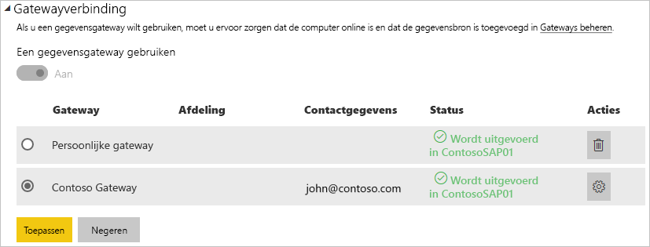

# Uw gegevensbron beheren - SAP HANA

[!INCLUDE [gateway-rewrite](includes/gateway-rewrite.md)]

Nadat u de [on-premises gegevensgateway hebt geïnstalleerd](/data-integration/gateway/service-gateway-install), moet u [gegevensbronnen toevoegen](service-gateway-data-sources.md#add-a-data-source) die met de gateway kunnen worden gebruikt. In dit artikel wordt beschreven hoe u werkt met gateways en SAP HANA-gegevensbronnen die worden gebruikt voor gepland vernieuwen of voor DirectQuery.

## Een gegevensbron toevoegen

Zie [Een gegevensbron toevoegen](service-gateway-data-sources.md#add-a-data-source) voor meer informatie over het toevoegen van een gegevensbron. Selecteer SAP HANA als het **Gegevensbrontype**.

Nadat u het SAP HANA-gegevensbrontype hebt geselecteerd, vult u de **Server**, de **Gebruikersnaam** en het **Wachtwoord** voor de gegevensbron in.

> [!NOTE]
> Alle query's over de gegevensbron worden uitgevoerd met deze referenties. Zie [Versleutelde referenties opslaan in de cloud](service-gateway-data-sources.md#store-encrypted-credentials-in-the-cloud) voor meer informatie over het opslaan van referenties.

Selecteer **Toevoegen** nadat u alles hebt ingevuld. U kunt deze gegevensbron nu gebruiken voor geplande vernieuwing of DirectQuery met een on-premises SAP HANA-server. De tekst *Verbinding gemaakt* wordt weergegeven als deze bewerking is geslaagd.

### Geavanceerde instellingen

U kunt optioneel het privacyniveau voor uw gegevensbron configureren. Hiermee bepaalt u hoe gegevens kunnen worden gecombineerd. Dit wordt alleen gebruikt voor geplande vernieuwing. Het geldt niet voor DirectQuery. Zie [privacyniveaus (Power query)](https://support.office.com/article/Privacy-levels-Power-Query-CC3EDE4D-359E-4B28-BC72-9BEE7900B540)voor meer informatie over privacyniveaus voor uw gegevensbron.

## De gegevensbron gebruiken

Nadat u de gegevensbron hebt gemaakt, kan deze worden gebruikt met DirectQuery-verbindingen of via geplande vernieuwing.

> [!NOTE]
> De servernaam en databasenaam die worden gebruikt voor Power BI Desktop en de gegevensbron in de on-premises gegevensgateway moeten overeenkomen.

De koppeling tussen uw gegevensset en de gegevensbron in de gateway is gebaseerd op uw server- en databasenaam. Deze moeten overeenkomen. Als u bijvoorbeeld een IP-adres gebruikt als servernaam in Power BI Desktop, moet u dit IP-adres ook gebruiken voor de gegevensbron in de gatewayconfiguratie. Als u in Power BI Desktop *SERVER\EXEMPLAAR* gebruikt, moet u daar ook gebruik van maken in de gegevensbron die u voor de gateway configureert.

Dit geldt voor zowel DirectQuery als geplande vernieuwing.

### De gegevensbron gebruiken met DirectQuery-verbindingen

Zorg ervoor dat de servernaam en databasenaam voor Power BI Desktop en de geconfigureerde gegevensbron voor de gateway overeenkomen. Zorg er ook voor dat de gebruiker wordt vermeld op het tabblad **Gebruikers** van de gegevensbron om DirectQuery-gegevenssets te kunnen publiceren. De selectie voor DirectQuery vindt plaats in Power BI Desktop wanneer u voor het eerst gegevens importeert. Zie [DirectQuery in Power BI Desktop gebruiken](desktop-use-directquery.md) voor meer informatie over het gebruik van DirectQuery.

Als het goed is, werken uw rapporten nadat u de gegevens hebt gepubliceerd vanuit Power BI Desktop of via **Gegevens ophalen**. Nadat u de gegevensbron in de gateway hebt gemaakt, kan het enkele minuten duren voordat de verbinding kan worden gebruikt.

### De gegevensbron gebruiken met geplande vernieuwing

Als u wordt vermeld op het tabblad **Gebruikers** voor de gegevensbron die is geconfigureerd in de gateway en als de server- en databasenaam overeenkomen, wordt de gateway als optie vermeld om te gebruiken bij geplande vernieuwing.

## Volgende stappen

* [Problemen met de on-premises gegevensgateway oplossen](/data-integration/gateway/service-gateway-tshoot)
* [Problemen met gateways oplossen - Power BI](service-gateway-onprem-tshoot.md)  

Hebt u nog vragen? [Misschien dat de Power BI-community het antwoord weet](http://community.powerbi.com/)

