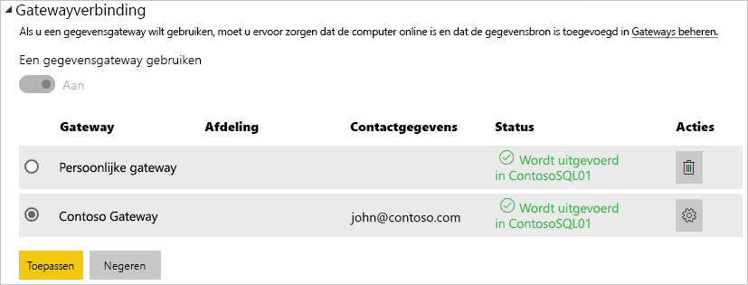

# Uw gegevensbron beheren - SQL Server

[!INCLUDE [gateway-rewrite](includes/gateway-rewrite.md)]

Nadat u de [on-premises gegevensgateway hebt geïnstalleerd](/data-integration/gateway/service-gateway-install), kunt u [gegevensbronnen](service-gateway-data-sources.md#add-a-data-source) toevoegen om bij de gateway te gebruiken. In dit artikel wordt beschreven hoe u werkt met gateways en SQL Server-gegevensbronnen die worden gebruikt voor gepland vernieuwen of voor DirectQuery.

## Een gegevensbron toevoegen

Zie [Een gegevensbron toevoegen](service-gateway-data-sources.md#add-a-data-source) voor meer informatie over het toevoegen van een gegevensbron. Selecteer onder **Gegevensbrontype** de optie **SQL Server**.

> [!NOTE]
> Wanneer u DirectQuery gebruikt, biedt de gateway alleen ondersteuning voor **SQL Server 2012 SP1** en latere versies.

Vul vervolgens de gegevens voor de gegevensbron in, waaronder **Server** en **Database**. 

Kies onder **Verificatiemethode** de optie **Windows** of **Basic**. Kies **Basic** als u SQL-verificatie wilt gebruiken in plaats van Windows-verificatie. Voer vervolgens de referenties in die u voor deze gegevensbron wilt gebruiken.

> [!NOTE]
> Alle query's voor de gegevensbron worden uitgevoerd met deze referenties, tenzij eenmalige aanmelding (SSO) met Kerberos is geconfigureerd en ingeschakeld voor de gegevensbron. Bij eenmalige aanmelding gebruiken importgegevenssets de opgeslagen referenties, maar DirectQuery-gegevenssets gebruiken de huidige Power BI-gebruiker om de query's met behulp van eenmalige aanmelding uit te voeren. Zie [Versleutelde referenties opslaan in de cloud](service-gateway-data-sources.md#store-encrypted-credentials-in-the-cloud) voor meer informatie over het opslaan van referenties. Of zie het artikel met informatie over [Kerberos gebruiken voor eenmalige aanmelding (SSO) bij on-premises gegevensbronnen vanuit Power BI](service-gateway-sso-kerberos.md).

Nadat u alles hebt ingevuld, selecteert u **Toevoegen**. U kunt deze gegevensbron nu gebruiken voor gepland vernieuwen of DirectQuery bij een on-premises SQL-server. De tekst *Verbinding gemaakt* wordt weergegeven als deze bewerking is geslaagd.

### Geavanceerde instellingen

U kunt optioneel het privacyniveau voor uw gegevensbron configureren. Met deze instelling bepaalt u hoe gegevens kunnen worden gecombineerd. Deze wordt alleen gebruikt voor geplande vernieuwing. De privacyniveau-instelling is niet van toepassing op DirectQuery. Zie [privacyniveaus (Power query)](https://support.office.com/article/Privacy-levels-Power-Query-CC3EDE4D-359E-4B28-BC72-9BEE7900B540)voor meer informatie over privacyniveaus voor uw gegevensbron.

## De gegevensbron gebruiken

Nadat u de gegevensbron hebt gemaakt, is deze beschikbaar voor gebruik met zowel DirectQuery-verbindingen als via geplande vernieuwing.

> [!NOTE]
> De servernaam en databasenaam die worden gebruikt voor Power BI Desktop en de gegevensbron in de on-premises gegevensgateway moeten overeenkomen.

De koppeling tussen uw gegevensset en de gegevensbron in de gateway is gebaseerd op uw server- en databasenaam. Deze namen moeten overeenkomen. Als u bijvoorbeeld een IP-adres gebruikt als servernaam in Power BI Desktop, moet u dit IP-adres ook gebruiken voor de gegevensbron in de gatewayconfiguratie. Als u in Power BI Desktop *SERVER\EXEMPLAAR* gebruikt, moet u daarvan gebruikmaken in de gegevensbron die u voor de gateway configureert.

Deze vereiste geldt voor zowel DirectQuery als gepland vernieuwen.

### De gegevensbron gebruiken met DirectQuery-verbindingen

Zorg ervoor dat de servernaam en databasenaam voor Power BI Desktop en de geconfigureerde gegevensbron voor de gateway overeenkomen. Zorg er ook voor dat de gebruiker wordt vermeld op het tabblad **Gebruikers** van de gegevensbron om DirectQuery-gegevenssets te kunnen publiceren. De selectie voor DirectQuery vindt plaats in Power BI Desktop wanneer u voor het eerst gegevens importeert. Zie [DirectQuery in Power BI Desktop gebruiken](desktop-use-directquery.md) voor meer informatie over het gebruik van DirectQuery.

Nadat u de gegevens hebt gepubliceerd, werken uw rapporten vanuit Power BI Desktop of via **Gegevens ophalen**. Nadat u de gegevensbron in de gateway hebt gemaakt, kan het enkele minuten duren voordat de verbinding kan worden gebruikt.

### De gegevensbron gebruiken met geplande vernieuwing

Als u wordt vermeld op het tabblad **Gebruikers** voor de gegevensbron die is geconfigureerd in de gateway en als de server- en databasenaam overeenkomen, wordt de gateway als optie vermeld om te gebruiken bij geplande vernieuwing.

## Volgende stappen

* [Verbinding maken met on-premises gegevens in SQL Server](service-gateway-sql-tutorial.md)
* [Problemen met de on-premises gegevensgateway oplossen](/data-integration/gateway/service-gateway-tshoot)
* [Problemen met gateways oplossen - Power BI](service-gateway-onprem-tshoot.md)
* [Kerberos gebruiken voor eenmalige aanmelding (SSO) bij on-premises gegevensbronnen vanuit Power BI](service-gateway-sso-kerberos.md)

Hebt u nog vragen? Misschien dat de[Power Bi-community](http://community.powerbi.com/) het antwoord weet.

