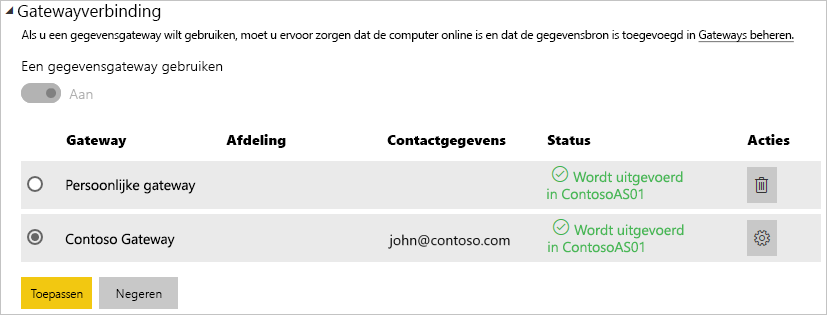

# <a name="manage-your-data-source---analysis-services"></a>Uw gegevensbron beheren - Analysis Services

[!INCLUDE [gateway-rewrite](includes/gateway-rewrite.md)]

Nadat u de [on-premises gegevensgateway hebt geïnstalleerd](/data-integration/gateway/service-gateway-install), moet u [gegevensbronnen toevoegen](service-gateway-data-sources.md#add-a-data-source) die met de gateway kunnen worden gebruikt. In dit artikel wordt beschreven hoe u werkt met gateways en Analysis Services-gegevensbronnen die worden gebruikt voor gepland vernieuwen of voor liveverbindingen.

[Bekijk deze video](https://www.youtube.com/watch?v=GPf0YS-Xbyo&feature=youtu.be) voor meer informatie over het instellen van een liveverbinding met Analysis Services.

> [!NOTE]
> Als u een gegevensbron van Analysis Services hebt, moet u de gateway installeren op een computer die lid is van hetzelfde forest/domein als de Analysis Services-server.

## <a name="add-a-data-source"></a>Een gegevensbron toevoegen

Zie [Een gegevensbron toevoegen](service-gateway-data-sources.md#add-a-data-source) voor meer informatie over het toevoegen van een gegevensbron. Selecteer Analysis Services als het **Gegevensbrontype** als u verbinding maakt met een multidimensionale server of een server in tabelvorm.


Vul vervolgens de gegevens voor de gegevensbron in, waaronder de **Server** en de **Database**. De **Gebruikersnaam** en **Wachtwoord** die u invoert worden door de gateway gebruikt om verbinding te maken met het Analysis Services-exemplaar.

> [!NOTE]
> Het Windows-account dat u opgeeft moet serverbeheerdermachtigingen hebben voor het exemplaar waarmee u verbinding maakt. Als het wachtwoord van dit account zo is ingesteld dat dit verloopt, kunnen gebruikers een verbindingsfout krijgen als het wachtwoord voor de gegevensbron niet op tijd wordt bijgewerkt. Zie [Versleutelde referenties opslaan in de cloud](service-gateway-data-sources.md#storing-encrypted-credentials-in-the-cloud) voor meer informatie over het opslaan van referenties.


Selecteer **Toevoegen** nadat u alles hebt ingevuld. U kunt deze gegevensbron nu gebruiken voor geplande vernieuwing of liveverbindingen op basis van een Analysis Services-exemplaar dat on-premises wordt uitgevoerd. De tekst *Verbinding gemaakt* wordt weergegeven als deze bewerking is geslaagd.


### <a name="advanced-settings"></a>Geavanceerde instellingen

U kunt optioneel het privacyniveau voor uw gegevensbron configureren. Hiermee bepaalt u hoe gegevens kunnen worden gecombineerd. Dit wordt alleen gebruikt voor geplande vernieuwing. Deze is niet van toepassing voor liveverbindingen. Zie [privacyniveaus (Power query)](https://support.office.com/article/Privacy-levels-Power-Query-CC3EDE4D-359E-4B28-BC72-9BEE7900B540)voor meer informatie over privacyniveaus voor uw gegevensbron.


## <a name="usernames-with-analysis-services"></a>Gebruikersnamen en Analysis Services

<iframe width="560" height="315" src="https://www.youtube.com/embed/Qb5EEjkHoLg" frameborder="0" allowfullscreen></iframe>

Telkens wanneer een gebruiker interactie heeft met een rapport dat is verbonden met Analysis Services, wordt de effectieve gebruikersnaam doorgegeven aan de gateway en vervolgens aan de on-premises Analysis Services-server. Het e-mailadres waarmee u zich bij Power BI aanmeldt wordt als de effectieve gebruikersnaam doorgegeven aan Analysis Services. Deze informatie wordt doorgegeven via de verbindingseigenschap [EffectiveUserName](https://msdn.microsoft.com/library/dn140245.aspx#bkmk_auth). Dit e-mailadres moet overeenkomen met een user principal name (UPN) die is gedefinieerd in het lokale Active Directory-domein. De UPN is een eigenschap van een Active Directory-account. Dat Windows-account moet aanwezig zijn in een Analysis Services-rol. De aanmelding kan niet tot stand worden gebracht als er geen overeenkomst wordt gevonden in Active Directory Domain Services. Zie [Kenmerken van gebruikersnamen](https://msdn.microsoft.com/library/ms677605.aspx) voor meer informatie over Active Directory Domain Services en de naamgeving van gebruikers.

U kunt ook [uw Power BI-aanmeldingsnaam toewijzen aan een UPN in een lokale map](service-gateway-enterprise-manage-ssas.md#mapping-usernames-for-analysis-services-data-sources).

## <a name="mapping-usernames-for-analysis-services-data-sources"></a>Gebruikersnamen toewijzen voor gegevensbronnen van Analysis Services

<iframe width="560" height="315" src="https://www.youtube.com/embed/eATPS-c7YRU" frameborder="0" allowfullscreen></iframe>

In Power BI kunt u gebruikersnamen toewijzen voor gegevensbronnen van Analysis Services. U kunt regels configureren om een gebruikersnaam die is aangemeld met Power BI toe te wijzen aan een naam die wordt doorgegeven voor EffectiveUserName tijdens de Analysis Services-verbinding. De functie voor het toewijzen van gebruikersnamen is een uitstekende oplossing voor het geval dat uw gebruikersnaam in AAD niet overeenkomt met een UPN in uw lokale Active Directory. Als uw e-mailadres bijvoorbeeld nancy@contoso.onmicrsoft.com is, kunt u dit adres toewijzen aan nancy@contoso.com, en dan wordt die waarde doorgegeven aan de gateway.

U kunt op twee verschillende manieren gebruikersnamen toewijzen voor Analysis Services:

* Handmatig opnieuw toewijzen van gebruikers
* On-premises Active Directory-eigenschappen opzoeken om AAD UPN's toe te wijzen aan Active Directory-gebruikers (Toewijzing op basis van AD-zoekactie)

Hoewel handmatige toewijzing mogelijk is volgens de tweede benadering, is dat tijdrovend en lastig te onderhouden. Het is met name onpraktisch wanneer het gebruik van jokertekens niet voldoet, zoals wanneer domeinnamen verschillen tussen AAD en uw on-premises AD of wanneer de namen van gebruikersaccounts verschillen tussen AAD en AD. Daarom wordt handmatige toewijzing volgens de tweede methode niet aanbevolen.

We beschrijven deze twee benaderingen, op volgorde, in de volgende twee secties.

### <a name="manual-user-name-re-mapping"></a>Handmatig opnieuw toewijzen van gebruikersnamen

U kunt voor Analysis Services-gegevensbronnen aangepaste regels configureren voor de User Principal Name (UPN). Dit maakt het eenvoudiger als uw aanmeldingsnamen voor de Power BI-service niet overeenkomen met de UPN's in uw lokale directory. Als u zich bijvoorbeeld aanmeldt bij Power BI met john@contoso.com, maar uw lokale directory-UPN john@contoso.local is, kunt u een toewijzingsregel configureren waarmee john@contoso.local wordt doorgegeven aan Analysis Services.

Volg de volgende stappen om het venster voor UPN-toewijzing te openen.

1. Navigeer naar het **tandwielpictogram** en selecteer **Gateways beheren**.
2. Vouw de gateway uit die de Analysis Services-gegevensbron bevat. Als u de Analysis Services-gegevensbron nog niet hebt gemaakt, kunt u dat ook eerst doen.
3. Selecteer de gegevensbron en selecteer vervolgens het tabblad **Gebruikers**.
4. Selecteer **Gebruikersnamen toewijzen**.

    

U krijgt dan opties te zien om regels toe te voegen en voor een bepaalde gebruiker te testen.

> [!NOTE]
> Het is mogelijk om per ongeluk een andere gebruiker te wijzigen dan u wilde. Als uw **Vervangen (oorspronkelijke waarde)** <em>@contoso.com</em> is en uw **Door (nieuwe naam)** <em>@contoso.local</em> is, worden alle gebruikers met een aanmeldingsnaam die <em>@contoso.com</em> bevat vervangen door <em>@contoso.local</em>. Ook als uw **Vervangen (oorspronkelijke naam)** <em>dave@contoso.com</em> is en uw **Door (nieuwe naam)** <em>dave@contoso.local</em> is, wordt een gebruiker met de aanmeldnaam v-dave@contoso.com verzonden als v-dave<em>@contoso.local</em>.

### <a name="ad-lookup-mapping"></a>Toewijzing op basis van AD-zoekactie

Volg de stappen in deze sectie om AAD UPN's opnieuw toe te wijzen aan Active Directory-gebruikers met behulp van een zoekactie op basis van on-premises AD-eigenschappen. Laten we eerst doornemen hoe dit werkt.

In de **Power BI-service** gebeurt het volgende:

* Voor elke query door een Power BI AAD-gebruiker naar een on-premises SSAS-server wordt een UPN-tekenreeks doorgegeven, zoals: firstName.lastName@contoso.com

> [!NOTE]
> Handmatige UPN-gebruikerstoewijzingen die zijn gedefinieerd in de Power BI-configuratie van de gegevensbron worden nog steeds toegepast *voordat* de gebruikersnaam wordt verzonden naar de on-premises gegevensgateway.

Voor een on-premises gegevensgateway met configureerbare aangepaste gebruikerstoewijzing volgt u de volgende stappen:

1. Open Active Directory Domain Services om te zoeken (automatisch of configureerbaar).
2. Zoek naar het kenmerk van de AD-persoon (zoals *E-mail*) op basis van een binnenkomende UPN-tekenreeks ('firstName.lastName@contoso.com') van de **Power BI-service**.
3. Als de AD-zoekopdracht mislukt, wordt geprobeerd de UPN door te geven aan SSAS als EffectiveUser.
4. Als de AD-zoekopdracht slaagt, wordt de *UserPrincipalName* van die AD-persoon opgehaald.
5. Het e-mailadres van de *UserPrincipalName* wordt aan SSAS doorgegeven als *EffectiveUser*, zoals: <em>Alias@corp.on-prem.contoso</em>.

Stel uw gateway op het uitvoeren van de AD-zoekopdracht:

1. [Download en installeer de nieuwste versie van de gateway](/data-integration/gateway/service-gateway-install).

2. In de gateway dient u de **on-premises gegevensgatewayservice** in te stellen zodat deze wordt uitgevoerd met een domeinaccount (in plaats van een lokaal serviceaccount, anders wordt de AD-zoekopdracht tijdens runtime niet goed uitgevoerd). Ga naar de [on-premises gegevensgateway-app](/data-integration/gateway/service-gateway-app) op uw computer en ga vervolgens naar **Service-instellingen > Serviceaccount wijzigen**. Zorg ervoor dat u de herstelsleutel voor deze gateway hebt, omdat u deze nodig hebt om de gateway te herstellen op dezelfde computer, tenzij u een nieuwe gateway wilt maken. U moet de gatewayservice opnieuw starten om de wijziging door te voeren.

3. Navigeer als administrator naar de installatiemap van de gateway, *C:\Program Files\On-premises data gateway* om ervoor te zorgen dat u schrijfrechten hebt en open het bestand *Microsoft.PowerBI.DataMovement.Pipeline.GatewayCore.dll.config*.

4. Bewerk de volgende twee configuratiewaarden voor uw AD-gebruikers volgens de kenmerkconfiguraties van *uw* Active Directory. De onderstaande configuratiewaarden zijn slechts voorbeelden: u moet deze invoeren op basis van uw Active Directory-configuratie. Deze configuraties zijn hoofdlettergevoelig, dus zorg ervoor dat deze overeenkomen met de waarden in Active Directory Domain Services.

    

    Als er geen waarde is opgegeven voor de configuratie van ADServerPath, maakt de gateway gebruik van de globale standaardcatalogus. U kunt ook meerdere waarden opgeven voor ADServerPath. Elke waarde moet worden gescheiden door puntkomma's, zoals in het volgende voorbeeld.

    ```xml
    <setting name="ADServerPath" serializeAs="String">
        <value> >GC://serverpath1; GC://serverpath2;GC://serverpath3</value>
    </setting>
    ```

    De gateway parseert de waarden voor ADServerPath van links naar rechts totdat een overeenkomst is gevonden. Als er geen overeenkomst wordt gevonden, wordt de oorspronkelijke UPN gebruikt. Zorg ervoor dat het account dat de gatewayservice (PBIEgwService) uitvoert over query-machtigingen beschikt voor alle AD-servers die u in ADServerPath opgeeft.

    De gateway ondersteunt twee typen ADServerPath, zoals in de volgende voorbeelden.

    **WinNT**

    ```xml
    <value="WinNT://usa.domain.corp.contoso.com,computer"/>
    ```

    **GC**

    ```xml
    <value> GC://USA.domain.com </value>
    ```

5. Start de **on-premises gegevensgatewayservice** opnieuw om de configuratiewijzigingen door te voeren.

### <a name="working-with-mapping-rules"></a>Werken met toewijzingsregels

Om een toewijzingsregel te maken, voert u een waarde in voor **Oorspronkelijke naam** en **Nieuwe naam** en selecteert u vervolgens **Toevoegen**.

| Veld | Beschrijving |
| --- | --- |
| Vervangen (Oorspronkelijke naam) |Het e-mailadres waarmee u zich aanmeldt bij Power BI. |
| Met (Nieuwe naam) |De waarde waarmee u de oorspronkelijke naam wilt vervangen. Het resultaat van deze vervanging wordt doorgegeven aan de eigenschap *EffectiveUserName* voor de Analysis Services-verbinding. |


Wanneer u een item in de lijst selecteert, kunt u ervoor kiezen deze opnieuw te rangschikken met behulp van de **pictogrammen van de dubbele punthaken** of de vermelding te **verwijderen**.


### <a name="using-wildcard-"></a>Jokertekens (\*) gebruiken

U kunt een jokerteken gebruiken in uw tekenreeks voor **Vervangen (Oorspronkelijke naam)** . Deze kan alleen los worden gebruikt, niet in combinatie met een ander deel van een tekenreeks. Hierdoor kunt u voor alle gebruikers een enkele waarde doorgeven aan de gegevensbron. Dit is handig als u wilt dat alle gebruikers in uw organisatie dezelfde gebruiker gebruiken in uw lokale omgeving.

### <a name="test-a-mapping-rule"></a>Een toewijzingsregel testen

U kunt controleren door wat een oorspronkelijke naam wordt vervangen door een waarde in te voeren bij **Oorspronkelijke naam** en vervolgens **Regel testen** te selecteren.


> [!NOTE]
> Het duurt enkele minuten voordat opgeslagen regels door de service in gebruik worden genomen. In de browser werkt de regel wel direct.

### <a name="limitations-for-mapping-rules"></a>Beperkingen voor toewijzingsregels

De toewijzing is alleen van toepassing voor de gegevensbron die wordt geconfigureerd. Het is geen algemene instelling. Als er meerdere Analysis Services-gegevensbronnen gebruikt, moet u de gebruikers voor elke gegevensbron toewijzen.

## <a name="authentication-to-a-live-analysis-services-data-source"></a>Verificatie voor een live-gegevensbron van Analysis Services

Telkens wanneer een gebruiker interactie heeft met Analysis Services, wordt de effectieve gebruikersnaam doorgegeven aan de gateway en vervolgens aan de on-premises Analysis Services-server. De UPN (user principal name), meestal het e-mailadres waarmee u zich bij de cloud aanmeldt, wordt als de effectieve gebruikersnaam doorgegeven aan Analysis Services. De UPN wordt doorgegeven via de verbindingseigenschap EffectiveUserName. Dit e-mailadres moet overeenkomen met een UPN die is gedefinieerde in het lokale Active Directory-domein. De UPN is een eigenschap van een Active Directory-account. Dat Windows-account moet aanwezig zijn in een Analysis Services-rol om toegang te hebben tot de server. De aanmelding kan niet tot stand worden gebracht als er geen overeenkomst wordt gevonden in Active Directory.

Analysis Services kan ook filtering aanbieden op basis van dit account. Deze filtering kan plaatsvinden met behulp van op rollen gebaseerde beveiliging of beveiliging op rijniveau.

## <a name="role-based-security"></a>Beveiliging op basis van rollen

Modellen bieden beveiliging op basis van gebruikersrollen. Rollen worden gedefinieerd voor een bepaald modelproject tijdens het ontwerpen van het project in SQL Server Data Tools – Business Intelligence (BI-SSDT). Dit kan trouwens ook nadat een model is geïmplementeerd, in dat geval met behulp van SQL Server Management Studio (SSMS). Rollen bevatten leden op Windows-gebruikersnaam of Windows-groep. Rollen bepalen welke machtigingen een gebruiker heeft om query's of acties uit te voeren op het model. De meeste gebruikers behoren tot een rol met leesmachtigingen. Andere rollen zijn bedoeld voor beheerders met machtigingen voor het verwerken van items, en voor het beheren van databasefuncties en andere rollen.

## <a name="row-level-security"></a>Beveiliging op rijniveau

Beveiliging op rijniveau is specifiek voor beveiliging op rijniveau van Analysis Services. Modellen kunnen dynamische beveiliging op rijniveau bieden. In tegenstelling tot de aanpak waarbij gebruikers ten minste één rol moeten hebben, is dynamische beveiliging niet vereist voor een tabellair model. In algemene zin bepaalt dynamische beveiliging de leestoegang van een gebruiker voor gegevens, gespecificeerd tot een bepaalde rij in een bepaalde tabel. Net als bij rollen, is voor dynamische beveiliging op rijniveau de Windows-gebruikersnaam van een gebruiker nodig.

De mogelijkheid van gebruikers om modelgegevens op te vragen en weer te geven, wordt in eerste instantie bepaald door de rollen die zijn toegewezen aan hun Windows-gebruikersaccount. Als bovendien dynamische beveiliging op rijniveau is geconfigureerd, wordt hier in tweede instantie rekening mee gehouden.

De implementatie van op rollen gebaseerde beveiliging en dynamische beveiliging op rijniveau valt buiten het bereik van dit artikel. U kunt op MSDN meer informatie (Engelstalig) vinden over [rollen (SSAS Tabular)](https://msdn.microsoft.com/library/hh213165.aspx) en [beveiligingsrollen (Analysis Services - Multidimensional Data)](https://msdn.microsoft.com/library/ms174840.aspx). Voor het uitgebreidste overzicht van beveiliging met modellen in tabelvorm kunt u het technische artikel [Het semantische BI-model in tabelvorm beveiligen](https://msdn.microsoft.com/library/jj127437.aspx) downloaden en lezen.

## <a name="what-about-azure-active-directory"></a>De rol van Azure Active Directory

Microsoft-cloudservices maken gebruik van [Azure Active Directory](/azure/active-directory/fundamentals/active-directory-whatis) voor de verificatie van gebruikers. Azure Active Directory is de tenant met gebruikersnamen en beveiligingsgroepen. Het e-mailadres waarmee een gebruiker zich aanmeldt, is meestal hetzelfde als de UPN van het account.

Wat is de functie van mijn lokale Active Directory?

Analysis Services moet bepalen of een gebruiker die verbinding maakt met de service behoort tot een rol met machtigingen voor het lezen van gegevens. Hiervoor moet de server de effectieve gebruikersnaam converteren die door AAD wordt doorgegeven aan de gateway en vervolgens aan de Analysis Services-server. De Analysis Services-server geeft de effectieve gebruikersnaam door aan een Windows Active Directory-domeincontroller (DC). De Active Directory-domeincontroller controleert vervolgens of de effectieve gebruikersnaam een geldige UPN is, voor een lokaal account, en stuurt de Windows-gebruikersnaam van die gebruiker vervolgens terug naar de Analysis Services-server.

EffectiveUserName kan alleen worden gebruikt met een Analysis Services-server die aan een domein is gekoppeld. De Analysis Services-server moet deel uitmaken van een domein om aanmeldingsfouten te voorkomen.

### <a name="how-do-i-tell-what-my-upn-is"></a>Hoe weet ik wat mijn UPN is?

U weet mogelijk niet wat uw UPN is en u bent mogelijk geen domeinbeheerder. Gebruik de volgende opdracht vanaf uw computer om de UPN voor uw account op te vragen.

    whoami /upn

Het resultaat ziet eruit als een e-mailadres, maar dit is de UPN voor uw domeinaccount. Als u een Analysis Services-gegevensbron gebruikt voor liveverbindingen en de UPN niet overeenkomt met het e-mailadres waarmee u zich aanmeldt bij Power BI, kan het nuttig zijn te kijken naar het [toewijzen van gebruikersnamen](#mapping-usernames-for-analysis-services-data-sources).

## <a name="synchronize-an-on-premises-active-directory-with-azure-active-directory"></a>Een on-premises Active Directory synchroniseren met Azure Active Directory

Het is handig als uw lokale Active Directory Domain Services-accounts overeenkomen met Azure Active Directory als u gebruik gaat maken van liveverbindingen van Analysis Services. De UPN moet namelijk overeenkomen tussen de accounts.

De cloudservices kennen alleen accounts binnen Azure Active Directory. Het maakt niet uit of u een account hebt toegevoegd in uw lokale Active Directory. Als het account niet in AAD bestaat, kan het niet worden gebruikt. Er zijn verschillende manieren waarop u uw lokale Active Directory-accounts in overeenstemming kunt brengen met Azure Active Directory.

1. U kunt accounts handmatig toevoegen aan Azure Active Directory.

   U kunt een account maken in Azure Portal of in het Microsoft 365-beheercentrum. De accountnaam komt dan overeen met de UPN van het lokale Active Directory-account.

2. U kunt het hulpprogramma [Azure AD Connect](/azure/active-directory/hybrid/how-to-connect-sync-whatis) gebruiken om lokale accounts te synchroniseren met uw Azure Active Directory-tenant.

   Het hulpprogramma Azure AD Connect biedt opties voor adreslijstsynchronisatie en het instellen van verificatie, met inbegrip van wachtwoordhashsynchronisatie, pass-through-verificatie en federatie. Als u geen tenantbeheerder of lokale domeinbeheerder bent, moet u contact opnemen met uw IT-beheerder om dit te laten configureren.

Door gebruik te maken van Azure AD Connect weet u zeker dat de UPN overeenkomt tussen AAD en uw lokale Active Directory.

> [!NOTE]
> Het synchroniseren van accounts met het hulpprogramma Azure AD Connect betekent dat er nieuwe accounts worden gemaakt binnen uw AAD-tenant.

## <a name="using-the-data-source"></a>De gegevensbron gebruiken

Nadat u de gegevensbron hebt gemaakt, is deze beschikbaar voor gebruik met zowel liveverbindingen als via geplande vernieuwing.

> [!NOTE]
> De servernaam en databasenaam die worden gebruikt voor Power BI Desktop en de gegevensbron in de on-premises gegevensgateway moeten overeenkomen.

De koppeling tussen uw gegevensset en de gegevensbron in de gateway is gebaseerd op uw server- en databasenaam. Deze moeten overeenkomen. Als u bijvoorbeeld een IP-adres gebruikt als servernaam in Power BI Desktop, moet u dit IP-adres ook gebruiken voor de gegevensbron in de gatewayconfiguratie. Als u in Power BI Desktop *SERVER\EXEMPLAAR* gebruikt, moet u daar ook gebruik van maken in de gegevensbron die u voor de gateway configureert.

Dit geldt voor zowel liveverbindingen als geplande vernieuwing.

### <a name="using-the-data-source-with-live-connections"></a>De gegevensbron gebruiken met liveverbindingen

Zorg ervoor dat de servernaam en databasenaam voor Power BI Desktop en de geconfigureerde gegevensbron voor de gateway overeenkomen. U moet er ook voor zorgen dat uw gebruiker wordt vermeld op het tabblad **Gebruikers** voor de gegevensbron om gegevenssets met een liveverbinding te kunnen publiceren. De selectie voor liveverbindingen vindt plaats binnen Power BI Desktop, wanneer u voor het eerst gegevens importeert.

Nadat u de gegevens hebt gepubliceerd, vanuit Power BI Desktop of via **Gegevens ophalen**, zouden uw rapporten moeten werken. Nadat u de gegevensbron in de gateway hebt gemaakt, kan het enkele minuten duren voordat de verbinding kan worden gebruikt.

### <a name="using-the-data-source-with-scheduled-refresh"></a>De gegevensbron gebruiken met geplande vernieuwing

Als u wordt vermeld op het tabblad **Gebruikers** voor de gegevensbron die is geconfigureerd in de gateway en als de server- en databasenaam overeenkomen, wordt de gateway als optie vermeld om te gebruiken bij geplande vernieuwing.



### <a name="limitations-of-analysis-services-live-connections"></a>Beperkingen van liveverbindingen van Analysis Services

U kunt een liveverbinding gebruiken voor tabelvormige of multidimensionale exemplaren.

| **Server-versie** | **Vereiste SKU** |
| --- | --- |
| 2012 SP1 CU4 of hoger |Business Intelligence en Enterprise-SKU |
| 2014 |Business Intelligence en Enterprise-SKU |
| 2016 |Standaard-SKU of hoger |

* Opmaak op celniveau en vertaalfuncties worden niet ondersteund.
* Acties en benoemde sets zijn niet beschikbaar in Power BI, maar u kunt wel verbinding maken met multidimensionale kubussen die ook acties of benoemde sets bevatten. Ook kunt u visuele elementen en rapporten maken.

## <a name="next-steps"></a>Volgende stappen

* [Problemen met de on-premises gegevensgateway oplossen](/data-integration/gateway/service-gateway-tshoot)
* [Problemen met gateways oplossen - Power BI](service-gateway-onprem-tshoot.md)

Hebt u nog vragen? [Misschien dat de Power BI-community het antwoord weet](http://community.powerbi.com/)

