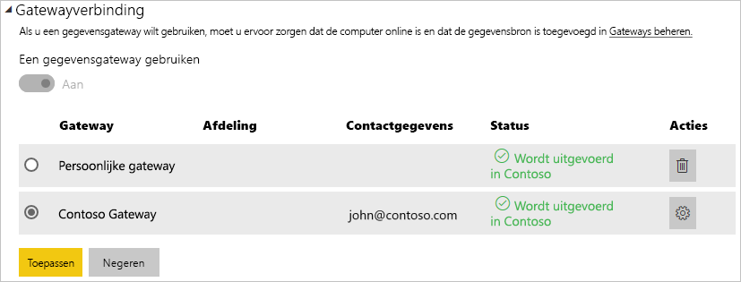

# <a name="manage-your-data-source---oracle"></a>De gegevensbron beheren - Oracle

[!INCLUDE [gateway-rewrite](includes/gateway-rewrite.md)]

Nadat u de [on-premises gegevensgateway hebt geïnstalleerd](/data-integration/gateway/service-gateway-install), moet u [gegevensbronnen toevoegen](service-gateway-data-sources.md#add-a-data-source) die met de gateway kunnen worden gebruikt. In dit artikel wordt beschreven hoe u gateways en Oracle-gegevensbronnen gebruikt voor gepland vernieuwen of voor DirectQuery.

## <a name="install-the-oracle-client"></a>De Oracle-client installeren

U kunt de gateway alleen verbinden met uw Oracle-server als de Oracle-gegevensprovider voor .NET (ODP.NET) is geïnstalleerd en geconfigureerd. ODP.NET maakt deel uit van de Oracle Data Access Components (ODAC).

Gebruik voor 32 bitsversies van Power BI Desktop de volgende koppeling om de 32 bits-Oracle-client te downloaden en te installeren:

* [32-bits Oracle Data Access Components (ODAC) met Oracle-ontwikkelhulpprogramma's voor Visual Studio (12.1.0.2.4)](https://www.oracle.com/technetwork/topics/dotnet/utilsoft-086879.html)

Gebruik voor 64 bitsversies van Power BI Desktop of voor de on-premises gegevensgateway de volgende koppeling om de 64 bits-Oracle-client te downloaden en te installeren:

* [64-bits ODAC 12.2c release 1 (12.2.0.1.0) voor Windows x64](https://www.oracle.com/technetwork/database/windows/downloads/index-090165.html)

Na installatie van de client configureert u het bestand tnsnames.ora met de juiste gegevens voor uw database. Power BI Desktop en de gateway gaan af op de net_service_name die is gedefinieerd in het bestand tnsnames.ora. Als de net_service_name niet is geconfigureerd, kunt u geen verbinding maken. Het standaardpad voor tnsnames.ora is: `[Oracle Home Directory]\Network\Admin\tnsnames.ora`. Voor meer informatie over hoe u tnsnames.ora-bestanden configureert, raadpleegt u [Oracle: Parameters voor lokale naamgeving (tnsnames.ora)](https://docs.oracle.com/cd/B28359_01/network.111/b28317/tnsnames.htm).

### <a name="example-tnsnamesora-file-entry"></a>Voorbeeld van invoer voor het bestand tnsnames.ora

De basisindeling voor een vermelding in tnsname.ora is als volgt:

```
net_service_name=
 (DESCRIPTION=
   (ADDRESS=(protocol_address_information))
   (CONNECT_DATA=
     (SERVICE_NAME=service_name)))
```

Hier volgt een voorbeeld van ingevulde server- en poortgegevens:

```
CONTOSO =
  (DESCRIPTION =
    (ADDRESS = (PROTOCOL = TCP)(HOST = oracleserver.contoso.com)(PORT = 1521))
    (CONNECT_DATA =
      (SERVER = DEDICATED)
      (SERVICE_NAME = CONTOSO)
    )
  )
```

## <a name="add-a-data-source"></a>Een gegevensbron toevoegen

Zie [Een gegevensbron toevoegen](service-gateway-data-sources.md#add-a-data-source) voor meer informatie over het toevoegen van een gegevensbron. Selecteer onder **Gegevensbrontype** de optie **Oracle**.


Nadat u het Oracle-gegevensbrontype hebt geselecteerd, vult u de gegevens voor de gegevensbron in, met inbegrip van **Server** en **Database**. 

Onder **Verificatiemethode** kunt u **Windows** of **Basic** kiezen. Kies **Basic** als u een account wilt gebruiken dat binnen Oracle is gemaakt, in plaats van Windows-verificatie. Voer vervolgens de referenties in die u voor deze gegevensbron wilt gebruiken.

> [!NOTE]
> Alle query's over de gegevensbron worden uitgevoerd met deze referenties. Zie [Versleutelde referenties opslaan in de cloud](service-gateway-data-sources.md#store-encrypted-credentials-in-the-cloud) voor meer informatie over het opslaan van referenties.


Nadat u alles hebt ingevuld, selecteert u **Toevoegen**. U kunt deze gegevensbron nu gebruiken voor gepland vernieuwen of DirectQuery op een on-premises Oracle-server. De tekst *Verbinding gemaakt* wordt weergegeven als deze bewerking is geslaagd.


### <a name="advanced-settings"></a>Geavanceerde instellingen

U kunt optioneel het privacyniveau voor uw gegevensbron configureren. Met deze instelling bepaalt u hoe gegevens kunnen worden gecombineerd. Deze wordt alleen gebruikt voor geplande vernieuwing. De privacyniveau-instelling is niet van toepassing op DirectQuery. Zie [privacyniveaus (Power query)](https://support.office.com/article/Privacy-levels-Power-Query-CC3EDE4D-359E-4B28-BC72-9BEE7900B540)voor meer informatie over privacyniveaus voor uw gegevensbron.


## <a name="use-the-data-source"></a>De gegevensbron gebruiken

Nadat u de gegevensbron hebt gemaakt, is deze beschikbaar voor gebruik met zowel DirectQuery-verbindingen als via geplande vernieuwing.

> [!WARNING]
> De servernaam en databasenaam die worden gebruikt voor Power BI Desktop en de gegevensbron in de on-premises gegevensgateway moeten overeenkomen.

De koppeling tussen uw gegevensset en de gegevensbron in de gateway is gebaseerd op uw server- en databasenaam. Deze namen moeten overeenkomen. Als u bijvoorbeeld een IP-adres gebruikt als servernaam in Power BI Desktop, moet u dit IP-adres ook gebruiken voor de gegevensbron in de gatewayconfiguratie. Deze naam moet ook overeenkomen met een alias die is gedefinieerd in het bestand tnsnames.ora. Raadpleeg [De Oracle-client installeren](#install-the-oracle-client) voor meer informatie over het bestand tnsnames.ora.

Deze vereiste geldt voor zowel DirectQuery als gepland vernieuwen.

### <a name="use-the-data-source-with-directquery-connections"></a>De gegevensbron gebruiken met DirectQuery-verbindingen

Zorg ervoor dat de servernaam en databasenaam voor Power BI Desktop en de geconfigureerde gegevensbron voor de gateway overeenkomen. Zorg er ook voor dat de gebruiker wordt vermeld op het tabblad **Gebruikers** van de gegevensbron om DirectQuery-gegevenssets te kunnen publiceren. De selectie voor DirectQuery vindt plaats in Power BI Desktop wanneer u voor het eerst gegevens importeert. Zie [DirectQuery in Power BI Desktop gebruiken](desktop-use-directquery.md) voor meer informatie over het gebruik van DirectQuery.

Nadat u de gegevens hebt gepubliceerd, werken uw rapporten vanuit Power BI Desktop of via **Gegevens ophalen**. Nadat u de gegevensbron in de gateway hebt gemaakt, kan het enkele minuten duren voordat de verbinding kan worden gebruikt.

### <a name="use-the-data-source-with-scheduled-refresh"></a>De gegevensbron gebruiken met geplande vernieuwing

Als u wordt vermeld op het tabblad **Gebruikers** voor de gegevensbron die is geconfigureerd in de gateway en als de server- en databasenaam overeenkomen, wordt de gateway als optie vermeld om te gebruiken bij geplande vernieuwing.



## <a name="troubleshooting"></a>Problemen oplossen

Als de naamgevingssyntaxis onjuist is of niet goed is geconfigureerd, kunnen er in Oracle diverse fouten optreden:

* ORA-12154: TNS:could not resolve the connect identifier specified.
* ORA-12514: TNS:listener does not currently know of service requested in connect descriptor.
* ORA-12541: TNS:no listener.
* ORA-12170: TNS:connect timeout occurred.
* ORA-12504: TNS:listener was not given the SERVICE_NAME in CONNECT_DATA.

Deze fouten kunnen zich voordoen als de Oracle-client niet is geïnstalleerd of niet juist is geconfigureerd. Als de client wel is geïnstalleerd, controleert u of het bestand tnsnames.ora goed is geconfigureerd en of u de juiste net_service_name gebruikt. Zorg er ook voor dat de net_service_name hetzelfde is op de computer waarop Power BI Desktop wordt gebruikt als op de computer waarop de gateway wordt uitgevoerd. Zie [De Oracle-client installeren](#install-the-oracle-client) voor meer informatie.

> [!NOTE]
> Er kan ook een compatibiliteitsprobleem optreden tussen de versie van de Oracle-server en de versie van de Oracle-client. Deze versies moeten doorgaans overeenkomen.

Raadpleeg [Problemen met de on-premises gegevensgateway oplossen](/data-integration/gateway/service-gateway-tshoot) voor aanvullende informatie over het oplossen van gatewaygerelateerde problemen.

## <a name="next-steps"></a>Volgende stappen

* [Problemen met gateways oplossen - Power BI](service-gateway-onprem-tshoot.md)
* [Power BI Premium](service-premium.md)

Hebt u nog vragen? Misschien dat de[Power Bi-community](https://community.powerbi.com/) het antwoord weet.

