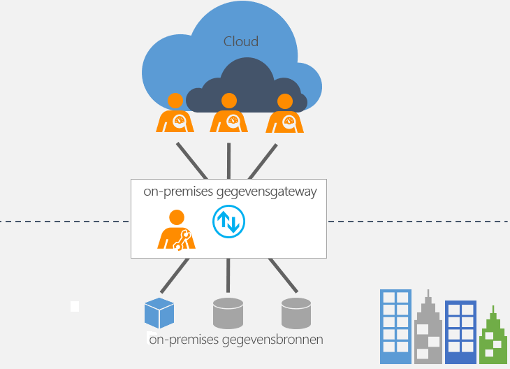

# Wat is een on-premises gegevensgateway?

[!INCLUDE [gateway-rewrite](includes/gateway-rewrite.md)]

De on-premises gegevensgateway fungeert als een brug om snelle en veilige gegevensoverdracht mogelijk te maken tussen on-premises gegevens (gegevens die zich niet in de cloud bevinden) en verschillende Microsoft-cloudservices. Deze cloudservices omvatten Power BI, PowerApps, Power Automate, Azure Analysis Services en Azure Logic Apps. Door een gateway te gebruiken kunnen organisaties databases en andere gegevensbronnen in hun on-premises netwerken houden en die on-premises gegevens toch veilig gebruiken in Power BI-rapporten en -dashboards.

## Hoe de gateway werkt

Zie [Architectuur van on-premises gegevensgateway](/data-integration/gateway/service-gateway-onprem-indepth) voor meer informatie over de werking van de gateway.

## Soorten gateways

Er zijn twee verschillende soorten gateways, elk voor een ander scenario:

* Met de **on-premises gegevensgateway** kunnen meerdere gebruikers verbinding maken met meerdere on-premises gegevensbronnen. U kunt een on-premises gegevensgateway gebruiken met alle ondersteunde services en hoeft daarvoor maar één gateway te instaleren. Deze gateway is geschikt voor complexere scenario's waarbij meerdere personen toegang moeten krijgen tot meerdere gegevensbronnen.

* Met de **on-premises gegevensgateway (persoonlijke modus)** kan één gebruiker verbinding maken met bronnen. Kan niet worden gedeeld met anderen. Een on-premises gegevensgateway (persoonlijke modus) kan alleen worden gebruikt met Power BI. Deze gateway is geschikt voor scenario's waarbij u de enige bent die rapporten maakt en u geen gegevensbronnen met anderen hoeft te delen.

## Een gateway gebruiken

Er zijn vier belangrijke stappen voor het gebruik van een gateway.

1. [Download en installeer de gateway](/data-integration/gateway/service-gateway-install) op een lokale computer.
1. [Configureer](/data-integration/gateway/service-gateway-app) de gateway op basis van uw firewall en andere netwerkvereisten.
1. [Voeg gatewaybeheerders toe](/data-integration/gateway/service-gateway-manage) die ook andere netwerkvereisten kunnen beheren en besturen.
1. [Gebruik de gateway](service-gateway-sql-tutorial.md) om een on-premises gegevensbron te vernieuwen.
1. [Problemen oplossen met](service-gateway-onprem-tshoot.md) de gateway in geval van fouten.

## Volgende stappen

* [De on-premises gegevensgateway installeren](/data-integration/gateway/service-gateway-install)

Hebt u nog vragen? [Misschien dat de Power BI-community het antwoord weet](https://community.powerbi.com/)
