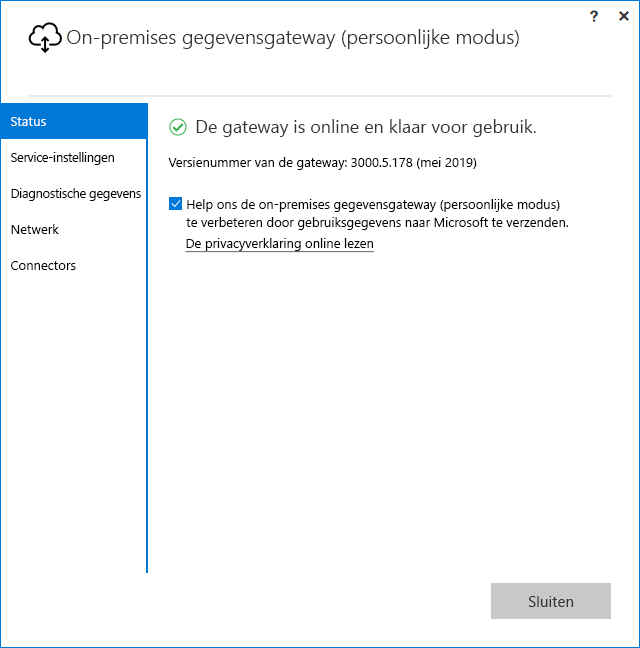

# <a name="use-personal-gateways-in-power-bi"></a>Persoonlijke gateways gebruiken in Power BI

[!INCLUDE [gateway-rewrite](includes/gateway-rewrite.md)]

De on-premises gegevensgateway (persoonlijke modus) is een versie van de on-premises gegevensgateway die alleen werkt met Power BI. Met een persoonlijke gateway kunnen personen een gateway op hun eigen computer installeren en toegang krijgen tot on-premises gegevens.

> [!NOTE]
> Voor elke Power BI-gebruiker kunt u slechts één gateway in de persoonlijke modus uitvoeren. Als u voor dezelfde gebruiker een andere gateway in de persoonlijke modus installeert, zelfs op een andere computer, wordt de bestaande voorgaande installatie vervangen door de meest recente installatie.

## <a name="on-premises-data-gateway-vs-on-premises-data-gateway-personal-mode"></a>On-premises gegevensgateway versus on-premises gegevensgateway (persoonlijke modus)

In de volgende tabel worden de verschillen tussen een on-premises gegevensgateway en een on-premises gegevensgateway (persoonlijke modus) beschreven.

|   |On-premises gegevensgateway | On-premises gegevensgateway (persoonlijke modus) |
| ---- | ---- | ---- |
|Ondersteunde cloudservices |Power BI, PowerApps, Azure Logic Apps, Microsoft Flow, Azure Analysis Services, Gegevensstromen |Power BI |
|Wordt uitgevoerd |Zoals geconfigureerd door gebruikers die toegang hebben tot de gateway |Zoals u hebt geconfigureerd voor Windows-verificatie en andere verificatietypen |
|Kan alleen worden geïnstalleerd als computerbeheerder |Ja |Nee |
|Gecentraliseerde gateway en gegevensbronbeheer |Ja |Nee |
|Gegevens importeren en vernieuwen plannen |Ja |Ja |
|DirectQuery-ondersteuning |Ja |Nee |
|LiveConnect-ondersteuning voor Analysis Services |Ja |Nee |

## <a name="install-the-on-premises-data-gateway-personal-mode"></a>De on-premises gegevensgateway (persoonlijke modus) installeren

Installeer de on-premises gegevensgateway (persoonlijke modus) als volgt:

1. [Download de on-premises gegevensgateway](https://go.microsoft.com/fwlink/?LinkId=820925&clcid=0x409).

2. Selecteer in het installatieprogramma de on-premises gegevensgateway (persoonlijke modus) en selecteer vervolgens de knop **Volgende**.

   

Zodra de installatie is voltooid en u zich hebt aangemeld, wordt het volgende scherm weergegeven.



## <a name="using-fast-combine-with-the-personal-gateway"></a>Fast Combine gebruiken in combinatie met de persoonlijke gateway

Met Snel combineren op een persoonlijke gateway kunt u opgegeven privacyniveaus negeren tijdens het uitvoeren van query's. Schakel als volgt Snel combineren in voor de on-premises gegevensgateway (persoonlijke modus):

1. Open met behulp van de Verkenner het volgende bestand:

   `%localappdata%\Microsoft\On-premises data gateway (personal mode)\Microsoft.PowerBI.DataMovement.Pipeline.GatewayCore.dll.config`

2. Voeg onderaan het bestand de volgende tekst toe:

    ```xml
    <setting name="EnableFastCombine" serializeAs="String">
       <value>true</value>
    </setting>
    ```

3. Ongeveer een minuut nadat u deze wijziging hebt opgeslagen, wordt de instelling doorgevoerd. Als u wilt controleren of deze correct werkt, kunt u in de **Power BI-service** handmatig opdracht geven een vernieuwing uit te voeren om te controleren of **Fast Combine** werkt.

## <a name="frequently-asked-questions-faq"></a>Veelgestelde vragen

**Vraag:** Kan ik de **on-premises gegevensgateway (persoonlijke modus)** uitvoeren naast de **lokale gegevensgateway** (voorheen bekend als de Enterprise-versie van de gateway)?
  
**Antwoord**: Ja, beide kunnen tegelijkertijd worden uitgevoerd.

**Vraag:** Kan ik de **On-premises gegevensgateway (persoonlijke modus)** uitvoeren als een service?
  
**Antwoord**: Nee. de **on-premises gegevensgateway (persoonlijke modus)** kan alleen worden uitgevoerd als een toepassing. Als u de gateway wilt uitvoeren als een service en/of met beheerdersrechten, zult u naar de [**on-premises gegevensgateway**](/data-integration/gateway/service-gateway-onprem) (voorheen bekend als de Enterprise-gateway).

**Vraag:** Hoe vaak wordt de **on-premises gegevensgateway (persoonlijke modus)** bijgewerkt?
  
**Antwoord**: We gaan de persoonlijke gateway maandelijks bijwerken.

**Vraag:** Waarom word ik gevraagd mijn referenties bij te werken?
  
**Antwoord**: Er kunnen diverse redenen zijn waarom u om uw referenties wordt gevraagd. De meest voorkomende reden is dat u de **on-premises gegevensgateway (persoonlijke modus)** hebt geïnstalleerd op een andere computer dan uw **Power BI - Personal**-gateway. Het is ook mogelijk dat er een probleem is opgetreden in de gegevensbron, waardoor Power BI geen testverbinding kon maken, of dat er een time-out of systeemfout is opgetreden. U kunt uw referenties bijwerken in de **Power BI-service** door te navigeren naar het **tandwielpictogram** en **Instellingen** en vervolgens **Gegevenssets** te selecteren. U zoekt de betreffende gegevensset en selecteert **Gegevensbronreferenties**.

**Vraag:** Hoelang is mijn vorige persoonlijke gateway offline tijdens de upgrade?
  
**Antwoord**: Het upgraden van de persoonlijke gateway naar de nieuwe versie duurt normaliter slechts enkele minuten.

**Vraag:** Ik gebruik R- en Python-scripts. Wordt dit ondersteund?
  
**Antwoord**: R- en Python-scripts worden ondersteund in de persoonlijke modus.

## <a name="next-steps"></a>Volgende stappen

* [Configuring proxy settings for the on-premises data gateway](/data-integration/gateway/service-gateway-proxy) (Proxy-instellingen configureren voor de on-premises gegevensgateway)  

Hebt u nog vragen? [Misschien dat de Power BI-community het antwoord weet](http://community.powerbi.com/)

