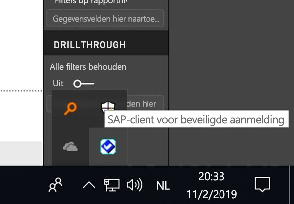
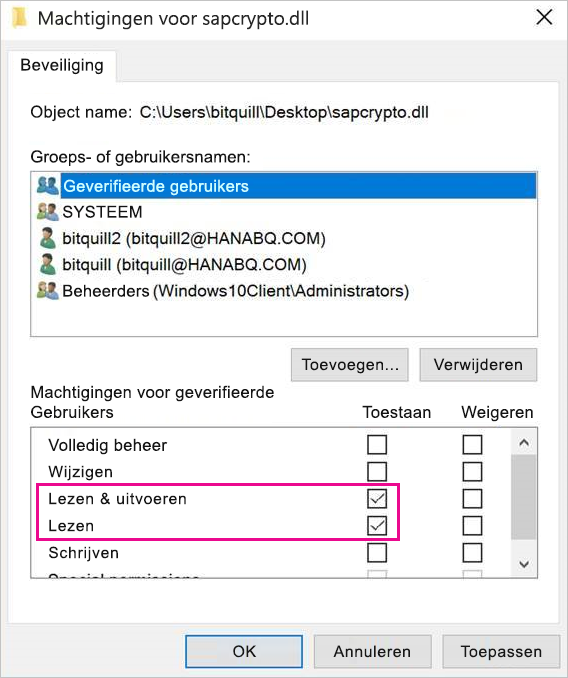
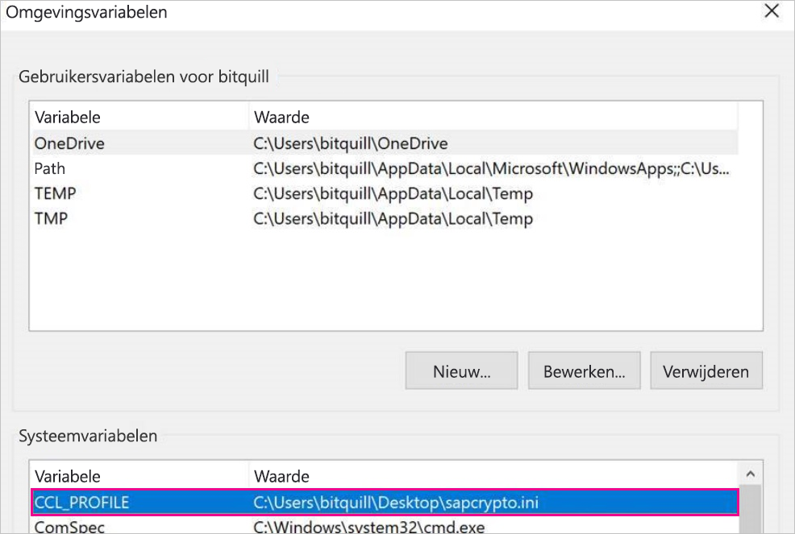
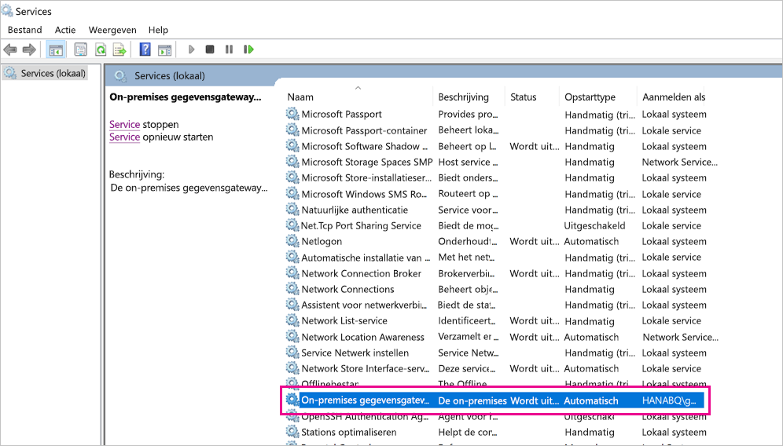
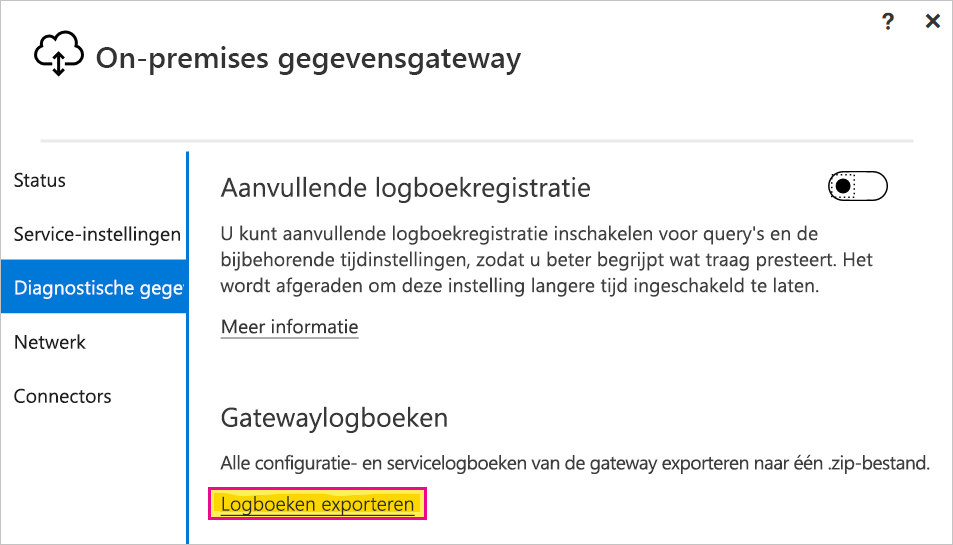

# <a name="use-kerberos-single-sign-on-for-sso-to-sap-bw-using-commoncryptolib-sapcryptodll"></a>Eenmalige aanmelding van Kerberos gebruiken voor SSO in SAP BW met CommonCryptoLib (sapcrypto.dll)

In dit artikel wordt beschreven hoe u SAP BW-server configureert voor SSO vanuit de Power BI-service met CommonCryptoLib (sapcrypto.dll).

> [!NOTE]
> Volg de stappen in dit artikel en in [Kerberos SSO configureren](service-gateway-sso-kerberos.md) voordat u probeert een op SAP BW gebaseerd rapport dat gebruikmaakt van Kerberos SSO te vernieuwen. Als u CommonCryptoLib gebruikt als uw SNC-bibliotheek zijn SSO-verbindingen voor zowel SAP BW-toepassingsservers als SAP BW-berichtenservers mogelijk.

## <a name="configure-sap-bw-server-to-enable-sso-using-commoncryptolib"></a>SAP BW configureren om SSO met behulp van CommonCryptoLib in te schakelen

> [!NOTE]
> De on-premises gegevensgateway is 64-bits software en heeft daarom de 64-bits versie van CommonCryptoLib (sapcrypto.dll) nodig. Als u van plan bent om de SSO-verbinding naar uw SAP BW-server in SAP GUI te testen voordat u een SSO-verbinding test via de gateway (aanbevolen) hebt u ook de 32-bits versie van CommonCryptoLib nodig, aangezien SAP GUI 32-bits software is.

1. Zorg ervoor dat uw BW-server op de juiste manier is geconfigureerd voor Kerberos-SSO met CommonCryptoLib. Als dat het geval is, zou u SSO moeten kunnen gebruiken voor toegang tot uw BW-server (rechtstreeks of via een SAP BW-berichtenserver) met een SAP-hulpprogramma als SAP GUI, dat is geconfigureerd om gebruik te maken van CommonCryptoLib. Zie voor meer informatie over de installatiestappen [Eenmalige aanmelding van SAP: verificatie met Kerberos/SPNEGO](https://blogs.sap.com/2017/07/27/sap-single-sign-on-authenticate-with-kerberosspnego/). Voor uw BW-server moet CommonCryptoLib als SNC-bibliotheek worden gebruikt. De server moet een SNC-naam hebben die begint met ‘CN=’, zoals ’CN=BW1’. Raadpleeg [SNC-parameters voor Kerberos-configuratie](https://help.sap.com/viewer/df185fd53bb645b1bd99284ee4e4a750/3.0/en-US/360534094511490d91b9589d20abb49a.html) (in het bijzonder de parameter snc/identity/as) voor meer informatie over vereisten voor SNC-namen.

1. Als u dit nog niet hebt gedaan, installeert u nu de 64-bitsversie van de [SAP .NET Connector](https://support.sap.com/en/product/connectors/msnet.html) op de computer waarop de gateway is geïnstalleerd. U kunt controleren of het onderdeel is geïnstalleerd door verbinding te maken met uw BW-server in Power BI Desktop. Als u geen verbinding kunt maken met behulp van de 2.0-implementatie, is de .NET Connector niet geïnstalleerd.

1. Zorg ervoor dat SAP Secure Login Client (SLC) niet wordt uitgevoerd op de computer waarop de gateway is geïnstalleerd. Via SLC worden Kerberos-tickets zodanig in de cache geplaatst dat dit invloed kan hebben op het vermogen van de gateway om Kerberos voor SSO te gebruiken. Als SLC is geïnstalleerd, verwijdert u dit of sluit u SAP Secure Login Client af: klik met de rechtermuisknop op het pictogram in het systeemvak en selecteer Afmelden en Afsluiten voordat u probeert een SSO-verbinding te maken met behulp van de gateway. SLC wordt niet ondersteund voor gebruik op Windows Server-computers. Zie [SAP-notitie 2780475](https://launchpad.support.sap.com/#/notes/2780475) (s-gebruiker vereist) voor meer informatie.

    

    Als u SLC verwijdert of **Afmelden** en **Afsluiten** selecteert, opent u een cmd-venster en voert u `klist purge` in om alle gecachte Kerberos-tickets te wissen voordat u probeert een SSO-verbinding tot stand te brengen via de gateway.

1. Download de 64-bits CommonCryptoLib (sapcrypto.dll) versie **8.5.25 of hoger** via het SAP Launchpad en kopieer deze versie naar een map op uw gatewaycomputer. In dezelfde map waarnaar u sapcrypto.dll hebt gekopieerd, maakt u een bestand met de naam sapcrypto.ini, met de volgende inhoud:

    ```
    ccl/snc/enable_kerberos_in_client_role = 1
    ```

    Het .ini-bestand bevat configuratie-informatie die voor CommonCryptoLib vereist is om SSO in te schakelen in het gatewayscenario.

    > [!NOTE]
    > Deze bestanden moeten worden opgeslagen op dezelfde locatie; met andere woorden: _/pad/naar/sapcrypto/_ moet zowel sapcrypto.ini als sapcrypto.dll bevatten.

    Zowel de gatewayservicegebruiker als de Active Directory-gebruiker (AD) die door de servicegebruiker wordt geïmiteerd hebben lees- en uitvoermachtigingen nodig voor beide bestanden. U wordt aangeraden machtigingen voor zowel het .ini- als het .dll-bestand toe te wijzen aan de geverifieerde gebruikersgroep. Voor testdoeleinden kunt u deze machtigingen ook expliciet toewijzen aan zowel de gatewayservicegebruiker als de Active Directory-gebruiker die u gebruikt voor tests. In het onderstaande schermopname zijn aan de geverifieerde gebruikersgroep **lees- &amp; uitvoer**machtigingen voor sapcrypto.dll toegewezen:

    

1. Als u geen SAP BW-gegevensbron hebt, kunt u op de pagina **Gateways beheren** in de Power BI-service een gegevensbron toevoegen. Als u al een BW-gegevensbron hebt gekoppeld aan de gateway waarlangs de SSO-verbinding moet stromen, moet u het bewerken hiervan voorbereiden. Kies **SAP Business Warehouse** voor het **type gegevensbron** als u een SSO-verbinding met een BW-toepassingsserver wilt maken. Selecteer **SAP Business Warehouse-berichtenserver** als u een SSO-verbinding met een BW-berichtenserver wilt maken.

    Voor **SNC-bibliotheek** selecteert u de omgevingsvariabele **SNC\_LIB of SNC\_LIB\_64** of **Aangepast**. Als u de optie **SNC\_LIB** selecteert, moet u de waarde van de omgevingsvariabele **SNC\_LIB\_64** op de gatewaycomputer instellen op het absolute pad van de 64-bits kopie van sapcrypto.dll op de gatewaycomputer, bijvoorbeeld C:\Gebruikers\Test\Desktop\sapcrypto.dll. Als u **Aangepast** kiest, plakt u het absolute pad naar sapcrypto.dll in het veld Pad naar aangepaste SNC-bibliotheek dat op de pagina **Gateways beheren** wordt weergegeven. Voor de SNC-naam van de BW-server in als **SNC-partnernaam**. Zorg er onder **Geavanceerde instellingen** voor dat **Eenmalige aanmelding via Kerberos gebruiken voor DirectQuery-query's** is aangevinkt. De overige velden moeten worden ingevuld alsof u een Windows-verificatieverbinding vanuit Power BI Desktop vaststelt.

1. Maak een omgevingsvariabele voor het CCL\_PROFILE-systeem en richt deze op sapcrypto.ini:

    

    Let op: de bestanden sapcrypto.dll en sapcrypto.ini moeten zich op dezelfde locatie bevinden. In het bovenstaande voorbeeld, waarin sapcrypto.ini zich op het bureaublad bevindt, moet sapcrypto.dll ook op het bureaublad staan.

1. Start de gatewayservice opnieuw op:

    

1. [Een Power BI-rapport uitvoeren](service-gateway-sso-kerberos.md#run-a-power-bi-report)

## <a name="troubleshooting"></a>Problemen oplossen

Als u het rapport niet kunt vernieuwen in de Power BI-service, kunt u gatewaytracering, CPIC-tracering en CommonCryptoLib-tracering gebruiken om het probleem te diagnosticeren. CPIC-tracering en CommonCryptoLib zijn SAP-producten. Microsoft kan hiervoor dus geen directe ondersteuning bieden. Active Directory-gebruikers aan wie SSO-toegang tot BW wordt verleend, moeten voor een aantal Active Directory-configuraties mogelijk lid zijn van de beheerdersgroep op de computer waarop de gateway is geïnstalleerd.

1. **Gatewaylogboeken:** Reproduceer het probleem, open de [gateway-app](https://docs.microsoft.com/data-integration/gateway/service-gateway-app), ga naar het tabblad **Diagnostiek** en selecteer **Logboeken exporteren**:

    

1. **CPIC-tracering:** Als u CPIC-tracering wilt inschakelen, moet u twee omgevingsvariabelen instellen: CPIC\_TRACE en CPIC\_TRACE\_DIR. Met de eerste variabele wordt het traceringsniveau ingesteld, met de tweede variabele wordt de bestandsmap voor tracering ingesteld. De map moet een locatie zijn waarnaar leden van de geverifieerde gebruikersgroep kunnen schrijven. Stel CPIC\_TRACE in op 3 en CPIC\_TRACE\_DIR op de map waarnaar u de traceringsbestanden wilt schrijven.

    

    Reproduceer het probleem en controleer of CPIC\_TRACE\_DIR traceringsbestanden bevat.

1. **CommonCryptoLib-tracering:** Schakel CommonCryptoLib-tracering in door twee regels toe te voegen aan het sapcrypto.ini-bestand dat u eerder hebt gemaakt:

    ```
    ccl/trace/level=5
    ccl/trace/directory=<drive>:\logs\sectrace
    ```

    Wijzig de optie _ccl/trace/map_ in een locatie waarnaar leden van de geverifieerde gebruikersgroep kunnen schrijven. Een andere mogelijkheid is een nieuw .ini-bestand maken om dit gedrag te veranderen. In dezelfde map als sapcrypto.ini en sapcrypto.dll maakt u een bestand met de naam sectrace.ini, met de onderstaande inhoud. Vervang de mapoptie door een locatie op uw computer waarnaar Geverifieerde gebruiker kunnen schrijven:

    ```
    LEVEL = 5

    DIRECTORY = <drive>:\logs\sectrace
    ```

    Reproduceer nu het probleem en controleer of de locatie waarnaar MAP verwijst de traceringsbestanden bevat. Schakel CPIC- en CCL-tracering uit zodra u klaar bent.

    Zie [SAP-notitie 2491573](https://launchpad.support.sap.com/#/notes/2491573) (s-gebruiker vereist) voor meer informatie over CommonCryptoLib-tracering.

## <a name="next-steps"></a>Volgende stappen

Raadpleeg de volgende bronnen voor meer informatie over de **on-premises gegevensgateway** en **DirectQuery**:

* [Wat is een on-premises gegevensgateway?](/data-integration/gateway/service-gateway-getting-started)
* [DirectQuery in Power BI](desktop-directquery-about.md)
* [Data sources supported by DirectQuery](desktop-directquery-data-sources.md) (Gegevensbronnen die worden ondersteund door DirectQuery)
* [DirectQuery en SAP BW](desktop-directquery-sap-bw.md)
* [DirectQuery en SAP HANA](desktop-directquery-sap-hana.md)
