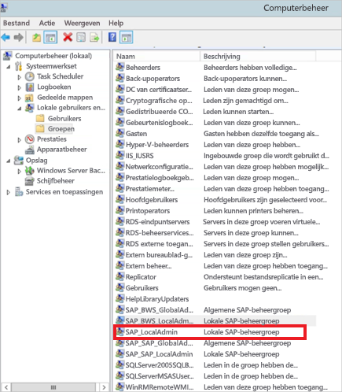

# <a name="use-kerberos-for-single-sign-on-sso-to-sap-bw-using-gx64krb5"></a>Kerberos gebruiken voor SSO (eenmalige aanmelding) bij SAP BW met gx64krb5

In dit artikel wordt beschreven hoe u uw SAP BW-gegevensbron configureert voor SSO vanuit de Power BI-service met gx64krb5.

> [!NOTE]
> Als u de stappen in dit artikel en de stappen in [SSO van Kerberos configureren](service-gateway-sso-kerberos.md) afrondt, schakelt u op basis van SSO de vernieuwing van rapporten in SAP BW-toepassingsservers in de Power BI-service in. Microsoft raadt echter het gebruik van CommonCryptoLib, niet gx64krb5, aan als uw SNC-bibliotheek. SAP biedt geen ondersteuning meer voor gx64krb5 en de stappen die nodig zijn om het te configureren voor de gateway zijn aanzienlijk complexer in vergelijking met CommonCryptoLib. Raadpleeg [SAP BW configureren voor SSO met behulp van CommonCryptoLib](service-gateway-sso-kerberos-sap-bw-commoncryptolib.md) voor informatie over hoe u SSO configureert met CommonCryptoLib. Gebruik CommonCryptoLib _of_ gx64krb5 als uw SNC-bibliotheek. Voer de configuratiestappen niet uit voor beide bibliotheken.

Deze handleiding is uitgebreid. Als u al een aantal van de beschreven stappen hebt voltooid, kunt u deze overslaan. U hebt bijvoorbeeld uw SAP BW-server misschien al geconfigureerd voor eenmalige aanmelding met gx64krb5.

## <a name="set-up-gx64krb5-on-the-gateway-machine-and-the-sap-bw-server"></a>gx64krb5 instellen in de gatewaymachine en SAP BW-server

> [!NOTE]
> De gx64krb5-bibliotheek wordt niet meer ondersteund door SAP. Zie [SAP-notitie 352295](https://launchpad.support.sap.com/#/notes/352295) voor meer informatie. Houd er rekening mee dat gx64krb5 geen SSO-verbindingen van de gegevensgateway naar SAP BW-berichtenservers toestaat; er zijn alleen verbindingen met SAP BW-toepassingsservers mogelijk. Deze beperking bestaat niet als u [CommonCryptoLib](service-gateway-sso-kerberos-sap-bw-commoncryptolib.md) gebruikt als uw SNC-bibliotheek. Hoewel andere SNC-bibliotheken mogelijk ook werken voor SSO via BW, worden deze niet officieel ondersteund door Microsoft.

De gx64krb5-bibliotheek moet zowel op de client als op de server worden gebruikt om een SSO-verbinding te voltooien via de gateway. Dat wil zeggen dat zowel de client als de server dezelfde SNC-bibliotheek moeten gebruiken.

1. Download gx64krb5.dll van [SAP Note 2115486](https://launchpad.support.sap.com/) (SAP S-gebruiker vereist). Zorg ervoor dat u minstens over versie 1.0.11.x beschikt. Download ook gsskrb5.dll (de 32-bits versie van de bibliotheek) als u de SSO-verbinding wilt testen in SAP GUI voordat u de SSO-verbinding via de gateway probeert (aanbevolen). De 32-bits versie is vereist voor tests met SAP GUI, omdat SAP GUI alleen beschikbaar is in 32-bits.

1. Plaats gx64krb5.dll op een locatie op uw gatewaycomputer die toegankelijk is voor de gebruiker van uw gatewayservice. Als u de SSO-verbinding wilt testen met SAP GUI, plaatst u ook een kopie van gsskrb5.dll op de computer en stelt u de **SNC_LIB**-omgevingsvariabele in om ernaar te verwijzen. Zowel de gatewayservicegebruiker als de Active Directory-gebruikers (AD) die door de servicegebruiker worden geïmiteerd, hebben lees- en uitvoermachtigingen nodig voor de kopie van gx64krb5.dll. Voor de .dll raden we aan machtigingen te geven aan de groep geverifieerde gebruikers. Voor testdoeleinden kunt u deze machtigingen ook expliciet toewijzen aan zowel de gatewayservicegebruiker als de Active Directory-gebruiker die u gebruikt om te testen.

1. Als uw BW-server nog niet is geconfigureerd voor SSO met gx64krb5.dll, plaatst u een andere kopie van de .dll op uw SAP BW-servermachine op een locatie die toegankelijk is voor de SAP BW-server. 

    Raadpleeg de [SAP-documentatie](https://launchpad.support.sap.com/#/notes/2115486) (SAP s-gebruiker vereist) voor meer informatie over het configureren van gx64krb5.dll voor gebruik met een SAP BW-server.

1. Stel in de client- en servermachines de omgevingsvariabelen**SNC_LIB** en **SNC_LIB_64** in: 
    - Als u gsskrb5.dll gebruikt, stelt u de variabele **SNC_LIB** in op het absolute pad. 
    - Als u gx64krb5.dll gebruikt, stelt u de variabele **SNC_LIB_64** in op het absolute pad.

## <a name="configure-an-sap-bw-service-user-and-enable-snc-communication-on-the-bw-server"></a>Een SAP BW-servicegebruiker configureren en SNC-communicatie inschakelen op de BW-server

Rond dit gedeelte af als u uw SAP BW-server nog niet hebt ingesteld voor SNC-communicatie (bijvoorbeeld SSO) door gx64krb5 te gebruiken.

> [!NOTE]
> In dit gedeelte wordt ervan uitgegaan dat u al een servicegebruiker voor BW hebt gemaakt en daar een geschikte SPN aan hebt gekoppeld (bijvoorbeeld een naam die begint met *SAP/* ).

1. Geef de servicegebruiker toegang tot de SAP BW-toepassingsserver:

    1. Voeg op de SAP BW-servercomputer de servicegebruiker toe aan de lokale beheerdersgroep. Open het programma **Computerbeheer** en stel de lokale beheerdersgroep voor uw server vast. 

        

    1. Dubbelklik op de groep Lokale beheerders en selecteer vervolgens **Toevoegen** om uw servicegebruiker toe te voegen aan de groep. 

    1. Selecteer **Namen controleren** om te controleren of u de naam goed hebt ingevoerd en selecteer **OK**.

1. Stel de servicegebruiker van de SAP BW-server in als de gebruiker die de SAP BW-serverservice start op de SAP BW-servercomputer:

    1. Open **Uitvoeren** en voer vervolgens **Services.msc** in. 

    1. Zoek de service die overeenkomt met uw SAP BW Application Server-exemplaar, klik er met de rechtermuisknop op en selecteer vervolgens **Eigenschappen**.

        

    1. Schakel over naar het tabblad **Aanmelden** en wijzig de gebruiker in uw SAP BW-servicegebruiker. 

    1. Voer het wachtwoord van de gebruiker in en selecteer vervolgens **OK**.

1. Meld u in SAP-aanmelding aan bij uw server en stel de volgende profielparameters in met behulp van de transactie RZ10:

    1. Stel de profielparameter **snc/identity/as** in op *p:&lt; SAP BW-servicegebruiker die u hebt gemaakt&gt;* . Bijvoorbeeld *p:BWServiceUser\@MYDOMAIN.COM*. Houd er rekening mee dat *p:* voorafgaat aan de UPN van de servicegebruiker, in tegenstelling tot *p:CN =* , dat voorafgaat aan de UPN wanneer u CommonCryptoLib gebruikt als de SNC-bibliotheek.

    1. Stel de profielparameter **snc/gssapi\_lib** in op *&lt;pad naar gx64krb5.dll op de BW-server&gt;* . Plaats de bibliotheek op een locatie die toegankelijk is voor de SAP BW-toepassingsserver.

    1. Stel de volgende aanvullende profielparameters in en wijzig zo nodig de waarden naar behoefte. Met de laatste vijf opties kunnen clients via SAP-aanmelden verbinding maken met de SAP BW-server zonder dat de SNC is geconfigureerd.

        | **Instelling** | **Waarde** |
        | --- | --- |
        | snc/data\_protection/max | 3 |
        | snc/data\_protection/min | 1 |
        | snc/data\_protection/use | 9 |
        | snc/accept\_insecure\_cpic | 1 |
        | snc/accept\_insecure\_gui | 1 |
        | snc/accept\_insecure\_r3int\_rfc | 1 |
        | snc/accept\_insecure\_rfc | 1 |
        | snc/permit\_insecure\_start | 1 |

    1. Stel de eigenschap **snc/enable** in op 1.

1. Open na het instellen van deze profielparameters de SAP-beheerconsole op de servercomputer en start de SAP BW-instantie opnieuw op. 

   Als de server niet start, controleert u of u de profielparameters juist hebt ingesteld. Zie de [SAP-documentatie](https://help.sap.com/saphelp_nw70ehp1/helpdata/en/e6/56f466e99a11d1a5b00000e835363f/frameset.htm) voor meer informatie over de profielparameterinstellingen. U kunt ook de sectie [Probleemoplossing](#troubleshooting) in dit artikel raadplegen.

## <a name="map-an-sap-bw-user-to-an-active-directory-user"></a>Een SAP BW-gebruiker toewijzen aan een Active Directory-gebruiker

Wijs een Active Directory-gebruiker toe aan een SAP BW-toepassingsservergebruiker als u dat nog niet hebt gedaan en test de SSO-verbinding bij SAP-aanmelding.

1. Meld u met SAP-aanmelding aan bij uw SAP BW-server. Voer transactie SU01 uit.

1. Geef voor **Gebruiker** de SAP BW-gebruiker op waarvoor u de SSO-verbinding wilt inschakelen. Selecteer het pictogram **Bewerken** (pictogram van de pen) in de linkerbovenhoek van het SAP-aanmeldingsvenster.

    

1. Selecteer het tabblad **SNC**. Voer in het invoervak voor de SNC-naam *p&lt;:uw Active Directory-gebruiker&gt;@&lt;uw domein&gt;* in. In het geval van de SNC-naam moet *p:* voorafgaan aan de UPN van de Active Directory-gebruiker. Denk erom dat de UPN hoofdlettergevoelig is.

   De Active Directory-gebruiker die u opgeeft, moet horen bij de persoon of organisatie waarvoor u SSO-toegang tot de SAP BW-toepassingsserver wilt inschakelen. Als u bijvoorbeeld SSO-toegang wilt inschakelen voor de gebruiker testuser \@TESTDOMAIN.COM, voert u *p:testuser\@TESTDOMAIN.COM* in.

    

1. Selecteer het pictogram **Opslaan** (de diskette) in de linkerbovenhoek van het scherm.

## <a name="test-sign-in-via-sso"></a>Testaanmelding via SSO

Controleer of u zich kunt aanmelden bij de server met behulp van SAP-aanmelding via SSO als de Active Directory-gebruiker voor wie u SSO-toegang hebt ingeschakeld:

1. Meld u aan op een computer op uw domein waarop SAP-aanmelding is geïnstalleerd als de Active Directory-gebruiker voor wie u zojuist SSO-toegang hebt ingeschakeld. Start SAP-aanmelding en maak een nieuwe verbinding.

1. Kopieer het bestand gsskrb5.dll dat u eerder hebt gedownload naar een locatie op de computer waarop u bent aangemeld. Stel de omgevingsvariabele **SNC_LIB** in op het absolute pad van deze locatie.

1. Start SAP-aanmelding en maak een nieuwe verbinding.

1. Selecteer in het scherm **Nieuwe systeemvermelding maken** de optie **Door gebruiker opgegeven systeem** en selecteer vervolgens **Volgende**.

    

1. Vul de relevante gegevens in op het volgende scherm, met inbegrip van de toepassingsserver, het instantienummer en de systeem-id. Selecteer vervolgens **Voltooien**.

1. Klik met de rechtermuisknop op de nieuwe verbinding, selecteer **Eigenschappen**en selecteer vervolgens het tabblad **Netwerk**. 

1. In het tekstvak **SNC-naam** voert u *p:&lt;UPN van de SAP BW-servicegebruiker&gt;* in. Bijvoorbeeld *p:BWServiceUser\@MYDOMAIN.COM*. Selecteer **OK**.

    

1. Dubbelklik op de verbinding die u zojuist hebt gemaakt, om te proberen een SSO-verbinding met de BS-server tot stand te brengen. 

   Als deze verbindingspoging lukt, gaat u verder naar de volgende sectie. Anders bekijkt u de eerdere stappen in dit document om te controleren of deze correct zijn uitgevoerd of controleert u de sectie [Probleemoplossing](#troubleshooting). Als u in deze context niet via SSO verbinding kunt maken met de SAP BW-server, kunt u ook geen verbinding maken met de SAP BW-server met SSO in de gatewaycontext.

## <a name="add-registry-entries-to-the-gateway-machine"></a>Registervermeldingen toevoegen aan de gatewaycomputer

Vereiste registervermeldingen toevoegen aan het register van de computer waarop de gateway is geïnstalleerd en op computers die zijn bedoeld om verbinding mee te maken vanaf Power BI Desktop. Voer de volgende opdrachten uit om deze registervermeldingen toe te voegen:

- ```REG ADD HKLM\SOFTWARE\Wow6432Node\SAP\gsskrb5 /v ForceIniCredOK /t REG_DWORD /d 1 /f```

- ```REG ADD HKLM\SOFTWARE\SAP\gsskrb5 /v ForceIniCredOK /t REG_DWORD /d 1 /f```

## <a name="add-a-new-sap-bw-application-server-data-source-to-the-power-bi-service-or-edit-an-existing-one"></a>Een nieuwe gegevensbron van de SAP BW-toepassingsserver toevoegen aan de Power BI-service of een bestaande bewerken

1. Voer in het venster voor gegevensbronconfiguratie de **Hostnaam**, het **Systeemnummer** en de **client-id** van de SAP BW-toepassingsserver in zoals u zou doen om u vanuit Power BI Desktop aan te melden bij uw SAP BW-server.

1. Voer in het veld **Naam van SNC-partner** *p:&lt;SPN die u hebt toegewezen aan de SAP BW-servicegebruiker&gt;* in. Als de SPN bijvoorbeeld SAP/BWServiceUser\@MYDOMAIN.COM is, moet u *p: SAP/BWServiceUser\@MYDOMAIN.COM* opgeven in het veld **Naam SNC-partner**.

1. Als SNC-bibliotheek selecteert u **SNC\_LIB** of **SNC\_LIB\_64**. Zorg ervoor dat **SNC\_LIB\_64** op de gatewaymachine verwijst naar gx64krb5.dll. U kunt ook de optie **Aangepast** selecteren en het absolute pad naar gx64krb5.dll opgeven op de gatewaymachine.

1. Selecteer **Eenmalige aanmelding via Kerberos gebruiken voor DirectQuery-query's** en selecteer **Toepassen**. Als de testverbinding mislukt, controleert u of de vorige installatie- en configuratiestappen correct zijn voltooid.

1. [Een Power BI-rapport uitvoeren](service-gateway-sso-kerberos.md#run-a-power-bi-report)

## <a name="troubleshooting"></a>Problemen oplossen

### <a name="troubleshoot-gx64krb5-configuration"></a>Probleem met de configuratie gx64krb5 oplossen

Als u een van de volgende problemen ondervindt, volgt u deze stappen om problemen met de installatie van gx64krb5 en SSO-verbindingen op te lossen:

* Er treden fouten op bij het voltooien van de gx64krb5-installatiestappen. De SAP BW-server kan bijvoorbeeld niet worden gestart nadat u de profielparameters hebt gewijzigd. Bekijk de serverlogboeken (... work\dev\_W0 op de servermachine) om deze fouten op te lossen. 

* U kunt de SAP BW-service niet starten vanwege een fout bij het aanmelden. Mogelijk hebt u het verkeerde wachtwoord opgegeven toen u de *start-as*-gebruiker van SAP BW instelde. Controleer het wachtwoord door u aan te melden als de SAP BW-servicegebruiker bij een computer in uw Active Directory-omgeving.

* Als er foutmeldingen worden weergegeven over onderliggende gegevensbronreferenties (zoals SQL Server), die verhinderen dat de server wordt gestart, controleert u of u de servicegebruiker toegang tot de SAP BW-database hebt verleend.

* Het volgende bericht wordt weergegeven: *(GSS-API) opgegeven doel is onbekend of onbereikbaar*. Deze fout betekent doorgaans dat u de verkeerde SNC-naam hebt opgegeven. Zorg ervoor dat u alleen *p:* , niet *p:CN=* , laat voorafgaan aan de UPN van de servicegebruiker in de clienttoepassing.

* Het volgende bericht wordt weergegeven: *(GSS-API) Er is een ongeldige naam opgegeven*. Zorg ervoor dat *p:* de waarde heeft van de profielparameter voor de SNC-identiteit van de server.

* Het volgende bericht wordt weergegeven: *(SNC-fout) de opgegeven module is niet gevonden*. Deze fout wordt vaak veroorzaakt door het plaatsen van gx64krb5.dll op een locatie waarvoor verhoogde bevoegdheden (beheerdersrechten) zijn vereist voor toegang.

### <a name="troubleshoot-gateway-connectivity-issues"></a>Het oplossen van problemen met de gatewayconnectiviteit

1. Controleer de gatewaylogboeken. Open de toepassing gatewayconfiguratie en selecteer **Diagnostische gegevens**, vervolgens **Logboeken exporteren**. De recentste fouten bevinden zich aan het einde van de logboekbestanden die u onderzoekt.

    

1. Schakel SAP BW-tracering in en controleer de gegenereerde logboekbestanden. Er zijn verschillende soorten SAP BW-tracering beschikbaar (bijvoorbeeld CPIC-tracering):

   a. Als u CPIC-tracering wilt inschakelen, moet u twee omgevingsvariabelen instellen: **CPIC\_TRACE** en **CPIC\_TRACE\_DIR**.

      Met de eerste variabele wordt het traceringsniveau ingesteld, met de tweede variabele wordt de bestandsmap voor tracering ingesteld. De map moet een locatie zijn waarnaar leden van de geverifieerde gebruikersgroep kunnen schrijven. 
 
    b. Stel **CPIC\_TRACE** in op *3* en **CPIC\_TRACE\_DIR** op de map waarnaar u de traceringsbestanden wilt schrijven. Bijvoorbeeld:

      

    c. Reproduceer het probleem en controleer of **CPIC\_TRACE\_DIR** traceringsbestanden bevat. 

## <a name="next-steps"></a>Volgende stappen

Raadpleeg de volgende bronnen voor meer informatie over de on-premises gegevensgateway en DirectQuery:

* [Wat is een on-premises gegevensgateway?](/data-integration/gateway/service-gateway-onprem)
* [DirectQuery in Power BI](desktop-directquery-about.md)
* [Data sources supported by DirectQuery](desktop-directquery-data-sources.md) (Gegevensbronnen die worden ondersteund door DirectQuery)
* [DirectQuery en SAP BW](desktop-directquery-sap-bw.md)
* [DirectQuery en SAP HANA](desktop-directquery-sap-hana.md)
