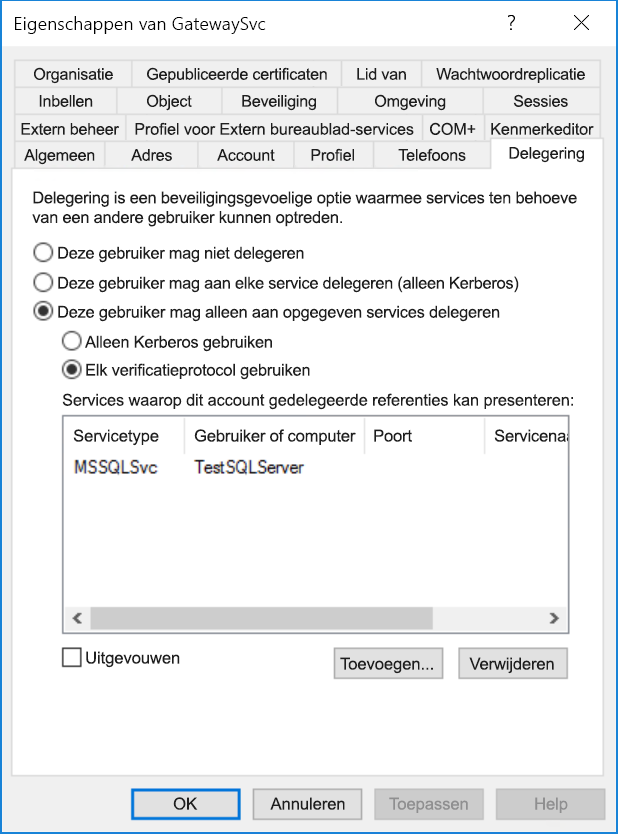
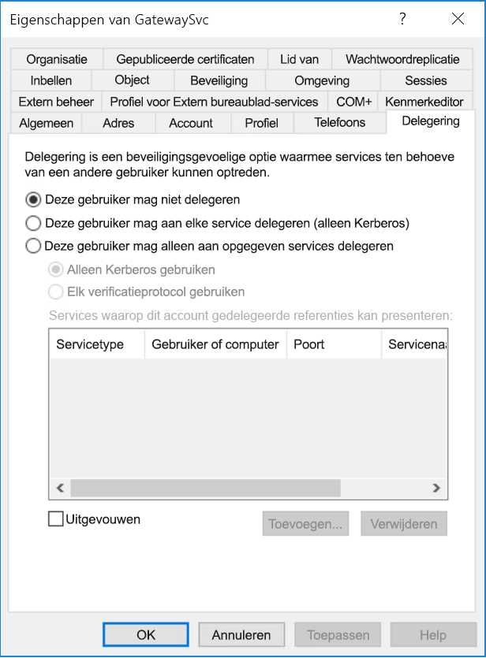
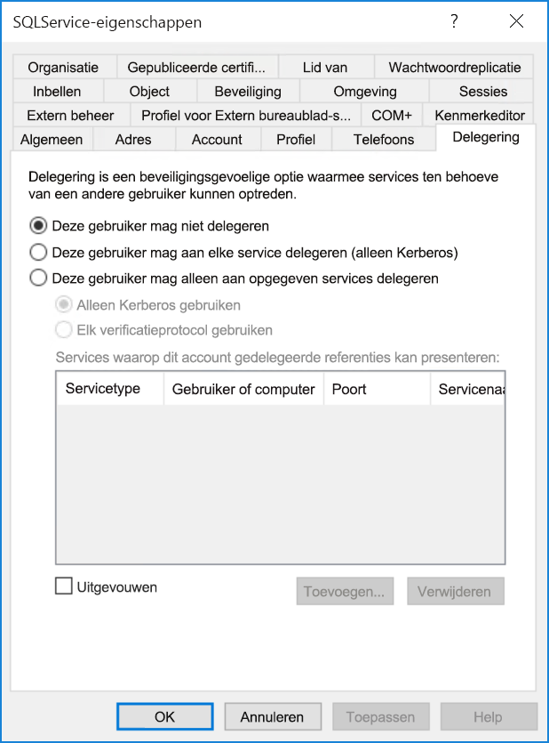

# <a name="configure-kerberos-based-sso-from-power-bi-service-to-on-premises-data-sources"></a>SSO met Kerberos vanuit Power BI-service naar on-premises gegevensbronnen configureren

Gebruik [beperkte Kerberos-delegering](/windows-server/security/kerberos/kerberos-constrained-delegation-overview) om naadloze connectiviteit via SSO mogelijk te maken. Met inschakeling van SSO is het eenvoudiger om gegevens van on-premises gegevensbronnen te vernieuwen in Power BI-rapporten en -dashboards, terwijl machtigingen van het gebruikersniveau die op deze gegevensbronnen zijn geconfigureerd, worden gehandhaafd.

Er moeten verschillende items worden geconfigureerd om ervoor te zorgen dat beperkte Kerberos-delegering goed werkt, waaronder _Service Principal Names_ (SPN) en delegeringsinstellingen voor serviceaccounts.

### <a name="prerequisite-1-install-and-configure-the-microsoft-on-premises-data-gateway"></a>Vereiste 1: De on-premises gegevensgateway van Microsoft installeren en configureren

De on-premises gegevensgateway biedt ondersteuning voor een in-place upgrade en voor het _overnemen van de instellingen_ van bestaande gateways.

### <a name="prerequisite-2-run-the-gateway-windows-service-as-a-domain-account"></a>Vereiste 2: De gatewayservice in Windows moet worden uitgevoerd als een domeinaccount

In een standaardinstallatie wordt de gateway uitgevoerd als een lokaal serviceaccount (als _NT Service\PBIEgwService_ om precies te zijn), zoals wordt weergegeven in de volgende afbeelding:


Om beperkte Kerberos-delegering in te schakelen, moet de gateway worden uitgevoerd als een domeinaccount, tenzij uw Azure AD-exemplaar (Azure Active Directory) al wordt gesynchroniseerd met uw lokale Active Directory-exemplaar (via Azure AD DirSync/Connect). Zie [Het on-premises serviceaccount van de gegevensgateway wijzigen](/data-integration/gateway/service-gateway-service-account) om over te schakelen naar een domeinaccount.

> [!NOTE]
> Als Azure AD Connect is geconfigureerd en gebruikersaccounts worden gesynchroniseerd, hoeft de gatewayservice tijdens runtime niet te zoeken in de lokale Azure AD. In plaats daarvan kunt u de lokale service-SID gebruiken voor de gatewayservice om alle vereiste configuratie in Azure Active Directory te voltooien. De stappen voor het configureren van beperkte Kerberos-delegering in dit artikel zijn hetzelfde als de configuratiestappen die vereist zijn in de Azure Active Directory-context. Alleen worden ze hier op het computerobject van de gateway in Azure AD toegepast (zoals aangegeven met de lokale service-SID) in plaats van op het domeinaccount.

### <a name="prerequisite-3-have-domain-admin-rights-to-configure-spns-setspn-and-kerberos-constrained-delegation-settings"></a>Vereiste 3: U moet beschikken over domeinbeheerdersrechten om instellingen voor SPN's (SetSPN) en de beperkte Kerberos-delegering te configureren

Het wordt afgeraden dat een domeinbeheerder iemand anders tijdelijk of permanent rechten geeft om SPN-namen en instellingen voor Kerberos-delegering te configureren, tenzij deze persoon ook over domeinbeheerdersrechten beschikt. In het volgende gedeelte worden de aanbevolen configuratiestappen in meer detail besproken.

## <a name="configure-kerberos-constrained-delegation-for-the-gateway-and-data-source"></a>Beperkte Kerberos-delegering configureren voor de gateway en de gegevensbron

Als domeinbeheerder configureert u een SPN voor het domeinaccount van de gatewayservice en configureert u delegeringsinstellingen voor het domeinaccount van de gatewayservice.

### <a name="configure-an-spn-for-the-gateway-service-account"></a>Een SPN voor het gatewayserviceaccount configureren

Bepaal eerst of er al een SPN is gemaakt voor het domeinaccount dat wordt gebruikt als gatewayserviceaccount:

1. Start als domeinbeheerder **Active Directory: gebruikers en computers**.

2. Klik met de rechtermuisknop op het domein, selecteer **Zoeken** en voer de accountnaam van het gatewayserviceaccount in.

3. Klik in de zoekresultaten met de rechtermuisknop op het gatewayserviceaccount en selecteer **Eigenschappen**.

4. Als het tabblad **Delegering** wordt weergegeven in het dialoogvenster **Eigenschappen**, is er al een SPN gemaakt en kunt u direct doorgaan naar [Kiezen tussen beperkte Kerberos-delegering op basis van resources en standaard beperkte Kerberos-delegering](#decide-on-resource-based-or-standard-kerberos-constrained-delegation).

    Als het dialoogvenster **Eigenschappen** geen tabblad **Delegering** bevat, kunt u handmatig een SPN maken voor het account. Gebruik het [setspn-hulpprogramma](https://technet.microsoft.com/library/cc731241.aspx) dat standaard deel uitmaakt van Windows (u moet domeinbeheerdersrechten hebben om de SPN te maken).

    Stel dat het gatewayserviceaccount de naam **Contoso\GatewaySvc** heeft en dat de naam van de computer waarop de gatewayservice wordt uitgevoerd **MyGatewayMachine** is. Om nu de SPN voor het gatewayserviceaccount in te stellen, zou u de volgende opdracht gebruiken:

    

    U kunt de SPN ook instellen met behulp van de MMC-module (Microsoft Management Console) Active Directory: gebruikers en computers.

### <a name="decide-on-resource-based-or-standard-kerberos-constrained-delegation"></a>Kiezen tussen beperkte Kerberos-delegering op basis van resources en standaard beperkte Kerberos-delegering

U kunt instellingen voor delegering configureren voor beperkte Kerberos-delegering op basis van resources _of_ standaard beperkte Kerberos-delegering. Gebruik op delegering op basis van resources als uw gegevensbron deel uitmaakt van een ander domein dan uw gateway. U kunt deze methode echter alleen gebruiken als u met Windows Server 2012 of hoger werkt. Zie de [pagina met een overzicht van beperkte Kerberos-delegering](/windows-server/security/kerberos/kerberos-constrained-delegation-overview) voor meer informatie over de verschillen tussen de twee methoden van delegering.

 Als u hebt besloten welke methode u wilt gebruiken, gaat u verder _naar_ [Gatewayserviceaccount configureren voor standaard beperkte Kerberos-delegering](#configure-the-gateway-service-account-for-standard-kerberos-constrained-delegation) _of_ [Gatewayserviceaccount configureren voor beperkte Kerberos-delegering op basis van resources](#configure-the-gateway-service-account-for-resource-based-kerberos-constrained-delegation). U moet niet beide subsecties uitvoeren.

## <a name="configure-the-gateway-service-account-for-standard-kerberos-constrained-delegation"></a>Gatewayserviceaccount configureren voor standaard beperkte Kerberos-delegering

> [!NOTE]
> Volg de stappen in deze sectie als u de standaarduitvoering van beperkte Kerberos-delegering wilt inschakelen. Als u beperkte Kerberos-delegering op basis van resources wilt inschakelen, gaat u naar de subsectie [Gatewayserviceaccount configureren voor beperkte Kerberos-delegering op basis van resources](#configure-the-gateway-service-account-for-resource-based-kerberos-constrained-delegation).

We gaan nu de instellingen voor delegering configureren voor het gatewayserviceaccount. Er zijn verschillende hulpprogramma's die u kunt gebruiken om deze stappen uit te voeren. Hier gebruiken we Active Directory: gebruikers en computers, een MMC-module (Microsoft Management Console) om informatie in de directory te beheren en te publiceren. De module is standaard beschikbaar op domeincontrollers, maar u kunt de module ook inschakelen via de configuratie van Windows-onderdelen op andere computers.

We moeten beperkte Kerberos-delegering met protocoldoorvoer configureren. Bij beperkte delegering moet u expliciet zijn voor wat betreft de services waaraan de gateway gedelegeerde referenties mag aanbieden. Zo worden delegatieaanroepen vanuit het gatewayserviceaccount alleen geaccepteerd door SQL-server of uw SAP HANA-server.

In deze sectie wordt ervan uitgegaan dat u al SPN-namen hebt geconfigureerd voor uw onderliggende gegevensbronnen (zoals SQL Server, SAP HANA, SAP BW, Teradata of Spark). Raadpleeg de technische documentatie voor de desbetreffende gegevensbronserver voor meer informatie over het configureren van SPN-namen voor de gegevensbronserver. U kunt ook kijken bij de kop *Welke SPN-naam heeft uw app nodig?* in het blogbericht [Mijn Kerberos-controlelijst](https://techcommunity.microsoft.com/t5/SQL-Server-Support/My-Kerberos-Checklist-8230/ba-p/316160).

In de volgende stappen wordt uitgegaan van een on-premises omgeving met twee computers op hetzelfde domein: een gatewaycomputer en een databaseserver met SQL Server die al is geconfigureerd voor SSO op basis van Kerberos. De stappen kunnen worden aangepast voor een van de andere ondersteunde gegevensbronnen, op voorwaarde dat de gegevensbron al is geconfigureerd voor eenmalige aanmelding op basis van Kerberos. In dit voorbeeldscenario worden de volgende instellingen en namen gebruikt:

* Active Directory-domein (Netbios): **Contoso**
* Naam van de gatewaymachine: **MyGatewayMachine**
* Gatewayserviceaccount: **Contoso\GatewaySvc**
* Computernaam SQL Server-gegevensbron: **TestSQLServer**
* Serviceaccount voor SQL Server-gegevensbron: **Contoso\SQLService**

U kunt de delegeringsinstellingen als volgt configureren:

1. Start als domeinbeheerder **Active Directory: gebruikers en computers**.

2. Klik met de rechtermuisknop op het gatewayserviceaccount (**Contoso\GatewaySvc**) en selecteer **Eigenschappen**.

3. Selecteer het tabblad **Delegering**.

4. Selecteer **Deze computer mag alleen aan opgegeven services delegeren** > **Elk protocol voor authenticatie gebruiken**.

5. Selecteer **Toevoegen** onder **Services waaraan dit account gedelegeerde referenties kan presenteren**.

6. Selecteer **Gebruikers of computers** in het nieuwe dialoogvenster.

7. Voer het serviceaccount voor de gegevensbron in. Een gegevensbron van SQL Server kan bijvoorbeeld een serviceaccount hebben als **Contoso\SQLService**. Er moet al een geschikte SPN voor de gegevensbron zijn ingesteld voor dit account. Zodra het account is toegevoegd, selecteert u **OK**.

8. Selecteer de SPN die u hebt gemaakt voor de databaseserver. In ons voorbeeld begint de SPN-naam met **MSSQLSvc**. Als u zowel de FQDN als de NetBIOS SPN voor uw databaseservice hebt toegevoegd, selecteert u deze hier allebei. Mogelijk ziet u er maar één.

9. Selecteer **OK**. U zou de SPN nu in de lijst met services moeten zien waaraan het gatewayserviceaccount gedelegeerde referenties kan laten zien.

    

Ga nu verder met [Lokale beleidsrechten toewijzen aan gatewayserviceaccount op gatewaycomputer](#grant-the-gateway-service-account-local-policy-rights-on-the-gateway-machine) om door te gaan met de configuratie.

## <a name="configure-the-gateway-service-account-for-resource-based-kerberos-constrained-delegation"></a>Gatewayserviceaccount configureren voor beperkte Kerberos-delegering op basis van resources

> [!NOTE]
> Volg de stappen in deze sectie als u beperkte Kerberos-delegering op basis van resources wilt inschakelen. Als u standaard beperkte Kerberos-delegering wilt inschakelen, gaat u naar de subsectie [Gatewayserviceaccount configureren voor standaard beperkte Kerberos-delegering](#configure-the-gateway-service-account-for-standard-kerberos-constrained-delegation).

Gebruik [beperkte Kerberos-delegering op basis van resources](/windows-server/security/kerberos/kerberos-constrained-delegation-overview) om eenmalige aanmelding voor Windows Server 2012 en later in te schakelen, zodat front-end- en back-end-services zich in verschillende domeinen kunnen bevinden. Om dit te laten werken, moet het domein van de back-end-service het domein van de front-end-service vertrouwen.

In de volgende stappen wordt uitgegaan van een on-premises omgeving met twee computers in verschillende domeinen: een gatewaycomputer en een databaseserver met SQL Server die al is geconfigureerd voor SSO op basis van Kerberos. De stappen kunnen worden aangepast voor een van de andere ondersteunde gegevensbronnen, op voorwaarde dat de gegevensbron al is geconfigureerd voor eenmalige aanmelding op basis van Kerberos. In dit voorbeeldscenario worden de volgende instellingen en namen gebruikt:

* Active Directory front-enddomein (Netbios): **ContosoFrontEnd**
* Active Directory back-enddomein (Netbios): **ContosoBackEnd**
* Naam van de gatewaymachine: **MyGatewayMachine**
* Gatewayserviceaccount: **ContosoFrontEnd\GatewaySvc**
* Computernaam SQL Server-gegevensbron: **TestSQLServer**
* Serviceaccount voor SQL Server-gegevensbron: **ContosoBackEnd\SQLService**

Voer aan de hand van deze voorbeeldnamen en -instellingen de volgende configuratiestappen uit:

1. Zorg ervoor dat op de domeincontroller voor het domein **ContosoFrontEnd** geen instellingen voor delegering worden toegepast voor het gatewayserviceaccount met behulp van **Active Directory: gebruikers en computers**, een MMC-module (Microsoft Management Console).

    

2. Gebruik **Active Directory: gebruikers en computers** op de domeincontroller voor het domein **ContosoBackEnd** om te controleren dat er geen instellingen voor delegering worden toegepast op het serviceaccount van de back-end.

    

3. Zorg er ook voor dat het kenmerk **msDS-AllowedToActOnBehalfOfOtherIdentity** voor dit account niet is ingesteld. U vindt dit kenmerk in de **Kenmerkeditor**, zoals wordt weergegeven in de volgende afbeelding:

    

4. Maak een groep in **Active Directory: gebruikers en computers**, op de domeincontroller voor het domein **ContosoBackEnd**. Voeg het serviceaccount van de gateway toe aan deze groep, zoals is weergegeven in de volgende afbeelding. In de afbeelding wordt een nieuwe groep met de naam _ResourceDelGroup_ weergegeven en het serviceaccount voor de gateway, **GatewaySvc**, dat is toegevoegd aan deze groep.

    

5. Open een opdrachtprompt en voer de volgende opdrachten uit op de domeincontroller voor het domein **ContosoBackEnd** om het kenmerk **msDS-AllowedToActOnBehalfOfOtherIdentity** van het serviceaccount van de back-end bij te werken:

    ```powershell
    $c = Get-ADGroup ResourceDelGroup
    Set-ADUser SQLService -PrincipalsAllowedToDelegateToAccount $c
    ```

6. U kunt controleren of de update terug is te zien in het tabblad 'Kenmerkeditor' in de eigenschappen voor het serviceaccount van de back-end in **Active Directory-gebruikers en -computers.** De **msDS-AllowedToActOnBehalfOfOtherIdentity** moet nu worden ingesteld.

## <a name="grant-the-gateway-service-account-local-policy-rights-on-the-gateway-machine"></a>Lokale beleidsrechten toewijzen aan gatewayserviceaccount op gatewaycomputer

Ten slotte moet u op de computer waarop de gatewayservice wordt uitgevoerd (**MyGatewayMachine** in ons voorbeeld), het lokale beleid **Een client nabootsen na verificatie** en **Functioneren als deel van het besturingssysteem (SeTcbPrivilege)** toewijzen aan het gatewayserviceaccount. U kunt deze configuratie bewerkstelligen en controleren met de Lokale groepsbeleidobjecteditor (**gpedit**).

1. Voer op de gatewaycomputer *gpedit.msc* uit.

2. Ga naar **Lokaal computerbeleid** &gt; **Computerconfiguratie** &gt; **Windows-instellingen** &gt; **Beveiligingsinstellingen** &gt; **Lokaal beleid** &gt; **Toewijzing van gebruikersrechten**.

    

3. Selecteer onder **Toewijzing van gebruikersrechten** in de lijst met beleidsregels de optie **Een client nabootsen na verificatie**.

    

    Klik met de rechtermuisknop om **Eigenschappen** te openen. Controleer de lijst met accounts. Het moet het gatewayserviceaccount (**Contoso\GatewaySvc** of **ContosoFrontEnd\GatewaySvc** bevatten, afhankelijk van het type beperkte delegatie).

4. Selecteer onder **Toewijzing van gebruikersrechten** in de lijst met beleidsregels de optie **Functioneren als deel van het besturingssysteem (SeTcbPrivilege)** . Zorg ervoor dat het gatewayserviceaccount ook wordt opgenomen in de lijst met accounts.

5. Start het serviceproces van de **on-premises gegevensgateway** opnieuw op.

### <a name="set-user-mapping-configuration-parameters-on-the-gateway-machine-if-required"></a>Configuratieparameters voor gebruikerstoewijzing instellen op gatewaycomputer

Als u Azure AD Connect niet hebt geconfigureerd, volgt u deze stappen om een gebruiker van de Power BI-service toe te wijzen aan een lokale Active Directory-gebruiker. Elke Active Directory-gebruiker die op deze manier wordt toegewezen, moet SSO-machtigingen hebben voor uw gegevensbron. Bekijk deze [Guy in a Cube-video](https://www.youtube.com/watch?v=NG05PG9aiRw)voor meer informatie.

1. Open het configuratiebestand van de hoofdgateway, `Microsoft.PowerBI.DataMovement.Pipeline.GatewayCore.dll`. Dit bestand bevindt zich standaard in C:\Program Files\On-premises data gateway.

1. Stel **ADUserNameLookupProperty** in op een niet-gebruikt Active Directory-kenmerk. We gaan ervan uit dat `msDS-cloudExtensionAttribute1` wordt gebruikt in de volgende stappen, wetende dat dit kenmerk alleen beschikbaar is in Windows Server 2012 en hoger. Stel **ADUserNameReplacementProperty** in op `SAMAccountName`. Sla het configuratiebestand op.

1. Klik op het tabblad **Services** met de rechtermuisknop op de gateway-service en selecteer **Opnieuw opstarten**.

    

1. Voor elke gebruiker van de Power BI-service waarvoor u SSO met Kerberos wilt inschakelen, stelt u de eigenschap `msDS-cloudExtensionAttribute1` van een lokale Active Directory-gebruiker (met SSO-machtiging voor uw gegevensbron) in op de volledige gebruikersnaam (d.w.z. UPN) van de gebruiker van de Power BI-service. Als u zich bijvoorbeeld aanmeldt bij de Power BI-service als `test@contoso.com` en u deze gebruiker wilt toewijzen aan een lokale Active Directory-gebruiker met SSO-machtigingen, bijvoorbeeld `test@LOCALDOMAIN.COM`, stelt u het kenmerk `msDS-cloudExtensionAttribute1` van `test@LOCALDOMAIN.COM` in op `test@contoso.com`.

    U kunt de eigenschap `msDS-cloudExtensionAttribute1` instellen met behulp van de module Active Directory Users en Computers Microsoft Management Console (MMC):
    
    1. Start als domeinbeheerder Active Directory-gebruikers en -computers.
    
    1. Klik met de rechtermuisknop op het domein, selecteer Zoeken en typ de accountnaam van de lokale Active Directory-gebruiker waaraan u de gebruiker wilt toewijzen.
    
    1. Selecteer het tabblad **Kenmerkeditor**.
    
        Zoek de eigenschap `msDS-cloudExtensionAttribute1` en dubbelklik hierop. Stel de waarde in op de volledige gebruikersnaam (d.w.z. UPN) van de gebruiker waarmee u zich aanmeldt bij de Power BI-service.
    
    1. Selecteer **OK**.
    
        
    
    1. Selecteer **Toepassen**. Controleer of de juiste waarde is ingesteld in de kolom **Waarde**.

## <a name="complete-data-source-specific-configuration-steps"></a>Configuratiestappen uitvoeren die specifiek gelden voor gegevensbron

Voor SAP HANA en SAP BW gelden aanvullende vereisten en voorwaarden voor wat betreft de configuratie van gegevensbronnen waaraan moet worden voldaan voordat u via de gateway een SSO-verbinding kunt opzetten naar deze gegevensbronnen. Zie de [configuratiepagina voor SAP HANA](service-gateway-sso-kerberos-sap-hana.md) en [voor SAP BW - CommonCryptoLib (sapcrypto.dll)](service-gateway-sso-kerberos-sap-bw-commoncryptolib.md) voor meer informatie. Het is ook mogelijk om [SAP BW te configureren voor gebruik met de SNC-bibliotheek gx64krb5](service-gateway-sso-kerberos-sap-bw-gx64krb.md), maar deze bibliotheek wordt niet aanbevolen door Microsoft omdat deze niet meer wordt ondersteund door SAP. Gebruik CommonCryptoLib _of_ gx64krb5 als uw SNC-bibliotheek. Voer de configuratiestappen niet voor beide bibliotheken uit.

> [!NOTE]
> Andere SNC-bibliotheken werken mogelijk ook voor SSO via BW, maar deze worden niet officieel ondersteund door Microsoft.

## <a name="run-a-power-bi-report"></a>Een Power BI-rapport uitvoeren

Nadat alle configuratiestappen zijn voltooid, kunt u de pagina **Gateway beheren** in Power BI gebruiken om de gegevensbron te configureren die u wilt gebruiken voor SSO. Als u meerdere gateways hebt, moet u de gateway selecteren die u voor SSO via Kerberos hebt geconfigureerd. Controleer vervolgens of onder **Geavanceerde instellingen** voor de gegevensbron **Eenmalige aanmelding via Kerberos gebruiken voor query's van DirectQuery** is ingeschakeld.


 Publiceer een **op DirectQuery gebaseerd** rapport vanuit Power BI Desktop. Voor dit rapport moeten gegevens worden gebruikt die toegankelijk zijn voor de gebruiker die is toegewezen aan de (Azure) Active Directory-gebruiker die zich bij de Power BI-service aanmeldt. Gebruik DirectQuery in plaats van importeren; dit heeft te maken met de manier waarop gegevens worden vernieuwd. Wanneer u op import gebaseerde rapporten vernieuwt, worden op de gateway de referenties gebruikt die u in de velden **Gebruikersnaam** en **Wachtwoord** hebt ingevoerd toen u de gegevensbron hebt gemaakt. Met andere woorden: Kerberos SSO wordt **niet** gebruikt. Bovendien moet u er tijdens het publiceren voor zorgen dat u de gateway selecteert die u voor SSO hebt geconfigureerd (indien u meerdere gateways hebt). In de Power BI-service kunt u nu het rapport vernieuwen of een nieuw rapport maken op basis van de gepubliceerde gegevensset.

Deze configuratie werkt in de meeste gevallen. Er kunnen echter andere Kerberos-configuraties nodig zijn, afhankelijk van uw omgeving. Als het rapport nog steeds niet wordt geladen, neemt u contact op met uw domeinbeheerder voor verdere hulp. Als uw gegevensbron SAP BW is, kunt u ook de secties voor probleemoplossing raadplegen op de configuratiepagina's van een gegevensbron voor [CommonCryptoLib](service-gateway-sso-kerberos-sap-bw-commoncryptolib.md#troubleshooting) en [gx64krb5/gsskrb5](service-gateway-sso-kerberos-sap-bw-gx64krb.md#troubleshooting), afhankelijk van welke SNC-bibliotheek u hebt gekozen.

## <a name="next-steps"></a>Volgende stappen

Raadpleeg de volgende bronnen voor meer informatie over de **on-premises gegevensgateway** en **DirectQuery**:

* [Wat is een on-premises gegevensgateway?](/data-integration/gateway/service-gateway-onprem)
* [DirectQuery in Power BI](desktop-directquery-about.md)
* [Data sources supported by DirectQuery](desktop-directquery-data-sources.md) (Gegevensbronnen die worden ondersteund door DirectQuery)
* [DirectQuery en SAP BW](desktop-directquery-sap-bw.md)
* [DirectQuery en SAP HANA](desktop-directquery-sap-hana.md)
