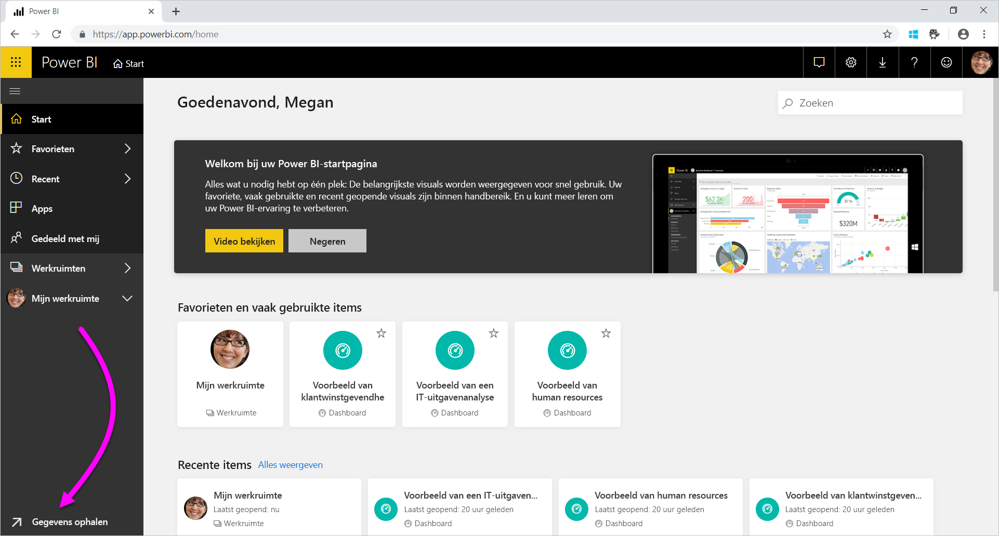
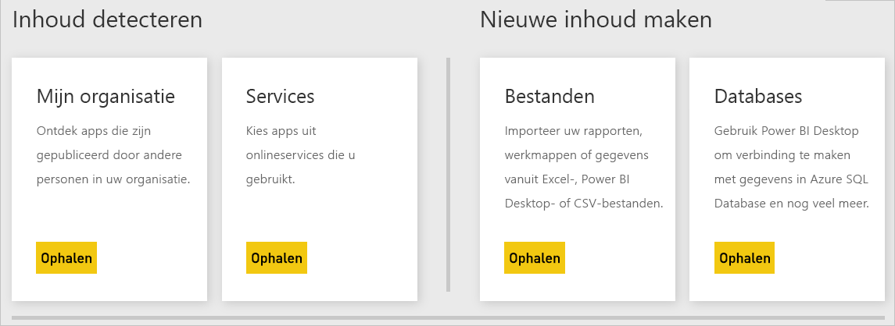

# Gegevensbronnen voor de Power BI-service
Gegevens vormen de kern van Power BI. Stel dat u gegevens verkent. U doet dit mogelijk door grafieken of dashboards te maken of door vragen te stellen met **Q&A**. De visualisaties en antwoorden die u ziet, krijgen hun onderliggende gegevens uit een gegevensset. Maar waar komt deze gegevensset vandaan? Deze is afkomstig van een gegevensbron.

In dit artikel gaan we in op de typen gegevensbronnen waarmee u verbinding kunt maken vanuit de Power BI-service. Vergeet niet dat er ook nog veel andere typen gegevensbronnen zijn waaruit u gegevens kunt ophalen. Als u deze gegevensbronnen kiest, moet u mogelijk eerst gebruikmaken van de geavanceerde gegevensquery- en modelleringsfuncties van Power BI Desktop of Excel. Deze opties worden later besproken. Nu gaan we kijken naar de verschillende typen gegevensbronnen die direct vanuit uw Power BI-servicesite beschikbaar zijn.

U kunt gegevens ophalen uit een van de gegevensbronnen in Power BI door **Gegevens ophalen** in de linkerbenedenhoek van de pagina te selecteren.

 

Nadat u **Gegevens ophalen** hebt geselecteerd, kunt u de gegevens kiezen die u wilt openen

## Inhoud detecteren

De sectie **Inhoud ontdekken** bevat alle gegevens en rapporten die u nodig hebt. Er zijn twee typen inhoudspakketten in Power BI: Organisatie en Services. 

**Organisatie**: als u en andere gebruikers in uw organisatie een Power BI Pro-account hebben, kunt u inhoudspakketten maken, delen en gebruiken. Zie [Inleiding tot organisatie-inhoudspakketten](service-organizational-content-pack-introduction.md) voor meer informatie.

**Services**: er zijn talloze services met inhoudspakketten voor Power BI en er worden er steeds meer toegevoegd. Voor de meeste services hebt u een account nodig. Zie [Verbinding maken met de services die u gebruikt met Power BI](service-connect-to-services.md) voor meer informatie.

## Nieuwe inhoud maken

De sectie **Nieuwe inhoud maken** bevat opties voor het zelf maken en importeren van inhoud. U kunt in Power BI op twee manieren uw eigen inhoud maken of importeren: bestanden en databases. 

### Bestanden

**Excel** ( *.xlsx*, *.xlsm*) - Een werkmap in Excel kan verschillende gegevenstypen bevatten. Deze kan bijvoorbeeld gegevens bevatten die u zelf hebt ingevoerd in werkbladen. Of de werkmap kan gegevens bevatten die u hebt opgevraagd en geladen uit externe gegevensbronnen met behulp van Power Query. Power Query is beschikbaar via **Ophalen en transformeren** in Excel 2016 of Power Pivot. U kunt gegevens importeren uit tabellen in werkbladen of uit een gegevensmodel. Zie [Gegevens uit bestanden ophalen voor Power BI](service-get-data-from-files.md) voor meer informatie.

**Power BI Desktop** ( *.pbix*): met Power BI Desktop kunt u gegevens opvragen en laden uit externe gegevensbronnen en rapporten maken. Ook is het mogelijk uw gegevensmodel uit te breiden met metingen en relaties of om uw Power BI Desktop-bestand in de Power BI-site te importeren. Power BI Desktop wordt aanbevolen voor gevorderde gebruikers. Deze gebruikers hebben meestal een goede kennis van hun gegevensbronnen. Ook weten ze wat het ophalen en transformeren van gegevens inhoudt en begrijpen ze de concepten van gegevensmodellering. Zie [Verbinding maken met gegevens in Power BI Desktop](desktop-connect-to-data.md) voor meer informatie.

**Door komma's gescheiden waarden** ( *.csv*): bestanden van dit type zijn eenvoudige tekstbestanden met rijen gegevens. Elke rij kan een of meer waarden bevatten, van elkaar gescheiden door komma's. Zo bevat een *CSV*-bestand met naam- en adresgegevens waarschijnlijk veel rijen. Elke rij kan waarden voor de voor- en achternaam, het adres, de plaats enzovoort bevatten. U kunt geen gegevens importeren in een *CSV*-bestand, maar veel toepassingen, zoals Excel, kunnen eenvoudige tabelgegevens opslaan als *CSV*-bestand.

Voor andere bestandstypen, zoals XML-tabel ( *.xml*) of tekstbestanden ( *.txt*), kunt u met behulp van **Ophalen en transformeren** gegevens eerst opvragen, transformeren en laden in een Excel- of Power BI Desktop-bestand. U kunt het Excel- of Power BI Desktop-bestand vervolgens importeren in Power BI.

Het maakt ook een groot verschil waar u uw bestanden opslaat. OneDrive voor Bedrijven biedt de grootste mate van flexibiliteit en integratie met Power BI. Het is mogelijk uw bestanden op de lokale schijf te houden. Maar als u uw gegevens moet vernieuwen, zijn er enkele extra stappen nodig. Zie de artikelkoppelingen hieronder voor meer informatie.

### Databases

**Databases in de cloud**: u kunt vanuit de Power BI-service live verbinding maken met:

* Azure SQL Database
* Azure SQL Data Warehouse
* Spark op Azure HDInsight

Verbindingen vanuit Power BI met deze databases zijn live. Stel dat u verbinding maakt met een Azure SQL Database. U begint vervolgens met het verkennen van de gegevens hiervan door rapporten te maken in Power BI. Wanneer u uw gegevens segmenteert of een ander veld aan een visualisatie toevoegt, voert Power BI rechtstreeks een query voor de database uit. Zie [Azure en Power BI](service-azure-and-power-bi.md) voor meer informatie.

**On-premises databases**: vanuit de Power BI-service kunt u rechtstreeks verbinding maken met databases van het tabelmodel van SQL Server Analyses Services. Als u dit wilt doen, hebt u een Power BI Enterprise-gateway nodig. Als u niet zeker weet hoe u verbinding kunt maken met uw organisatiedatabase in tabelvorm, neemt u contact op met de systeembeheerder of IT-afdeling. Zie [Live SQL Server Analysis Services-gegevens in Power BI](sql-server-analysis-services-tabular-data.md) voor meer informatie.

Voor andere databasetypen in uw organisatie moet u eerst met Power BI Desktop of Excel verbinding maken om gegevens op te vragen en ze in een gegevensmodel te laden. U kunt het bestand vervolgens importeren in Power BI, waar een gegevensset bestaat. Als u een geplande vernieuwing hebt geconfigureerd, gebruikt Power BI die configuratie en verbindingsinformatie uit het bestand om rechtstreeks verbinding te maken met de gegevensbron en naar updates te zoeken. Vervolgens worden die updates met Power BI in de gegevensset geladen. Zie [Verbinding maken met gegevens in Power BI Desktop](desktop-connect-to-data.md) voor meer informatie.

## Wat gebeurt er als mijn gegevens afkomstig zijn van een andere bron?
Er zijn honderden verschillende gegevensbronnen die u kunt gebruiken met Power BI. Waar uw gegevens ook vandaan komen, de gegevens moeten een indeling hebben die geschikt is voor de Power BI-service. De Power BI-service kan met bruikbare gegevens rapporten en dashboards maken, vragen beantwoorden met **Q&A** enzovoort.

Sommige gegevensbronnen hebben al gegevens met de juiste indeling voor de Power BI-service. Deze bronnen zijn vergelijkbaar met inhoudspakketten van serviceproviders zoals Google Analytics en Twilio. Ook databases in tabelmodel van SQL Server Analysis Services zijn klaar voor gebruik. Het is eveneens mogelijk live verbinding te maken met databases in de cloud zoals Azure SQL Database en Spark op HDInsight.

In andere gevallen moet u de gewenste gegevens mogelijk opvragen en in een bestand laden. Stel dat u logistieke gegevens bewaart in uw organisatie. U bewaart die gegevens in een datawarehousedatabase op een server. In de Power BI-service kunt u geen verbinding maken met deze database om de gegevens te gaan verkennen, tenzij dit een database met een tabelmodel is. U kunt echter wel met Power BI Desktop of Excel de logistieke gegevens opvragen en in een gegevensmodel laden dat u als een bestand opslaat. U kunt het bestand vervolgens importeren in Power BI, waar een gegevensset bestaat.

U denkt waarschijnlijk: "Maar logistieke gegevens in deze database veranderen elke dag. Hoe vernieuw ik mijn Power BI gegevensset?" Wanneer u de gegevens in de gegevensset importeert, importeert u ook de verbindingsgegevens uit het Power BI Desktop- of Excel-bestand.

Stel dat u een geplande vernieuwing configureert of de gegevensset handmatig vernieuwt. Power BI gebruikt de verbindingsgegevens van de gegevensset samen met een aantal andere instellingen om direct verbinding te maken met de database. Vervolgens wordt er naar updates gezocht en worden die updates in de gegevensset geladen. U hebt waarschijnlijk een Power BI-gateway nodig om de gegevensoverdracht tussen uw on-premises server en Power BI te beveiligen. Wanneer de overdracht is voltooid, worden alle visualisaties in rapporten en dashboards automatisch vernieuwd.

Dus zelfs als u niet direct vanuit de Power BI-service verbinding kunt maken met uw gegevensbron, kunt u die gegevens toch in Power BI ophalen. Er zijn alleen een paar stappen extra nodig en misschien wat hulp van uw IT-afdeling. Zie [Gegevensbronnen in Power BI Desktop](desktop-data-sources.md) voor meer informatie.

## Nog enkele details
U ziet dat de termen gegevensset en gegevensbron veel worden gebruikt in Power BI. Ze worden vaak als synoniem gebruikt. Het zijn echter twee verschillende dingen die wel met elkaar in verband staan.

U maakt automatisch een **gegevensset** in Power BI wanneer u **Gegevens ophalen** gebruikt. Met **Gegevens ophalen** maakt u verbinding met een inhoudspakket of bestand en importeert u gegevens of maakt u verbinding met een livegegevensbron. Een gegevensset bevat informatie over de gegevensbron en gegevensbronreferenties. In veel gevallen bevat de gegevensset ook een subset van gegevens die zijn gekopieerd uit de gegevensbron. Als u visualisaties in rapporten en dashboards maakt, kijkt u vaak naar gegevens in de gegevensset.

Een **gegevensbron** is de plek waar de gegevens in een gegevensset vandaan komen. De gegevens kunnen bijvoorbeeld afkomstig zijn van:

* Een onlineservice zoals Google Analytics of QuickBooks
* Een database in de cloud zoals Azure SQL Database
* Een database of bestand op een lokale computer of server in uw eigen organisatie

## Gegevens vernieuwen
Misschien slaat u uw bestanden op uw lokale schijf of een schijf ergens in de organisatie op. Mogelijk hebt u een Power BI-gateway nodig zodat u de gegevensset in Power BI kunt vernieuwen. De computer waarop het bestand is opgeslagen, moet bij het vernieuwen zijn ingeschakeld. U kunt uw bestand opnieuw importeren of Publiceren vanuit Excel of Power BI Desktop gebruiken, maar dit zijn geen geautomatiseerde processen.

Als u uw bestanden op OneDrive voor Bedrijven of SharePoint - Teamsites opslaat en er vervolgens verbinding mee maakt of ze importeert in Power BI, zijn uw gegevensset, rapporten en dashboard altijd actueel. Omdat OneDrive en Power BI beide in de cloud zijn, kan Power BI rechtstreeks verbinding maken met uw opgeslagen bestand. Er wordt ongeveer één keer per uur verbinding gemaakt en op updates gecontroleerd. De gegevensset en alle visualisaties worden automatisch vernieuwd als er updates zijn.

Inhoudspakketten van services worden automatisch bijgewerkt. In de meeste gevallen worden ze één keer per dag bijgewerkt. U kunt handmatig vernieuwen, maar het hangt af van de serviceprovider of u wel of niet bijgewerkte gegevens ziet. Updates voor inhoudspakketten van personen in uw organisatie zijn afhankelijk van de gegevensbronnen die worden gebruikt. Ze zijn ook afhankelijk van hoe degene die het inhoudspakket heeft gemaakt, de vernieuwing heeft geconfigureerd.

Azure SQL Database, Azure SQL Data Warehouse en Spark op Azure HDInsight zijn gegevensbronnen in de cloud. De Power BI-service bevindt zich ook in de cloud, zodat Power BI met behulp van **DirectQuery** live verbinding mee kan maken. Wat u ziet in Power BI is altijd synchroon en er hoeft geen geplande vernieuwing te worden ingesteld.

Wanneer u vanuit Power BI verbinding maakt met SQL Server Analysis Services, is het een liveverbinding net als een Azure-database in de cloud. Het verschil is dat de database zelf zich op een server in uw organisatie bevindt. Voor dit type verbinding is een Power BI-gateway vereist die kan worden geconfigureerd door een IT-afdeling.

Gegevens vernieuwen is een uiterst belangrijk onderdeel van Power BI en is veel te complex om hier verder te behandelen. Zie [Gegevens vernieuwen in Power BI](refresh-data.md) als u er diepgaand inzicht in wilt krijgen.

## Overwegingen en beperkingen
Voor alle gegevensbronnen die in de Power BI-service worden gebruikt, zijn de volgende beperkingen van toepassing. Er zijn andere beperkingen van toepassing voor specifieke functies, maar de volgende lijst is van toepassing op de volledige Power BI-service:

* **Maximale grootte van de gegevensset**: er is een limiet van 1 GB per gegevensset in Gedeelde capaciteit in de Power BI-service. Als u grotere gegevenssets nodig hebt, kunt u [Power BI Premium](service-premium-what-is.md) gebruiken.

* **Distinct-waarden in een kolom**: bij het opslaan van gegevens in een Power BI-gegevensset (ook wel 'importmodus' genoemd) is er een limiet van 1.999.999.997 voor het aantal afzonderlijke waarden dat in een kolom kan worden opgeslagen.

* **Rijlimiet** : wanneer u **DirectQuery** gebruikt, legt Power BI een limiet op voor de queryresultaten die worden verzonden naar de onderliggende gegevensbron. Als de query die naar de gegevensbron wordt verzonden, meer dan 1.000.000 rijen retourneert, wordt er een fout weergegeven en mislukt de query. Uw onderliggende gegevens kunnen nog steeds meer dan 1.000.000 rijen bevatten. Het is niet waarschijnlijk dat u deze limiet zult tegenkomen omdat de meeste rapporten de gegevens in kleinere sets met resultaten verzamelen.

* **Kolomlimiet**: het maximum aantal kolommen dat is toegestaan in een gegevensset voor alle tabellen in de gegevensset, is 16.000 kolommen. Deze limiet is van toepassing voor de Power BI-service en voor gegevenssets die worden gebruikt in Power BI Desktop. Power BI houdt op deze manier het aantal kolommen en tabellen in de gegevensset bij, wat betekent dat het maximum aantal kolommen 16.000 min één is voor elke tabel in de gegevensset.

