# Zelfstudie: Aan de slag met de Power BI-service
Deze zelfstudie is een inleiding tot een aantal functies van de *Power BI-service*. U kunt daarmee verbinding maken met gegevens, een rapport en een dashboard maken en vragen stellen over uw gegevens. U kunt veel meer doen in de Power BI-service. Deze zelfstudie is alleen maar bedoeld om de smaak naar meer op te wekken. Als u wilt weten hoe de Power BI-service aansluit bij de andere Power BI-aanbiedingen, is het een goed idee om [Wat is Power BI?](fundamentals/power-bi-overview.md) te lezen.

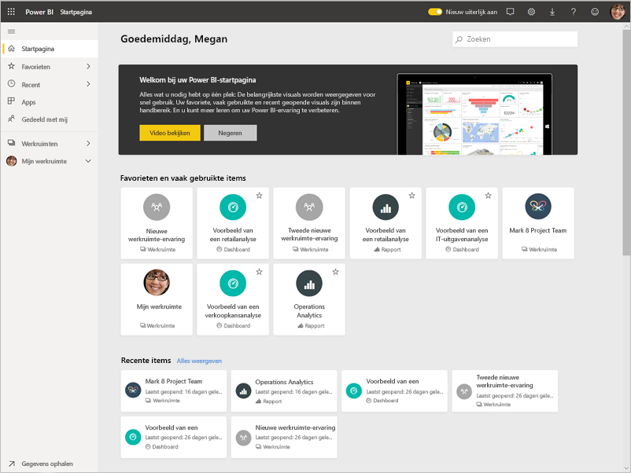

In deze zelfstudie voert u de volgende stappen uit:

> [!div class="checklist"]
> * Meld u aan bij uw Power BI Online-account of registreert u zich als u nog geen account hebt.
> * De Power BI-service openen.
> * Enkele gegevens ophalen en deze openen in de rapportweergave.
> * Deze gegevens gebruiken om visualisaties te maken en deze op te slaan als een rapport.
> * Een dashboard maken door tegels van het rapport vast te maken.
> * Andere visualisaties toevoegen aan uw dashboard met behulp van Q&A (query's uitvoeren in natuurlijke taal).
> * Het formaat van de tegels op het dashboard wijzigen, de tegels opnieuw ordenen en ermee communiceren.
> * Resources opschonen door het verwijderen van de gegevensset, het rapport en het dashboard.

> [!TIP]
> Volgt u liever een gratis training in uw eigen tempo? [Schrijf u in voor de cursus Analyzing and Visualizing Data with Power BI op EdX](http://aka.ms/edxpbi).

## Aanmelden voor de Power BI-service
Als u geen Power BI-account hebt, kunt u zich [aanmelden voor een gratis Power BI Pro-proefversie](https://app.powerbi.com/signupredirect?pbi_source=web) voordat u begint.

Wanneer u een account hebt, voert u *app.powerbi.com* in uw browser in om de Power bi-service te openen. 

## Stap 1: Gegevens ophalen

Wanneer u een Power BI-rapport wilt maken, kunt u vaak het beste beginnen in Power BI Desktop. Nu gaan we helemaal opnieuw beginnen met het maken van een rapport in de Power BI-service.

In deze zelfstudie gaan we gegevens ophalen uit een CSV-bestand. Doet u mee? [Download het CSV-bestand met financiële voorbeelden](http://go.microsoft.com/fwlink/?LinkID=521962).

1. [Meld u aan bij Power BI](http://www.powerbi.com/). Hebt u geen account? Geen probleem, u kunt zich aanmelden voor een gratis proefversie.
2. Power BI wordt geopend in uw browser. Selecteer **Gegevens ophalen** onder in de linkernavigatiebalk.

    De pagina **Gegevens ophalen** wordt geopend.   

3. Selecteer in de sectie **Nieuwe inhoud maken** de optie **Bestanden**. 
   
   
4.  Selecteer **Lokaal bestand**.
   
    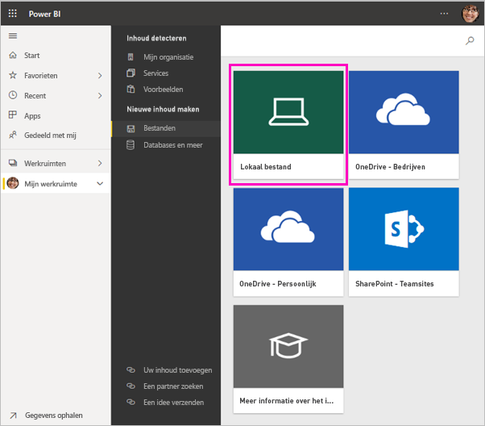

5. Blader naar het bestand op uw computer en kies **Openen**.

5. Voor deze zelfstudie selecteren we **Importeren** om het Excel-bestand toe te voegen als een gegevensset die we vervolgens kunnen gebruiken om rapporten en dashboards te maken. Als u **Uploaden** selecteert, wordt de hele Excel-werkmap geüpload naar Power BI, waar u deze kunt openen en bewerken in Excel Online.
   
   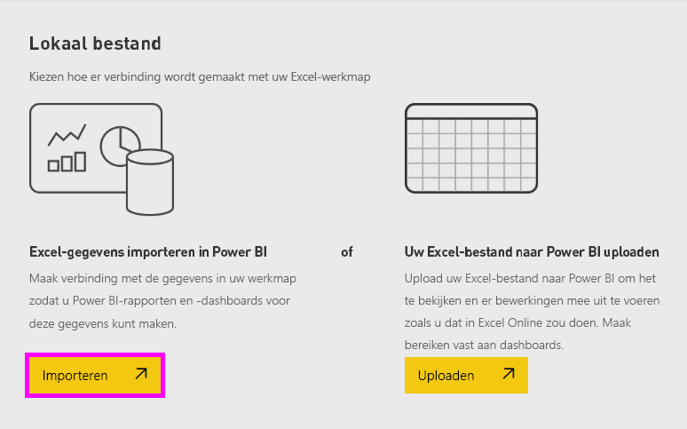
6. Selecteer **Gegevenssets** wanneer uw gegevensset gereed is, selecteer vervolgens **Rapport maken** naast de gegevensset **Financieel voorbeeld** om de rapporteditor te openen. 

    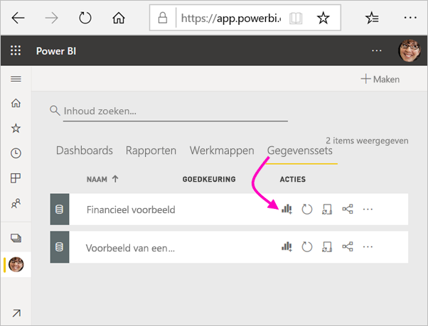

    Het rapportcanvas is leeg. Aan de rechterkant zien we de deelvensters **Filters**, **Visualisaties** en **Velden**.

    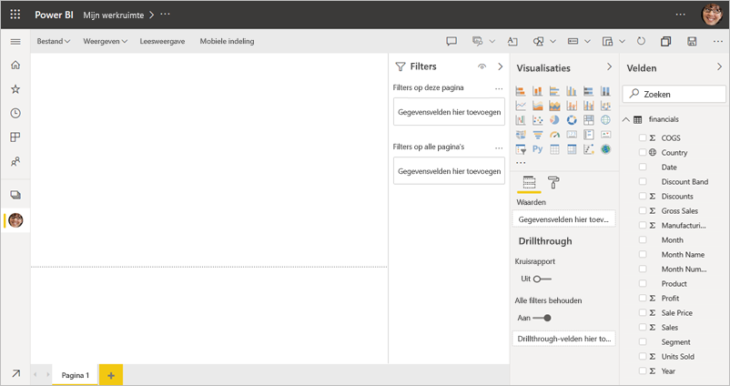

7. U ziet een optie voor de **leesweergave** in de bovenste navigatiebalk. Omdat u deze optie hebt, betekent dit dat u zich momenteel in de weergave Bewerken bevindt. Een uitstekende manier om vertrouwd te raken met de rapporteditor is door [een rondleiding te volgen](service-the-report-editor-take-a-tour.md).

    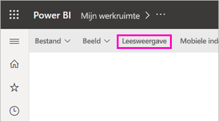

    In de weergave Bewerken kunt u uw rapporten maken en aanpassen omdat u de *eigenaar* van het rapport bent. Dat wil zeggen dat u een *maker*bent. Wanneer u uw rapport met collega’s deelt, kunnen zij alleen interactief met het rapport werken in de leesweergave; uw collega's worden *consumenten* genoemd. Lees meer over de [leesweergave en de bewerkweergave](consumer/end-user-reading-view.md).

## Stap 2: Een grafiek in een rapport maken
Nu u verbinding met de gegevens hebt gemaakt, kunt u gaan verkennen.  Wanneer u iets interessants hebt gevonden, kunt u een dashboard maken om dit te controleren en te zien hoe dit na verloop van tijd verandert. Laten we zien hoe het werkt.
    
1. In de rapporteditor beginnen we in het deelvenster **Velden** aan de rechterkant van de pagina voor het bouwen van een visualisatie. Schakel de selectievakjes in van **Bruto verkoop** en **Datum**.
   
   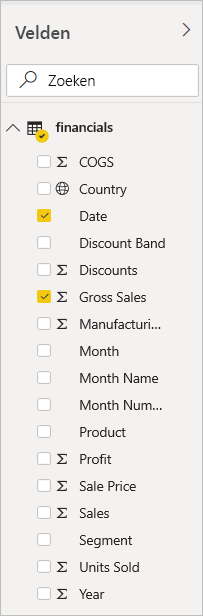

    Power BI analyseert de gegevens en maakt vervolgens een visualisatie. Als u eerst **Datum** hebt geselecteerd, ziet u een tabel. Als u eerst **Bruto verkoop** hebt geselecteerd, ziet u een kolomdiagram. 

2. Probeer de gegevens eens op een andere manier weer te geven. Laten we deze gegevens eens bekijken als lijndiagram. Selecteer in het deelvenster **Visualisaties** het lijndiagrampictogram.
   
   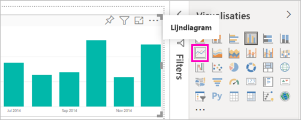

3. Dit diagram lijkt interessant, dus laten we deze *vastmaken* aan een dashboard. Beweeg de muisaanwijzer over de visualisatie en selecteer het pictogram voor vastmaken. Wanneer u deze visualisatie vastmaakt, wordt deze opgeslagen op uw dashboard en kunt u in één oogopslag zien wat de meest recente waarde is.
   
   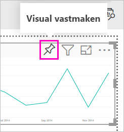

4. Omdat dit een nieuw rapport is, wordt u gevraagd dit rapport op te slaan voordat u een visualisatie aan een dashboard kunt vastmaken. Geef uw rapport een naam (bijvoorbeeld *Verkoop over periode*) en selecteer vervolgens **Opslaan**. 

5. Selecteer **Nieuw dashboard** en geef het de naam *Financieel voorbeeld voor de zelfstudie*. 
   
   
   
6. Selecteer **Vastmaken**.
   
    U ontvangt het bericht (in de rechterbovenhoek) dat de visualisatie als tegel aan uw dashboard is toegevoegd.
   
    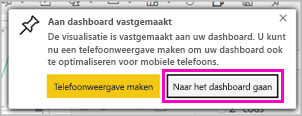

7. Selecteer **Naar het dashboard gaan** om uw nieuwe dashboard met het lijndiagram te bekijken dat u er als tegel aan hebt vastgemaakt. 
   
   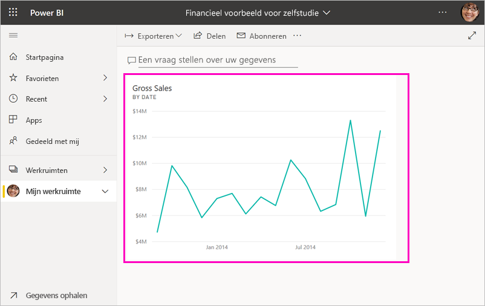
   
8. Selecteer de nieuwe tegel in het dashboard als u wilt terugkeren naar het rapport. Met Power BI keert u terug naar het rapport in de leesweergave. 

1. Als u wilt terugkeren naar de bewerkingsweergave, selecteert u in de bovenste navigatiebalk **Meer opties** (...) > **Bewerken**. Terug in de Bewerkingsweergave, kunt u tegels blijven verkennen en vastmaken.

    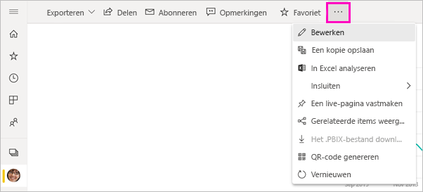

## Stap 3: Verkennen met Q&A

Als u uw gegevens snel wilt verkennen, kunt u een vraag stellen in het Q&A-vak. Met Q&A maakt u query's in natuurlijke taal over uw gegevens. In een dashboard bevindt het vak Q&A zich bovenaan (**Stel een vraag over uw gegevens**). In een rapport bevindt het zich in de bovenste navigatiebalk (**Een vraag stellen**).

1. Selecteer **Mijn werkruimte** in de zwarte balk **Power BI** om terug te gaan naar het dashboard.

    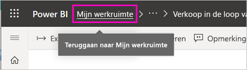

1. Selecteer uw dashboard op het tabblad **Dashboards**.

    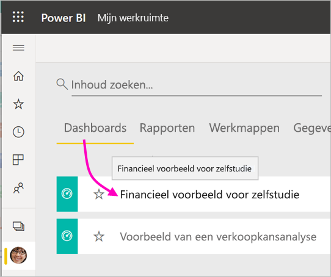

1. Selecteer **Een vraag stellen over uw gegevens**. Q&A toont automatisch een aantal suggesties.

    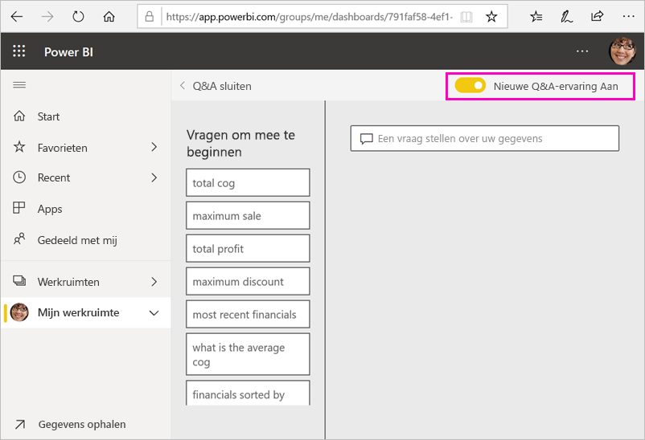

    > [!NOTE]
    > Als u de suggesties niet ziet, schakelt u **Nieuwe Q&A-ervaring** in.

2. Sommige suggesties geven één waarde als resultaat. Selecteer bijvoorbeeld **maximale verkoop**.

    Via Q&A wordt een antwoord gezocht dat vervolgens als *kaart*-visualisatie wordt weergegeven.

    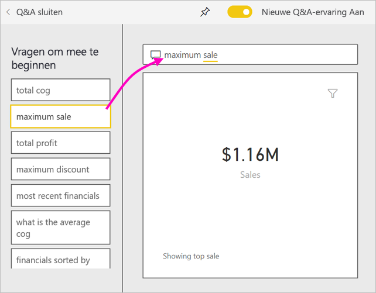

3. Selecteer het speldpictogram  als u deze visualisatie wilt laten zien op het dashboard Financieel voorbeeld voor zelfstudie.

1. Schuif omlaag in de lijst **Vragen om aan de slag te gaan** en selecteer **KVG-gemiddelde voor elke maand**. 

    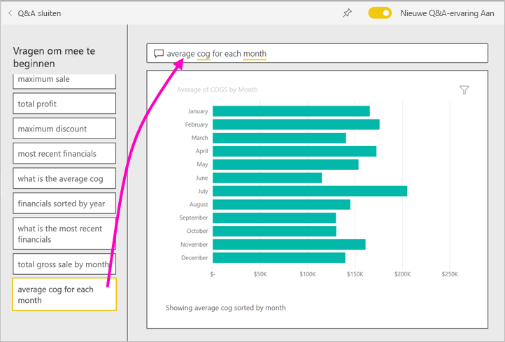

1. Maak ook het staafdiagram vast aan het dashboard **Financieel voorbeeld voor zelfstudie**.

1. Plaats de cursor na *per maand* in het vak Q&A en typ *als lijn*. Selecteer **lijn (Visualisatietype)** . 

    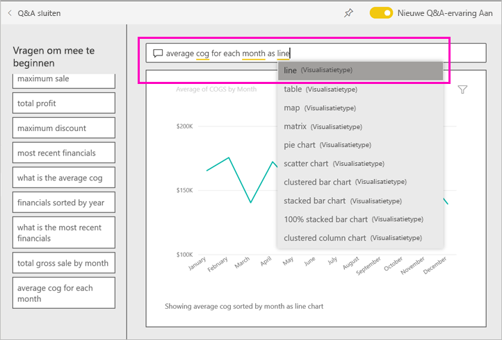

4. Selecteer **Q&A afsluiten** om terug te gaan naar uw dashboard, waar u de nieuwe tegels ziet die u gemaakt hebt. 

   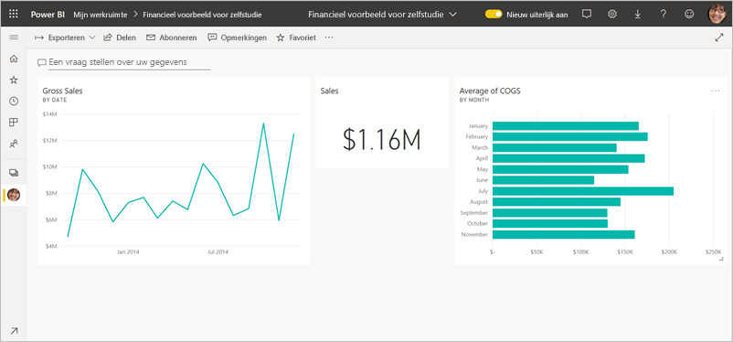

   Hoewel u de grafiek hebt gewijzigd in een lijndiagram, blijft de tegel een staafdiagram, omdat dat het was toen u het vastmaakte. 

## Stap 4: Tegels verplaatsen

Het dashboard is breed. We kunnen de tegels opnieuw rangschikken om beter gebruik te maken van de dashboardruimte.

1. Sleep de rechterbenedenhoek van de lijndiagramtegel *Brutoverkoop* omhoog, totdat deze op dezelfde hoogte wordt uitgelijnd als de tegel Verkoop en laat deze vervolgens los.

    

    De twee tegels hebben nu dezelfde hoogte.

    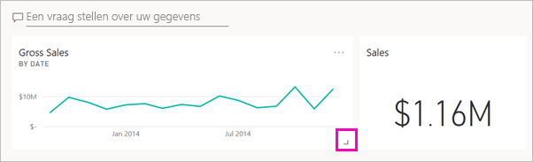

1. Sleep de staafdiagramtegel *KVG-gemiddelde* totdat deze onder het lijndiagram *Brutoverkoop* past.

    Dat ziet er beter uit.

    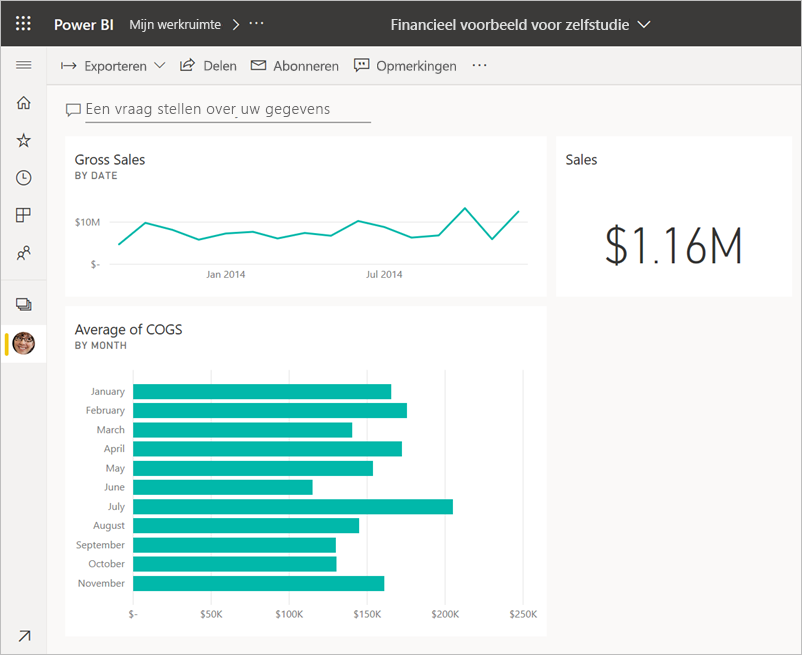

## Stap 5: Tegels beheren

Er is nog een laatste interactie waar u rekening mee moet houden, voordat u uw dashboards en rapporten gaat maken. Het selecteren van de verschillende tegels levert verschillende resultaten op. 

1. Selecteer eerst de lijndiagramtegel *Brutoverkoop* die u van het rapport hebt vastgemaakt. 

    Met Power BI opent u het rapport in de leesweergave. 

2. Selecteer de knop Vorige in browser. 

1. Selecteer nu de staafdiagramtegel *KVG-gemiddelde* die u hebt gemaakt in Q&A. 

    Met Power BI wordt het rapport niet geopend. In plaats daarvan wordt Q&A geopend, omdat u deze grafiek daar hebt gemaakt.

## Resources opschonen
Nu u de zelfstudie hebt voltooid, kunt u de gegevensset, het rapport en het dashboard verwijderen. 

1. Zorg dat u in de navigatiebalk aan de linkerkant in **Mijn werkruimte** bent.
2. Selecteer het tabblad **Gegevenssets** en zoek de gegevensset die u voor deze zelfstudie hebt geïmporteerd.  
3. Selecteer **Meer opties** (...) > **Verwijderen**.

    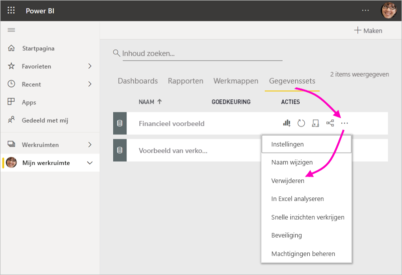

    Als u de gegevensset verwijdert, ziet u een waarschuwing **Alle rapporten en dashboardtegels met gegevens van deze gegevensset worden ook verwijderd**.

4. Selecteer **Verwijderen**.

## Volgende stappen

Maak dashboards nog beter door meer visualisatietegels toe te voegen en [ze een andere naam te geven, groter of kleiner te maken, te koppelen en te verplaatsen](service-dashboard-edit-tile.md).

