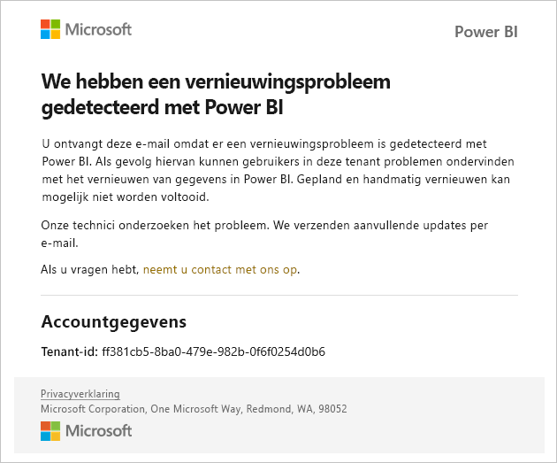
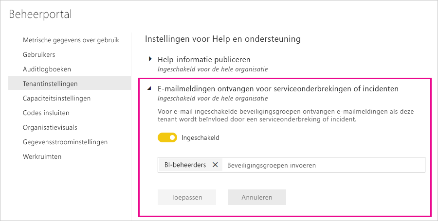

# Meldingen over onderbrekingen van de service

Het is essentieel om inzicht te hebben in de beschikbaarheid van uw bedrijfskritische zakelijke toepassingen. Power BI biedt meldingen over incidenten zodat u optioneel e-mails kunt ontvangen bij onderbreking of degradatie van een service. Hoewel deze incidenten zelden voorkomen dankzij de Service Level Agreement (SLA) van 99,9 procent van Power BI, vinden we het belangrijk om u op de hoogte te houden. In de volgende schermopname ziet u het type e-mailbericht dat u ontvangt als u meldingen inschakelt:

Op dit moment verzenden we e-mails voor de volgende _betrouwbaarheidsscenario's:_

- Betrouwbaarheid van rapport openen
- Betrouwbaarheid van model vernieuwen
- Betrouwbaarheid van query vernieuwen

Deze meldingen worden bijvoorbeeld gegeven wanneer gebruikers een lange vertraging ervaren bij bewerkingen zoals het openen van rapporten, het vernieuwen van gegevenssets of het uitvoeren van query’s. Wanneer een incident is opgelost, ontvangt u een vervolgmail.

> [!NOTE]
> Deze functie is momenteel alleen beschikbaar voor toegewezen capaciteit in Power BI Premium. Deze functie is niet beschikbaar voor gedeelde of ingesloten capaciteit.

## Meldingen inschakelen

Een Power BI-tenantbeheerder schakelt meldingen in de beheerportal in:

1. Identificeer of maak een beveiligingsgroep met e-mail die meldingen moet ontvangen.

1. Selecteer **Tenantinstellingen** in de beheerportal. Vouw onder **Instellingen voor Help en ondersteuning** de optie **E-mailmeldingen ontvangen voor serviceonderbrekingen of incidenten** uit.

1. Schakel meldingen in, voer een beveiligingsgroep in en selecteer **Toepassen**.

    

> [!NOTE]
> Vanuit Power BI worden meldingen verzonden vanuit het account no-reply-powerbi@microsoft.com. Zorg ervoor dat dit account in de goedgekeurde lijst staat, zodat de meldingen niet in een map met ongewenste e-mail belanden.

## Volgende stappen

[Ondersteuningsopties van Power BI Pro en Power BI Premium](service-support-options.md)

Hebt u nog vragen? [Misschien dat de Power BI-community het antwoord weet](http://community.powerbi.com/)
