# Geautomatiseerde Machine Learning in Power BI

Met geautomatiseerde machine learning (AutoML) voor gegevensstromen kunnen bedrijfsanalisten rechtstreeks in Power BI machine learning-modellen (ML) trainen, valideren en aanroepen. De service bevat een eenvoudige ervaring voor het maken van een nieuw ML-model, waarbij analisten hun gegevensstromen kunnen gebruiken om de invoergegevens op te geven voor het trainen van het model. De service extraheert automatisch de meest relevante functies en selecteert een geschikt algoritme, waarna het ML-model wordt afgestemd en gevalideerd. Nadat een model is getraind, genereert Power BI automatisch een prestatierapport dat de resultaten van de validatie bevat. Het model kan vervolgens worden aangeroepen voor nieuwe of bijgewerkte gegevens in de gegevensstroom.

Geautomatiseerde machine learning is alleen beschikbaar voor gegevensstromen die worden gehost in Power BI Premium of Embedded.

## Werken met AutoML

Bij [Power BI-gegevensstromen](service-dataflows-overview.md) kunt u zelf gegevens voorbereiden voor big data. Met AutoML, geïntegreerd in gegevensstromen, kunt u de taken voor gegevensvoorbereiding ook inzetten voor het bouwen van machine learning-modellen, rechtstreeks vanuit Power BI.

Met AutoML in Power BI kunnen gegevensanalisten aan de hand van gegevensstromen op een vereenvoudigde manier machine learning-modellen bouwen, met alleen maar hun Power BI-vaardigheden. Het grootste deel van de gegevenswetenschap achter het maken van de ML-modellen wordt geautomatiseerd door Power BI. Het heeft vangnetten om ervoor te zorgen dat het gegenereerde model van goede kwaliteit is en inzicht geeft in het proces dat wordt gebruikt om uw ML-model te maken.

AutoML biedt ondersteuning voor het maken van modellen van het type **Binaire voorspelling**, **Classificatie** en **Regressie** voor gegevensstromen. Dit zijn gecontroleerde ('supervised') typen machine learning-technieken, wat betekent dat ze leren van de bekende resultaten van eerdere waarnemingen om de resultaten van andere waarnemingen te voorspellen. De gegevensset die als invoer fungeert voor het trainen van een AutoML-model bestaat uit een set records die worden **gelabeld** met de bekende resultaten.

Met AutoML in Power BI integreert u [geautomatiseerde ML](https://docs.microsoft.com/azure/machine-learning/service/concept-automated-ml) uit [Azure Machine Learning](https://docs.microsoft.com/azure/machine-learning/service/overview-what-is-azure-ml) om uw ML-modellen te maken. U hebt echter geen Azure-abonnement nodig om AutoML te gebruiken in Power BI. Het proces van het trainen en hosten van de ML-modellen wordt volledig beheerd door de Power BI-service.

Nadat een ML-model is getraind, genereert AutoML automatisch een Power BI-rapport waarin de waarschijnlijke prestaties van uw ML-model worden uitgelegd. AutoML benadrukt de verklaarbaarheid door het accentueren van de belangrijkste beïnvloeders in de invoer die van invloed zijn op de voorspellingen die worden geretourneerd door uw model. Het rapport bevat ook belangrijke metrische gegevens voor het model.

Andere pagina's van het gegenereerde rapport bevatten het statistische overzicht van het model en de trainingsdetails. Het statistisch overzicht is van belang voor gebruikers die de standaardprestatiemetingen voor het model willen zien die worden gehanteerd in de gegevenswetenschap. De trainingsdetails geven een overzicht van alle iteraties die zijn uitgevoerd om het model te maken, met de bijbehorende modelleringsparameters. Hier wordt ook beschreven hoe elke invoer is gebruikt voor het maken van het ML-model.

U kunt het ML-model vervolgens toepassen op uw gegevens om een score te verkrijgen. Wanneer de gegevensstroom wordt vernieuwd, worden uw gegevens bijgewerkt met voorspellingen uit uw ML-model. Power BI bevat ook een afzonderlijke uitleg voor elke specifieke voorspelling die het ML-model produceert.

## Een machine learning-model maken

In dit gedeelte wordt beschreven hoe u een AutoML-model maakt.

### Gegevens voorbereiden voor het maken van een ML-model

Als u een machine learning-model wilt maken in Power BI, moet u eerst een gegevensstroom maken voor de gegevens die de historische resultaatgegevens bevatten. Dit zijn de gegevens die worden gebruikt voor het trainen van het ML-model. Bovendien moet u berekende kolommen toevoegen voor metrische gegevens van het bedrijf die belangrijke voorspellingsfactoren kunnen zijn voor het resultaat dat u wilt voorspellen. Zie [Zelf gegevens voorbereiden in Power BI](service-dataflows-overview.md) voor meer informatie over het configureren van een gegevensstroom.

AutoML hanteert specifieke gegevensvereisten voor het trainen van een machine learning-model. Deze vereisten worden hieronder beschreven voor de verschillende modeltypen.

### Invoer voor ML-model configureren

Als u een AutoML-model wilt maken, selecteert u het ML-pictogram in de kolom **Acties** van de gegevensstroomentiteit en selecteert u vervolgens **Een Machine Learning-model toevoegen**.

Er wordt een vereenvoudigde ervaring gestart, die bestaat uit een wizard die u door het proces van het maken van het ML-model leidt. De wizard bestaat uit de volgende eenvoudige stappen.

**1. Selecteer de entiteit met de historische gegevens en het resultaatveld waarvoor u een voorspelling wilt**

Het resultaatveld geeft het labelkenmerk voor het trainen van het ML-model aan, zoals u kunt zien in de volgende afbeelding.

**2. Een modeltype kiezen**

Wanneer u het resultaatveld opgeeft, analyseert AutoML de labelgegevens om het meest waarschijnlijke ML-modeltype te adviseren dat kan worden getraind. U kunt een ander modeltype kiezen, zoals hieronder wordt weergegeven, door te klikken op 'Een ander model selecteren'.

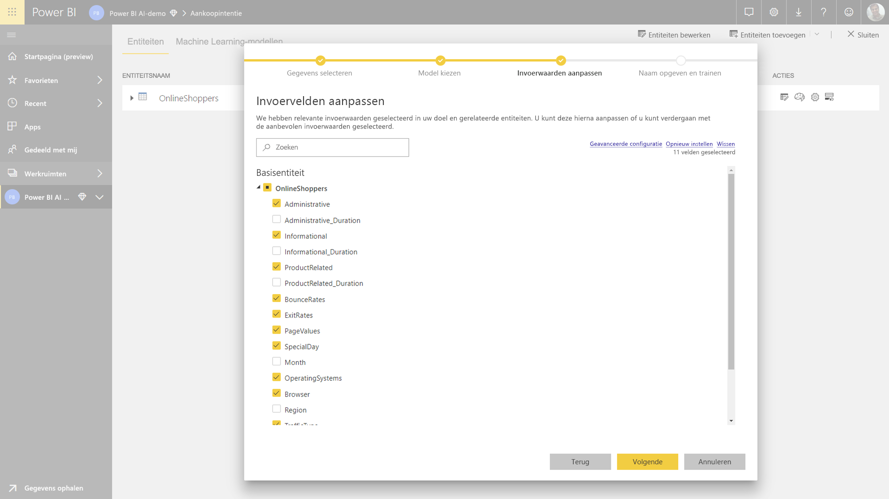

> [!NOTE]
> Sommige modeltypen worden mogelijk niet ondersteund voor de gegevens die u hebt geselecteerd en zijn dan ook uitgeschakeld. In het bovenstaande voorbeeld is Regressie uitgeschakeld, omdat een tekstkolom als resultaatveld is geselecteerd.

**3. Selecteer de invoer die door het model moet worden gebruikt als voorspellende signalen**

AutoML analyseert een sample van de geselecteerde entiteit om de invoer voor te stellen die kan worden gebruikt voor het trainen van het ML-model. Er wordt uitleg gegeven naast de velden die niet zijn geselecteerd. Als een bepaald veld te veel afzonderlijke waarden of slechts één waarde bevat, of een lage of hoge correlatie met het uitvoerveld heeft, wordt dit niet aanbevolen.

Invoer die afhankelijk is van de waarde in het resultaatveld (het labelveld) mag niet worden gebruikt voor het trainen van het ML-model, aangezien deze invoer invloed heeft op de prestaties. Dergelijke velden worden gemarkeerd met 'verdacht hoge correlatie met uitvoerveld'. De introductie van deze velden in de trainingsgegevens leidt tot labellekkage, waarbij het model goed wordt uitgevoerd op de validatie- of testgegevens, maar die prestaties niet kan evenaren indien gebruikt in productie om een score te berekenen. Labellekkage kan een mogelijke reden tot zorg zijn in AutoML-modellen, wanneer de prestaties van het trainingsmodel te mooi zijn om waar te zijn.

Deze functie-aanbeveling is gebaseerd op een sample van gegevens, waardoor u de gebruikte invoer moet controleren. U hebt de mogelijkheid om de selecties te wijzigen, zodat deze alleen de velden bevatten die door het model moeten worden onderzocht. U kunt ook alle velden selecteren door het selectievakje naast de naam van de entiteit in te schakelen.

**4. Geef uw model een naam en sla de configuratie op**

In de laatste stap kunt u het model een naam geven en Opslaan en trainen selecteren. Hiermee wordt begonnen met de training van het ML-model. U kunt ervoor kiezen om de trainingstijd te verkorten om snel resultaten te bekijken of de hoeveelheid tijd die wordt besteed aan training te vergroten om het beste model te krijgen.

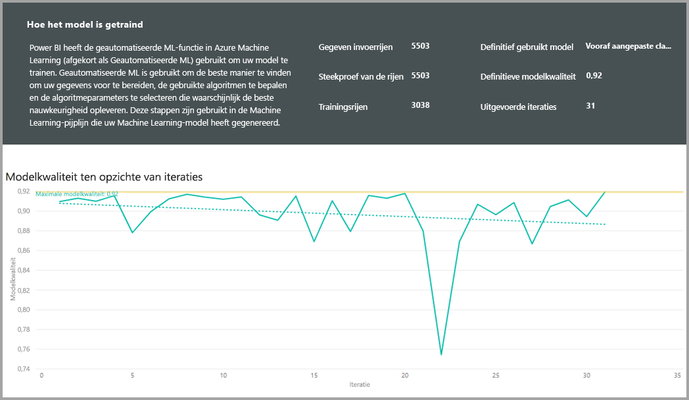

### Training van ML-model

De training van AutoML-modellen vindt plaats tijdens het vernieuwen van een gegevensstroom. AutoML bereidt uw gegevens eerst voor op de training.
AutoML splitst de historische gegevens die u opgeeft in gegevenssets voor trainingsdoeleinden en voor testdoeleinden. De set voor testdoeleinden is een evaluatieset die wordt gebruikt om de modelprestaties na de training te valideren. Deze worden gerealiseerd als **Training- en Testing**-entiteiten in de gegevensstroom. AutoML maakt gebruik van kruisvalidatie voor de modelvalidatie.

Vervolgens wordt elk invoerveld geanalyseerd en wordt er imputatie toegepast, waarbij eventuele ontbrekende waarden worden vervangen door vervangende waarden. Er worden een aantal verschillende imputatiestrategieën gebruikt door AutoML. In het geval van invoerkenmerken die als numerieke functies worden behandeld, wordt voor de imputatie het gemiddelde van de kolomwaarden genomen. In het geval van invoerkenmerken die als categorische functies worden behandeld, gebruikt AutoML de modus van de kolomwaarden voor de imputatie. Het gemiddelde en de modus van de waarden die worden gebruikt voor de imputatie, worden berekend door het AutoML-framework in de subgegevensset voor een subsample van de training.

Daarna worden, zoals vereist, steekproeven en normalisatie toegepast op uw gegevens. In het geval van classificatiemodellen voert AutoML de invoergegevens uit door middel van gelaagde steekproeven en worden de klassen gebalanceerd om ervoor te zorgen dat het aantal rijen gelijk is.

AutoML past verschillende transformaties toe op elke geselecteerd invoerveld, op basis van het gegevenstype en de statistische eigenschappen van het veld. AutoML gebruikt deze transformaties voor het extraheren van functies die kunnen worden gebruikt bij het trainen van uw ML-model.

Het trainingsproces voor AutoML-modellen bestaat uit maximaal 50 iteraties met verschillende modelleringsalgoritmen en hyperparameter-instellingen om het model met de beste prestaties te vinden. De training kan eerder eindigen met minder iteraties als AutoML merkt dat er geen prestatieverbetering wordt waargenomen. De prestaties van elk van deze modellen worden beoordeeld door validatie aan de hand van de set met evaluatiegegevens. Tijdens deze trainingsstap maakt AutoML verschillende pijplijnen voor de training en validatie van deze iteraties. Het proces van het beoordelen van de prestaties van de modellen kan enige tijd duren, van enkele minuten tot enkele uren tot de trainingstijd die is geconfigureerd in de wizard, afhankelijk van de grootte van de gegevensset en de toegewezen capaciteitsresources.

In sommige gevallen kan het uiteindelijke gegenereerde model gebruikmaken van 'ensemble learning', waarbij meerdere modellen worden gebruikt om betere voorspellende prestaties te bieden.

### Verklaarbaarheid van AutoML-model

Nadat het model is getraind, analyseert AutoML de relatie tussen de invoerfuncties en de modeluitvoer. Daarnaast worden voor elke invoerfunctie de magnitude van de wijziging van de modeluitvoer beoordeeld voor de set met evaluatiegegevens. Dit staat bekend als de _functie-urgentie_. Dit gebeurt als onderdeel van het vernieuwen zodra de training is voltooid. Het vernieuwen kan daarom langer duren dan de trainingstijd die in de wizard is geconfigureerd.

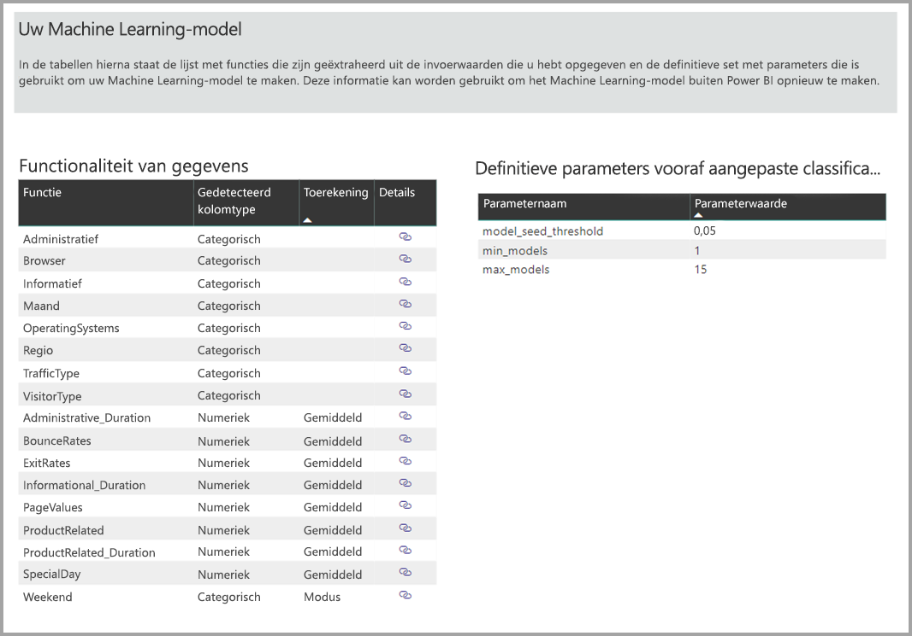

### Rapport voor AutoML-model

AutoML genereert een Power BI-rapport met een overzicht van de prestaties van het model tijdens validatie, samen met het belang van globale functies. Dit rapport is toegankelijk vanaf het tabblad Machine Learning-model wanneer het vernieuwen van de gegevensstroom is geslaagd. Het rapport geeft een overzicht van de resultaten van het toepassen van het ML-model op de testgegevens voor evaluatie en het vergelijken van de voorspellingen met de bekende resultaatwaarden.

U kunt het modelrapport bekijken om inzicht in de prestaties te krijgen. U kunt ook controleren of de belangrijkste beïnvloeders van het model overeenkomen met de zakelijke inzichten over de bekende resultaten.

De diagrammen en metingen die worden gebruikt om de prestaties van het model te beschrijven in het rapport, zijn afhankelijk van het modeltype. Deze prestatiediagrammen en metingen worden beschreven in de volgende secties.

Het rapport kan extra pagina's bevatten met statistische metingen van het model gezien vanuit het perspectief van de gegevenswetenschap. Zo bevat het rapport voor **binaire voorspellingen** bijvoorbeeld een toenamediagram en de ROC-curve voor het model.

De rapporten bevatten ook een pagina met **trainingsdetails** met een beschrijving van hoe het model is getraind en een diagram met een beschrijving van de modelprestaties voor elke iteratie.

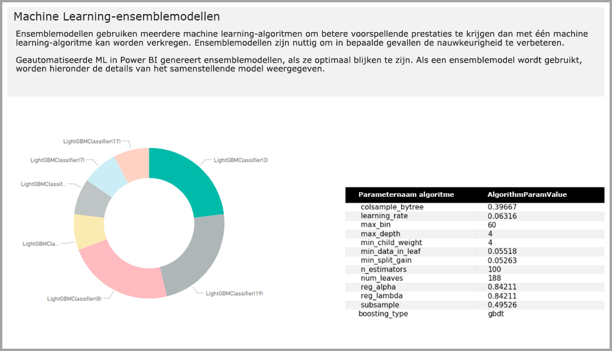

In een andere sectie op deze pagina worden het gedetecteerde type van het invoerveld en de imputatiemethode die wordt gebruikt voor het vullen van ontbrekende waarden, beschreven. De pagina bevat ook de parameters die worden gebruikt door het uiteindelijke model.

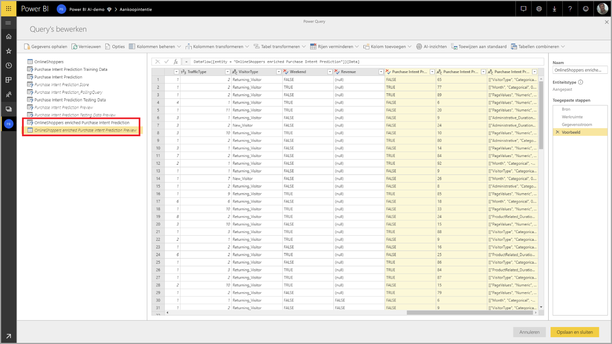

Als het geproduceerde model gebruikmaakt van 'ensemble learning', bevat de pagina met **trainingsdetails** ook een grafiek met de weging van elk samenstellend model in het ensemble, samen met de bijbehorende parameters.

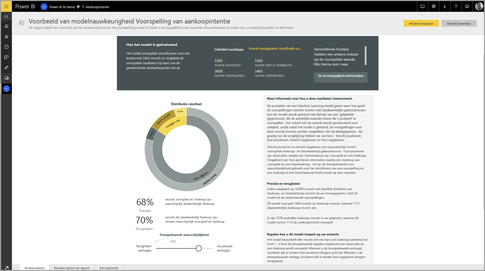

## Toepassen van AutoML-model

Als u tevreden bent met de prestaties van het gemaakte ML-model, kunt u het model toepassen op nieuwe of bijgewerkte gegevens wanneer uw gegevensstroom wordt vernieuwd. U kunt dit doen vanuit het modelrapport, door de knop **Toepassen** te selecteren in de rechterbovenhoek of de knop ML-model toepassen onder acties op het tabblad Machine Learning-modellen.

Om het ML-model toe te passen, geeft u de naam op van de entiteit waarop u het model wilt toepassen en een voorvoegsel voor de kolommen die aan deze entiteit worden toegevoegd voor de modeluitvoer. Het standaardvoorvoegsel voor de kolomnamen is de modelnaam. De functie _Apply_ kan aanvullende parameters bevatten die specifiek zijn voor het modeltype.

Door het ML-model toe te passen, worden twee nieuwe gegevensstroomentiteiten gemaakt die de voorspellingen en de individuele uitleg bevatten voor elke rij die in de uitvoerentiteit wordt gescoord. Als u bijvoorbeeld het model _PurchaseIntent_ toepast op de entiteit _OnlineShoppers_, worden de entiteiten **OnlineShoppers enriched PurchaseIntent** en **OnlineShoppers enriched PurchaseIntent explanations** gegenereerd. Voor elke rij in de verrijkte entiteit wordt de **Uitleg** opgesplitst in meerdere rijen in de entiteit met de verrijkte uitleg op basis van de invoerfunctie. Met een **ExplanationIndex** kunt u de rijen van de verrijkte uitlegentiteit toewijzen aan de rij in een verrijkte entiteit.

Nadat u het model hebt toegepast, zorgt AutoML ervoor dat uw voorspellingen altijd actueel zijn wanneer de gegevensstroom wordt vernieuwd.

Als u de inzichten en voorspellingen uit het ML-model wilt gebruiken in een Power BI-rapport, kunt u vanuit Power BI Desktop verbinding maken met de uitvoerentiteit met behulp van de connector **dataflows**.

## Model van het type Binaire voorspelling

Modellen van het type Binaire voorspelling, formeel ook bekend als **binaire classificatiemodellen**, worden gebruikt om een gegevensset in twee groepen te classificeren. Ze worden gebruikt om gebeurtenissen te voorspellen die een binaire uitkomst kunnen hebben. Bijvoorbeeld of een verkoopkans wordt geconverteerd, of een account wordt opgezegd, of een factuur op tijd wordt betaald, of een transactie frauduleus is, enzovoort.

De uitvoer van een binair voorspellingsmodel is een waarschijnlijkheidsscore, die de waarschijnlijkheid aangeeft dat het doelresultaat werkelijkheid zal worden.

### Trainen van een binair voorspellingsmodel

Vereisten:

- Voor elke klasse met resultaten zijn minimaal 20 rijen met historische gegevens vereist

Het proces van het maken van een binair voorspellingsmodel bestaat uit dezelfde stappen als voor andere AutoML modellen, zoals wordt beschreven in het gedeelte **Invoer voor ML-model configureren** hierboven. Het enige verschil zit in de stap Een model kiezen, waarin u de waarde voor het doelresultaat kunt selecteren waarin u het meest geïnteresseerd bent. U kunt ook beschrijvende labels opgeven voor de resultaten die moeten worden gebruikt in het automatisch gegenereerde rapport waarin de resultaten van de modelvalidatie worden samengevat.

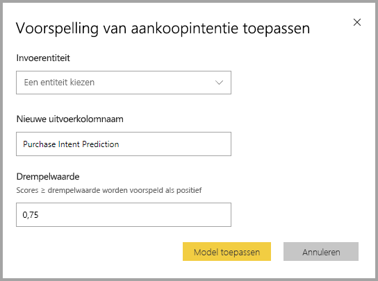

### Rapport voor binair voorspellingsmodel

Het binaire voorspellingsmodel produceert als uitvoer een waarschijnlijkheidsscore dat een record het doelresultaat bereikt. Het rapport bevat een slicer voor de waarschijnlijkheidsdrempel, die van invloed is op de manier waarop de scores boven en onder de drempel worden geïnterpreteerd.

In het rapport worden de prestaties van het model beschreven in termen van _terecht positieven (True Positives), fout-positieven (False Positives), terecht negatieven (True Negatives) en fout-negatieven (False Negatives)_ . Terecht positieven en terecht negatieven zijn correct voorspelde resultaten voor de twee klassen in de resultaatgegevens. Fout-positieven zijn records waarvan is voorspeld dat ze het doelresultaat hebben, maar dat uiteindelijk niet hebben. Fout-negatieven zijn daarentegen records die het doelresultaat hadden, maar waarvan werd voorspeld dat ze dat niet zouden hebben.

Metingen, zoals Precisie en Terughalen, beschrijven het effect van de waarschijnlijkheidsdrempel op de voorspelde resultaten. U kunt de slicer met de waarschijnlijkheidsdrempel gebruiken om een drempel te selecteren die een compromis oplevert tussen Precisie en Terughalen.

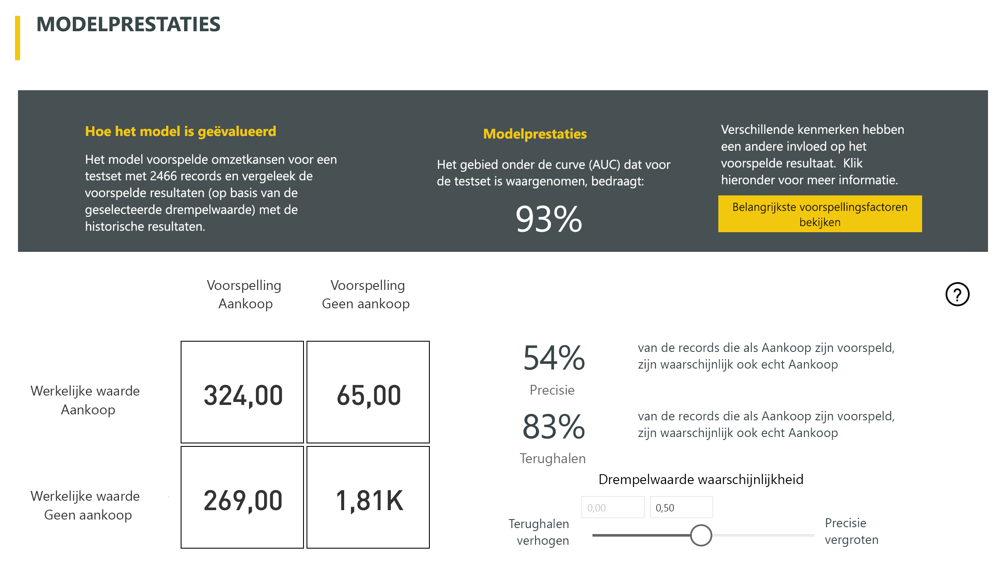

Het rapport bevat ook een hulpprogramma voor een kosten-batenanalyse waarmee u de subset van de populatie kunt identificeren waarop moet worden ingezet om de hoogste winst te krijgen. Aan de hand van de geschatte kosten per eenheid en een eenheidsvoordeel door het bereiken van een doelresultaat, wordt getracht met de kosten-batenanalyse de winst te maximaliseren. U kunt dit hulpprogramma gebruiken om uw waarschijnlijkheidsdrempelwaarde te kiezen op basis van het maximumpunt in de grafiek om de winst te maximaliseren. U kunt de grafiek ook gebruiken om de winst of kosten voor uw keuze van de waarschijnlijkheidsdrempelwaarde te berekenen.

De pagina **Nauwkeurigheidsrapport** van het modelrapport bevat het diagram _Cumulatieve toenames_ en de ROC-curve voor het model. Dit zijn statistische metingen van modelprestaties. De rapporten bevatten beschrijvingen van de weergegeven diagrammen.

### Een binair voorspellingsmodel toepassen

Als u een binair voorspellingsmodel wilt toepassen, moet u de entiteit opgeven die de gegevens bevat waarop u de voorspellingen uit het ML-model wilt toepassen. Andere parameters zijn het voorvoegsel voor de naam van de uitvoerkolom en de waarschijnlijkheidsdrempel voor het classificeren van het voorspelde resultaat.

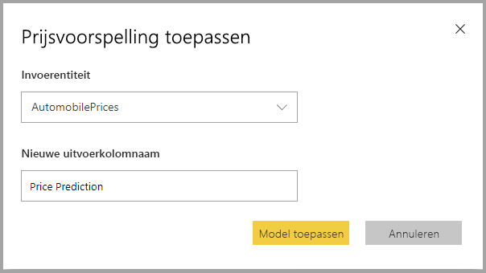

Bij het toepassen van een binair voorspellingsmodel, worden er vier uitvoerkolommen toegevoegd aan de entiteit met verrijkte uitvoer: **Outcome**, **PredictionScore**, **PredictionExplanation** en **ExplanationIndex**. Het voorvoegsel voor de kolomnamen in de entiteit wordt opgegeven bij het toepassen van het model.

**PredictionScore** is een waarschijnlijkheidspercentage waarmee de waarschijnlijkheid wordt aangegeven dat het doelresultaat werkelijkheid zal worden.

De kolom **Outcome** bevat het label voor het voorspelde resultaat. Als records waarschijnlijkheidsscores hebben die de drempel overschrijden, wordt voorspeld dat ze het doelresultaat waarschijnlijk behalen en krijgen ze het label Waar. Van records onder de drempelwaarde wordt voorspeld dat het onwaarschijnlijk is dat ze het resultaat kunnen bereiken; deze krijgen het label Onwaar.

De kolom **PredictionExplanation** bevat een uitleg met de specifieke invloed van de invoerfuncties op de **PredictionScore**.

## Classificatiemodellen

Classificatiemodellen worden gebruikt om een gegevensset in meerdere groepen of klassen te classificeren. Ze worden gebruikt om gebeurtenissen te voorspellen die een van de verschillende mogelijke resultaten kunnen hebben. Bijvoorbeeld of een klant waarschijnlijk een zeer hoge, hoge, gemiddelde of lage levensduur heeft, of het risico voor betalingsverzuim hoog, gemiddeld, laag of zeer laag is, enzovoort.

De uitvoer van een classificatiemodel is een waarschijnlijkheidsscore die de kans aangeeft of een record de criteria voor een bepaalde klasse gaat behalen.

### Trainen van een classificatiemodel

De invoerentiteit met de trainingsgegevens voor een classificatiemodel moet een tekstveld of heel numeriek veld bevatten als het resultaatveld, waarin de eerdere bekende resultaten worden geïdentificeerd.

Vereisten:

- Voor elke klasse met resultaten zijn minimaal 20 rijen met historische gegevens vereist

Het proces van het maken van een binair classificatiemodel bestaat uit dezelfde stappen als voor andere AutoML modellen, zoals wordt beschreven in het gedeelte **Invoer voor ML-model configureren** hierboven.

### Rapport voor classificatiemodel

Het rapport voor een classificatiemodel wordt geproduceerd door het ML-model toe te passen op de evaluatiegegevens en de voorspelde klasse voor een record te vergelijken met de daadwerkelijk bekende klasse.

Het modelrapport bevat een diagram met een uitsplitsing van de juist en onjuist geclassificeerde records voor elke bekende klasse.

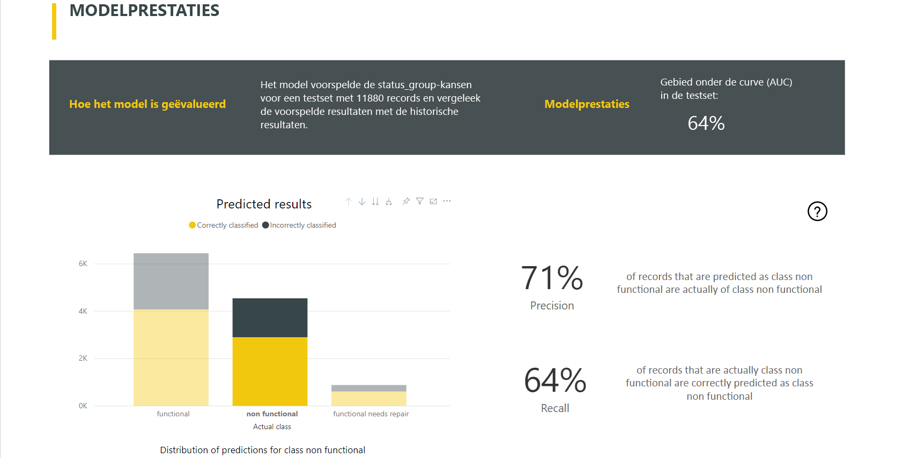

U kunt verder inzoomen op een bepaalde klasse om een analyse mogelijk te maken van de manier waarop de voorspellingen voor een bekende klasse worden gedistribueerd. Dit geeft de andere klassen aan waarin records van die bekende klasse naar alle waarschijnlijkheid onjuist worden geclassificeerd.

De toelichting van het model in het rapport bevat ook de belangrijkste voorspellingsfactoren voor elke klasse.

Het rapport voor het classificatiemodel bevat ook een pagina met trainingsdetails die vergelijkbaar is met de pagina's voor andere modeltypen, zoals wordt beschreven in het gedeelte **Rapport voor AutoML-model** eerder in dit artikel.

### Toepassen van een classificatiemodel

Als u een classificatiemodel wilt toepassen, moet u de entiteit opgeven met de invoergegevens en het voorvoegsel voor de naam van de uitvoerkolom.

Bij het toepassen van een classificatiemodel worden er vijf uitvoerkolommen toegevoegd aan de entiteit met verrijkte uitvoer: **ClassificationScore**, **ClassificationResult**, **ClassificationExplanation**, **ClassProbabilities** en **ExplanationIndex**. Het voorvoegsel voor de kolomnamen in de entiteit wordt opgegeven bij het toepassen van het model.

De kolom **ClassProbabilities** bevat de lijst met waarschijnlijkheidsscores voor de record voor elke mogelijke klasse.

De **ClassificationScore** is een waarschijnlijkheidspercentage dat de kans aangeeft of een record de criteria voor een bepaalde klasse gaat behalen.

De kolom **ClassificationResult** bevat de meest waarschijnlijke voorspelde klasse voor de record.

De kolom **ClassificationExplanation** bevat een uitleg met de specifieke invloed van de invoerfuncties op de **ClassificationScore**.

## Regressiemodellen

Regressiemodellen worden gebruikt om een numerieke waarde te voorspellen. Bijvoorbeeld: de omzet die waarschijnlijk zal worden gerealiseerd met een verkoop, de levensduur van een account, het bedrag van een factuur die waarschijnlijk zal worden betaald, de datum waarop een factuur kan worden betaald, enzovoort.

De uitvoer van een regressiemodel is de voorspelde waarde.

### Trainen van een regressiemodel

De invoerentiteit met de trainingsgegevens voor een regressiemodel moet een numeriek veld bevatten als het resultaatveld, dat de bekende resultaatwaarden identificeert.

Vereisten:

- Voor een regressiemodel zijn minimaal 100 rijen met historische gegevens vereist

Het proces van het maken van een regressiemodel bestaat uit dezelfde stappen als voor andere AutoML modellen, zoals wordt beschreven in het gedeelte **Invoer voor ML-model configureren** hierboven.

### Rapport van regressiemodel

Net als de andere AutoML-modelrapporten, wordt het regressierapport gebaseerd op de resultaten van het toepassen van het model op de evaluatiegegevens.

Het modelrapport bevat een diagram waarin de voorspelde waarden worden vergeleken met de werkelijke waarden. In dit diagram geeft de afstand vanaf de diagonaal de fout in de voorspelling aan.

In het diagram met resterende fouten ziet u de verdeling van het percentage van gemiddelde fouten voor verschillende waarden in de set met evaluatiegegevens. De horizontale as vertegenwoordigt het gemiddelde van de werkelijke waarde voor de groep, waarbij de grootte van de bel de frequentie of het aantal waarden in dat bereik aangeeft. De verticale as vertegenwoordigt de gemiddelde restfouten.

Het rapport voor het regressiemodel bevat ook een pagina met trainingsdetails, net zoals de rapporten voor andere modeltypen, zoals wordt beschreven in het gedeelte **Rapport voor AutoML-model** eerder in dit artikel.

### Toepassen van een regressiemodel

Als u een regressiemodel wilt toepassen, moet u de entiteit opgeven met de invoergegevens en het voorvoegsel voor de naam van de uitvoerkolom.

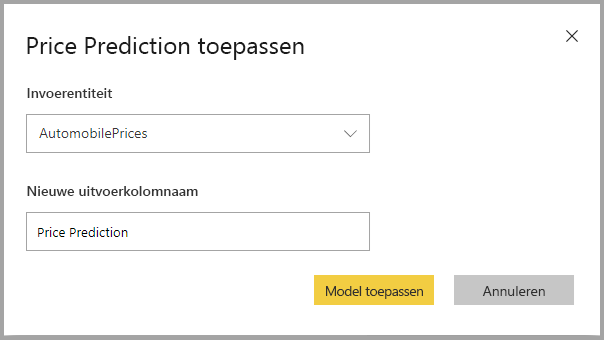

Bij het toepassen van een regressiemodel worden er drie uitvoerkolommen toegevoegd aan de entiteit met verrijkte uitvoer: **RegressionResult**, **RegressionExplanation** en **ExplanationIndex**. Het voorvoegsel voor de kolomnamen in de entiteit wordt opgegeven bij het toepassen van het model.

De kolom **RegressionResult** bevat de voorspelde waarde voor de record op basis van de invoervelden. De kolom **RegressionExplanation** bevat een uitleg met de specifieke invloed van de invoerfuncties op de **RegressionResult**.

## Volgende stappen

In dit artikel hebt u een overzicht van geautomatiseerde machine learning voor gegevensstromen in de Power BI-service. De volgende artikelen kunnen ook van pas komen.

- [Zelfstudie: Een machine learning-model bouwen in Power BI ](service-tutorial-build-machine-learning-model.md)
- [Zelfstudie: Cognitive Services gebruiken in Power BI](service-tutorial-use-cognitive-services.md)
- [Zelfstudie: Een Machine Learning Studio-model (klassiek) aanroepen in Power BI (preview)](service-tutorial-invoke-machine-learning-model.md)
- [Cognitive Services in Power BI](service-cognitive-services.md)
- [Azure Machine Learning-integratie in Power BI](service-machine-learning-integration.md)

Raadpleeg de volgende artikelen voor meer informatie over gegevensstromen:

- [Gegevensstromen maken en gebruiken in Power BI](service-dataflows-create-use.md)
- [Berekende entiteiten gebruiken in Power BI Premium](service-dataflows-computed-entities-premium.md)
- [Gegevensstromen gebruiken met on-premises gegevensbronnen](service-dataflows-on-premises-gateways.md)
- [Resources voor ontwikkelaars voor Power BI-gegevensstromen](service-dataflows-developer-resources.md)
- [Integratie van gegevensstromen en Azure Data Lake (preview)](service-dataflows-azure-data-lake-integration.md)
