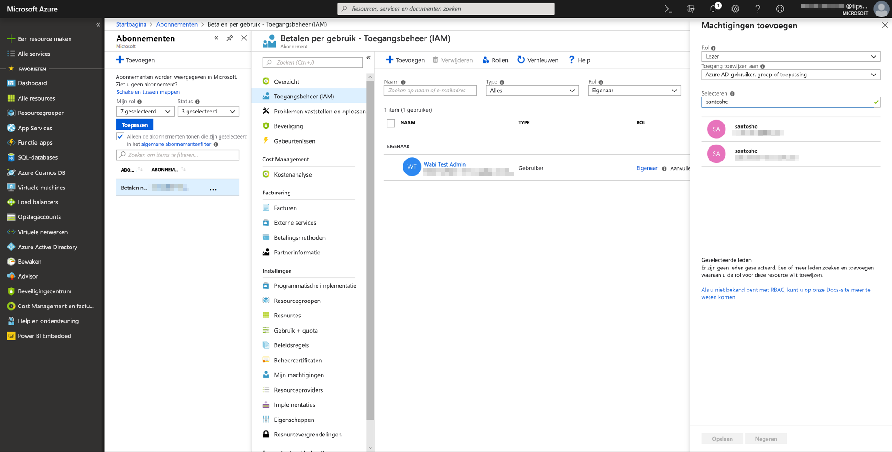

# Azure Machine Learning-integratie in Power BI

Talloze organisaties gebruiken **Machine Learning-modellen** voor beter inzicht in en nauwkeurige voorspellingen over hun bedrijf. De mogelijkheid om deze modellen te visualiseren in uw rapporten, dashboards en andere analyses en daar inzicht uit op te doen, helpt deze inzichten te verspreiden onder gebruikers in het bedrijf die daar het meest behoefte aan hebben.  Power BI maakt het nu gemakkelijk om de inzichten van modellen in Azure Machine Learning te gebruiken en doet dat aan de hand van eenvoudige muisbewegingen en -acties.

Een gegevenswetenschapper kan om deze mogelijkheid te gebruiken de BI-analist eenvoudigweg toegang geven tot het Azure ML-model met behulp van de Azure-portal.  Vervolgens ontdekt Power Query aan het begin van elke sessie alle modellen waar de gebruiker toegang tot heeft en weergeeft deze als dynamische Power Query-functies.  De gebruiker roept deze functies vervolgens aan door ze te openen vanuit het lint in Power Query-editor, of door de ML-functie rechtstreeks aan te roepen. Ook voegt Power BI toegangsaanvragen automatisch samen wanneer het Azure ML-model wordt aangeroepen voor een set rijen en dat zorgt voor betere prestaties.

Deze functionaliteit wordt momenteel alleen ondersteund voor Power BI-gegevensstromen en voor Power Query online in de Power BI-service.

Raadpleeg [Selfservice voor gegevensvoorbereiding in Power BI](service-dataflows-overview.md) voor meer informatie over gegevensstromen.

Voor meer informatie over Azure Machine Learning raadpleegt u:

- Overzicht:  [Wat is Azure Machine Learning?](https://docs.microsoft.com/azure/machine-learning/service/overview-what-is-azure-ml)
- Quick Starts en zelfstudies voor Azure Machine Learning:  [Documentatie voor Azure Machine Learning](https://docs.microsoft.com/azure/machine-learning/)

## Een Power BI-gebruiker toegang geven tot het Azure ML-model

Als een gebruiker toegang wil tot een Azure ML-model vanuit Power BI, moet deze **leestoegang** hebben tot het Azure-abonnement.  Daarnaast:

- **Leestoegang** tot de Machine Learning Studio-webservice (klassiek) voor Machine Learning Studio-modellen (klassiek)
- **Leestoegang** tot de Machine Learning-werkruimte voor Machine Learning-modellen

In de stappen in dit artikel wordt beschreven hoe een Power BI-gebruiker toegang krijgt tot een model in de Azure ML-service, zodat ze toegang hebben tot dit model als een Power Query-functie.  Voor meer informatie raadpleegt u [Toegang beheren met RBAC en de Azure-portal](https://docs.microsoft.com/azure/role-based-access-control/role-assignments-portal).

1. Meld u aan bij [Azure Portal](https://portal.azure.com).

2. Ga naar de pagina **Abonnementen**. U vindt de pagina **Abonnementen** via de lijst **Alle services** in het navigatievenstermenu van de Azure-portal.

    

3. Selecteer uw abonnement.

    

4. Selecteer **Toegangsbeheer (IAM)** en vervolgens de knop **Toevoegen**.

    

5. Selecteer **Lezer** als de rol. Selecteer de Power BI-gebruiker die u toegang wilt geven tot het Azure ML-model.

    

6. Selecteer **Opslaan**.

7. Herhaal stap drie tot en met zes om **leestoegang** te verlenen aan de gebruiker voor de specifieke Machine Learning Studio-webservice (klassiek) *of* de Machine Learning-werkruimte waarin het model wordt gehost.

## Schemadetectie voor Machine Learning-modellen

Gegevenswetenschappers gebruiken voornamelijk Python om hun machine learning-modellen voor Machine Learning te ontwikkelen en zelfs te implementeren.  In tegenstelling tot de Machine Learning Studio (klassiek), waarmee de taak voor het maken van een schemabestand kan worden geautomatiseerd, moet de gegevenswetenschapper in het geval van Machine Learning het schemabestand expliciet genereren met Python.

Dit schemabestand moet worden opgenomen in de geïmplementeerde webservice voor Machine Learning-modellen. Als u wilt dat het schema voor de webservice automatisch wordt geautomatiseerd, moet u een voorbeeld opgeven van de invoer/uitvoer in het script van de vermelding voor het geïmplementeerd model. Zie de subsectie over het [(optioneel) automatisch genereren van Swagger-schema's in de implementatiemodellen met de Azure Machine Learning Service-documentatie](https://docs.microsoft.com/azure/machine-learning/how-to-deploy-and-where#optional-define-model-web-service-schema). De koppeling bevat het voorbeeldscript van de vermelding met de instructies voor het genereren van schema's. 

Met name de functies *\@input_schema* en *\@output_schema* in het script van de vermelding verwijzen naar de voorbeeldindelingen van invoer en uitvoer in de variabelen *input_sample* en *output_sample* en genereren met behulp van deze voorbeelden een OpenAPI-specificatie (Swagger) voor de webservice tijdens de implementatie.

Deze instructies voor het genereren van schema's door het bijwerken van het script van de vermelding moeten ook worden toegepast op modellen die zijn gemaakt met behulp van geautomatiseerde Machine Learning-experimenten via de Azure Machine Learning-SDK.

> [!NOTE]
> Modellen die zijn gemaakt met behulp van de visuele interface van Azure Machine Learning bieden momenteel geen ondersteuning voor het genereren van schema's, maar dat zal in toekomstige releases wel het geval zijn. 

## Azure ML-model aanroepen in Power BI

U kunt elk Azure ML-model waar u toegang tot hebt rechtstreeks aanroepen vanuit de Power Query-editor in uw gegevensstroom. Als u toegang wilt tot de Azure ML-modellen, selecteert u de knop **Bewerken** voor de entiteit die u wilt opmaken met inzichten uit uw Azure ML-model, zoals wordt weergegeven in de volgende afbeelding.

Als u de knop **Bewerken** selecteert, wordt de Power Query-editor geopend voor de entiteiten in uw gegevensstroom.

Selecteer in het lint de knop **AI-inzichten** en selecteer vervolgens de map _Azure Machine Learning-modellen_ in het navigatievenstermenu. Alle Azure ML-modellen waar u toegang tot hebt, zijn hier vermeld als Power Query-functies. De invoerparameters voor het Azure ML-model worden automatisch toegewezen als parameters van de bijbehorende Power Query-functie.

Als u een Azure ML-model wilt aanroepen, kunt u vanuit het vervolgkeuzemenu een van de geselecteerde kolommen van de entiteit als invoer opgeven. U kunt ook een constante waarde opgeven die als invoer wordt gebruikt door het kolompictogram aan de linkerzijde van de het invoerdialoogvenster in te schakelen.

Selecteer **Aanroepen** om een voorbeeld van de uitvoer van het Azure ML-model weer te geven als een nieuwe kolom in de entiteitstabel. U ziet de aanroep aan het model ook als een toegepaste stap voor de query.

Als het model meerdere uitvoerparameters retourneert, worden ze gegroepeerd als een record in de uitvoerkolom. U kunt een kolom uitbreiden om afzonderlijke uitvoerparameters te produceren in afzonderlijke kolommen.

Nadat u uw gegevensstroom hebt opgeslagen, wordt het model automatisch aangeroepen wanneer de gegevensstroom wordt vernieuwd voor nieuwe of bijgewerkte rijen in de entiteitstabel.

## Volgende stappen

In dit artikel hebt u een overzicht gekregen over hoe u Machine Learning integreert in de Power BI-service. De volgende artikelen zijn voor u wellicht ook interessant en nuttig. 

* [Zelfstudie: Een Machine Learning Studio-model (klassiek) aanroepen in Power BI](service-tutorial-invoke-machine-learning-model.md)
* [Zelfstudie: Cognitive Services gebruiken in Power BI](service-tutorial-use-cognitive-services.md)
* [Cognitive Services in Power BI](service-cognitive-services.md)

Raadpleeg de volgende artikelen voor meer informatie over gegevensstromen:
* [Gegevensstromen maken en gebruiken in Power BI](service-dataflows-create-use.md)
* [Berekende entiteiten gebruiken in Power BI Premium](service-dataflows-computed-entities-premium.md)
* [Gegevensstromen gebruiken met on-premises gegevensbronnen](service-dataflows-on-premises-gateways.md)
* [Resources voor ontwikkelaars voor Power BI-gegevensstromen](service-dataflows-developer-resources.md)
* [Integratie van gegevensstromen en Azure Data Lake (preview)](service-dataflows-azure-data-lake-integration.md)

