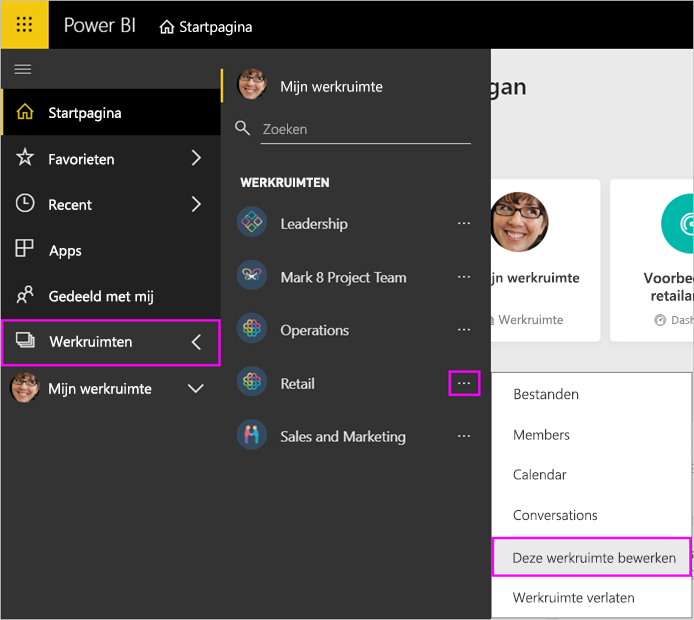
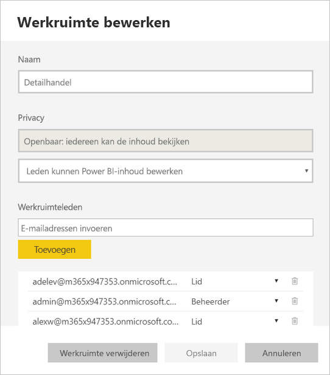
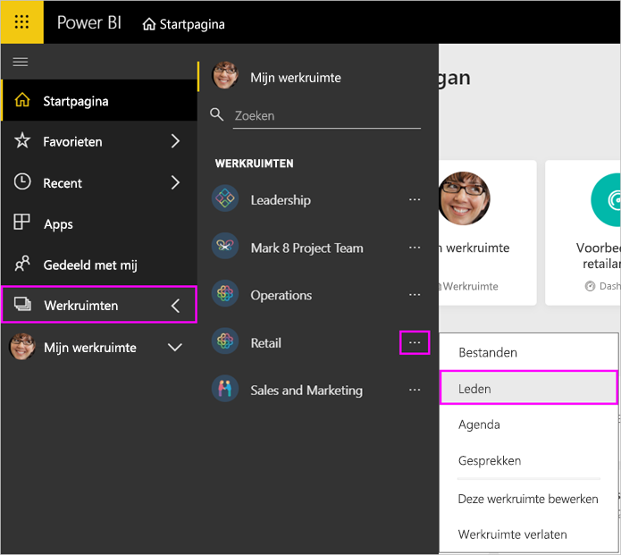
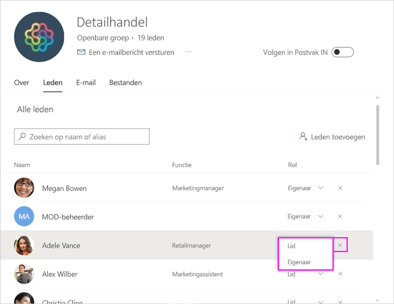
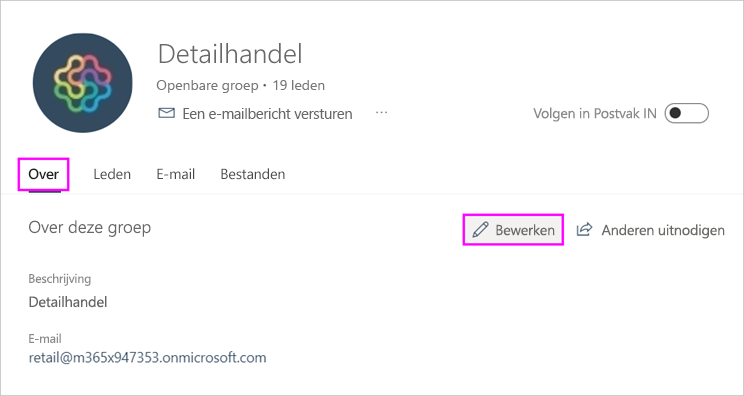
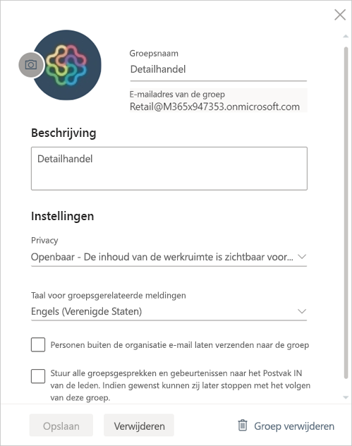

# Uw app-werkruimte beheren in Power BI en Office 365

Als maker of beheerder van een [app-werkruimte in Power BI](service-create-distribute-apps.md) of in Office 365, beheert u bepaalde aspecten van de werkruimte in Power BI. Andere aspecten beheert u in Office 365.

> [!NOTE]
> Bij de preview van de nieuwe werkruimte-ervaring is de relatie tussen Power BI-werkruimten en Office 365-groepen gewijzigd. Er wordt niet automatisch een Office 365-groep gemaakt wanneer u een van de nieuwe werkruimten maakt. Meer informatie over [het maken van de nieuwe werkruimten](service-create-the-new-workspaces.md).

In **Power BI** kunt u:

* Leden aan een app-werkruimte toevoegen of verwijderen. U kunt een lid van de werkruimte ook beheerder maken.
* De naam van de app-werkruimte bewerken.
* De app-werkruimte verwijderen.

In **Office 365** kunt u:

* Groepsleden aan uw app-werkruimte toevoegen of verwijderen. U kunt een lid ook eigenaar maken.
* De groepsnaam, afbeelding, beschrijving en andere instellingen bewerken.
* Het e-mailadres van de groep zien.
* De groep verwijderen.

U hebt een [Power BI Pro](service-features-license-type.md)-licentie nodig om beheerder of lid van een app-werkruimte te zijn. Uw app-gebruikers hebben ook een Power BI Pro-licentie nodig, tenzij uw app-werkruimte zich in een Power BI Premium-capaciteit bevindt. Lees [Wat is Power BI Premium?](service-premium-what-is.md) voor meer informatie.

## Uw app-werkruimte bewerken in Power BI

1. Selecteer in de Power BI-service de pijl naast **Werkruimten** > selecteer het beletselteken (…) naast de naam van de werkruimte > **Deze werkruimte bewerken**.

   

   > [!NOTE]
   > U ziet **Deze werkruimte bewerken** alleen als u beheerder van een app-werkruimte bent.

1. Hier kunt u de werkruimte een andere naam geven, leden toevoegen of verwijderen of de werkruimte verwijderen.

   

1. Selecteer **Opslaan** of **Annuleren**.

## Eigenschappen van app-werkruimten van Power BI bewerken in Office 365

U kunt aspecten van een app-werkruimte ook rechtstreeks bewerken in Outlook voor Office 365.

### De leden van de app-werkruimtegroep bewerken

1. Selecteer in de Power BI-service de pijl naast **Werkruimten** > selecteer het beletselteken (…) naast de naam van de werkruimte > **Leden**.

   

   Hiermee opent u de groepsweergave van Outlook voor Office 365 van uw app-werkruimte. Mogelijk moet u zich aanmelden bij uw bedrijfsaccount.

1. Selecteer de rol naast de naam van een teamlid om deze persoon **lid** of **eigenaar** te maken. Selecteer de **X** om de persoon uit de groep te verwijderen.

   

### Een afbeelding toevoegen en andere werkruimte-eigenschappen instellen

Wanneer u uw app distribueert vanuit de app-werkruimte, is de afbeelding die u hier toevoegt de afbeelding voor uw app. Zie de sectie [Een afbeelding toevoegen aan uw Office 365-app-werkruimte (optioneel)](service-create-workspaces.md#add-an-image-to-your-office-365-app-workspace-optional) van het artikel **De nieuwe werkruimten maken**.

1. Ga in de Outlook voor Office 365-weergave van uw app-werkruimte naar het tabblad **Over** en selecteer **Bewerken**.

    
1. U kunt de naam, beschrijving en taal bewerken voor groepsgerelateerde meldingen. U kunt hier ook een afbeelding toevoegen en andere eigenschappen instellen.

   

1. Selecteer **Opslaan** of **Verwijderen**.

## Volgende stappen

* [Een app publiceren in Power BI](service-create-distribute-apps.md)

* Hebt u nog vragen? [Misschien dat de Power BI-community het antwoord weet](http://community.powerbi.com/)
