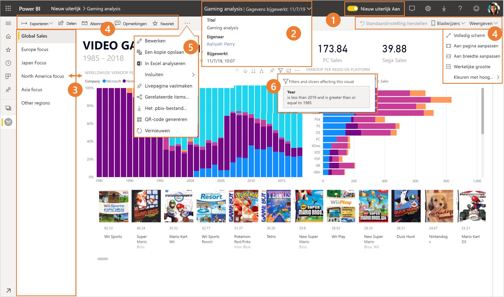
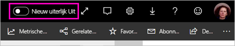
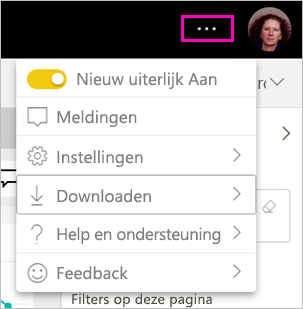
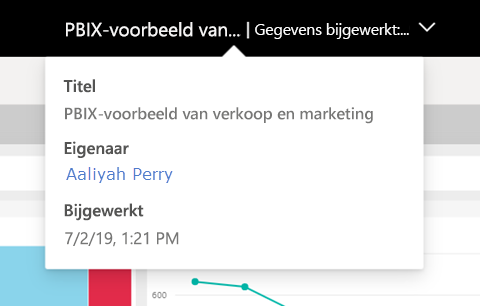
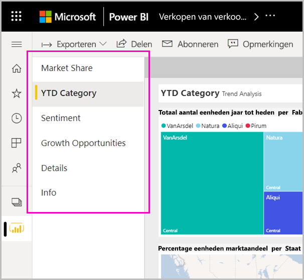
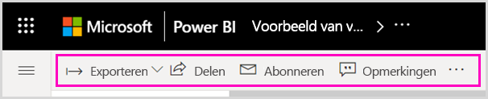

# Het nieuwe uiterlijk van de Power BI-service

De Power BI-service (app.powerbi.com) heeft een nieuwe vormgeving waarmee u uw rapporten gemakkelijker kunt weergeven en gebruiken. Het nieuwe uiterlijk biedt een moderne, eenvoudigere ervaring die is gebaseerd op uw bekendheid met andere Microsoft-producten. In de gehele Power BI-service is de inhoud van rapporten nu het belangrijkste aandachtspunt, door het gebruik van een lichter kleurenthema en bijgewerkte pictogrammen. Hier ziet u een overzicht van de veranderingen in het nieuwe uiterlijk. Bekijk de genummerde gedeelten voor meer informatie:

## Beknopt overzicht van de wijzigingen

In deze animatie ziet u hoe het uiterlijk van het rapport is gewijzigd.

## 1. Aanmelden voor het nieuwe uiterlijk

Elke gebruiker van de Power BI-service kan zich aanmelden voor het nieuwe uiterlijk. Schuif de knop **Nieuw uiterlijk uitschakelen** naar **Nieuw uiterlijk inschakelen**.

Schuif **Nieuw uiterlijk inschakelen** naar  als u wilt terugkeren naar het oude uiterlijk. Selecteer het menu met het beletselteken in de rechterbovenhoek als u deze optie niet ziet.

## 2. Rapportdetails weergeven 

Bekijk in de bovenste banner snel details zoals de laatste vernieuwingsdatum en contactgegevens.  Open het menu om aanvullende informatie over het rapport weer te geven. U kunt zelfs een e-mailbericht naar de rapporteigenaar versturen.

## 3. Verticale lijst met pagina's 
De namen van rapportpagina's staan nu in een lijst in een verticaal deelvenster. Deze lijst is nadrukkelijk aanwezig en vergelijkbaar met navigatie in Word en PowerPoint. U kunt de rest van het rapportgebied vergroten of verkleinen door het formaat van het verticale deelvenster te wijzigen.

## 4. Vereenvoudigde actiebalk 

De bijgewerkte actiebalk bovenaan bevat de meest relevante opdrachten (voor en midden) voor gebruikers van rapporten. Gebruikers kunnen eenvoudiger inhoud exporteren, zich abonneren, met anderen samenwerken en uitgebreider zoeken met behulp van filters en bladwijzers.

## 5. Waar vind ik de rapportopdrachten?

We hebben de functionaliteit van het oude uiterlijk niet verwijderd. U vindt de extra opdrachten zoals Bewerken, Kopie opslaan enzovoort, door het beletselteken (het menu met de puntjes ...) in de actiebalk uit te vouwen. Ook kunt u vanuit de inhoudslijst toegang krijgen tot de metrische gegevens over het verbruik.

### Waar staat de acties van het menu Bestand?

Zoekt u de acties van het menu **Bestand**? De acties die voorheen in het menu **Bestand** stonden, staan nu ook in het menu met het beletselteken (...). 

## 6. Nieuwe filterfunctionaliteit

Recente updates zoals het weergeven van toegepaste filters en het nieuwe deelvenster Filters zijn standaard beschikbaar in het nieuwe uiterlijk. Zelfs als de rapportontwerpers geen upgrade naar de nieuwe filterervaring hebben uitgevoerd, ziet u het nieuwe deelvenster Filters.

## De dashboardervaring in het nieuwe uiterlijk 

Ook dashboards zijn, net als rapporten en apps, van een vereenvoudigde actiebalk voorzien voor een consistente ervaring, waarbij de functionele verschillen zijn behouden. Hier ziet u een overzicht van de acties in een dashboard.
 

## Geen wijzigingen voor bewerkingsmodus 

De ontwerpervaring is nog steeds vergelijkbaar met die in Desktop. De wijzigingen in het nieuwe uiterlijk zijn alleen van toepassing op de leesweergave.

## Volgende stappen

[Power BI voor gebruikers](consumer/end-user-consumer.md)
