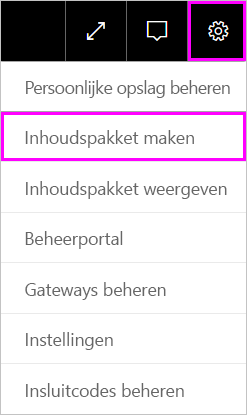
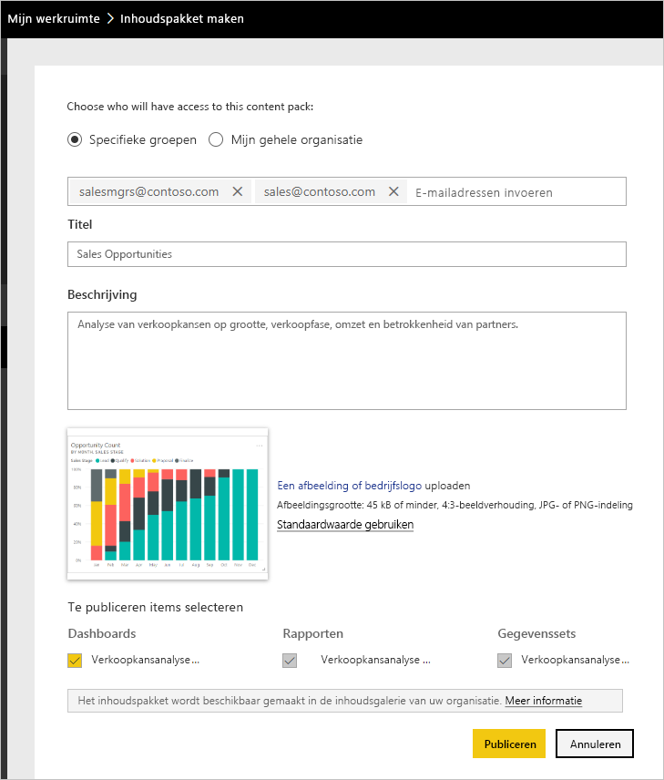
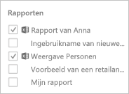
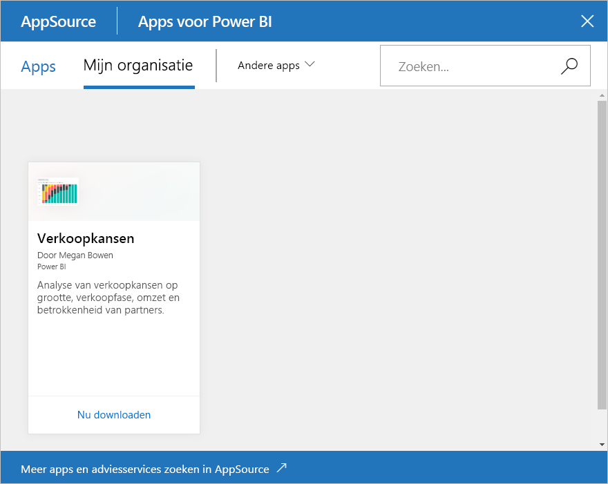

# Zelfstudie: Organisatie-inhoudspakketten in Power BI maken en publiceren

In deze zelfstudie maakt u een organisatie-inhoudspakket, geeft u een specifieke groep toegang ertoe en publiceert u het in de bibliotheek voor inhoudspakketten van uw organisatie in Power BI.

Het maken van inhoudspakketten verschilt van het delen van dashboards of het samenwerken aan een dashboard in een groep. Lees [Manieren om uw werk te delen in Power BI](service-how-to-collaborate-distribute-dashboards-reports.md) om te bepalen wat de beste optie voor uw situatie is.

Voor het maken van een organisatie-inhoudspakket moeten u en uw collega’s beschikken over een [Power BI Pro-account](https://powerbi.microsoft.com/pricing).

> [!NOTE]
> U kunt in de nieuwe werkruimte-ervaring geen organisatie-inhoudspakketten maken of installeren. Het is nu een goed moment om uw inhoudspakketten te upgraden naar apps, als u dat nog niet hebt gedaan. Informatie over [de nieuwe werkruimte-ervaring](service-create-the-new-workspaces.md).

## Een inhoudspakket maken en publiceren

Stel u voor dat u releasebeheerder bent bij Contoso en bezig bent de introductie van een nieuw product voor te bereiden.  U hebt een dashboard gemaakt met rapporten die u wilt delen. Deze kunnen nuttig zijn voor andere medewerkers die de introductie beheren. U zoekt een manier om het dashboard en de rapporten te verpakken als een oplossing die uw collega’s kunnen gebruiken.

Doet u mee? Ga in de [Power BI-service](https://powerbi.com) naar **Mijn werkruimte**. Ga vervolgens naar **Gegevens ophalen** > **Voorbeelden** > **Voorbeeld van een verkoopkansanalyse** > **Verbinden** om uw eigen exemplaar op te halen.

1. Selecteer **Werkruimten** > **Mijn Werkruimten** in het navigatievenster.

1. Selecteer in het bovenste navigatievenster het tandwielpictogram. > **Inhoudspakket maken**.

   

1. Voer in het venster **Inhoudspakket maken** de volgende informatie in.  

   Houd er wel rekening mee dat de bibliotheek met inhoudspakketten van uw organisatie snel vol kan lopen. Uiteindelijk kan de bibliotheek wel honderden inhoudspakketten bevatten die zijn gepubliceerd voor de organisatie of voor groepen. Neem de tijd om uw inhoudspakket een betekenisvolle naam te geven, een goede beschrijving toe te voegen en de juiste doelgroep te selecteren.  Gebruik woorden die het gemakkelijk maken uw inhoudspakket te vinden met een zoekopdracht. Hierdoor is het later gemakkelijker terug te vinden.

      

    1. Selecteer **Specifieke groepen**.

    1. Typ het volledige e-mailadres van afzonderlijke personen, [Office 365-groepen](https://support.office.com/article/Create-a-group-in-Office-365-7124dc4c-1de9-40d4-b096-e8add19209e9), distributiegroepen of beveiligingsgroepen. Bijvoorbeeld: salesmgrs@contoso.com; sales@contoso.com

        Probeer het voor deze zelfstudie met het e-mailadres van uw groep.

    1. Noem het inhoudspakket *Verkoopkansen*.

        > [!TIP]
        > U zou de naam van het dashboard in de naam van het inhoudspakket kunnen opnemen. Op die manier kunnen uw collega's het dashboard gemakkelijker vinden nadat ze verbinding hebben gemaakt met uw inhoudspakket.

    1. Aanbevolen: Voeg een beschrijving toe. Hierdoor kunnen collega's de benodigde inhoudspakketten gemakkelijker vinden. Naast een beschrijving kunt u ook sleutelwoorden toevoegen die uw collega's kunnen gebruiken om het inhoudspakket te zoeken. Neem contactgegevens op voor het geval uw collega's een vraag hebben of hulp nodig hebben.

    1. Upload een afbeelding of logo zodat groepsleden het inhoudspakket gemakkelijker kunnen vinden.

        Zoeken naar een afbeelding gaat sneller dan zoeken naar een tekst. Schermopname van een afbeelding van de kolomdiagramtegel **Verkoopkansen**.

    1. Selecteer het dashboard **Voorbeeld van een verkoopkansanalyse** om het toe te voegen aan het inhoudspakket.

        Het bijbehorende rapport en de bijbehorende gegevensset worden automatisch toegevoegd. Als u wilt, kunt u ook andere toevoegen.

       > [!NOTE]
       > Alleen de dashboards, rapporten, gegevenssets en werkmappen die u kunt bewerken worden weergegeven in Power BI. In de app worden er dus geen weergegeven die met u zijn gedeeld.

   1. Als u Excel-werkmappen hebt, staan deze onder **Rapporten**, met een Excel-pictogram. U kunt deze ook toevoegen aan het inhoudspakket.

      

      > [!NOTE]
      > Als leden van de groep de Excel-werkmap niet kunnen bekijken, moet u mogelijk [de werkmap met hen delen in OneDrive voor Bedrijven](https://support.office.com/article/Share-documents-or-folders-in-Office-365-1fe37332-0f9a-4719-970e-d2578da4941c).

1. Selecteer **Publiceren** om het inhoudspakket toe te voegen aan de bibliotheek met organisatie-inhoudspakketten van de groep.  

   U krijgt een bericht wanneer het pakket is gepubliceerd.

1. Als leden van uw groep gaan naar **Gegevens ophalen** > **Organisatie-inhoudspakketten**, zien ze uw inhoudspakket.

   

   > [!TIP]
   > De URL die wordt weergegeven in uw browser is een uniek adres voor dit inhoudspakket.  Wilt u uw collega's op de hoogte stellen van dit nieuwe inhoudspakket?  Plak de URL in een e-mailbericht.

1. Wanneer uw groepsleden **Verbinden** selecteren, kunnen ze [uw inhoudspakket bekijken en ermee werken](service-organizational-content-pack-copy-refresh-access.md).

## Volgende stappen

* [Inleiding tot organisatie-inhoudspakketten in Power BI](service-organizational-content-pack-introduction.md).

* [Organisatie-inhoudspakketten beheren, bijwerken en verwijderen](service-organizational-content-pack-manage-update-delete.md).

* [Een app publiceren in Power BI](service-create-distribute-apps.md).

* [Wat is OneDrive voor Bedrijven?](https://support.office.com/article/What-is-OneDrive-for-Business-187f90af-056f-47c0-9656-cc0ddca7fdc2)

* Nog vragen? [Misschien dat de Power BI-community het antwoord weet](https://community.powerbi.com/)
