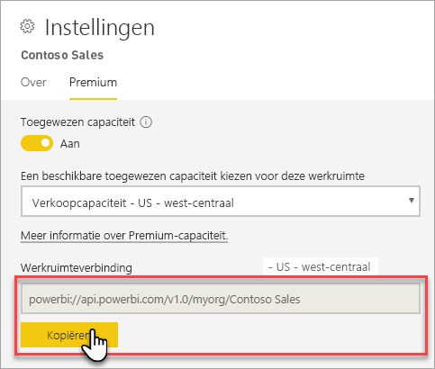

# Verbinding maken met gegevenssets met clienttoepassingen en hulpprogramma's (preview)

Power BI Premium-werkruimten en -gegevenssets bieden ondersteuning voor *alleen-lezen*verbindingen van Microsoft en clienttoepassingen en hulpprogramma's van derden. Verbindingen zijn standaard ingeschakeld.

> [!NOTE]
> Dit artikel is uitsluitend bedoeld om alleen-lezenconnectiviteit in Power BI Premium-werkruimten en -gegevenssets te introduceren. Het *is niet* bedoeld om gedetailleerde informatie te verstrekken over programmeerbaarheid, specifieke hulpprogramma's en toepassingen, architectuur en beheer van werkruimten en gegevenssets. Voor de hier beschreven onderwerpen is een goed begrip van de database-architectuur en het beheer van het tabellaire Analysis Services-model vereist.

## Protocol

Power BI Premium maakt gebruik van het XMLA-protocol ([XML for Analysis](https://docs.microsoft.com/bi-reference/xmla/xml-for-analysis-xmla-reference)) voor communicatie tussen clienttoepassingen en de engine waarmee uw werkruimten en gegevenssets wordt beheerd. Deze communicatie verloopt via wat vaak wordt aangeduid als XMLA-eindpunten. XMLA is hetzelfde communicatieprotocol dat wordt gebruikt door de Microsoft Analysis Services-engine, waarmee achter de schermen de semantische modellering, governance, levensduur en het gegevensbeheer van Power BI wordt uitgevoerd. 

Het overgrote deel van de clienttoepassingen en hulpprogramma's communiceren niet expliciet met de engine via XMLA-eindpunten. In plaats daarvan gebruiken ze clientbibliotheken zoals MSOLAP ADOMD en AMO als intermediair tussen de clienttoepassing en de engine, die uitsluitend via XMLA communiceert.

## Ondersteunde hulpprogramma 's

Deze hulpprogramma's bieden ondersteuning voor alleen-lezentoegang tot Power BI Premium-werkruimten en gegevenssets:

**SQL Server Management Studio (SSMS)** : ondersteunt DAX-, MDX-, XMLA- en TraceEvent-query's. Vereist versie 18.0. U kunt [hier](https://docs.microsoft.com/sql/ssms/download-sql-server-management-studio-ssms) downloaden. 

**SQL Server Profiler**: dit hulpprogramma, dat is opgenomen in SSMS 18.0 (preview), voorziet in het bijhouden en opsporen van fouten in servergebeurtenissen. U kunt gegevens over elke gebeurtenis vastleggen en opslaan in een bestand of tabel om later te analyseren. Hoewel Profiler officieel is afgeschaft voor SQL Server, wordt het nog steeds opgenomen in SSMS en ondersteund voor Analysis Services en nu Power BI Premium. Zie [SQL Server Profiler](https://docs.microsoft.com/sql/tools/sql-server-profiler/sql-server-profiler) voor meer informatie.

**DAX-Studio**: een open-source, communityhulpprogramma voor het uitvoeren en analyseren van DAX query's ten aanzien van Analysis Services. Hiervoor is versie 2.8.2 of hoger vereist. Zie [daxstudio.org](https://daxstudio.org/) voor meer informatie.

**Excel-draaitabellen**: hiervoor is een klik-en-klaar-versie van Office 16.0.11326.10000 of hoger vereist.

**Van derden**: bevat toepassingen en hulpprogramma's voor het visualiseren van clientgegevens waarmee u verbinding kunt maken met, query's kunt uitvoeren in en gebruik kunt maken van gegevenssets in Power BI Premium. Voor de meeste hulpprogramma's zijn de meest recente versies van de MSOLAP-clientbibliotheken vereist, maar voor sommige kunt u ADOMD gebruiken.

## Clientbibliotheken

Clientbibliotheken zijn nodig om de clienttoepassingen en hulpprogramma's verbinding te laten maken met Power BI Premium-werkruimten. Dezelfde clientbibliotheken die worden gebruikt om verbinding te maken met Analysis Services worden ook ondersteund in Power BI Premium. Met Microsoft-clienttoepassingen zoals Excel, SQL Server Management Studio (SSMS) en SQL Server Data Tools (SSDT) worden alle drie clientbibliotheken geïnstalleerd en worden ze samen met de reguliere toepassingsupdates bijgewerkt. In sommige gevallen, met name bij toepassingen en hulpprogramma's van derden, moet u mogelijk nieuwere versies van de clientbibliotheken installeren. Clientbibliotheken worden maandelijks bijgewerkt. Zie [Clientbibliotheken om verbinding te maken met Analysis Services](https://docs.microsoft.com/azure/analysis-services/analysis-services-data-providers) voor meer informatie.

## Verbinding maken met een Premium-werkruimte

U kunt verbinding maken met werkruimten die zijn toegewezen aan toegewezen Premium-capaciteiten. Werkruimten die zijn toegewezen aan toegewezen capaciteiten hebben een verbindingsreeks in URL-indeling. 

Als u de verbindingsreeks van de werkruimte wilt ophalen, moet u in Power BI **Werkruimte-instellingen** op het tabblad **Premium**, in **Werkruimteverbinding** op **Kopiëren** klikken.

Werkruimteverbindingen maken gebruik van de volgende URL-indeling om een werkruimte te behandelen alsof het de naam van een Analysis Services-server betreft:   
`powerbi://api.powerbi.com/v1.0/[tenant name]/[workspace name]` 

Bijvoorbeeld `powerbi://api.powerbi.com/v1.0/contoso.com/Sales Workspace`

### Verbinding maken in SSMS

Selecteer in **Verbinding maken met Server** > **Servertype** **Analysis Services**. Geef in **Servernaam** de URL op. Selecteer bij **Verificatie** **Active Directory - Universeel met MFA-ondersteuning** en geef vervolgens in **Gebruikersnaam** de gebruikers-id van uw organisatie op. 

Wanneer de verbinding is gemaakt, wordt de werkruimte weergegeven als een Analysis Services-server en worden gegevenssets in de werkruimte weergegeven als databases.  

### Oorspronkelijke catalogus

Voor sommige hulpprogramma's, zoals SQL Server Profiler, moet u mogelijk een *Oorspronkelijke catalogus* opgeven. Geef een gegevensset (database) in uw werkruimte op. In **Verbinding maken met server** klikt u op **Opties**. In het dialoogvenster **Verbinding maken met server** op het tabblad **Verbindingseigenschappen** voert u in **Verbinding maken met database** de naam van de gegevensset in.

### Dubbele naam van de werkruimte

Wanneer u verbinding maakt met een werkruimte met dezelfde naam als een andere werkruimte, krijgt u mogelijk de volgende fout: **Kan geen verbinding maken met powerbi://api.powerbi.com/v1.0/ [tenantnaam] / [werkruimtenaam].**

U kunt deze fout oplossen door naast de naam van de werkruimte de ObjectIDGuid op te geven, die u kunt kopiëren vanuit de objectID van de werkruimte in de URL. De objectID toevoegen aan de verbindings-URL. Bijvoorbeeld 'powerbi://api.powerbi.com/v1.0/myorg/Contoso-verkoop - 9d83d204-82a9-4b36-98f2-a40099093830'

### Dubbele naam van gegevensset

Bij het verbinden met een gegevensset met dezelfde naam als een andere gegevensset in dezelfde werkruimte moet u de GUID van de gegevensset toevoegen aan de naam van de gegevensset. U kunt zowel de gegevenssetnaam *als* GUID ophalen wanneer u verbinding hebt met de werkruimte in SSMS. 

### Vertraging in de gegevenssets die worden weergegeven

Wanneer u verbinding maakt met een werkruimte, kan het wel vijf minuten duren alvorens wijzigingen vanwege nieuwe, verwijderde en hernoemde gegevenssets worden weergegeven. 

### Niet-ondersteunde gegevenssets

De volgende gegevenssets zijn niet toegankelijk via XMLA-eindpunten. Deze gegevenssets worden *niet* weergegeven onder de werkruimte in SSMS of in andere hulpprogramma's: 

- Gegevenssets met een liveverbinding met Analysis Services-modellen. 
- Gegevenssets met pushgegevens met behulp van de REST-API.
- Gegevenssets op basis van Excel-werkmappen. 

De volgende gegevenssets worden niet ondersteund in de Power BI-service:   

- Gegevenssets met een liveverbinding met een Power BI-gegevensset.

### Rollen en rollidmaatschappen

Momenteel kunnen modelrollen en rollidmaatschappen niet worden gedetecteerd of weergegeven met behulp van XMLA-eindpunten.

## Auditlogboeken 

Wanneer clienttoepassingen en hulpprogramma's verbinding maken met een werkruimte, wordt de toegang via XMLA-eindpunten geregistreerd in de Power BI-auditlogboeken onder de bewerking **GetWorkspaces**. Zie [Power BI controleren](service-admin-auditing.md) voor meer informatie.

## Zie ook

[Verwijzingen Analysis Services](https://docs.microsoft.com/bi-reference/?pivot=home&panel=home-all)   
[SQL Server Management Studio](https://docs.microsoft.com/sql/ssms/sql-server-management-studio-ssms)   
[SQL Server Analysis Services-protocol in tabelvorm](https://docs.microsoft.com/openspecs/sql_server_protocols/ms-ssas-t/b98ed40e-c27a-4988-ab2d-c9c904fe13cf)   
[Dynamische beheerweergaven (DMV's)](https://docs.microsoft.com/sql/analysis-services/instances/use-dynamic-management-views-dmvs-to-monitor-analysis-services)   

Hebt u nog vragen? [Misschien dat de Power BI-community het antwoord weet](https://community.powerbi.com/)
