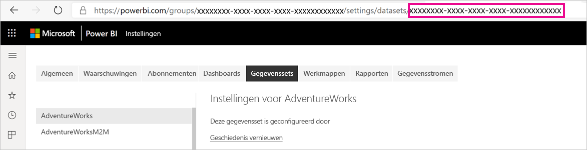
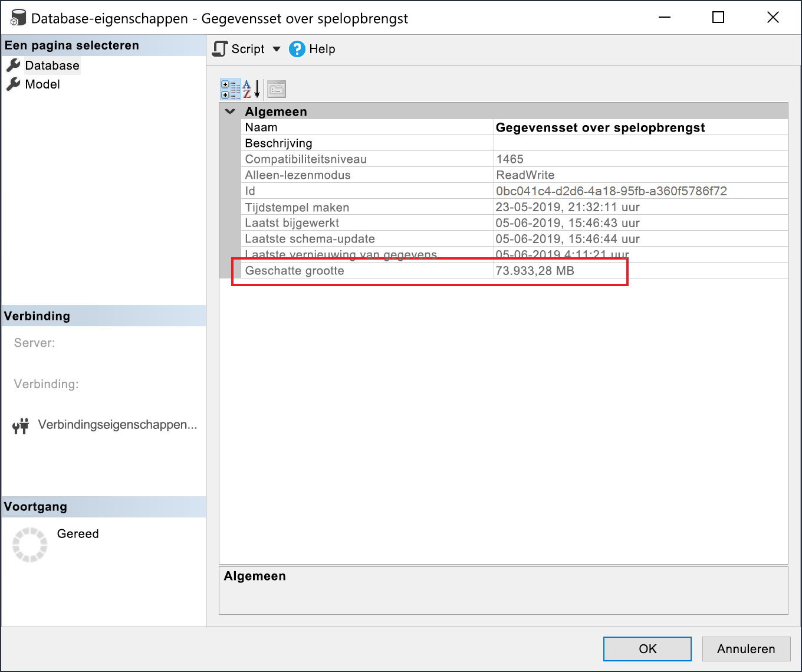

# <a name="large-models-in-power-bi-premium-preview"></a>Ondersteuning voor grote modellen in Power BI Premium (preview-versie)

Met Power BI-gegevenssets kunnen gegevens sterk gecomprimeerd in de cache in het geheugen worden opgeslagen voor geoptimaliseerde queryprestaties. Dit maakt snelle gebruikersinteractiviteit met grote gegevenssets mogelijk. Met de functie voor grote modellen kunnen gegevenssets in Power BI Premium groter worden dan 10 GB. De grootte van de gegevensset wordt beperkt door de grootte van de Power BI Premium-capaciteit. Dit is vergelijkbaar met de manier waarop Azure Analysis Services werkt als het gaat om de beperkingen van de modelgrootte. Zie Capaciteitsknooppunten voor meer informatie over capaciteitsgrootten in Power BI Premium. U kunt grote modellen instellen voor alle Premium P-SKU's en ingebouwde SKU's, maar deze werken alleen met de [nieuwe werkruimten](service-create-the-new-workspaces.md).

Grote modellen hebben geen invloed op de PBIX-uploadgrootte, die nog steeds beperkt is tot 10 GB. In plaats daarvan worden gegevenssets groter dan 10 GB in de service bij het vernieuwen. U kunt incrementeel vernieuwen gebruiken om een gegevensset te configureren die groter kan worden dan 10 GB.

## <a name="enable-large-models"></a>Grote modellen inschakelen

Voer de volgende stappen uit om een gegevensset te maken die groter is dan 10 GB:

1. Maak een gegevensset in Power BI Desktop en configureer een [incrementele vernieuwing](service-premium-incremental-refresh.md).

1. Publiceer de gegevensset naar de Power BI Premium-service.

1. Schakel de gegevensset voor grote modellen in door de onderstaande Power shell-cmdlets uit te voeren. Deze cmdlets zorgen ervoor dat Power BI de gegevensset opslaat in Azure Premium Files en de limiet van 10 GB niet wordt afgedwongen.

1. Roep een vernieuwing aan om historische gegevens te laden op basis van het beleid voor incrementeel vernieuwen. Tijdens de eerste keer vernieuwen kan het even duren voordat de geschiedenis is geladen. De volgende vernieuwingen moeten sneller zijn omdat ze incrementeel zijn.

### <a name="powershell-cmdlets"></a>PowerShell-cmdlets

Schakel in de huidige versie van grote modellen de gegevensset in voor Premium Files-opslag met behulp van PowerShell-cmdlets. U moet beschikken over capaciteitsbeheer en beheerdersbevoegdheden voor werkruimten hebben om de PowerShell-cmdlets uit te voeren.

1. Zoek de gegevensset-ID (GUID) op. Op het tabblad **Gegevenssets** voor de werkruimte, onder de instellingen van de gegevensset, ziet u de ID in de URL.

    

1. Installeer de module [MicrosoftPowerBIMgmt](/powershell/module/microsoftpowerbimgmt.data/) van een Power shell-beheerprompt.

    ```powershell
    Install-Module -Name MicrosoftPowerBIMgmt
    ```

1. Voer de volgende cmdlets uit om u aan te melden en de opslagmodus voor de gegevensset te controleren.

    ```powershell
    Login-PowerBIServiceAccount

    (Get-PowerBIDataset -Scope Organization -Id <Dataset ID> -Include actualStorage).ActualStorage
    ```

    Het antwoord moet het volgende zijn. De opslagmodus is ABF (Analysis Services back-upbestand). Dit is de standaardinstelling.

    ```
    Id                   StorageMode

    --                   -----------

    <Dataset ID>         Abf
    ```

1. Voer de volgende cmdlets uit om de opslagmodus in te stellen op Premium-bestanden en te controleren. Het kan een paar seconden duren om naar Premium-bestanden te converteren.

    ```powershell
    Set-PowerBIDataset -Id <Dataset ID> -TargetStorageMode PremiumFiles

    (Get-PowerBIDataset -Scope Organization -Id <Dataset ID> -Include actualStorage).ActualStorage
    ```

    Het antwoord moet het volgende zijn. De opslagmodus is nu ingesteld op Premium-bestanden.

    ```
    Id                   StorageMode
    
    --                   -----------
    
    <Dataset ID>         PremiumFiles
    ```

U kunt de status van gegevenssetconversies controleren van en naar Premium-bestanden met behulp van de cmdlet [Get-PowerBIWorkspaceMigrationStatus](/powershell/module/microsoftpowerbimgmt.workspaces/get-powerbiworkspacemigrationstatus).

## <a name="dataset-eviction"></a>Gegevenssets verwijderen

Power BI maakt gebruik van dynamisch geheugenbeheer om inactieve gegevenssets uit het geheugen te verwijderen. Power BI verwijdert gegevenssets zodat andere gegevenssets kunnen worden geladen om query's af te handelen. Met dynamisch geheugenbeheer kan de som van de grootte van gegevenssets aanzienlijk groter zijn dan het geheugen dat beschikbaar is op de capaciteit, maar een enkele gegevensset moet in het geheugen passen. Zie [Hoe capaciteiten functioneren](service-premium-what-is.md#how-capacities-function)voor meer informatie over dynamisch geheugenbeheer.

U moet rekening houden met de gevolgen van het verwijderen van grote modellen. Ondanks een relatief snelle laadtijd van gegevenssets kan er nog steeds een merkbare vertraging optreden voor gebruikers als ze moeten wachten totdat grote verwijderde gegevenssets opnieuw worden geladen. Daarom wordt de functie voor grote modellen, in zijn huidige vorm, voornamelijk aanbevolen voor capaciteiten die zijn toegewezen voor vereisten voor bedrijfs-BI en niet voor een combinatie met vereisten voor selfservice-BI. Capaciteiten die zijn toegewezen voor vereisten voor bedrijfs-BI activeren minder vaak verwijderingen en hoeven minder vaak gegevenssets opnieuw te laden. Anderzijds kunnen capaciteiten voor selfservice-BI veel kleine gegevenssets bevatten die vaker in en uit het geheugen worden geladen.

## <a name="checking-dataset-size"></a>De grootte van gegevenssets controleren

Nadat u historische gegevens hebt geladen, kunt u [SQL Server Management Studio](https://docs.microsoft.com/sql/ssms/download-sql-server-management-studio-ssms) gebruiken via het [XMLA-eindpunt](service-premium-connect-tools.md) om de geschatte grootte van de gegevensset in het venster met modeleigenschappen te controleren.



U kunt ook de grootte van de gegevensset controleren door de volgende DMV-query's vanuit SQL Server Management Studio uit te voeren. Tel de kolommen DICTIONARY\_SIZE en USED\_SIZE uit de uitvoer bij elkaar op om de grootte van de gegevensset in bytes weer te geven.

```sql
SELECT * FROM SYSTEMRESTRICTSCHEMA
($System.DISCOVER_STORAGE_TABLE_COLUMNS,
 [DATABASE_NAME] = '<Dataset Name>') //Sum DICTIONARY_SIZE (bytes)

SELECT * FROM SYSTEMRESTRICTSCHEMA
($System.DISCOVER_STORAGE_TABLE_COLUMN_SEGMENTS,
 [DATABASE_NAME] = '<Dataset Name>') //Sum USED_SIZE (bytes)
```

## <a name="current-feature-restrictions"></a>Huidige functiebeperkingen

Houd bij het gebruik van grote modellen rekening met de volgende beperkingen:

- **Gebruik uw eigen BYOK-versleuteling**: gegevenssets die zijn ingeschakeld voor Premium-bestanden worden niet versleuteld door [BYOK](service-encryption-byok.md).
- **Ondersteuning voor meerdere geografische gebieden**: gegevenssets die zijn ingeschakeld voor Premium-bestanden mislukken op capaciteiten waar [meerdere geografische gebieden](service-admin-premium-multi-geo.md) ook zijn ingeschakeld.

- **Downloaden naar Power BI Desktop**: als een gegevensset wordt opgeslagen in Premium-bestanden, mislukt [downloaden als een pbix-bestand](service-export-to-pbix.md).
- **Ondersteunde regio's**: grote modellen worden ondersteund door de volgende regio's.
  - Australië - oost
  - Australië - zuidoost
  - US - centraal
  - Azië - oost
  - US - oost
  - US - oost 2
  - Japan - oost
  - Japan - west
  - Korea - centraal
  - Korea - zuid
  - US - noord-centraal
  - Europa - noord
  - US - zuid-centraal
  - Azië - zuidoost
  - UK - zuid
  - UK - west
  - Europa - west
  - US - west
  - US - west 2