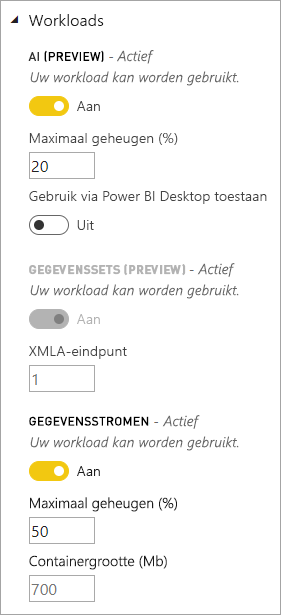
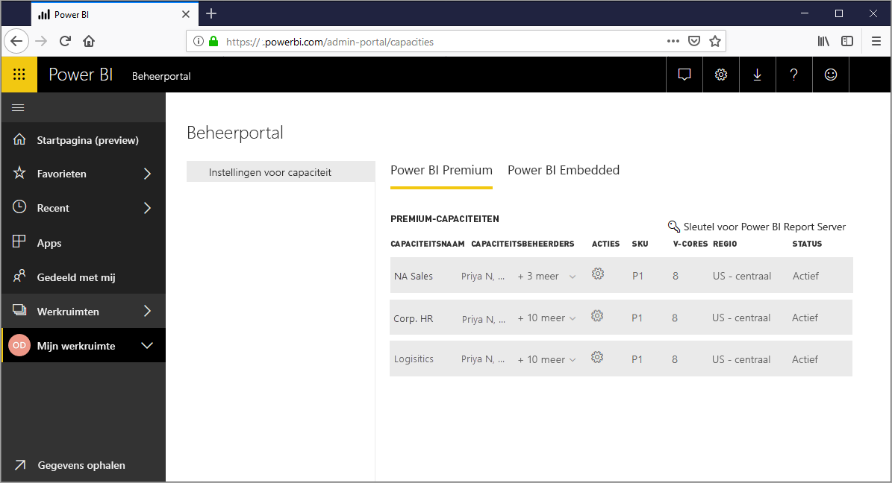
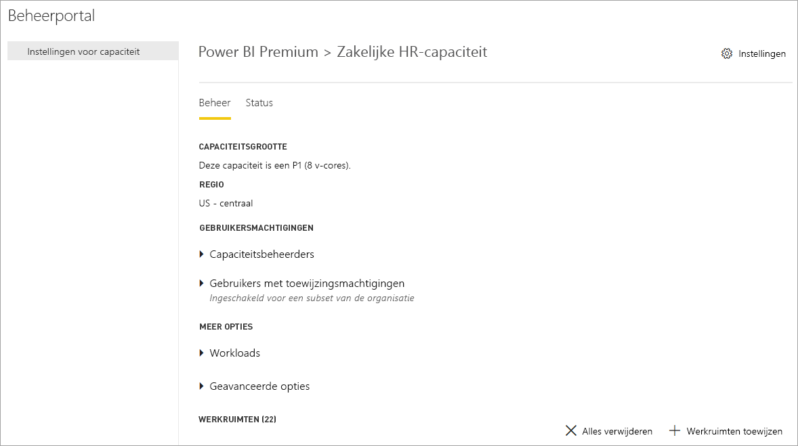
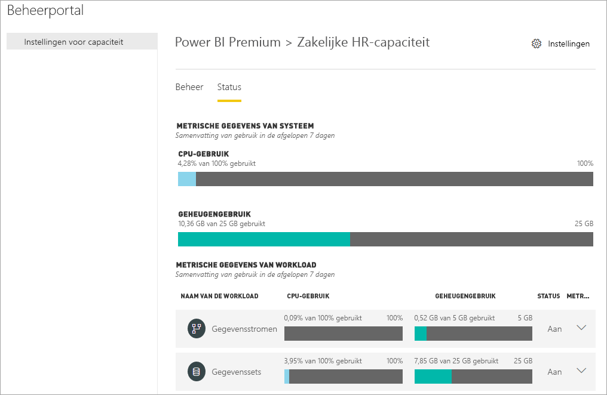
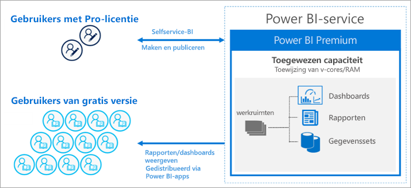
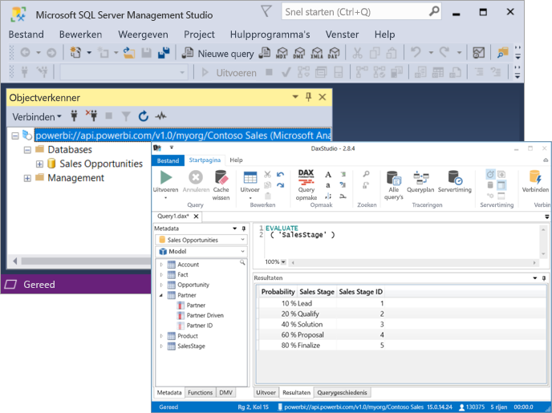

# Wat is Power BI Premium?

Power BI Premium bevat toegewezen en verbeterde resources voor het uitvoeren van de Power BI-service voor uw organisatie. Bijvoorbeeld:

- Grotere schaal en prestaties
- Flexibiliteit door capaciteit-licentie
- Lever een geïntegreerde ervaring analistenportals en Self-service enterprise BI
- Uitbreiden van BI on-premises met Power BI Report Server
- Ondersteuning voor gegevensresidentie per regio (meerdere geografische gebieden)
- Gegevens delen met iedereen zonder het aanschaffen van een licentie per gebruiker

In dit artikel is niet bedoeld om informatie over elke functie van Power BI Premium - in feite, deze alleen het oppervlak raakt. Indien nodig, vindt u koppelingen naar aanvullende artikelen met meer gedetailleerde informatie.

## Abonnementen en licentieverlening

Power BI Premium is een op tenantniveau Office 365-abonnement beschikbaar in twee SKU (Stock Keeping Unit)-families:

- **EM** SKU's (EM1-EM3) voor het insluiten van inhoud, vereisen een jaarlijkse toezegging maandelijks in rekening worden gebracht.
- **P** SKU's (P1-P3) voor het insluiten van inhoud en enterprise-functies vereisen een maandelijkse of jaarlijkse toezegging, maandelijks gefactureerd en bevat een licentie voor Power BI Report Server on-premises installeert.

Een alternatieve methode is het kopen van een **Azure Power BI Embedded** abonnement, waarvan één **A** (A1-A6) SKU-serie voor het insluiten van inhoud en testen van de capaciteit is uitsluitend bedoeld. Alle SKU's leveren v-cores voor het maken van capaciteit, maar de EM-SKU's zijn niet toegestaan voor het insluiten van kleinere schaal. EM1, EM2, A1 en A2-SKU's met minder dan vier v-cores niet uitgevoerd op toegewezen infrastructuur.

De focus van dit artikel is de P-SKU's, is veel van wat wordt beschreven ook relevant zijn voor de A-SKU's. In tegenstelling tot de Premium-abonnement SKU's, Azure-SKU's vereisen geen verplichtingen op tijd en worden per uur gefactureerd. Ze bieden volledige elasticiteit inschakelen schaal omhoog, omlaag schalen, onderbreken, hervatten en verwijderen. 

Azure Power BI Embedded is grotendeels buiten het bereik van dit artikel, maar dit wordt beschreven in de [testen benaderingen](service-premium-capacity-optimize.md#testing-approaches) gedeelte van het artikel optimaliseren van Premium-capaciteiten als een praktische en economische optie voor het testen en meten van workloads. Zie voor meer informatie over Azure-SKU's, [documentatie voor Azure Power BI Embedded](https://azure.microsoft.com/services/power-bi-embedded/).

### Kopen

Power BI Premium-abonnementen worden aangeschaft door beheerders in de Microsoft 365-beheercentrum. Specifiek, kunnen alleen Office 365 globale beheerders of beheerders facturering SKU's aanschaffen. Wanneer u hebt aangeschaft, ontvangt een overeenkomstige aantal v-cores om toe te wijzen aan capaciteit, ook wel *v-core groepering*. Een P3-SKU kopen geeft bijvoorbeeld de tenant 32 v-cores. Zie voor meer informatie, [Power BI Premium kopen](service-admin-premium-purchase.md).

## Toegewezen capaciteit

Met Power BI Premium, krijgt u *toegewezen capaciteit*. In tegenstelling tot een gedeelde capaciteit waar workloads worden uitgevoerd op calculatiebronnen die worden gedeeld met andere klanten, is een toegewezen capaciteit voor exclusief gebruik door een organisatie. Het is geïsoleerd met specifieke rekenkundige resources waarmee u betrouwbare en consistente prestaties voor gehoste inhoud. 

Werkruimten zich bevinden in de capaciteit. Elke Power BI-gebruiker heeft een persoonlijke werkruimte wel **mijn werkruimte**. Extra werkruimten kunnen worden gemaakt om in te schakelen voor samenwerking en implementatie, en dit staat bekend als **App-werkruimten**. Werkruimten, met inbegrip van persoonlijke werkruimten, worden standaard gemaakt in de gedeelde capaciteit. Als u Premium-capaciteiten, kunnen zowel mijn werkruimten en App-werkruimten worden toegewezen aan Premium-capaciteiten.

### Capaciteit knooppunten

Zoals beschreven in de [abonnementen en licentieverlening](#subscriptions-and-licensing) sectie, zijn er twee Power BI Premium SKU-families: **EM** en **P**. Alle Power BI Premium-SKU's zijn beschikbaar als capaciteit *knooppunten*, elk voor een vaste hoeveelheid resources die bestaat uit een processor, geheugen en opslag. Naast de resources, elke SKU heeft operationele limieten voor het aantal verbindingen voor DirectQuery en Live-verbinding per seconde en het aantal parallelle model wordt vernieuwd.

Verwerking wordt bereikt door een bepaald aantal v-cores, evenredig verdeeld over back-end en frontend.

**Back-end-v-cores** verantwoordelijk zijn voor de kernfunctionaliteit van het Power BI queryverwerking, Cachebeheer, uitvoeren van R services, modelvernieuwing, verwerking van natuurlijke taal (Q & A) en server-side rendering van rapporten en afbeeldingen. Back-end-v-cores zijn een vaste hoeveelheid geheugen die wordt voornamelijk gebruikt worden toegewezen aan host modellen, ook wel bekend als actieve gegevenssets.

**Front-end-v-cores** verantwoordelijk zijn voor de web service, dashboard en rapport documentbeheer, beheren van de toegangsrechten, planning, API's, wordt geüpload en gedownload en in het algemeen voor alles met betrekking tot de gebruiker optreedt.

Opslag is ingesteld op **100 TB per capaciteitsknooppunt**.

De resources en limieten van elke Premium-SKU (en de grootte oftewel een SKU) in de volgende tabel worden beschreven:

| Capaciteit knooppunten | Totaal aantal v-cores | v-cores voor back-end | RAM (GB) | v-cores voor front-end | DirectQuery/Liveverbindingen (per seconde) | Model vernieuwen parallelle uitvoering |
| --- | --- | --- | --- | --- | --- | --- |
| EM1/A1 | 1 | 0,5 | 2.5 | 0,5 | 3.75 | 1 |
| EM2/A2 | 2 | 1 | 5 | 1 | 7.5 | 2 |
| EM3/A3 | 4 | 2 | 10 | 2 | 15 | 3 |
| P1/A4 | 8 | 4 | 25 | 4 | 30 | 6 |
| P2/A5 | 16 | 8 | 50 | 8 | 60 | 12 |
| P3/A6 | 32 | 16 | 100 | 16 | 120 | 24 |
| | | | | | | |

### Capaciteit workloads

Capaciteit werkbelastingen zijn services beschikbaar gesteld aan gebruikers. Standaard ondersteuning Premium en Azure-capaciteiten voor alleen een gegevensset werkbelasting die is gekoppeld aan het uitvoeren van query's van Power BI. De werkbelasting van de gegevensset kan niet worden uitgeschakeld. Extra werkbelasting kunnen worden ingeschakeld voor [AI (Cognitive Services)](https://powerbi.microsoft.com/blog/easy-access-to-ai-in-power-bi-preview/), [gegevensstromen](service-dataflows-overview.md#dataflow-capabilities-on-power-bi-premium), en [gepagineerde rapporten](paginated-reports-save-to-power-bi-service.md). Deze werkbelastingen worden ondersteund in Premium-abonnementen. 

Elke extra belasting Hiermee kunt u configureren de maximale hoeveelheid geheugen (als percentage van totale beschikbare geheugen) door de werkbelasting kan worden gebruikt. Standaardwaarden voor de maximale hoeveelheid geheugen worden bepaald door de SKU. U kunt de beschikbare bronnen van uw capaciteit maximaliseren door in te schakelen alleen deze extra werkbelastingen wanneer ze worden gebruikt. En u kunt de instellingen alleen als u de standaardinstellingen hebt vastgesteld niet voldoen aan de resourcevereisten van uw capaciteit geheugen wijzigen. Werkbelastingen kunnen worden ingeschakeld en geconfigureerd voor een capaciteit van de capaciteitsbeheerders met behulp van **capaciteitsinstellingen** in de [-beheerportal](service-admin-portal.md) of met behulp van de [capaciteiten REST-API's](https://docs.microsoft.com/rest/api/power-bi/capacities).  

Zie voor meer informatie, [workloads configureren in een Premium-capaciteit](service-admin-premium-workloads.md). 

### Hoe capaciteiten functie

Ten allen tijde in Power BI-service maakt het beste gebruik van capaciteit resources tijdens van limieten die zijn opgelegd voor de capaciteit niet meer dan.

Capaciteit bewerkingen zijn geclassificeerd als een *interactieve* of *achtergrond*. Interactieve bewerkingen zijn onder meer het weergeven van aanvragen van en reageren op interactie van gebruikers (filteren, Q & A uitvoeren van query's, enz.). Over het algemeen is uitvoeren van query's importeren model geheugen resource-intensieve CPU-intensieve DirectQuery en Live-verbinding-modellen uitvoeren van query's is. Bewerkingen op de achtergrond gegevensstroom opnemen en importeer model wordt vernieuwd en dashboard query opslaan in cache.

Het is belangrijk om te begrijpen dat interactieve bewerkingen altijd voorrang boven bewerkingen op de achtergrond krijgen om te controleren of de best mogelijke gebruikerservaring. Als er onvoldoende bronnen, worden de bewerkingen op de achtergrond toegevoegd aan een wachtrij voor verwerking en resources vrij te maken. Bewerkingen op de achtergrond, zoals de gegevensset wordt vernieuwd, kunnen worden gestopt halverwege verwerkt door de Power BI-service en toegevoegd aan een wachtrij.

Import modellen moet volledig geladen in het geheugen, zodat ze kunnen worden opgevraagd of vernieuwd. Geheugen gebruik door middel van geavanceerde algoritmen om ervoor te zorgen maximaal gebruik van het beschikbare geheugen en kan leiden tot te veel doorvoeren van de capaciteit wordt beheerd door de Power BI-service: Alle terwijl het is mogelijk voor een capaciteit voor het opslaan van veel import modellen (maximaal 100 TB per Premium-capaciteit), wanneer de gecombineerde schijfopslag de ondersteunde geheugen overschrijdt (en extra geheugen vereist voor het uitvoeren van query's en vernieuwen is), klikt u vervolgens deze kunnen niet worden geladen in het geheugen op tegelijkertijd.

Import modellen zijn daarom zijn geladen en verwijderd uit het geheugen op basis van gebruik. Een model importeren wordt geladen wanneer het opgevraagde (interactieve bewerking) is en is nog niet in het geheugen, of wanneer het is om te worden vernieuwd (bewerking op de achtergrond).

Het verwijderen van een model uit het geheugen wordt ook wel *verwijdering*. Dit is een bewerking die Power BI snel, afhankelijk van de grootte van de modellen uitvoeren kunt. Als de capaciteit niet een geheugendruk voordoet is, zijn modellen eenvoudig in het geheugen geladen en er blijft. Echter, wanneer er onvoldoende geheugen beschikbaar om te laden van een model is, Power BI-service moet eerst om geheugen vrij te maken. Dit geheugen wordt vrijgemaakt door het detecteren van modellen die door de modellen die niet zijn gebruikt in de laatste drie minuten inactief zijn geworden \[ [1](#endnote-1)\], en ze vervolgens te verwijderen. Als er geen niet-actieve modellen onbeschikbaar maken, zoekt Power BI-service onbeschikbaar maken van modellen die worden geladen voor bewerkingen op de achtergrond. Laatste redmiddel na 30 seconden van mislukte pogingen \[ [1](#endnote-1)\], wordt de interactieve bewerking mislukken. In dit geval de rapportgebruiker wordt op de hoogte gesteld van de fout met een suggestie om te proberen het over enkele ogenblikken opnieuw. In sommige gevallen mogelijk modellen uit het geheugen vanwege servicebewerkingen verwijderd.

Het is belangrijk om te zorgen dat de verwijdering van de gegevensset een normale en de verwachte gedrag is. Wordt ernaar gestreefd om te maximaliseren van geheugengebruik door laden en modellen waarvan gecombineerde grootte kunnen groter zijn dan beschikbaar geheugen op te lossen. Dit is het ontwerp en volledig transparant voor gebruikers. Hoge verwijdering tarieven betekenen niet noodzakelijkerwijs dat de capaciteit is onvoldoende resources voorzien. Ze kunnen echter een probleem worden als query of vernieuwen reactietijd is lijden vanwege de hoge verwijdering tarieven.

Vernieuwen van import modellen zijn altijd geheugenintensieve zoals modellen moeten in het geheugen worden geladen. Extra geheugen is vereist voor verwerking. Een volledige vernieuwing kunt ongeveer de dubbele hoeveelheid geheugen die nodig is voor het model gebruiken. Dit zorgt ervoor dat het model kan alleen worden opgevraagd, zelfs wanneer wordt verwerkt, omdat de query's verzonden naar het bestaande model, totdat het vernieuwen is voltooid en de gegevens van het nieuwe model beschikbaar is. Incrementeel vernieuwen minder geheugen is vereist en kan sneller zijn voltooid en dus kan aanzienlijk verminderen druk op de capaciteit van bronnen. Vernieuwen kunnen ook worden de CPU-intensieve voor modellen, met name degenen die complexe Power Query-transformaties of berekende tabellen/kolommen die zijn complexe of zijn gebaseerd op grote tabellen.

Wordt vernieuwd, zoals query's, moeten het model in het geheugen worden geladen. Als er onvoldoende geheugen, Power BI-service probeert te verwijderen van inactieve modellen, en als dit niet mogelijk is (als alle modellen actief zijn), de vernieuwingstaak is in de wachtrij geplaatst. Vernieuwingen zijn gewoonlijk CPU-intensieve, zelfs meer dus dan query's. Om deze reden zijn er beperkingen van de capaciteit van het aantal gelijktijdige wordt vernieuwd, ingesteld op 1,5 keer het aantal back-end-v-cores, naar boven afgerond. Als er te veel gelijktijdige wordt vernieuwd, een geplande vernieuwing wordt in de wachtrij geplaatst. Wanneer deze situaties zich voordoet, duurt het langer voor het vernieuwen is voltooid. Op aanvraag wordt vernieuwd zoals die worden geactiveerd door een gebruikersaanvraag of een API-aanroep wordt opnieuw geprobeerd driemaal \[ [1](#endnote-1)\]. Als er nog steeds niet voldoende resources, mislukt het vernieuwen klikt.

Opmerkingen bij de sectie:   
\[1\] kan worden gewijzigd.

### Regionale ondersteuning

Een regio waar de werkruimten wordt toegewezen aan de capaciteit zich bevindt bij het maken van een nieuwe capaciteit, Office 365-hoofdbeheerders en Power BI-servicebeheerders kunt opgeven. Dit staat bekend als **meerdere geografische gebieden**. Met meerdere geografische gebieden, organisaties kunnen te voldoen aan gegevenslocatievereisten door het implementeren van inhoud met datacenters in een bepaalde regio, zelfs als deze anders is dan de regio waarin het Office 365-abonnement zich bevindt. Zie voor meer informatie, [ondersteuning voor meerdere geografische gebieden voor Power BI Premium](service-admin-premium-multi-geo.md).

### Capaciteitsbeheer

Beheren van Premium-capaciteiten omvat het maken of verwijderen van capaciteit, beheerders toe te wijzen, werkruimten toewijzen, workloads, bewaking en correcties aan de prestaties van de capaciteit te configureren. 

Globale beheerders van Office 365 en Power BI-servicebeheerders kunnen Premium-capaciteiten van beschikbare v-cores maken of wijzigen van bestaande Premium-capaciteiten. Grootte van de capaciteit en de geografische regio worden opgegeven wanneer een capaciteit is gemaakt, en ten minste één capaciteitsbeheerder wordt toegewezen. 

Capaciteiten zijn gemaakt, de meeste beheertaken worden uitgevoerd de [-beheerportal](service-admin-portal.md).

Capaciteitsbeheerders kunt werkruimten toewijzen aan de capaciteit, gebruikersmachtigingen beheren en toewijzen van andere beheerders. Capaciteitsbeheerders ook workloads, aanpassen van geheugentoewijzingen, configureren en indien nodig, opnieuw een capaciteit, opnieuw instellen van bewerkingen in het geval van een capaciteitsoverbelasting.

Capaciteitsbeheerders kan ook voor zorgen een capaciteit die probleemloos werken. Deze kunnen capaciteit health rechts in de beheerportal of met behulp van de app Premium capaciteit metrische gegevens controleren.

Zie voor meer informatie over het maken van capaciteit, beheerders toe te wijzen, en werkruimten toewijzen [beheren van Premium-capaciteiten](service-premium-capacity-manage.md). Zie voor meer informatie over rollen, [beheerdersrollen met betrekking tot Power BI](service-admin-administering-power-bi-in-your-organization.md#administrator-roles-related-to-power-bi).

### Controleren

Premium-capaciteiten bewaking biedt beheerders met een goed begrip van hoe capaciteiten uitvoert. Capaciteit kunnen worden bewaakt met behulp van de beheerportal en de [metrische gegevens over Power BI Premium capaciteit app](https://app.powerbi.com/groups/me/getapps/services/capacitymetrics).

Bewaking in de portal biedt een snelle weergave op hoog niveau metrische gegevens die aangeeft belastingen geplaatst en de resources die door uw capaciteit, gemiddelde, gedurende de afgelopen zeven dagen worden gebruikt. 

De **metrische gegevens over Power BI Premium capaciteit** app bevat de meest uitgebreide informatie in hoe uw capaciteit uitvoert. De app biedt een dashboard op hoog niveau en meer gedetailleerde rapporten.

Vanuit de app dashboard kunt u een metrische cel als u wilt een diepgaand rapport openen. Rapporten bieden gedetailleerde metrische gegevens en filteren van de mogelijkheid om in te zoomen op de belangrijkste informatie die u wilt houden van uw capaciteit die probleemloos werken.

Zie voor meer informatie over het controleren van capaciteit, [bewaken in de Power BI-beheerportal](service-admin-premium-monitor-portal.md) en [bewaking met de metrische gegevens over Power BI Premium capaciteit app](service-admin-premium-monitor-capacity.md).

### Capaciteiten optimaliseren

Het optimale gebruik van uw capaciteit is essentieel voor het ophalen van gebruikers om de prestaties en u krijgt de maximale waarde voor uw investering in Premium. Beheerders kunnen door de bewaking van belangrijke metrische gegevens, het beste bepalen knelpunten oplossen en de nodige actie ondernemen. Zie voor meer informatie, [optimaliseren van Premium-capaciteiten](service-premium-capacity-optimize.md) en [scenario's voor Premium-capaciteit](service-premium-capacity-scenarios.md).

### Capaciteiten REST-API 's

De Power BI REST-API's bevatten een verzameling met [capaciteiten API's](https://docs.microsoft.com/rest/api/power-bi/capacities). Beheerders met de API's kunt via een programma veel aspecten van uw Premium-capaciteiten, met inbegrip van inschakelen en uitschakelen van werkbelastingen, werkruimten toewijst aan een capaciteit, en meer beheren.

## Grote gegevenssets

Afhankelijk van de SKU, Power BI Premium ondersteunt Power BI Desktop (.pbix) modelbestanden uploadt tot een maximum van **10 GB** in grootte. Wanneer het wordt geladen, kan vervolgens het model worden gepubliceerd naar een werkruimte die is toegewezen aan een Premium-capaciteit. De gegevensset kan vervolgens worden vernieuwd, zodat maximaal **12 GB** in grootte.

### Overwegingen voor grootte

Grote modellen kunnen resource-intensieve zijn. U hebt ten minste een P1 SKU voor alle modellen die groter zijn dan 1 GB. Hoewel het publiceren van grote modellen aan werkruimten ondersteund door een A-SKU's tot A3 kan werk, ze te vernieuwen wordt niet.

In de volgende tabel zijn de aanbevolen SKU's voor verschillende pbix-grootten weergegeven:

   |SKU  |Grootte van pbix-bestand   |
   |---------|---------|
   |P1    | < 3 GB        |
   |P2    | < 6 GB        |
   |P3, P4, P5    | tot 10 GB   |

De Power BI Embedded A4-SKU is gelijk aan de P1-SKU, A5 = P2 en A6 = P3. Wanneer u grote modellen publiceert naar A- en EM-SKU's, worden mogelijk fouten geretourneerd die niet specifiek zijn voor de beperking van de modelgrootte in de gedeelde capaciteit. Het vernieuwen van fouten voor grote modellen in A- en EM-SKU's verwijst mogelijk naar time-outs. 

Uw pbix-bestanden bevatten gegevens in een *sterk gecomprimeerd status*. De gegevens breiden waarschijnlijk meerdere keren uit wanneer ze in het geheugen worden geladen. Van daaruit breiden ze mogelijk meerdere keren uit tijdens het vernieuwen van gegevens.

Geplande vernieuwing van grote gegevenssets kan erg lang duren en resource-intensieve. Het is belangrijk om te plannen niet te veel overlappende wordt vernieuwd. Het verdient aanbeveling [incrementeel vernieuwen](service-premium-incremental-refresh.md) is geconfigureerd, omdat het is sneller en betrouwbaarder en minder bronnen verbruikt.

Het oorspronkelijke rapport laden van grote gegevenssets kan erg lang duren als dit is een tijdje sinds de laatste keer dat de gegevensset is gebruikt. Voor rapporten waarvoor het laden langer duurt, wordt de laadvoortgang via een voortgangsbalk weergegeven.

Voor het geheugen per query en beperkingen zijn veel hoger in Premium-capaciteit, verdient het aanbeveling dat u filters en slicers gebruiken om u te visuals weer te geven alleen wat nodig is.

## Incrementeel vernieuwen

Incrementeel vernieuwen biedt een integraal onderdeel van hebben en onderhouden van grote gegevenssets in Power BI Premium. Incrementeel vernieuwen heeft veel voordelen, bijvoorbeeld wordt vernieuwd sneller zijn omdat er alleen gegevens die gewijzigd moet worden vernieuwd. Vernieuwingen zijn betrouwbaarder omdat dit overbodig langlopende verbindingen met vluchtige gegevensbronnen worden gehandhaafd. Resourceverbruik wordt verlaagd omdat minder gegevens te vernieuwen algehele verbruik van geheugen en andere bronnen vermindert. Beleidsregels voor incrementeel vernieuwen zijn gedefinieerd in **Power BI Desktop**, en worden toegepast wanneer gepubliceerd naar een werkruimte in een Premium-capaciteit. 

Zie voor meer informatie, [incrementeel vernieuwen in Power BI Premium](service-premium-incremental-refresh.md).

## Gepagineerde rapporten

Gepagineerde rapporten, ondersteund op P1-P3 en A4_A6-SKU's zijn gebaseerd op technologie in SQL Server Reporting Services Report Definition Language (RDL). Terwijl op basis van RDL-technologie, is het niet hetzelfde als Power BI Report Server, een downloadbare rapportageplatform die u kunt on-premises installeert, ook opgenomen in Power BI Premium. Gepagineerde rapporten zijn geformatteerd om aan te passen op een pagina die kan worden afgedrukt of gedeeld. Gegevens worden weergegeven in een tabel, zelfs als de tabel meerdere pagina's omvat. Met behulp van de gratis [ **Power BI Report Builder** ](https://go.microsoft.com/fwlink/?linkid=2086513) Windows Desktop-toepassing, gebruikers auteur gepagineerde rapporten en deze publiceren naar de service.

In Power BI Premium zijn rapporten Paginated een werkbelasting die voor een capaciteit moet worden ingeschakeld met behulp van de beheerportal. Capaciteitsbeheerders kunt inschakelen en geef vervolgens de hoeveelheid geheugen als percentage van totale geheugenbronnen van de capaciteit. In tegenstelling tot andere typen werkbelasting voert Premium gepagineerde rapporten in een ingesloten ruimte binnen de capaciteit. De maximale hoeveelheid geheugen voor deze ruimte wordt gebruikt, ongeacht of de werkbelasting actief is of niet opgegeven. De standaardwaarde is 20%. 

Zie voor meer informatie, [gepagineerde rapporten in Power BI Premium](paginated-reports-report-builder-power-bi.md). Zie voor meer informatie over het inschakelen van de werkbelasting van de rapporten Paginated [workloads configureren](service-admin-premium-workloads.md).

## Power BI Report Server
 
Power BI Report Server is opgenomen in met Power BI Premium, een *on-premises* rapportserver met een webportal. U kunt uw BI-omgeving on-premises bouwen en rapporten achter de firewall van uw organisatie te distribueren. Report Server biedt gebruikers toegang tot geavanceerde, interactieve, en enterprise-rapportagemogelijkheden van SQL Server Reporting Services. Gebruikers kunnen visuele gegevens te verkennen en Ontdek snel patronen om betere en snellere beslissingen te nemen. Governance biedt Report Server op uw eigen voorwaarden. Als de tijd wordt geleverd, kunt Power BI Report Server u eenvoudig migreren naar de cloud, waar uw organisatie van alle functies van Power BI Premium profiteren kan.

Zie voor meer informatie, [Power BI Report Server](report-server/get-started.md).

## Onbeperkte inhoud delen

Met Premium, kunt iedereen, of dat nu binnen of buiten uw organisatie bekijken uw Power BI-inhoud met inbegrip van gepagineerde en interactieve rapporten zonder afzonderlijke licenties aanschaffen. 

Premium kan wijdverbreid distributie van inhoud door Pro-gebruikers zonder Pro-licenties voor de ontvangers die de inhoud bekijken. Pro-licenties zijn vereist voor makers van inhoud. Makers van verbinding met gegevensbronnen, de gegevens van het model, en rapporten en dashboards die zijn verpakt als werkruimte apps maken. 

Zie voor meer informatie, [Power BI-licentieverlening](service-admin-licensing-organization.md).

## Hulpprogramma-connectiviteit (Preview)

De drijvende kracht achter de bewezen Microsoft enterprise **Analysis Services Vertipaq-engine** wordt gebruikt door Power BI-gegevenssets. Analyseservices biedt programmeerbaarheid en clienttoepassing en -hulpprogramma voor ondersteuning via-clientbibliotheken en API's die ondersteuning bieden voor het open standaard-XMLA-protocol. Op dit moment Power BI Premium-gegevenssets ondersteunen *alleen-lezen* bewerkingen van Microsoft en derden client-toepassingen en hulpprogramma's via **XMLA-eindpunten**. 

Hulpprogramma's van Microsoft, zoals SQL Server Management Studio en SQL Server Profiler en apps van derden, zoals DAX Studio en gegevenstoepassingen visualisatie, kunnen verbinding maken met en query uitvoeren op Premium-gegevenssets met behulp van gebeurtenissen XMLA, DAX, MDX, DMV's en tracering. 

Zie voor meer informatie, [verbinding maken met gegevenssets met client-toepassingen en hulpprogramma's](service-premium-connect-tools.md).

## Bevestigingen

Peter Myers, Data Platform MVP en onafhankelijke BI deskundige met [Bitsgewijs oplossingen](https://www.bitwisesolutions.com.au/), en de Microsoft Power BI Customer Advisory Team (CAT) zijn belangrijke inzenders aan dit artikel.

## Volgende stappen

> [!div class="nextstepaction"]
> [Premium-capaciteiten beheren](service-premium-capacity-manage.md)

Hebt u nog vragen? [Misschien dat de Power BI-community het antwoord weet](https://community.powerbi.com/)

||||||
