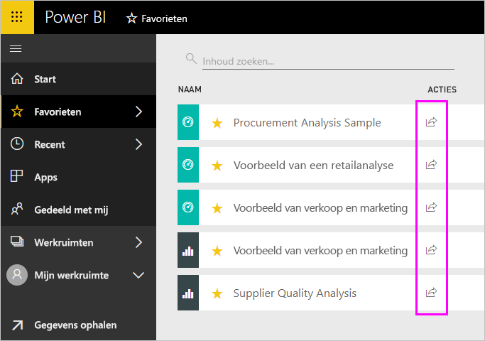
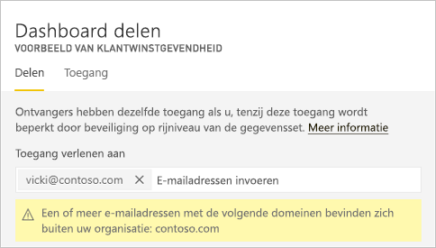
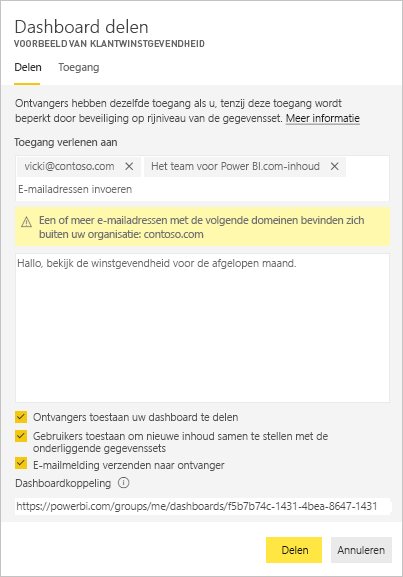
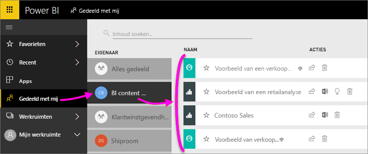
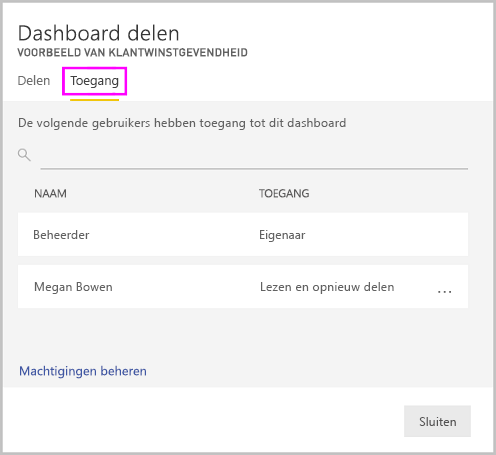
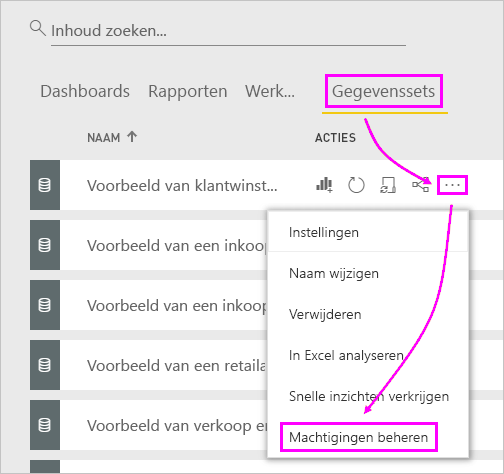
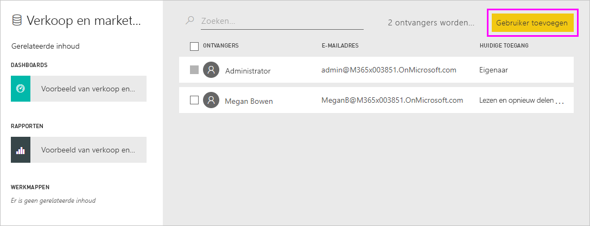
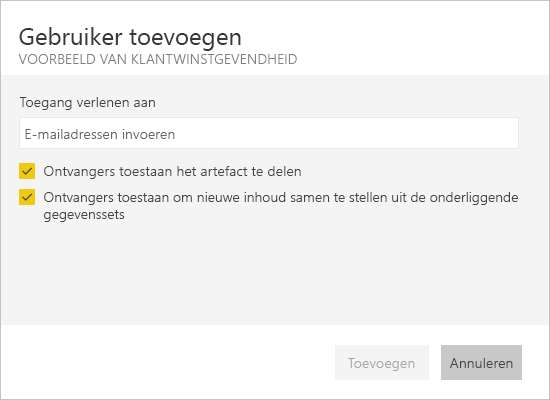

# Power BI-dashboards en -rapporten delen met collega's en anderen
*Delen* is een goede manier om enkele personen toegang te geven tot uw dashboards en rapporten. Power BI ondersteunt ook [verschillende andere manieren om samen te werken en uw dashboards en rapporten te distribueren](service-how-to-collaborate-distribute-dashboards-reports.md).

Als u inhoud wilt gaan delen, hebt u een [Power BI Pro-licentie](service-features-license-type.md) nodig, ongeacht of u inhoud binnen of buiten uw organisatie deelt. Uw ontvangers moeten ook Power BI Pro-licenties, tenzij de inhoud zich bevindt in een [Premium-capaciteit](service-premium-what-is.md). 

U kunt dashboards en rapporten vanaf de meeste plaatsen in de Power BI-service delen: Favorieten, Recent, gedeeld met mij (als de eigenaar het toestaat), mijn werkruimte of andere werkruimten. Wanneer u een dashboard of rapport deelt, kunnen de personen met wie u het deelt ernaar kijken en er interactie mee hebben, maar ze kunnen het niet bewerken. In het dashboard of rapport zien ze dezelfde gegevens als u, tenzij er [beveiliging op rijniveau](service-admin-rls.md) wordt toegepast. De collega's met wie u het dashboard of rapport deelt, kunnen het ook weer met hun collega's delen, maar alleen als u dat toestaat. De personen buiten uw organisatie kunnen ook bekijken en ermee aan het dashboard of rapport, maar niet delen. 

U kunt [een dashboard ook delen vanuit een van de mobiele apps van Power BI](consumer/mobile/mobile-share-dashboard-from-the-mobile-apps.md). U kunt dashboards van Power BI Desktop echter niet delen.

## Video: Een dashboard delen
Kijk hoe Amanda haar dashboard deelt met collega's binnen en buiten haar bedrijf. Gebruik vervolgens de stapsgewijze instructies onder de video om het zelf te proberen.

<iframe width="560" height="315" src="https://www.youtube.com/embed/0tUwn8DHo3s?list=PL1N57mwBHtN0JFoKSR0n-tBkUJHeMP2cP" frameborder="0" allowfullscreen></iframe>

## Een dashboard of rapport delen

1. Selecteer **Delen**  in een lijst met dashboards of rapporten, of in een geopend dashboard of rapport.

2. Typ in het bovenste vak het volledige e-mailadres voor afzonderlijke personen, distributiegroepen of beveiligingsgroepen. U kunt niet delen met dynamische distributielijsten. 
   
   U kunt delen met mensen met adressen buiten uw organisatie, maar u ziet dan wel een waarschuwing.
   
    
 
   >[!NOTE]
   >Het invoervak ondersteunt maximaal 100 gebruikers of groepen. Als u delen met grote aantallen gebruikers wilt, kunt u het dashboard in een werkruimte maken en [verdelen als een app](service-create-distribute-apps.md).
   > 
   > 

3. Typ desgewenst een bericht. Dit is niet verplicht.
4. Als collega's uw inhoud te delen met anderen, Controleer **ontvangers voor het delen van uw dashboard (of het rapport) toestaan**.
   
   Anderen toestaan om te delen, wordt *opnieuw delen* genoemd. Zij kunnen uw dashboard dan opnieuw delen vanuit de Power BI-service en de mobiele apps, of de e-mail met de uitnodiging doorsturen naar anderen in uw organisatie. De uitnodiging verloopt na één maand. Personen buiten uw organisatie kunnen niet opnieuw delen. Als eigenaar van de inhoud kunt u de mogelijkheid om de inhoud opnieuw te delen in het algemeen of alleen voor bepaalde personen uitschakelen. Zie [stoppen met delen of anderen in het delen van](#stop-sharing-or-stop-others-from-sharing).

5. Selecteer **Delen.**
   
     
   
   Power BI verzendt een e-mailuitnodiging naar personen, maar niet naar groepen, met een koppeling naar de gedeelde inhoud. U ziet de melding **Geslaagd**. 
   
   Wanneer ontvangers in uw organisatie op de koppeling klikken, wordt het dashboard of rapport door Power BI toegevoegd aan de lijstpagina **Gedeeld met mij** van die personen. Ze kunnen uw naam selecteren om alle inhoud te zien die u met hen hebt gedeeld. 
   
   
   
   Wanneer ontvangers buiten uw organisatie op de koppeling klikken, zien ze het dashboard of rapport, maar niet in de gebruikelijke Power BI-portal. Zie voor meer informatie, [een dashboard of rapport delen met personen buiten uw organisatie](#share-a-dashboard-or-report-with-people-outside-your-organization).

## Wie heeft er toegang tot een dashboard of rapport dat u hebt gedeeld?
Soms moet u de personen die u hebt gedeeld en zien met wie ze hebt gedeeld met zien:

1. Selecteer **Delen**  in de lijst met dashboards en rapporten of in het dashboard of rapport zelf. 
2. In de **dashboard delen** of **rapport delen** in het dialoogvenster, selecteer **toegang**.
   
    

    Personen buiten uw organisatie worden aangeduid als **Gast**.

## Het delen van inhoud stoppen of het delen van inhoud door anderen niet toestaan
Alleen de eigenaar van het dashboard of het rapport kan opnieuw delen in- en uitschakelen.

### Als u de uitnodiging nog niet hebt verzonden
* Schakel de **ontvangers voor het delen van uw dashboard (of het rapport) toestaan** selectievakje aan de onderkant van de uitnodiging voordat u deze verzendt.

### Als u het dashboard of rapport al hebt gedeeld
1. Selecteer **Delen**  in de lijst met dashboards en rapporten of in het dashboard of rapport zelf. 
2. In de **dashboard delen** of **rapport delen** in het dialoogvenster, selecteer **toegang**.
   
    
3. Selecteer het weglatingsteken ( **...** ) naast **Lezen en opnieuw delen** en selecteer:
   
   
   
   * **Lezen** om te voorkomen dat deze persoon met iemand anders deelt.
   * **Toegang verwijderen** om ervoor te zorgen dat die persoon de gedeelde inhoud helemaal niet meer ziet.

4. In de **toegang verwijderen** dialoogvenster vak, beslissen of u ook wilt verwijderen van toegang tot verwante inhoud, zoals rapporten en gegevenssets. Als u items met een waarschuwingspictogram verwijdert , is het beste ook verwante inhoud niet verwijderen omdat deze niet correct wordt weergegeven.

    

## Een dashboard of rapport delen met personen buiten uw organisatie
Wanneer u met personen buiten uw organisatie deelt, ontvangen ze een e-mail met een koppeling naar het gedeelde dashboard of rapport, die ze moeten zich aanmelden bij Power BI om te zien. Als ze geen licentie voor Power BI Pro hebben, kunnen ze er één aanvragen nadat ze op de koppeling hebben geklikt.

Nadat ze zich aanmelden, zien ze het gedeelde dashboard of rapport in een eigen browservenster, niet in hun gebruikelijke Power BI-portal. Voor later toegang tot dit dashboard of rapport, moeten zij de koppeling bladwijzer.

Ze kunnen geen inhoud van dit dashboard of rapport bewerken. Hoewel ze kunnen met de grafieken communiceren en filters of slicers wijzigen, opslaan ze hun wijzigingen niet. 

Alleen uw directe ontvangers kunnen het gedeelde dashboard of rapport zien. Als u bijvoorbeeld een uitnodiging stuurt naar Vicki@contoso.com, kan alleen Vicki het dashboard zien. Niemand anders ziet het dashboard, zelfs als ze de koppeling hebben. Vicki moet hetzelfde e-mailadres gebruiken voor toegang tot het; Als ze zich aanmeldt met een andere e-mailadres, heeft ze ook geen toegang tot het dashboard.

Personen buiten uw organisatie kan geen gegevens ziet als de rol - of beveiliging op rijniveau is geïmplementeerd op on-premises Analysis Services-modellen in tabelvorm.

Als u een koppeling vanuit een mobiele Power BI-app naar mensen buiten uw organisatie verzenden, de koppeling te klikken op het dashboard geopend in een browser, niet in de mobiele Power BI-app.

Als u [externe gastgebruikers ook kunnen bewerken en beheren van inhoud in de organisatie toestaan](service-admin-portal.md#export-and-sharing-settings), niet de standaard-ervaring voor alleen-verbruik op hen van toepassing. [Meer informatie](service-admin-azure-ad-b2b.md).

## Beperkingen en overwegingen
Houd rekening met de volgende zaken bij het delen van dashboards en rapporten:

* In het algemeen zien u en uw collega's dezelfde gegevens in het dashboard of rapport. Dus als u gemachtigd bent om meer gegevens te zien dan zij, kunnen zij al uw gegevens in het dashboard of rapport bekijken. Als er echter [beveiliging op rijniveau](service-admin-rls.md) wordt toegepast op de gegevensset van een dashboard of rapport, worden de referenties van elke persoon gebruikt om te bepalen welke gegevens ze mogen zien.
* Iedereen met wie u uw dashboard met deelt kan dit zien en ermee aan de gerelateerde rapporten in [leesweergave](consumer/end-user-reading-view.md#reading-view). Ze kunnen geen rapporten maken of wijzigingen in bestaande rapporten opslaan.
* Hoewel er kunt zien of downloaden van de gegevensset, hebben ze toegang tot de gegevensset rechtstreeks met behulp van de analyseren in Excel-functie. Een beheerder kan de mogelijkheid om te analyseren in Excel gebruiken voor iedereen in een groep beperken. De beperking is echter van toepassing op iedereen in deze groep, voor elke werkruimte waartoe de groep behoort.
* Iedereen kan [de gegevens handmatig vernieuwen](refresh-data.md).
* Als u Office 365 gebruikt voor e-mail, kunt u delen met leden van een distributiegroep door het e-mailadres in te voeren dat is gekoppeld aan de distributiegroep.
* Collega's met uw e-maildomein delen, en collega's met het domein verschillende maar geregistreerde binnen dezelfde tenant is, kunnen u het dashboard delen met anderen. Bijvoorbeeld, als de domeinen contoso.com en contoso2.com zijn geregistreerd in dezelfde tenant en uw e-mailadres is konrads@contoso.com, klikt u vervolgens beide ravali@contoso.com en gustav@contoso2.com kunt delen, zolang u toestemming heeft gegeven ze te delen.
* Als uw collega's al toegang tot een specifiek dashboard of rapport hebt, kunt u een directe koppeling verzenden door de URL kopiëren wanneer u zich in het dashboard of rapport. Bijvoorbeeld:`https://powerbi.com/dashboards/g12466b5-a452-4e55-8634-xxxxxxxxxxxx`
* Op dezelfde manier als uw collega's al toegang tot een specifiek dashboard hebt, kunt u [een directe koppeling sturen naar het onderliggende rapport](service-share-reports.md). 
* U kunt delen met maximaal 100 gebruikers of groepen in één share actie. U kunt echter meer dan 500 gebruikers toegang verlenen tot een item. Om dit te doen, meerdere keren delen door het opgeven van de gebruikers afzonderlijk of delen met een groep die alle gebruikers bevat.

## Problemen met delen oplossen

### De ontvangers van mijn dashboard zien een vergrendelingspictogram in een tegel of een bericht 'Machtiging is vereist'

De personen met wie u inhoud deelt zien mogelijk een vergrendelde tegel in een dashboard of het bericht 'Machtiging is vereist' wanneer ze proberen om een rapport weer te geven.

Als dit het geval is, moet u hen toestemming geven voor de onderliggende gegevensset:

1. Ga naar het tabblad **Gegevenssets** in de inhoudslijst.

1. Selecteer het weglatingsteken ( **...** ) naast de gegevensset, selecteert u vervolgens **machtigingen beheren**.

    

1. Selecteer **Gebruiker toevoegen**.

    

1. Typ het volledige e-mailadres voor afzonderlijke personen, distributiegroepen of beveiligingsgroepen. U kunt niet delen met dynamische distributielijsten.

    

1. Selecteer **Toevoegen**.

### Ik kan geen dashboards of rapporten delen

Als u wilt een dashboard of rapport delen, moet u de machtiging om te delen van de onderliggende inhoud; dat wil zeggen, verwante rapporten en gegevenssets. Als u een bericht dat u kunt geen delen ziet, vraagt u de auteur van het rapport te geven delen u machtiging voor deze rapporten en gegevenssets.

## Volgende stappen
* Wilt u feedback geven? Dit kan op de [site van de Power BI-community](https://community.powerbi.com/).
* [Hoe kan ik samenwerken aan dashboards en rapporten en deze delen?](service-how-to-collaborate-distribute-dashboards-reports.md)
* [Een gefilterd Power BI-rapport delen](service-share-reports.md).
* Vragen? [Misschien dat de Power BI-community het antwoord weet](http://community.powerbi.com/)

