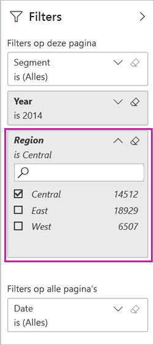
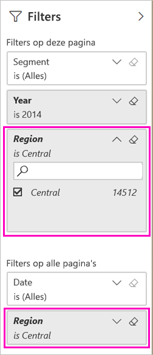

# Twee manieren om een gefilterd Power BI-rapport te delen
*Delen* is een goede manier om enkele personen toegang te geven tot uw dashboards en rapporten. Wat gebeurt er als u een gefilterde versie van een rapport wilt delen? Dit kan bijvoorbeeld een rapport zijn dat alleen gegevens weergeeft voor een specifieke stad of verkoper of jaar. Probeer een rapport te filteren en te delen of een aangepaste URL te maken. Het rapport wordt gefilterd zodra een ontvanger dit voor de eerste keer opent. Ze kunnen het filter verwijderen door de URL aan te passen. 

Power BI ondersteunt ook [andere manieren om samen te werken en rapporten te distribueren](service-how-to-collaborate-distribute-dashboards-reports.md). Als u wilt gaan delen, moeten u en de ontvangers een [Power BI Pro licentie](service-features-license-type.md) hebben, of de inhoud moet zich in een [Premium-capaciteit](service-premium-what-is.md) bevinden. 

## Twee manieren om een rapport te filteren

Voor beide filtertechnieken wordt de voorbeeldsjabloon-app Marketing en Sales gebruikt. Wilt u het proberen? U kunt ook de [voorbeeldsjabloon-app Marketing en Sales](https://appsource.microsoft.com/product/power-bi/microsoft-retail-analysis-sample.salesandmarketingsample?tab=Overview) installeren.

### Filter instellen

Open een rapport in de [bewerkingsweergave](consumer/end-user-reading-view.md) en pas een filter toe.

In dit voorbeeld filteren we de pagina JTD-categorie van de voorbeeldsjabloon-app Marketing en Sales, zodat alleen waarden worden weergegeven waarbij **Regio** gelijk is aan **Centraal**. 
 

Sla het rapport op.

### Een filter in de URL maken

Wanneer u het filter aan het einde van de URL van de rapportpagina toevoegt, is het gedrag iets anders. De gefilterde pagina ziet er hetzelfde uit. Power BI voegt het filter echter toe aan het hele rapport en verwijdert de andere waarden uit het filtervenster.  

Voeg het volgende toe aan het einde van de URL van de rapportpagina:
   
    ?filter=*tablename*/*fieldname* eq *value*
   
Het veld moet van het type getal, datum/tijd of reeks zijn. De waarden *tablename* of *fieldname* mogen geen spaties bevatten.
   
In ons voorbeeld is de naam van de tabel **Geo**, de naam van het veld **Regio** en de waarde waarop we willen filteren is **Centraal**:
   
    ?filter=Geo/Region eq 'Central'

De browser voegt speciale tekens toe om slashes, spaties en apostrofs weer te geven, zodat het uiteindelijke resultaat weergegeven wordt als:
   
    app.powerbi.com/groups/xxxx/reports/xxxx/ReportSection4d00c3887644123e310e?filter=Geo~2FRegion%20eq%20'Central'

Sla het rapport op.

Zie het artikel [Een rapport filteren door queryreeksparameters in de URL te gebruiken](service-url-filters.md) voor meer informatie.

## Het gefilterde rapport delen

1. Als u [het rapport deelt](service-share-dashboards.md), schakelt u het selectievakje **E-mailmelding verzenden naar ontvanger** uit.

    

4. Verzend de koppeling met het filter dat u eerder hebt gemaakt.

## Volgende stappen
* [Manieren om uw werk te delen in Power BI](service-how-to-collaborate-distribute-dashboards-reports.md)
* [Een dashboard delen](service-share-dashboards.md)
* Nog vragen? [Misschien dat de Power BI-community het antwoord weet](http://community.powerbi.com/).
* Wilt u feedback geven? Dit kan op de [site van de Power BI-community](https://community.powerbi.com/).

