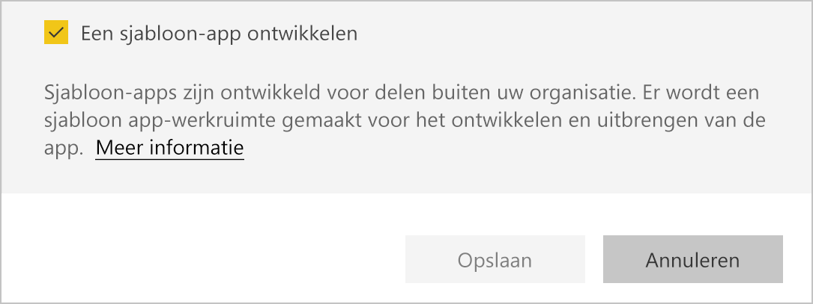
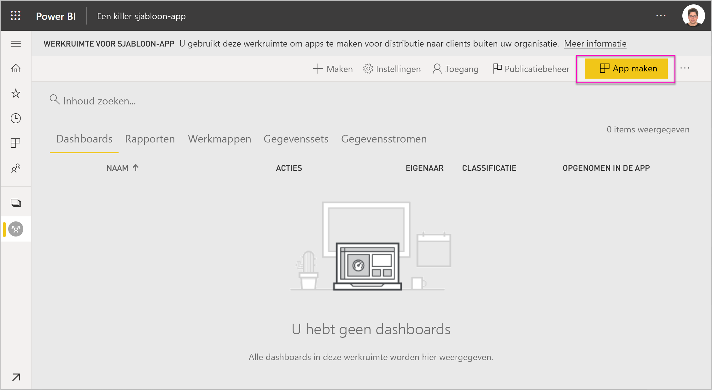
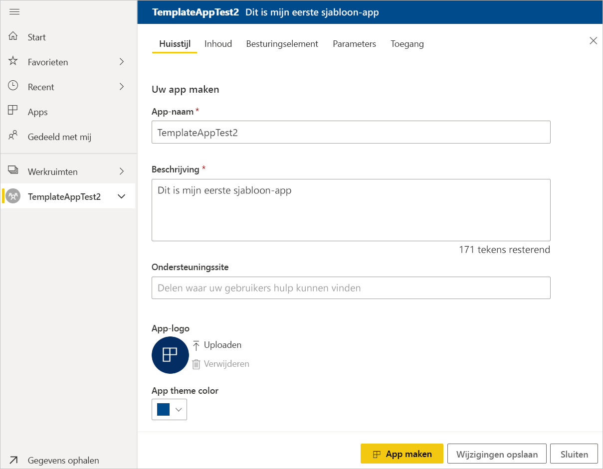
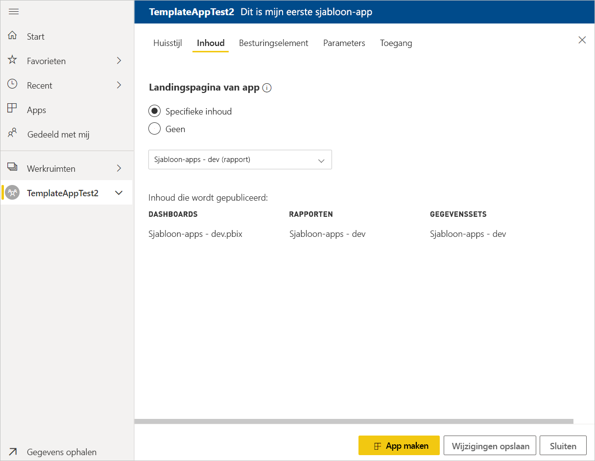
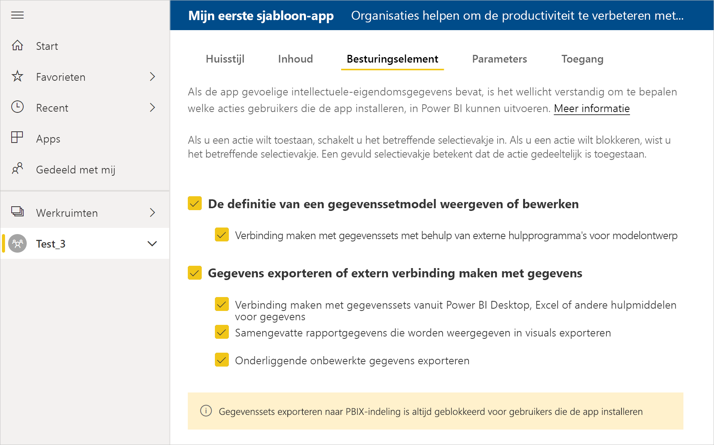
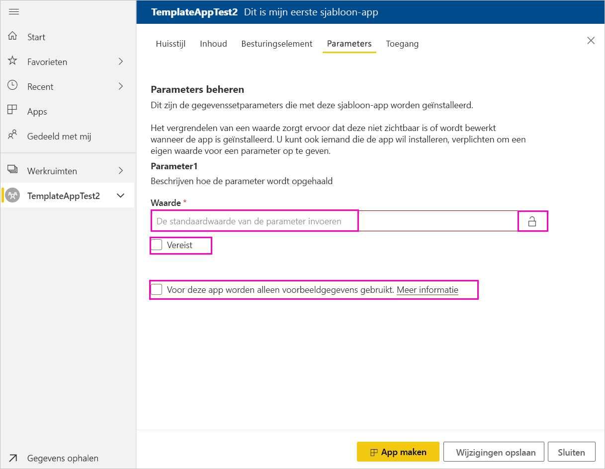
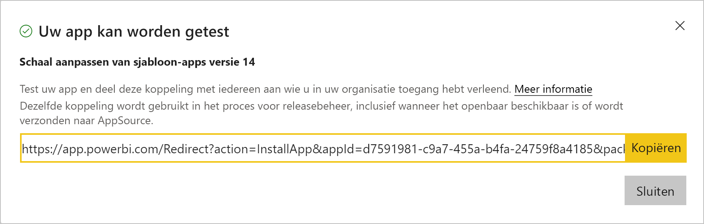
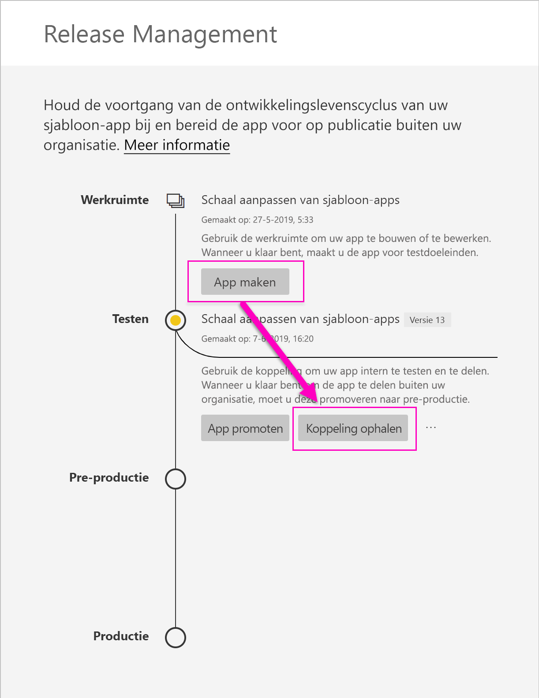
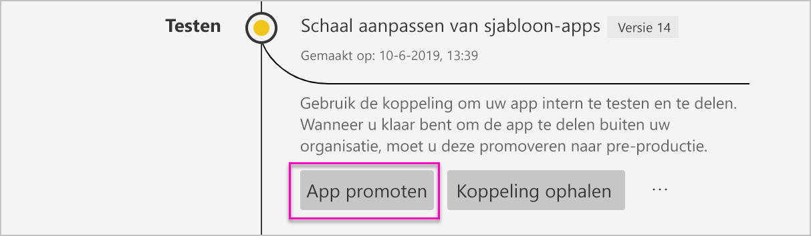
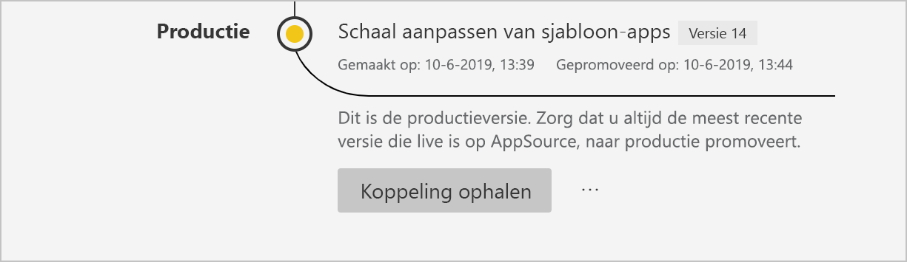

# Een sjabloon-app maken in Power BI (preview-versie)

Met de nieuwe Power BI-*sjabloon-apps* kunnen Power BI-partners Power BI-apps maken met weinig of geen code en deze implementeren naar elke Power BI-klant.  Dit artikel bevat stapsgewijze instructies voor het maken van een Power BI-sjabloon-app.

Als u Power BI-rapporten en -dashboards kunt maken, kunt u een *sjabloon-app-bouwer* worden die analytische inhoud maakt en verpakt in een *app*. Vervolgens kunt u uw app implementeren naar andere Power BI-tenants via elk beschikbaar platform, zoals AppSource, of de app gebruiken in uw eigen webservice. Als maker hebt u de mogelijkheid om een beveiligd analysepakket voor distributie te maken.

Power BI-tenantbeheerders beheren en bepalen wie er binnen hun organisatie sjabloon-apps kan maken en wie deze kan installeren. Gemachtigde gebruikers kunnen uw sjabloon-app installeren en deze vervolgens wijzigen en distribueren naar de Power BI-gebruikers in hun organisatie.

## Vereisten

Dit zijn de vereisten voor het bouwen van een sjabloon-app:  

- Een [Power BI Pro-licentie](service-self-service-signup-for-power-bi.md)
- De [installatie van Power BI Desktop](desktop-get-the-desktop.md) (optioneel)
- Vertrouwd zijn met de [basisconcepten van Power BI](service-basic-concepts.md)
- Machtigingen voor het maken van een sjabloon-app. Zie de Power BI-[beheerderportal en Instellingen voor sjabloon-apps](service-admin-portal.md#template-apps-settings-preview) voor meer informatie.

## Modus voor app-ontwikkelaars inschakelen

Voor het maken van een sjabloon-app die u naar andere Power BI-tenants kunt distribueren, moet u zich in de modus voor app-ontwikkelaars bevinden. Anders maakt u alleen een app voor Power BI-gebruikers in uw eigen organisatie.

1. Open de Power BI-service in een browser.
2. Ga naar **Instellingen** > **Algemeen** > **Ontwikkelaar** > **Ontwikkelingsmodus voor sjabloon-apps inschakelen**.

    

    Als u deze optie niet ziet, neemt u contact op met uw Power BI-beheerder om u [machtigingen voor de ontwikkeling van sjabloon-apps](service-admin-portal.md#template-apps-settings-preview) te verlenen in de beheerportal.

3. Selecteer **Toepassen**.

## De werkruimte voor sjabloon-apps maken

Voor het maken van een sjabloon-app die u naar andere Power BI-tenants kunt distribueren, moet u de app in een van de nieuwe app-werkruimten maken.

1. In de Power BI-service selecteert u **Werkruimten** > **App-werkruimte maken**.

    

2. Selecteer in **Een app-werkruimte maken** in **Voorbeeld weergeven van verbeterde werkruimten** de optie **Nu proberen**.

    

3. Voer een naam, beschrijving (optioneel) en logoafbeelding (optioneel) voor uw app-werkruimte in.

4. Selecteer **Een sjabloon-app ontwikkelen**.

    

5. Selecteer **Opslaan**.
>[!NOTE]
>U hebt machtigingen van uw Power BI-beheerder nodig om het niveau van sjabloon-apps te verhogen.

## De inhoud van uw sjabloon-app maken

Net als bij een normale Power BI-app-werkruimte is de volgende stap het maken van de inhoud in de werkruimte.  In deze preview-versie van sjabloon-apps, wordt slechts één van elk type ondersteund: één gegevensset, één rapport en één dashboard.

- [Maak uw Power BI-inhoud](power-bi-creator-landing.md) in uw app-werkruimte.

Als u parameters in Power Query gebruikt, moet u ervoor zorgen dat deze een goed gedefinieerd type (bijvoorbeeld Text) hebben. De typen Any en Binary worden niet ondersteund.

[Tips voor het ontwerpen van sjabloon-apps in Power BI (preview)](service-template-apps-tips.md) bevat suggesties die u kunt overwegen bij het maken van rapporten en dashboards voor uw app-sjabloon.

## De testsjabloon-app maken

Nu u inhoud in uw werkruimte hebt, kunt u deze verpakken in een sjabloonapp. De eerste stap is het maken van een testsjabloon-app, die alleen toegankelijk is binnen uw organisatie op uw tenant.

1. Selecteer **App maken** in de werkruimte van de sjabloon-app.

    

    Hier kunt u aanvullende bouwopties invullen voor uw sjabloon-app in vijf categorieën:

    **Huisstijl**

    
    - App-naam
    - Beschrijving
    - Ondersteuningssite (koppeling staat onder de app-gegevens nadat de sjabloon-app als organisatie-app is gedistribueerd)
    - App-logo (bestandsgrootte van maximaal 45K, hoogte-breedteverhouding van 1:1, in de indeling .png, .jpg of .jpeg)
    - App-themakleur

    **Inhoud**

    **Landingspagina van app:** hier kunt u definiëren dat een rapport of dashboard de landingspagina van uw app is. Gebruik een landingspagina die de juiste indruk wekt:

    

    **Besturingselement**

    Stel limieten en beperkingen in voor de inhoud van uw app voor de gebruikers van uw app. Met dit besturingselement kunt u intellectueel eigendom in uw app beveiligen.

    

    >[!NOTE]
    >Elementen exporteren naar de .pbix-indeling wordt altijd geblokkeerd voor gebruikers die de app installeren.

    **Parameters**

    Gebruik deze categorie om het gedrag van parameters te beheren wanneer er verbinding wordt gemaakt met gegevensbronnen. Meer informatie over het [maken van queryparameters](https://powerbi.microsoft.com/blog/deep-dive-into-query-parameters-and-power-bi-templates/).

    
    - **Waarde**: de standaardwaarde voor de parameter.
    - **Vereist**: gebruik deze optie als u wilt dat via het installatieprogramma een gebruikersspecifieke parameter wordt ingevoerd.
    - **Vergrendelen**: door parameters te vergrendelen, kunnen deze niet door het installatieprogramma worden bijgewerkt.
    - **Statisch**: schakel deze optie in indien de app *uitsluitend* voorbeeldgegevens bevat. Wanneer u **Statisch** selecteert, worden gebruikers niet in de installatiewizard gevraagd om een verbinding met een gegevensbron te maken.

    **Toegang**: in de testfase bepaalt u welke andere gebruikers in uw organisatie uw app kunnen installeren en testen. Maak u geen zorgen; u kunt altijd later terugkeren en deze instellingen wijzigen (instellen heeft geen invloed op de toegang tot de gedistribueerde sjabloon-app).

2. Selecteer **App maken**.

    U ziet een bericht dat de test-app gereed is, met daarin een koppeling om de app te kopiëren en te delen met de testers van uw app.

    

    U hebt ook de eerste stap van het publicatiebeheerproces uitgevoerd, dat hieronder wordt uiteengezet.

## De publicatie van de sjabloon-app beheren

Voordat u deze sjabloon-app openbaar maakt, moet u controleren of de app helemaal klaar is voor gebruik. Power BI heeft een deelvenster voor publicatiebeheer gemaakt, waarin u het volledige publicatiepad van de app kunt volgen en controleren. U kunt de overgang ook per fase activeren. Dit zijn de algemene fasen:

- Test-app genereren: de app alleen in uw organisatie testen.
- Het testpakket promoveren naar de preproductiefase: de app buiten uw organisatie testen.
- Het preproductiepakket promoveren naar productie: productieversie.
- Een pakket verwijderen of opnieuw beginnen vanaf de vorige fase.

Als u tussen de releasefasen wisselt, wordt de URL niet gewijzigd. Niveauverhoging heeft geen invloed op de URL zelf.

De verschillende fasen worden hieronder besproken:

1. Selecteer **Publicatiebeheer** in de werkruimte van de sjabloon-app.

    

2. Selecteer **App maken**.

    Als u de test-app hebt gemaakt in het gedeelte **De testsjabloon-app maken** hierboven, is de gele stip naast **Testen** al gevuld en hoeft u **App maken** hier niet te selecteren. Als u App maken wel selecteert, gaat u terug naar het proces voor het maken van de sjabloon-app.

3. Selecteer **Koppeling ophalen**.

    

4. Als u de installatie van de app wilt testen, kopieert u de koppeling in het meldingenvenster en plakt u deze in een nieuw browservenster.

    Vanaf hier volgt u dezelfde procedure als uw klanten. Zie [Install and distribute template apps in your organization](service-template-apps-install-distribute.md) (Sjabloon-apps in uw organisatie installeren en distribueren) voor hun versie.

5. Selecteer **Installeren** in het dialoogvenster.

    Wanneer de installatie is geslaagd, ziet u een melding dat de nieuwe app gereed is.

6. Selecteer **Naar de app**.
7. In **Aan de slag met uw nieuwe app** ziet u uw app zoals uw klanten deze ook zullen zien.

    
8. Selecteer **App verkennen** om de test-app te controleren met de voorbeeldgegevens.
9. Als u wijzigingen wilt aanbrengen, gaat u terug naar de app in de oorspronkelijke werkruimte. Werk de test-app bij totdat u helemaal tevreden bent.
10. Als u klaar bent om het niveau van de app te verhogen naar de preproductiefase waarin de app buiten uw tenant wordt getest, gaat u terug naar het deelvenster **Publicatiebeheer** en selecteert u **App promoveren**. 

    

    >[!NOTE]
    > Zodra het niveau van de app is verhoogd, wordt deze openbaar beschikbaar buiten uw eigen organisatie.

11. Selecteer **Niveau verhogen** om uw keuze te bevestigen.
12. Kopieer deze nieuwe URL om de app buiten uw tenant te testen. Dit is ook de koppeling die u verzendt voor de distributie van uw app op AppSource door een [nieuwe Cloud Partner-portalaanbieding](https://docs.microsoft.com/azure/marketplace/cloud-partner-portal/power-bi/cpp-publish-offer) te maken. Verzend alleen preproductiekoppelingen naar de Cloud Partner-portal. Pas zodra de app is goedgekeurd en u een melding krijgt dat uw app in AppSource is gepubliceerd, kunt u dit pakket naar productie in Power BI promoveren.
13. Wanneer uw app gereed is voor productie of kan worden gedeeld via AppSource, gaat u terug naar het deelvenster **Publicatiebeheer** en selecteert u **App promoten** naast **Vóór productie**.
14. Selecteer **Niveau verhogen** om uw keuze te bevestigen.

    Uw app is nu in productie en gereed voor distributie.

    

Als u uw app algemeen beschikbaar wilt stellen voor duizenden Power BI-gebruikers wereldwijd, raden we u aan de app te verzenden naar AppSource. Zie de [aanbieding voor Power BI-toepassing](https://docs.microsoft.com/azure/marketplace/cloud-partner-portal/power-bi/cpp-power-bi-offer) voor meer informatie.

## Uw app bijwerken

Nu uw app in productie is, kunt u opnieuw beginnen in de testfase, zonder de app in productie te onderbreken.

1. Selecteer **App maken** in het deelvenster **Publicatiebeheer**.
2. Ga terug via het proces voor het maken van een app.
3. Nadat u **Huisstijl**, **Inhoud**, **Besturingselement** en **Toegang** hebt ingesteld, selecteert u **App maken** opnieuw.
4. Selecteer **Sluiten** en ga terug naar **Publicatiebeheer**.

   U hebt nu twee versies: De versie in productie en een nieuwe versie in de testfase.

    

5. Als u klaar bent om de app te promoveren naar de preproductiefase waarin de app buiten uw tenant wordt getest, gaat u terug naar het deelvenster Publicatiebeheer en selecteert u **App promoveren** naast **Testen**.
6. Uw koppeling is nu live. Dien de app nogmaals in bij de Cloud Partner-portal volgens de stappen bij [Update voor Power BI-app-aanbieding](https://docs.microsoft.com/azure/marketplace/cloud-partner-portal/power-bi/cpp-update-existing-offer).

>[!NOTE]
>Promoveer uw app pas naar de productiefase wanneer de app door de Cloud Partner-portal is goedgekeurd en u de app hebt gepubliceerd.

## Volgende stappen

Zie hoe uw klanten werken met uw sjabloon-app in [Install, customize, and distribute template apps in your organization](service-template-apps-install-distribute.md) (Sjabloon-apps in uw organisatie installeren, aanpassen en distribueren).

Zie de [aanbieding voor Power BI-toepassing](https://docs.microsoft.com/azure/marketplace/cloud-partner-portal/power-bi/cpp-power-bi-offer) voor meer informatie over het distribueren van uw app.
