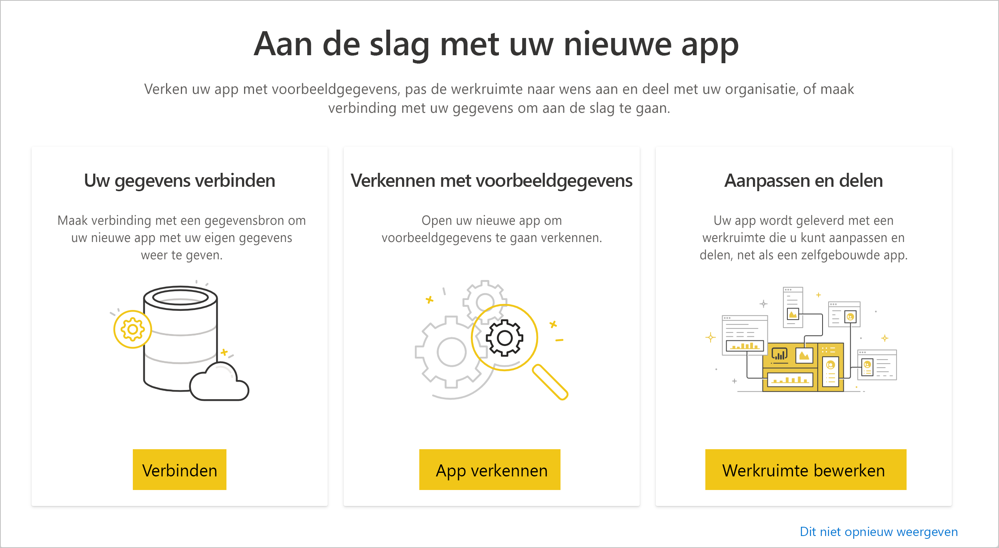
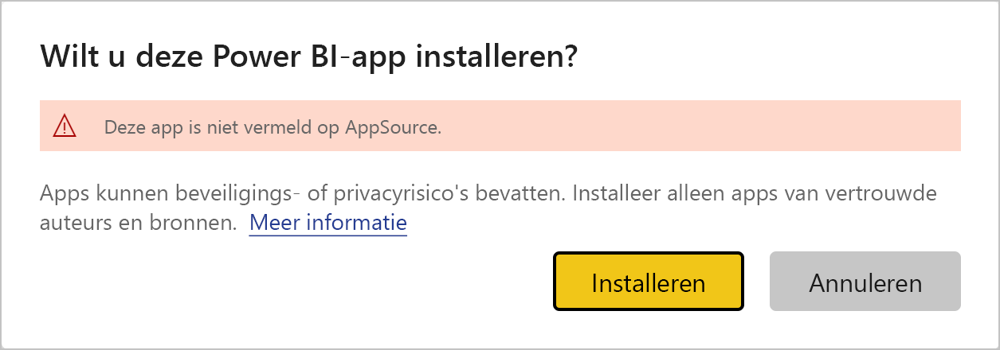
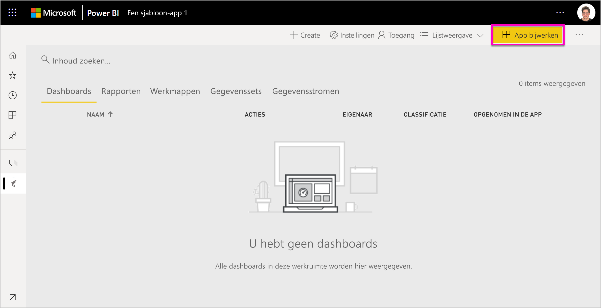
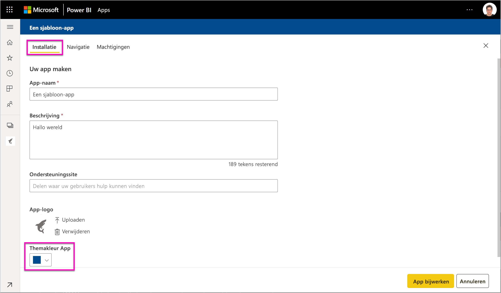
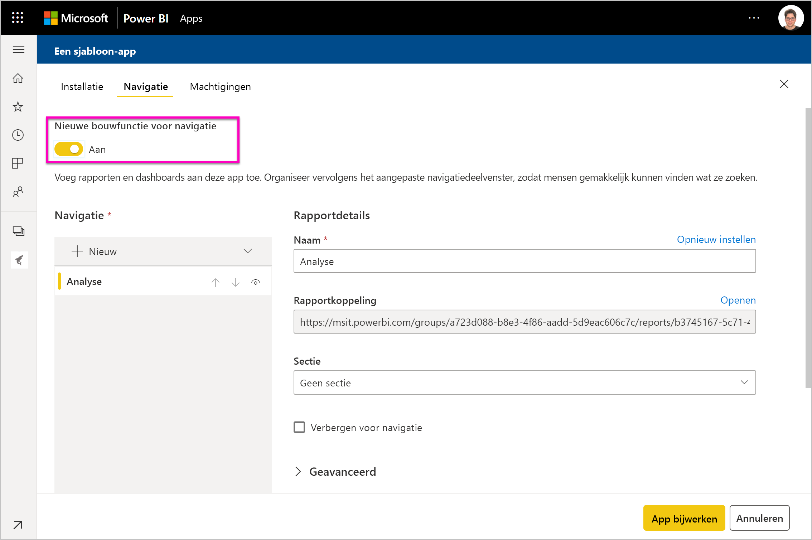

# Sjabloon-apps in uw organisatie installeren en distribueren - Power BI

Bent u een Power BI-analist? In dat geval leest u in dit artikel hoe u *sjabloon-apps* installeert om in verbinding te komen met de vele services waarmee u uw bedrijfsactiviteiten uitvoert, zoals Salesforce, Microsoft Dynamics en Google Analytics. U kunt het dashboard en de rapporten aanpassen om aan de behoeften van uw organisatie te voldoen en deze vervolgens als *app* naar uw collega's distribueren. 

Zie [Een sjabloon-app maken in Power BI](service-template-apps-create.md) als u meer wilt weten over het maken van sjabloon-apps die u zelf kunt distribueren. Power BI-partners kunnen Power BI-apps bouwen met weinig of geen code en deze implementeren naar Power BI-klanten. 

## Vereisten  

Dit zijn de vereisten voor het installeren, aanpassen en distribueren van een sjabloon-app: 

- Een [Power BI Pro-licentie](service-self-service-signup-for-power-bi.md)
- Vertrouwd zijn met de [basisconcepten van Power BI](service-basic-concepts.md)
- Een geldige koppeling voor de installatie van de maker van de sjabloon-app of AppSource. 
- Machtigingen voor het installeren van sjabloon-apps. 

## Een sjabloon-app installeren

U ontvangt mogelijk een koppeling naar een sjabloon-app. Als dit niet het geval is, kunt u in AppSource zoeken naar een sjabloon-app waarin u bent geïnteresseerd. Nadat u de sjabloon-app hebt geïnstalleerd, kunt u deze wijzigen en naar uw eigen organisatie distribueren.

### In AppSource zoeken vanuit een browser

Selecteer in een browser deze koppeling om AppSource te openen, waarbij is gefilterd op Power BI-apps:

- https://appsource.microsoft.com/marketplace/apps?product=power-bi

### In AppSource zoeken vanuit de Power BI-service

1. Selecteer in de Power BI-service in het navigatiedeelvenster aan de linkerkant **Apps** > **Apps ophalen**.

    

2. Selecteer in AppSource **Apps**.

    

3. Blader of zoek de app en selecteer vervolgens **Nu downloaden**.

4. Selecteer **Installeren** in het dialoogvenster.

     Als u een Power BI Pro-licentie hebt, wordt de app geïnstalleerd met de bijbehorende app-werkruimte. U past de app aan in de bijbehorende werkruimte.

    Wanneer de installatie is geslaagd, ziet u een melding dat uw nieuwe app gereed is.
4. Selecteer **Naar de app**.
5. Selecteer in **Aan de slag met uw nieuwe app**  een van de volgende drie opties:

    

    - **App verkennen**: De voorbeeldgegevens verkennen. Begin hier om het uiterlijk en de werking van de app te zien. 
    - **Verbinding maken met gegevens**: Vervang de gegevensbron van de voorbeeldgegevens door uw eigen gegevensbron. U kunt de parameters van de gegevensset en de referenties van de gegevensbron opnieuw definiëren. Zie [Bekende beperkingen](service-template-apps-tips.md#known-limitations) in het artikel met tips voor sjabloon-apps. 
    - **Naar de werkruimte** (meest geavanceerde optie): u kunt wijzigingen aanbrengen die door de ontwikkelaar van de app zijn toegestaan.

    U kunt dit dialoogvenster ook overslaan en direct de bijbehorende werkruimte openen via **Werkruimten** in het navigatiedeelvenster aan de linkerkant.
    >[!NOTE]
    >Door een sjabloon-app te installeren, worden ook een *organisatie-app* en een *app-werkruimte* geïnstalleerd. Lees meer over [het distribueren van apps in Power BI](service-create-distribute-apps.md).
 
6. Voordat u de app met uw collega's deelt, kunt u verbinding maken met uw eigen gegevens. U kunt ook het rapport of dashboard wijzigen, zodat dit geschikt is voor uw organisatie. Ook kunt u hier andere rapporten of dashboards toevoegen.

   Als u een installatiekoppeling selecteert voor een app die niet in AppSource is vermeld, wordt het dialoogvenster voor validatie weergegeven waarin u uw keuze moet bevestigen.

   

   >[!NOTE]
   >Als u sjabloon-apps wilt installeren die niet in AppSource is vermeld, moet u machtigingen aanvragen bij uw beheerder. Zie de Power BI-[beheerderportal en Instellingen voor sjabloon-apps](service-admin-portal.md#template-apps-settings) voor meer informatie.

## De app aanpassen en publiceren

Nadat u de app voor uw organisatie hebt bijgewerkt, kunt u de app publiceren. De stappen hiervoor zijn dezelfde als voor het publiceren van andere apps.

1. Wanneer u klaar bent met het aanpassen van de app, selecteert u **App bijwerken** in de rechterbovenhoek in de lijstweergave van de werkruimte.  

    

2. In **Details** kunt u de beschrijving en achtergrondkleur wijzigen.

   

3. In **Navigatie** kunt u de nieuwe opbouwfunctie voor navigatie gebruiken voor uw app of het dashboard of het rapport selecteren voor de landingspagina. Zie [De navigatie-ervaring ontwerpen](service-create-distribute-apps.md#design-the-navigation-experience) voor meer informatie.

   

4. In **Toegang** geeft u toegang aan geselecteerde gebruikers of aan de hele organisatie.  

   

5. Selecteer **App bijwerken**. 

6. Nadat de app is gepubliceerd, kunt u de koppeling kopiëren en delen met degenen die u toegang hebt gegeven. Als u de app met hen hebt gedeeld, zien zij de app ook op het tabblad **Mijn organisatie** in AppSource.

## Een sjabloon-app bijwerken

Makers van sjabloon-app kunnen nieuwe versies van hun sjabloon-apps vrijgeven via AppSource of een directe koppeling. Wanneer er een nieuwe versie beschikbaar is, kunt u de sjabloon-app bijwerken wanneer u de app opnieuw installeert met dezelfde of een nieuwere versie.

  >[!NOTE]
  >Als u een nieuwe versie installeert, worden alle wijzigingen die u in de rapporten en dashboards hebt aangebracht, overschreven. Om uw bijgewerkte rapporten en dashboards te bewaren, kunt u ze met een andere naam of op een andere locatie voordat u gaat installeren.

- **Een bestaande versie overschrijven:** hiermee wordt de bestaande werkruimte overschreven met de bijgewerkte versie van de sjabloon-app.

   

- **Installeren in een nieuwe werkruimte:** hiermee installeert u een nieuwe versie van de werkruimte en app die u moet opnieuw configureren.

### Gedrag voor overschrijven

* Bij het overschrijven worden de rapporten, de dashboards en de gegevensset in de *werkruimte* bijgewerkt en niet de app zelf. Wanneer u overschrijft, worden de navigatie van de app, de instellingen en de machtigingen niet gewijzigd.
* Nadat u de werkruimte hebt bijgewerkt, moet u *de app bijwerken* om wijzigingen voor de werkruimte toe te passen in de organisatie-app.
* Bij het overschrijven blijven geconfigureerde parameters en verificatie behouden. Na de update wordt automatisch gestart met het vernieuwen van de gegevensset. Tijdens dit proces bieden de organisatie-app, de rapporten en de dashboard een ervaring met *voorbeeldgegevens*.
  
* Tijdens het overschrijven worden er altijd voorbeeldgegevens weergegeven tot het vernieuwen is voltooid. Als de auteur van de sjabloon-app wijzigingen heeft aangebracht aan de gegevensset of parameters, blijven gebruikers van de werkruimte en app de ervaring met *voorbeeldgegevens* zien.
* Als u overschrijft, worden nooit *nieuwe* rapporten en dashboards die u hebt toegevoegd aan de werkruimte overschreven. De oorspronkelijke rapporten en dashboards worden overschreven met wijzigingen van de oorspronkelijke auteur.

>[!IMPORTANT]
>Vergeet niet om [de app bij te werken](#customize-and-publish-the-app) na het overschrijven, om wijzigingen aan te brengen in de rapporten en dashboards voor de gebruikers van de organisatie-app.

## Volgende stappen

[Werkruimten maken met uw collega's in Power BI](service-create-workspaces.md)
