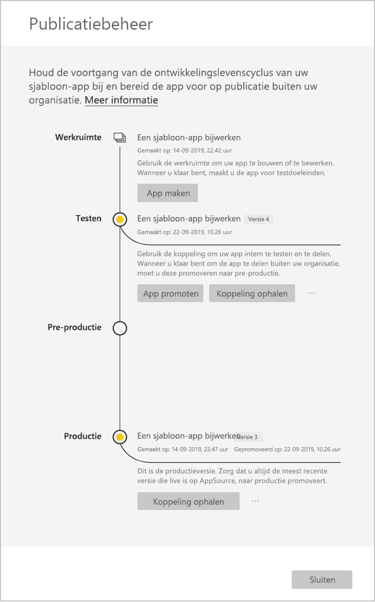

# Een sjabloon-app bijwerken, verwijderen en ophalen

Nu uw app in productie is, kunt u opnieuw beginnen in de testfase, zonder de app in productie te onderbreken.
## Uw app bijwerken

1. Selecteer **App maken** in het deelvenster **Publicatiebeheer**.
2. Ga terug via het proces voor het maken van een app.
3. Nadat u **Huisstijl**, **Inhoud**, **Besturingselement** en **Toegang** hebt ingesteld, selecteert u **App maken** opnieuw.
4. Selecteer **Sluiten** en ga terug naar **Publicatiebeheer**.

   U hebt nu twee versies: De versie in productie en een nieuwe versie in de testfase.

    

5. Als u klaar bent om de app te promoveren naar de preproductiefase waarin de app buiten de tenant wordt getest, gaat u terug naar het deelvenster Publicatiebeheer en selecteert u **App promoveren** naast **Testen**.
6. De koppeling is nu live. Dien de app nogmaals in bij de Cloud Partner-portal door de stappen te volgen bij de [Update voor Power BI-app-aanbieding](https://docs.microsoft.com/azure/marketplace/cloud-partner-portal/power-bi/cpp-update-existing-offer).
7. U moet de aanbieding opnieuw **publiceren** in CPP en deze nogmaals laten valideren.

>[!NOTE]
>Promoveer uw app pas naar de productiefase wanneer de app in de Cloud Partner-portal is goedgekeurd en u de app hebt gepubliceerd.

## Werkruimte extraheren
Terugschakelen naar de vorige versie van een sjabloon-app is nu gemakkelijker dan ooit met de mogelijkheid voor extraheren. Met de volgende stappen wordt een specifieke app-versie in verschillende releasestadia geëxtraheerd naar een nieuwe werkruimte:

1. Druk in het deelvenster Publicatiebeheer op **(...)** en vervolgens op **Extraheren**.

     
2. Voer in het dialoogvenster de naam voor de geëxtraheerde werkruimte in. er wordt een nieuwe werkruimte toegevoegd.

Versiebeheer voor uw nieuwe werkruimte wordt opnieuw ingesteld en u kunt doorgaan met het ontwikkelen en distribueren van de sjabloon-app vanuit de onlangs geëxtraheerde werkruimte.

## Versie van sjabloon-app verwijderen
Een werkruimte voor de sjabloon-app is de bron van een actief gedistribueerde sjabloon-app. Ter bescherming van de gebruikers van de sjabloon-app is het niet mogelijk om een werkruimte te verwijderen zonder eerst alle gemaakt app-versies in de werkruimte te verwijderen.
Als u een app-versie verwijdert, wordt de app-URL ook verwijderd en werkt deze niet meer.

1. Selecteer in het deelvenster Publicatiebeheer het beletselteken **(...)** en vervolgens **Verwijderen**.
 
  

>[!NOTE]
>Zorg ervoor dat u niet de app-versie verwijdert die wordt gebruikt door klanten of **AppSource**, anders werkt deze niet meer.

## Volgende stappen

Zie hoe uw klanten werken met uw sjabloon-app in [Install, customize, and distribute template apps in your organization](service-template-apps-install-distribute.md) (Sjabloon-apps in uw organisatie installeren, aanpassen en distribueren).

Zie de [aanbieding voor Power BI-toepassing](https://docs.microsoft.com/azure/marketplace/cloud-partner-portal/power-bi/cpp-power-bi-offer) voor meer informatie over het distribueren van uw app.
