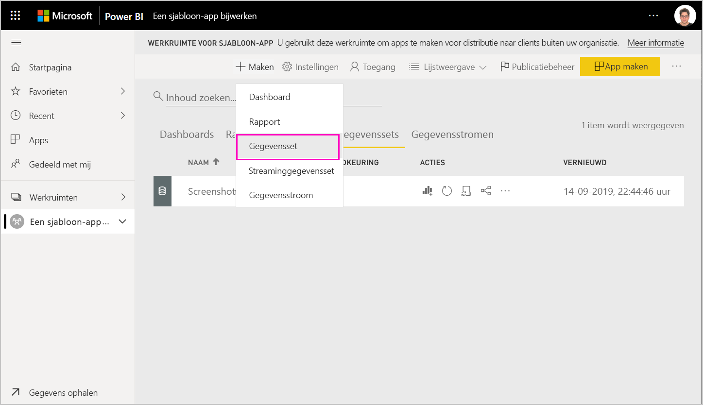
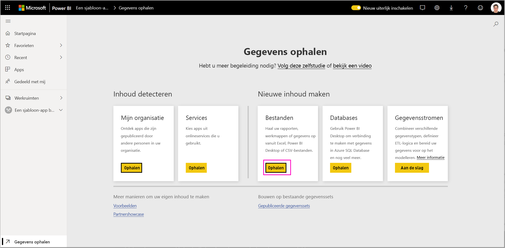
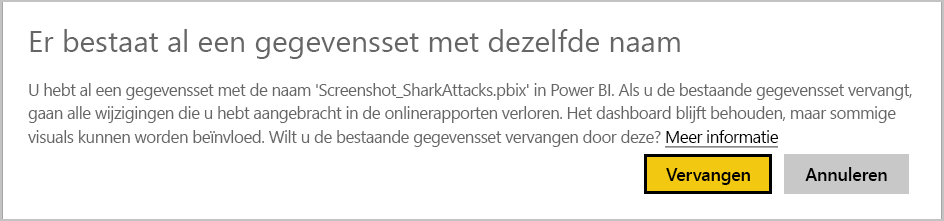
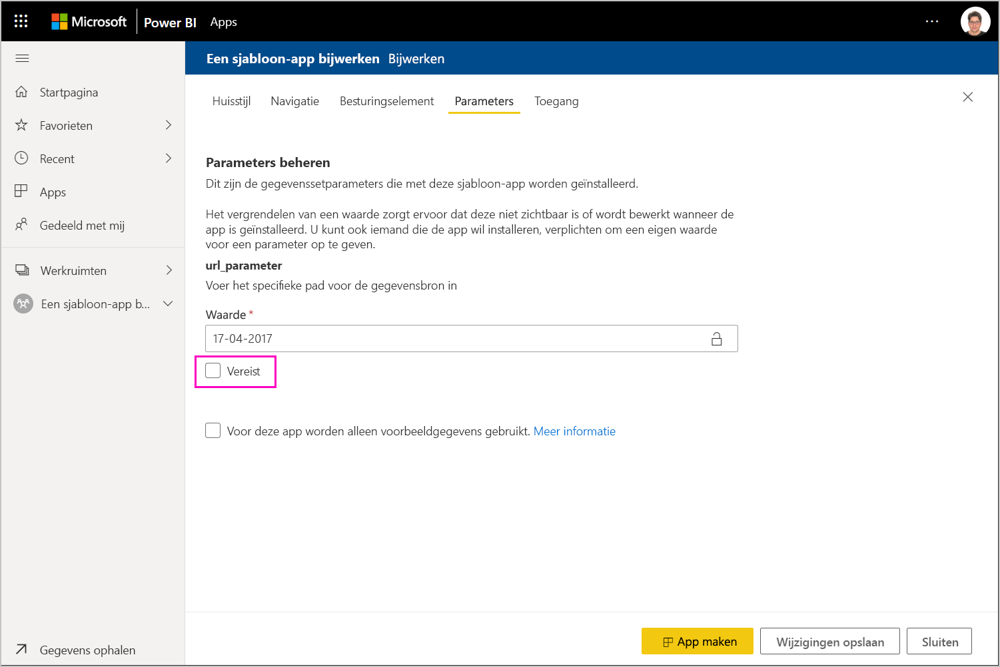

# Een sjabloon-app bijwerken, verwijderen en ophalen

Nu uw app in productie is, kunt u opnieuw beginnen in de testfase, zonder de app in productie te onderbreken.
## Uw app bijwerken

Als u wijzigingen in Power BI Desktop hebt aangebracht, begint u bij stap (1). Als u geen wijzigingen in Power BI Desktop hebt aangebracht, begint u bij stap (4).

1. Upload de bijgewerkte gegevensset en overschrijf de bestaande gegevensset. **Zorg ervoor dat u exact dezelfde naam gebruikt voor de gegevensset**. Als u een andere naam gebruikt, wordt er een nieuwe gegevensset gemaakt voor gebruikers die de app bijwerken.

1. Importeer het PBIX-bestand van uw computer.

1. Bevestig de overschrijving.

1. Selecteer **App maken** in het deelvenster **Publicatiebeheer**.
1. Ga terug via het proces voor het maken van een app.
1. Nadat u **Huisstijl**, **Inhoud**, **Besturingselement** en **Toegang** hebt ingesteld, selecteert u nogmaals **App maken**.
1. Selecteer **Sluiten** en ga terug naar **Publicatiebeheer**.

   U hebt nu twee versies: De versie in productie en een nieuwe versie in de testfase.

    

1. Als u klaar bent om de app te promoveren naar de preproductiefase waarin de app buiten de tenant wordt getest, gaat u terug naar het deelvenster Publicatiebeheer en selecteert u **App promoveren** naast **Testen**.

   U hebt nu een versie in productie en een versie in preproductie.

   

   De koppeling is nu live. **Houd er rekening mee dat de knop App promoveren in de preproductiefase grijs wordt weergegeven**. Dit is om te voorkomen dat de liveproductiekoppeling per ongeluk wordt overschreven met de huidige app-versie voordat de nieuwe app-versie is gevalideerd en goedgekeurd in de Cloud Partner-portal.

1. Dien uw koppeling nogmaals in bij de Cloud Partner-portal (CPP) door de stappen te volgen bij de [Update voor Power BI-app-aanbieding](https://docs.microsoft.com/azure/marketplace/cloud-partner-portal/power-bi/cpp-update-existing-offer). U moet de aanbieding opnieuw **publiceren** in de Cloud Partner-portal en deze laten valideren en goedkeuren.

   Wanneer uw aanbieding is goedgekeurd, wordt de knop App promoveren weer actief. 
1. Promoveer uw app naar de productiefase.
   
### Gedrag bijwerken

1. Als u de app bijwerkt, kan het installatieprogramma van de sjabloon-app [een sjabloon-app bijwerken](service-template-apps-install-distribute.md#update-a-template-app) in de reeds geïnstalleerde werkruimte zonder dat de configuratie van de verbinding verloren gaat.
1. Zie het [overschrijvingsgedrag](service-template-apps-install-distribute.md#overwrite-behavior) van het installatieprogramma voor meer informatie over hoe veranderingen in de gegevensset van invloed zijn op de geïnstalleerde sjabloon-app.
1. Wanneer u een sjabloon-app bijwerkt (overschrijft), wordt er om te beginnen teruggegaan naar voorbeeldgegevens en daarna wordt er automatisch opnieuw verbinding gemaakt met de configuratie van de gebruiker (parameters en verificatie). Totdat het vernieuwen is voltooid, worden de rapporten, dashboards en organisatie-app weergegeven met de banner met voorbeeldgegevens.
1. Als u een nieuwe queryparameter hebt toegevoegd aan de bijgewerkte gegevensset waarvoor invoer van gebruikers is vereist, moet u het selectievakje bij *Vereist* inschakelen. Hierdoor wordt de verbindingsreeks opgevraagd bij het installatieprogramma nadat de app is bijgewerkt.
 

## Werkruimte extraheren
Terugschakelen naar de vorige versie van een sjabloon-app is nu gemakkelijker dan ooit met de mogelijkheid voor extraheren. Met de volgende stappen wordt een specifieke app-versie in verschillende releasestadia geëxtraheerd naar een nieuwe werkruimte:

1. Druk in het deelvenster Publicatiebeheer op **(...)** en vervolgens op **Extraheren**.

     
2. Voer in het dialoogvenster de naam voor de geëxtraheerde werkruimte in. er wordt een nieuwe werkruimte toegevoegd.

Versiebeheer voor uw nieuwe werkruimte wordt opnieuw ingesteld en u kunt doorgaan met het ontwikkelen en distribueren van de sjabloon-app vanuit de onlangs geëxtraheerde werkruimte.

## Versie van sjabloon-app verwijderen
Een werkruimte voor de sjabloon is de bron van een actief gedistribueerde sjabloon-app. Ter bescherming van de gebruikers van de sjabloon-app is het niet mogelijk om een werkruimte te verwijderen zonder eerst alle gemaakt app-versies in de werkruimte te verwijderen.
Als u een app-versie verwijdert, wordt de app-URL ook verwijderd en werkt deze niet meer.

1. Selecteer in het deelvenster Publicatiebeheer het beletselteken **(...)** en vervolgens **Verwijderen**.
 
 

>[!NOTE]
>Zorg ervoor dat u niet de app-versie verwijdert die wordt gebruikt door klanten of **AppSource**, anders werkt deze niet meer.

## Volgende stappen

Zie hoe uw klanten werken met uw sjabloon-app in [Install, customize, and distribute template apps in your organization](service-template-apps-install-distribute.md) (Sjabloon-apps in uw organisatie installeren, aanpassen en distribueren).

Zie de [aanbieding voor Power BI-toepassing](https://docs.microsoft.com/azure/marketplace/cloud-partner-portal/power-bi/cpp-power-bi-offer) voor meer informatie over het distribueren van uw app.
