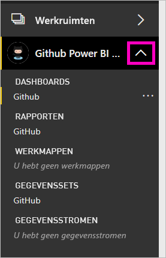

# Zelfstudie: Verbinding maken met een GitHub-opslagplaats met Power BI
In deze zelfstudie gebruikt u echte gegevens in de GitHub-service met Power BI en Power BI maakt automatisch dashboards en rapporten. U verbinding maken met de Power BI-inhoud openbare opslagplaats (ook wel bekend als een *opslagplaats*) en antwoorden op vragen zoals: Hoeveel mensen dragen bij aan de openbare Power BI-inhoud? Wie levert de meeste bijdragen? Op welke dag van de wek worden de meeste bijdragen geleverd? En andere vragen. 

In deze zelfstudie voert u de volgende stappen uit:

> [!div class="checklist"]
> * Meld u aan voor een GitHub-account als u dat nog niet hebt 
> * Meld u aan bij uw Power BI-account, of meld u aan voor een account als u dat nog niet hebt
> * De Power BI-service openen
> * De GitHub-app zoeken
> * De informatie voor de openbare GitHub-opslagplaats van Power BI invoeren
> * Het dashboard en rapport met GitHub-gegevens bekijken
> * De app verwijderen om resources te wissen

Als u zich niet hebt geregistreerd voor Power BI, kunt u zich hier [aanmelden voor een gratis proefversie](https://app.powerbi.com/signupredirect?pbi_source=web) voordat u begint.

## Vereisten

Voor het voltooien van deze zelfstudie hebt u een GitHub-account nodig, als u dit nog niet hebt. 

- Zich aanmelden voor een [GitHub-account](https://docs.microsoft.com/contribute/get-started-setup-github).

## Verbinding maken
1. Aanmelden bij de Power BI-service (https://app.powerbi.com)). 
2. Selecteer in het linkernavigatievenster de optie **Apps** en vervolgens **Apps downloaden**.
   
    

3. Selecteer **Apps**, type **GitHub** in het zoekvak > **nu downloaden**.
   
    

4. In **deze Power BI-App installeren?** Selecteer **installeren**.
5. In **uw nieuwe app is gereed**, selecteer **naar de app**.
6. In **aan de slag met uw nieuwe app**, selecteer **verbinding maken met gegevens**.

    

7. Voer de naam in van de opslagplaats en de naam van de eigenaar van de opslagplaats. De URL voor deze opslagplaats is https://github.com/MicrosoftDocs/powerbi-docs, dus de **Eigenaar van opslagplaats** is **MicrosoftDocs** en de **Opslagplaats** is **powerbi-docs**. 
   
    

5. Voer de GitHub-referenties die u hebt gemaakt in. Power BI kan deze stap overslaan als u zich al hebt aangemeld bij GitHub in uw browser. 

6. Voor **verificatiemethode**, houden **oAuth2** geselecteerde \> **aanmelden**.

7. Volg de schermen van GitHub-verificatie. Geef Power BI toestemming voor de GitHub-gegevens.
   
   Power BI kan nu verbinding maken met GitHub en de gegevens.  De gegevens worden eenmaal per dag vernieuwd.

8. Nadat de gegevens in Power BI geïmporteerd, ziet u de inhoud van uw nieuwe GitHub-werkruimte. 
9. Selecteer de pijl naast de naam van de werkruimte in de linker navigatiebalk. U ziet in dat de werkruimte bevat een dashboard en een rapport. 

    

10. Selecteer het weglatingsteken (...) naast de naam van het dashboard > **naam** > type **GitHub-dashboard**.
 
     

8. Selecteer het algemene navigatiepictogram om de navigatie aan de linkerkant te minimaliseren, zodat u meer ruimte hebt.

    

10. Selecteer uw GitHub-dashboard.
    
    De GitHub-dashboard bevat live gegevens, zodat de waarden die u ziet mogelijk anders.

    

    

## Een vraag stellen

1. Plaats de cursor in **een vraag stellen over uw gegevens**. Power BI ondersteunt **vragen op weg te helpen**. 

1. Selecteer **hoeveel gebruikers zijn er**.
 
    

13. Tussen **hoeveel** en **gebruikers zijn er**, type **pull-aanvragen per**. 

     Power BI maakt een staafdiagram met het aantal pull-aanvragen per persoon.

    

13. Selecteer het speldpictogram vervolgens aan uw dashboard vastmaken **Q & A afsluiten**.

## Het GitHub-rapport weergeven 

1. Selecteer in de GitHub-dashboard, het kolomdiagram **Pull-aanvragen per maand** om het bijbehorende rapport te openen.

    

2. Selecteer de gebruikersnaam van een in de **totaal aantal pull-aanvragen per gebruiker** grafiek. In dit voorbeeld ziet u de meeste van hun uren zijn in februari.

    

3. Selecteer het tabblad **Perforatiekaart** om de volgende pagina in het rapport weer te geven. 
 
    

    Blijkbaar dinsdag om 3 uur is het meest algemene tijdstip en dag van de week voor *doorvoeringen*, wanneer gebruikers in hun werk.

## Resources opschonen

Nu u de zelfstudie hebt voltooid, kunt u de GitHub-app verwijderen. 

1. Selecteer **Apps** in de linkernavigatiebalk.
2. Beweeg de cursor boven de GitHub-tegel en selecteer de prullenbak **Verwijderen**.

    

## Volgende stappen

In deze zelfstudie hebt u verbinding gemaakt met een openbare GitHub-opslagplaats en gegevens gedownload, die door Power BI naar een dashboard en rapport zijn geformatteerd. U hebt een aantal vragen over de gegevens beantwoord door het dashboard en rapport te verkennen. U kunt nu meer leren over verbinding maken met andere services zoals Salesforce, Microsoft Dynamics en Google Analytics. 
 
> [!div class="nextstepaction"]
> [Verbinding maken met de onlineservices die u gebruikt](service-connect-to-services.md)

