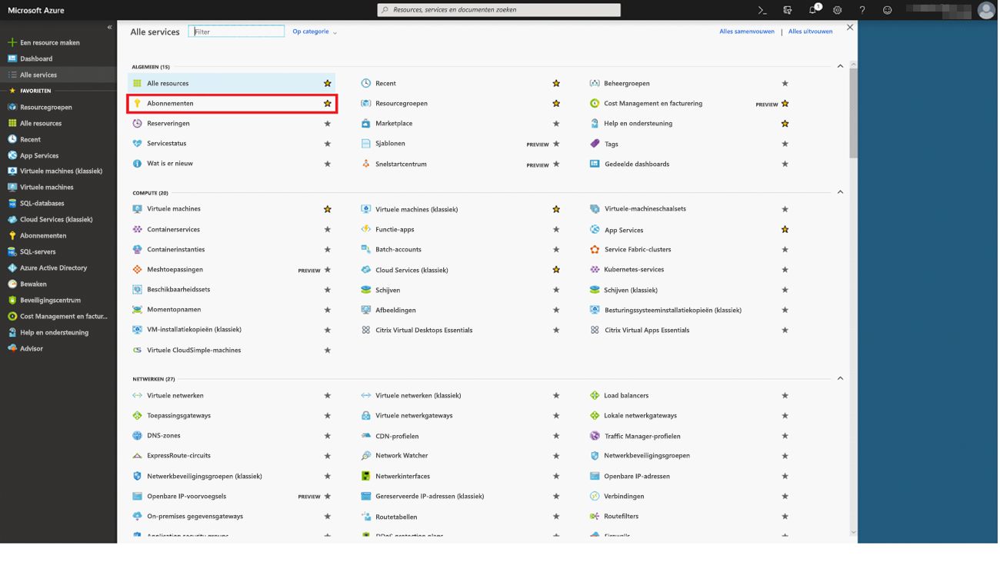
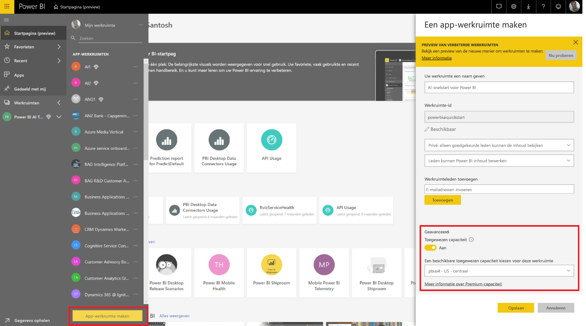
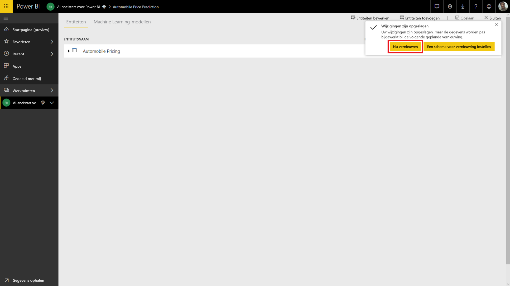
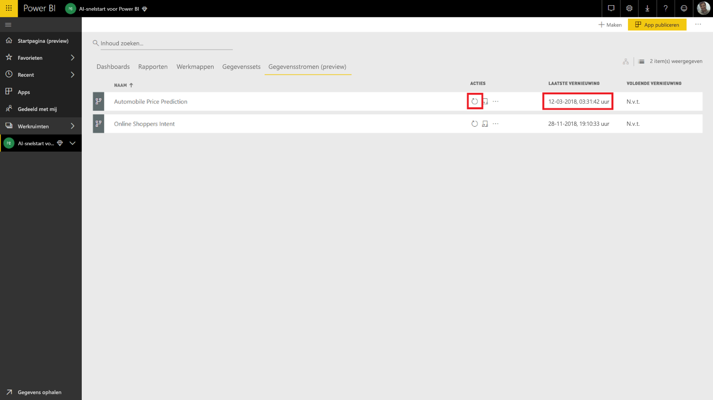
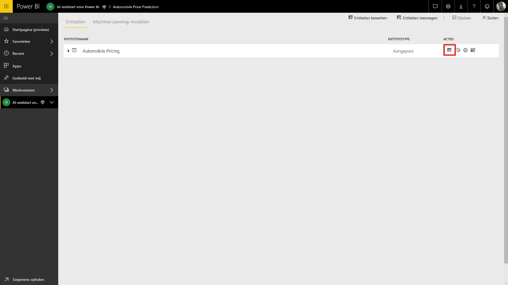

# Zelfstudie: Een Machine Learning Studio-model (klassiek) aanroepen in Power BI (preview)

In deze zelfstudie wordt stapsgewijs uitgelegd hoe u inzichten uit een **Azure Machine Learning Studio**-model (klassiek) gebruikt in Power BI. We beschrijven hoe u een Power BI-gebruiker toegang verleent tot een Azure ML-model, hoe u een gegevensstroom maakt en hoe u inzichten uit het Azure ML-model toepast op uw gegevensstroom. Deze zelfstudie bevat ook verwijzingen naar de quickstart voor het maken van een Azure ML-model, voor het geval u nog geen model hebt.

In deze zelfstudie worden de volgende acties uitgelegd:

> [!div class="checklist"]
> * Een Azure Machine Learning-model maken en publiceren
> * Een Power BI-gebruiker toegang tot het model verlenen
> * Een gegevensstroom maken
> * Inzichten uit het Azure ML-model toepassen op de gegevensstroom

## Een Azure ML-model maken en publiceren

Volg de instructies bij [stap 1 van de zelfstudie: Een Machine Learning Studio-werkruimte (klassiek) maken](https://docs.microsoft.com/azure/machine-learning/studio/walkthrough-1-create-ml-workspace) om een **Machine Learning**-werkruimte te maken.

U kunt deze stappen toepassen op al uw huidige Azure ML-modellen of -gegevenssets. Als u nog geen gepubliceerd model hebt, kunt u er binnen enkele minuten een maken met behulp van de instructies in [Create your first data science experiment in Azure Machine Learning Studio (classic)](https://docs.microsoft.com/azure/machine-learning/studio/create-experiment) (Uw eerste gegevenswetenschappelijke experiment maken in Azure Machine Learning Studio (klassiek)). U maakt dan een Azure ML-model voor een prijsvoorspelling voor auto's.

Volg de stappen in [Deploy an Azure Machine Learning Studio (classic) web service](https://docs.microsoft.com/azure/machine-learning/studio/tutorial-part3-credit-risk-deploy) (Een Azure Machine Learning Studio-webservice (klassiek) implementeren) om het Azure ML-model als webservice te implementeren.

## Een Power BI-gebruiker toegang verlenen

Als u vanuit Power BI toegang wilt hebben tot een Azure ML-model, hebt u **leestoegang** nodig tot het Azure-abonnement en de resourcegroep, evenals **leestoegang** tot de Azure Machine Learning Studio-webservice (klassiek) voor Machine Learning Studio-modellen (klassiek).  Voor een Azure Machine Learning-model hebt u **leestoegang** nodig tot de Machine Learning-werkruimte.

In de volgende stappen gaan we ervan uit dat u medebeheerder bent van het Azure-abonnement en de resourcegroep waarin het model is gepubliceerd.

Meld u aan bij de [Azure-portal](https://portal.azure.com) en ga naar de pagina **Abonnementen**. U vindt deze pagina via de lijst **Alle services** in het navigatievenster.

Selecteer het Azure-abonnement waarmee u het model hebt gepubliceerd en kies **Toegangsbeheer (IAM)**. Selecteer vervolgens **Roltoewijzing toevoegen**, selecteer de rol **Lezer** en selecteer de betreffende Power BI-gebruiker. Selecteer **Opslaan** wanneer u klaar bent. Op de volgende afbeelding worden deze selecties weergegeven.

Herhaal daarna bovenstaande stappen om **inzenderstoegang** te verlenen aan de Power BI-gebruiker voor de specifieke Machine Learning-webservice waarin het Azure ML-model is geïmplementeerd.

## Een gegevensstroom maken

### Gegevens ophalen om de gegevensstroom te maken

Meld u aan bij de Power BI-service met de referenties van de gebruiker die u in de vorige stap toegang tot het Azure ML-model hebt verleend.

In deze stap gaan we ervan uit dat u over gegevens in CSV-indeling beschikt om in uw Azure ML-model te gebruiken.  Als u het **experiment voor autoprijzen** hebt gebruikt om het model in Machine Learning Studio (klassiek) te maken, klikt u op de onderstaande koppeling voor de gegevensset:

* [Azure Learning Studio-voorbeeldmodel (klassiek)](https://github.com/santoshc1/PowerBI-AI-samples/blob/master/Tutorial_MLStudio_model_integration/Automobile%20price%20data%20_Raw_.csv)

### Een gegevensstroom maken

Als u entiteiten in uw gegevensstroom wilt maken, meldt u zich aan bij de Power BI-service en gaat u naar een werkruimte in uw toegewezen capaciteit waarvoor AI-preview is ingeschakeld.

Als u nog geen werkruimte hebt, kunt u er een maken door in het linkermenu **Werkruimten** te selecteren en vervolgens **Werkruimte maken** te kiezen in het paneel aan de onderkant.  Hiermee opent u een paneel waarin u gegevens van de werkruimte kunt invoeren. Voer de naam van de werkruimte in en selecteer **Opslaan**.

Nadat de werkruimte is gemaakt, selecteert u rechtsonder op het welkomstscherm **Overslaan**.

Selecteer het tabblad **Gegevensstromen (preview-versie)**. Klik rechtsbovenaan de werkruimte op de knop **Maken** en selecteer **Gegevensstroom**.

Selecteer **Nieuwe entiteiten toevoegen**. **Power Query Editor** wordt geopend in de browser.

Selecteer **Tekst/CSV** als gegevensbron.

Op het volgende scherm wordt u gevraagd verbinding te maken met een gegevensbron. Plak hier de koppeling naar de gegevens die u hebt gebruikt om uw Azure ML-model te maken. Als u de gegevens voor _autoprijzen_ hebt gebruikt, plakt u onderstaande koppeling in het vak **Bestandspad of URL** en klikt u op **Volgende**.

`https://raw.githubusercontent.com/MicrosoftLearning/Principles-of-Machine-Learning-Python/master/Module7/Automobile%20price%20data%20_Raw_.csv`

Power Query Editor geeft een voorbeeld weer van de gegevens uit het CSV-bestand. Selecteer **Tabel transformeren** in de lintopdracht en selecteer vervolgens **De eerste rij als veldnamen gebruiken**.  Hiermee wordt de querystap _Headers met verhoogd niveau_ toegevoegd aan het paneel **Toegepaste stappen** aan de rechterkant. U kunt de query ook een meer toepasselijke naam geven, bijvoorbeeld _Autoprijzen_. Dit doet u in het paneel aan de rechterkant.

In onze brongegevensset zijn onbekende waarden ingesteld als '?'.  We kunnen dit opschonen door '?' te vervangen door '0', om toekomstige fouten te voorkomen.  Selecteer de kolommen *normalized-losses*, *bore*, *stroke*, *compression-ratio*, *horsepower*, *peak-rpm* en *price* door op de naam te klikken in de kolomkoppen. Klik vervolgens op 'Kolommen transformeren' en selecteer 'Waarden vervangen'.  Vervang '?' door '0'.

Alle kolommen in de tabel met Tekst/CSV als bron worden behandeld als tekstkolommen.  Vervolgens moeten we de numerieke kolommen wijzigen om de gegevenstypen te corrigeren.  U doet dit in Power Query door te klikken op het gegevenstypesymbool in de kolomkop.  Stel onderstaande typen in voor de kolommen:

- **Geheel getal**:  symboling, normalized-losses, curb-weight, engine-size, horsepower, peak-rpm, city-mpg, highway-mpg, price
- **Decimaal getal**:  wheel-base, length, width, height, bore, stroke, compression-ratio

Selecteer **Gereed** om Power Query Editor te sluiten. U krijgt dan de entiteitenlijst te zien met de gegevens voor _autoprijzen_ die we hebben toegevoegd. Selecteer rechtsboven **Opslaan**, geef een naam voor de gegevensstroom op en selecteer **Opslaan**.

### De gegevensstroom vernieuwen

Wanneer u de gegevensstroom opslaat, krijgt u een melding te zien dat de gegevensstroom is opgeslagen. Selecteer **Nu vernieuwen** om gegevens uit de bron op te nemen in de gegevensstroom.

Selecteer rechtsboven **Sluiten** en wacht tot de gegevensstroom is vernieuwd.

U kunt de gegevensstroom ook vernieuwen met behulp van de opdrachten in **Acties**. De gegevensstroom wordt voorzien van een timestamp wanneer het vernieuwen is voltooid.

## Inzichten uit uw Azure ML-model toepassen

Als u het Azure ML-model voor _prijsvoorspelling voor auto's_ wilt openen, kunt u de entiteit _Autoprijzen_ bewerken waarvoor we de voorspelde prijs willen toevoegen.

Als u het pictogram **Bewerken** selecteert, wordt Power Query Editor geopend voor de entiteiten in uw gegevensstroom.

Selecteer in het lint de knop **AI-inzichten** en selecteer vervolgens de map _Azure Machine Learning-modellen_ in het navigatievenstermenu.

De Azure ML-modellen waartoe u toegang hebt gekregen, worden vermeld als Power Query-functies met het voorvoegsel *AzureML*.  Wanneer u klikt op de functie die overeenkomt met het model _AutomobilePricePrediction_, worden de parameters voor de webservice van het model vermeld als functieparameters.

Als u een Azure ML-model wilt aanroepen, kunt u vanuit het vervolgkeuzemenu een van de geselecteerde kolommen van de entiteit als invoer opgeven. U kunt ook een constante waarde opgeven die als invoer wordt gebruikt door het kolompictogram aan de linkerzijde van de het invoerdialoogvenster in te schakelen. Wanneer de kolomnaam overeenkomt met een van de functieparameternamen, wordt de kolom automatisch voorgesteld als invoer.  Als de kolomnaam niet overeenkomt, kunt u deze selecteren in de vervolgkeuzelijst.

Bij het model voor _prijsvoorspelling voor auto's_ zijn dit de invoerparameters:

- make
- body-style
- wheel-base
- engine-size
- horsepower
- peak-rpm
- highway-mpg

Aangezien de tabel in dit geval overeenkomt met de oorspronkelijke gegevensset die is gebruikt om het model te trainen, is voor alle parameters al de juiste kolom geselecteerd.

Selecteer **Aanroepen** om een voorbeeld van de uitvoer van het Azure ML-model weer te geven als een nieuwe kolom in de entiteitstabel. U ziet de aanroep aan het model ook als een toegepaste stap voor de query.

De uitvoer van het model wordt weergegeven als record in de uitvoerkolom. U kunt een kolom uitbreiden om afzonderlijke uitvoerparameters te produceren in afzonderlijke kolommen. We zijn nu alleen geïnteresseerd in de kolom _Scored Labels_ met de voorspelde prijs van de auto.  Hef de selectie van de rest op en selecteer **OK**.

De kolom *Scored Labels* die overblijft, bevat de prijsvoorspelling van het Azure ML-model.

Nadat u uw gegevensstroom hebt opgeslagen, wordt het Azure ML-model automatisch aangeroepen wanneer de gegevensstroom wordt vernieuwd voor nieuwe of bijgewerkte rijen in de entiteitstabel.

## Resources opschonen

Als u de in dit artikel gebruikte Azure-resources niet meer nodig hebt, kunt u ze verwijderen, zodat er geen kosten worden gemaakt.  U kunt ook de gemaakte gegevensstromen verwijderen als u ze niet meer nodig hebt.

## Volgende stappen

In deze zelfstudie hebt u een eenvoudig experiment gemaakt in Azure Machine Learning Studio (klassiek) aan de hand van een eenvoudige gegevensset en de onderstaande stappen:

- Een Azure Machine Learning-model maken en publiceren
- Een Power BI-gebruiker toegang tot het model verlenen
- Een gegevensstroom maken
- Inzichten uit het Azure ML-model toepassen op de gegevensstroom

Raadpleeg [Azure Machine Learning integration in Power BI (Preview)](service-machine-learning-integration.md) (Azure Machine Learning-integratie in Power BI (preview)) voor meer informatie over de integratie van Azure Machine Learning in Power BI.
