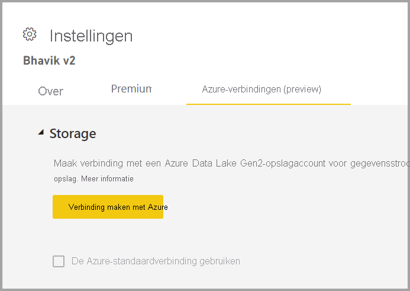
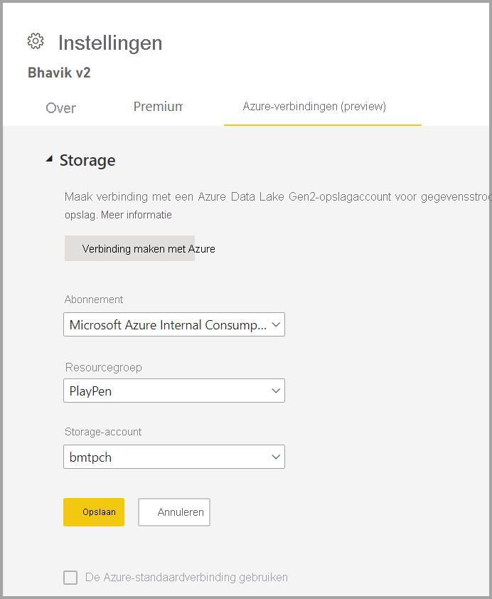

# Gegevensstroomopslag configureren voor gebruik van Azure Data Lake Gen 2 

Gegevens die worden gebruikt met Power BI, worden standaard opgeslagen in de interne opslag die wordt geleverd door Power BI. Met de integratie van gegevensstromen en Azure Data Lake Storage Gen 2 (ADLS Gen2) kunt u uw gegevensstromen opslaan in het Azure Data Lake Storage Gen 2-account van uw organisatie.

Er zijn twee manieren om te configureren welk ADLS Gen2-archief u wilt gebruiken: u kunt een ADLS Gen2-account gebruiken waaraan een tenant is toegewezen, of u kunt uw eigen ADLS Gen2-archief naar een werkruimteniveau brengen. 

## Vereisten

Om uw eigen ADLS Gen2-account te kunnen gebruiken, moet u eigenaarsmachtigingen hebben voor het opslagaccount, de resourcegroep of de abonnementslaag. Als u een beheerder bent, moet u nog steeds eigenaarsmachtigingen aan uzelf toewijzen. 

Het ADLS Gen2-account moet bovendien worden geïmplementeerd in dezelfde regio als uw Power BI-tenant. Er treedt een fout op als de locaties van de resources zich niet in dezelfde regio bevinden.

Tot slot kunt u verbinding maken met elk ADLS Gen2-account via de beheerdersportal, maar als u rechtstreeks verbinding maakt met een werkruimte, moet u er eerst voor zorgen dat er geen gegevensstromen in de werkruimte zijn voordat u verbinding maakt.

## Verbinding maken met Azure Data Lake Gen 2 in een werkruimte
Navigeer naar een werkruimte die geen gegevensstromen heeft. Selecteer **Werkruimte-instellingen** om een nieuw tabblad genaamd **Azure-verbindingen** te openen. Selecteer het tabblad **Azure-verbindingen** en selecteer vervolgens de sectie **Opslag**.

 
De optie **De Azure-standaardverbinding gebruiken** is zichtbaar als ADLS Gen2 al is geconfigureerd voor de tenant. U hebt twee opties: de tenant gebruiken waarvoor ADLS Gen2 is geconfigureerd, door het selectievakje **De Azure-standaardverbinding gebruiken** in te schakelen, of **Verbinding maken met Azure** selecteren om naar een nieuw Azure Storage-account te wijzen. 

Wanneer u **Verbinding maken met Azure** selecteert, haalt Power BI een lijst op met Azure-abonnementen waartoe u toegang hebt. Vul de vervolgkeuzelijsten in en selecteer een geldig(e) Azure-abonnement, resourcegroep en opslagaccount waarvoor de optie Hiërarchische naamruimte is ingeschakeld, wat de ADLS Gen2-vlag is.

 
Selecteer vervolgens **Opslaan**. U hebt de werkruimte nu met uw eigen ADLS Gen2-account verbonden. Power BI configureert het opslagaccount automatisch met de vereiste machtigingen en stelt het Power BI-bestandssysteem in waarnaar de gegevens worden geschreven. Op dit punt worden de gegevens van elke gegevensstroom binnen deze werkruimte rechtstreeks naar dit bestandssysteem geschreven, dat kan worden gebruikt met andere Azure-services, zodat u één bron voor al uw organisatie- of afdelingsgegevens hebt.

## De verbinding van Azure Data Lake Gen 2 met een werkruimte of tenant verbreken

Als u een verbinding wilt verwijderen op een werkruimteniveau, moet u er eerst voor zorgen dat alle gegevensstromen in de werkruimte zijn verwijderd. Zodra alle gegevensstromen zijn verwijderd, selecteert u **Verbinding verbreken** in de werkruimte-instellingen. Hetzelfde geldt voor een tenant, maar u moet er eerst voor zorgen dat de verbinding van alle werkruimten met het tenantopslagaccount ook is verbroken voordat u de verbinding kunt verbreken op een tenantniveau.

## Azure Data Lake Gen 2 uitschakelen

In de **Beheerportal** kunt u deze functie onder **Gegevensstromen** uitschakelen zodat gebruikers er geen toegang toe hebben, en kunt u de optie uitschakelen dat werkruimtebeheerders hun eigen Azure Storage-account gebruiken.

## Volgende stappen
De volgende artikelen bieden meer informatie over gegevensstromen en Power BI:

* [Inleiding tot gegevensstromen en selfservice voor gegevensvoorbereiding](dataflows-introduction-self-service.md)
* [Een gegevensstroom maken](dataflows-create.md)
* [Een gegevensstroom configureren en gebruiken](dataflows-configure-consume.md)
* [Premium-functies van gegevensstromen](dataflows-premium-features.md)
* [AI met gegevensstromen](dataflows-machine-learning-integration.md)
* [Beperkingen en overwegingen van gegevensstromen](dataflows-features-limitations.md)