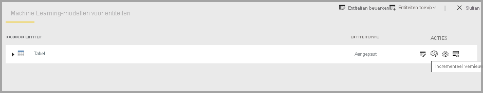
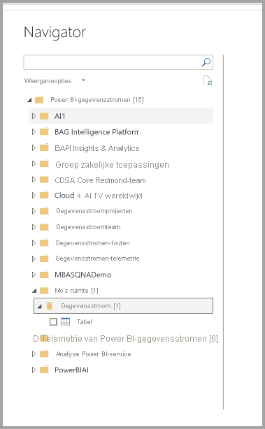

# Een gegevensstroom configureren en gebruiken

Met gegevensstromen kunt u gegevens uit meerdere bronnen samenvoegen en die samengevoegde gegevens voorbereiden op modellering. Telkens wanneer u een gegevensstroom maakt, wordt u gevraagd de gegevens voor de gegevensstroom te vernieuwen. De vernieuwing van een gegevensstroom is vereist voordat deze kan worden gebruikt in een gegevensset in Power BI Desktop, of voordat ernaar kan worden verwezen als een gekoppelde of berekende entiteit.

## Een gegevensstroom configureren

Om de vernieuwing van een gegevensstroom te configureren, selecteert u het menu **Meer** (de drie puntjes) en selecteert u **Instellingen**.

**Instellingen** biedt vele opties voor uw gegevensstroom, zoals beschreven in de volgende secties.

* **Eigenaar worden:** Als u niet de eigenaar van de gegevensstroom bent, zijn veel van deze instellingen uitgeschakeld. Om eigenaar te worden van de gegevensstroom, selecteert u **Overnemen** om de controle te nemen. U wordt gevraagd referenties op te geven om te verzekeren dat u het benodigde toegangsniveau hebt.

* **Gatewayverbinding:** In deze sectie kunt u kiezen of de gegevensstroom gebruikmaakt van een gateway en selecteren welke gateway er wordt gebruikt. 

* **Gegevensbronreferenties:** In deze sectie kiest u welke referenties er worden gebruikt en kunt u wijzigen hoe u zich verifieert bij de gegevensbron.

* **Vertrouwelijkheidslabel:** Hier kunt u de vertrouwelijkheid van de gegevens in de gegevensstroom definiëren. Zie [Vertrouwelijkheidslabels toepassen in Power BI](../../admin/service-security-apply-data-sensitivity-labels.md) voor meer informatie over vertrouwelijkheidslabels.

* **Geplande vernieuwing:** Hier kunt u definiëren op welke tijden van de dag de geselecteerde gegevensstroom wordt vernieuwd. Een gegevensstroom kan met dezelfde frequentie als een gegevensset worden vernieuwd.

* **Geavanceerde instellingen van berekeningsengine:** Hier kunt u definiëren of de gegevensstroom in de berekeningsengine wordt opgeslagen. Met de berekeningsengine kunnen volgende gegevensstromen, die verwijzen naar deze gegevensstroom, samenvoegingen en koppelingen en andere transformaties veel sneller dan anders uitvoeren. De engine zorgt er ook voor dat DirectQuery kan worden uitgevoerd op de gegevensstroom. Door **Aan** te selecteren, wordt de gegevensstroom altijd ondersteund in DirectQuery-modus en profiteren alle verwijzingen van de engine. Door **Geoptimaliseerd** te selecteren, wordt de engine alleen gebruikt als er een verwijzing naar deze gegevensstroom is. Door **Uit** te selecteren, worden de berekeningsengine en DirectQuery-mogelijkheid uitgeschakeld voor deze gegevensstroom.

* **Goedkeuringen:** U kunt definiëren of de gegevensstroom wordt gecertificeerd of gepromoot. 

## Een gegevensstroom vernieuwen​​
Gegevensstromen fungeren als bouwstenen die op elkaar zijn geplaatst. Stel dat u een gegevensstroom genaamd *Onbewerkte gegevens* hebt en een gekoppelde entiteit genaamd *Getransformeerde gegevens* die een gekoppelde entiteit naar de gegevensstroom *Onbewerkte gegevens* bevat. Wanneer de geplande vernieuwing voor de gegevensstroom *Onbewerkte gegevens* wordt geactiveerd, wordt na voltooiing elke gegevensstroom geactiveerd die ernaar verwijst. Deze functionaliteit creëert een domino-effect van vernieuwingen, zodat u gegevensstromen niet handmatig hoeft te plannen. Er zijn een aantal nuances waar u op moet letten bij vernieuwingen van gekoppelde entiteiten:

* Een gekoppelde entiteit wordt alleen door een vernieuwing geactiveerd als deze in dezelfde werkruimte bestaat

* Een gekoppelde entiteit wordt vergrendeld voor bewerking als een bronentiteit wordt vernieuwd. Als een van de gegevensstromen in een verwijzingsketen niet wordt vernieuwd, worden alle gegevensstromen teruggezet op de oude gegevens (gegevensstroomvernieuwingen zijn transactioneel in een werkruimte).

* Verwezen entiteiten worden alleen vernieuwd wanneer een bronvernieuwing is voltooid. Als u alle entiteiten wilt vernieuwen, moet u ook een geplande vernieuwing voor de gekoppelde entiteit instellen. Stel geen vernieuwingsplan in voor gekoppelde gegevensstromen, om dubbele vernieuwing te voorkomen.

**Vernieuwen annuleren** Gegevensstromen ondersteunen de mogelijkheid om een vernieuwing te annuleren, in tegenstelling tot gegevenssets. Als een vernieuwing lang duurt, kunt u de gegevensstroomopties (de drie puntjes naast de gegevensstroom) selecteren en vervolgens **Vernieuwing annuleren** selecteren.

**Incrementeel vernieuwen (alleen Premium)** Gegevensstromen kunnen ook worden ingesteld om incrementeel te vernieuwen. Hiertoe selecteert u de gegevensstroom die u wilt instellen voor incrementele vernieuwing, en selecteert u vervolgens het pictogram voor incrementeel vernieuwen.

Bij het instellen van incrementele vernieuwing worden er parameters aan de gegevensstroom toegevoegd om het datumbereik te specificeren. Zie het artikel [Incrementeel vernieuwen in Power Query](/power-query/dataflows/incremental-refresh) voor gedetailleerde informatie over het instellen van incrementele vernieuwing.

Er zijn een aantal omstandigheden waarin u incrementeel vernieuwen niet moet instellen:

* Gekoppelde entiteiten moeten incrementeel vernieuwen niet gebruiken als ze naar een gegevensstroom verwijzen. Gegevensstromen bieden geen ondersteuning voor het vouwen van query's (zelfs niet als DirectQuery is ingeschakeld voor de entiteit). 

* Gegevenssets die naar gegevensstromen verwijzen, moeten incrementeel vernieuwen niet gebruiken. Vernieuwingen van gegevensstromen presteren over het algemeen goed, waardoor incrementele vernieuwingen niet nodig zouden moeten zijn. Als vernieuwingen te lang duren, kunt u de berekeningsengine of de DirectQuery-modus gebruiken.

## Een gegevensstroom gebruiken

Een gegevensstroom kan op de volgende drie manieren worden gebruikt:

* Een gekoppelde entiteit van de gegevensstroom maken zodat een andere gegevensstroomauteur de gegevens kan gebruiken

* Een gegevensset van de gegevensstroom maken zodat een gebruiker de gegevens kan gebruiken om rapporten te maken

* Een verbinding maken van externe hulpmiddelen die de CDM-indeling kunnen lezen

**Gebruiken vanuit Power BI Desktop** Om een gegevensstroom te gebruiken, voert u Power BI Desktop uit en selecteert u de **Power BI-gegevensstroomconnector** in het dialoogvenster **Gegevens ophalen**.

> [!NOTE]
> De Power BI-gegevensstroomconnector gebruikt een andere verzameling referenties dan de huidige aangemelde gebruiker. Dit is standaard, om multi-tenant gebruikers te ondersteunen.

Selecteer met welke gegevensstroom en welke entiteiten u verbinding wilt maken. 

> [!NOTE]
> U kunt verbinding maken met elke gegevensstroom of entiteit, ongeacht in welke werkruimte deze zich bevindt en of deze in een Premium- of niet-Premium-werkruimte is gedefinieerd.

Als DirectQuery beschikbaar is, wordt u gevraagd te kiezen of u via DirectQuery of via Importeren verbinding wilt maken met de entiteiten. 

In DirectQuery-modus kunt u snel grootschalige gegevenssets lokaal ondervragen. U kunt echter geen aanvullende transformaties uitvoeren. 

'Importeren' brengt de gegevens in Power BI en vereist dat de gegevensset onafhankelijk van de gegevensstroom wordt vernieuwd.

## Volgende stappen
De volgende artikelen bieden meer informatie over gegevensstromen en Power BI:

* [Inleiding tot gegevensstromen en selfservice voor gegevensvoorbereiding](dataflows-introduction-self-service.md)
* [Een gegevensstroom maken](dataflows-create.md)
* [Gegevensstroomopslag configureren voor gebruik van Azure Data Lake Gen 2](dataflows-azure-data-lake-storage-integration.md)
* [Premium-functies van gegevensstromen](dataflows-premium-features.md)
* [AI met gegevensstromen](dataflows-machine-learning-integration.md)
* [Beperkingen en overwegingen van gegevensstromen](dataflows-features-limitations.md)
* [Best practices voor gegevensstromen](dataflows-best-practices.md)