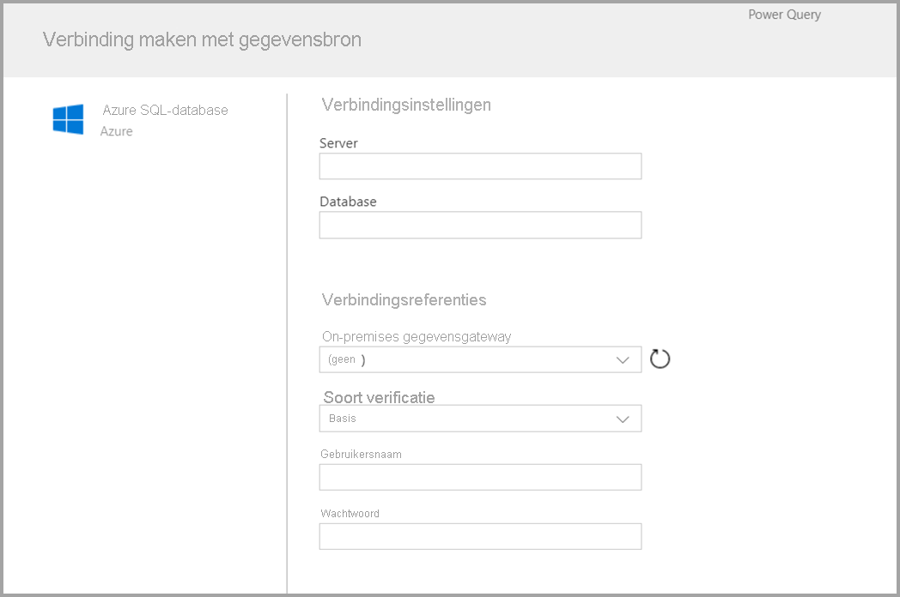

# Een gegevensstroom maken
Een **gegevensstroom** is een verzameling entiteiten (entiteiten zijn vergelijkbaar met tabellen) die worden gemaakt en beheerd in werkruimten in de Power BI-service. Een **entiteit/tabel** is een set velden die worden gebruikt voor het opslaan van gegevens, vergelijkbaar met een tabel in een database. U kunt rechtstreeks vanuit de werkruimte waarin de gegevensstroom is gemaakt entiteiten/tabellen toevoegen en bewerken, maar ook schema's voor gegevensvernieuwing beheren.

Als u een gegevensstroom wilt maken, start u de Power BI-service in een browser en selecteert u in het navigatievenster aan de linkerkant een **werkruimte** (gegevensstromen zijn niet beschikbaar in *Mijn werkruimte* in de Power BI-service). Zie het onderstaande scherm voor meer informatie. U kunt ook een nieuwe werkruimte maken, waarin u dan een nieuwe gegevensstroom maakt.

Er zijn meerdere manieren om te maken of bouwen op een nieuwe gegevensstroom:

* [Een gegevensstroom maken met behulp van het definiëren van nieuwe entiteiten](#create-a-dataflow-using-define-new-entities)
* [Een gegevensstroom maken met behulp van gekoppelde entiteiten](#create-a-dataflow-using-linked-entities)
* [Een gegevensstroom maken met behulp van een berekende entiteit](#create-a-dataflow-using-a-computed-entity)
* [Een gegevensstroom maken met behulp van import/export](#create-a-dataflow-using-importexport)

In de volgende secties vindt u een overzicht van de verschillende manieren om een gegevensstroom te maken.

## Een gegevensstroom maken met behulp van het definiëren van nieuwe entiteiten

Met de optie Nieuwe entiteiten definiëren kunt u een nieuwe entiteit/tabel definiëren en verbinding maken met een nieuwe gegevensbron.

Wanneer u een gegevensbron selecteert, wordt u gevraagd de verbindingsinstellingen op te geven, met inbegrip van het account dat moet worden gebruikt bij het maken van verbinding met de gegevensbron, zoals wordt weergegeven in de volgende afbeelding.

Als er eenmaal verbinding is, kunt u aangeven welke gegevens u wilt gebruiken voor uw entiteit. Als u gegevens en een bron kiest, maakt Power BI opnieuw verbinding met de gegevensbron om de gegevens in de gegevensstroom actueel te houden. Hiervoor wordt de frequentie gehanteerd die u later in het configuratieproces selecteert.

Als u de gegevens hebt geselecteerd die u wilt gebruiken in de entiteit, kunt u de gegevensstroomeditor gebruiken om die gegevens vorm te geven of te transformeren naar de indeling die noodzakelijk is voor gebruik in uw gegevensstroom. 

## Een gegevensstroom maken met behulp van gekoppelde entiteiten

Door een gegevensstroom te maken met behulp van gekoppelde entiteiten kunt u verwijzen naar een bestaande entiteit die is gedefinieerd in een andere gegevensstroom, met alleen-lezen. In de volgende lijst worden enkele redenen beschreven waarom u voor deze methode zou kunnen kiezen:

* Als u een entiteit wilt hergebruiken in meerdere gegevensstromen, zoals een datumentiteit of een statische opzoektabel, moet u één entiteit maken en deze vervolgens naar de andere gegevensstromen laten verwijzen.

* Als u wilt voorkomen dat een gegevensbron meerdere keren wordt vernieuwd, is het beter om gekoppelde entiteiten te gebruiken om de gegevens op te slaan en als een cache te laten fungeren. Als u dat doet, kan elke volgende gebruiker die entiteit gebruiken, waardoor de belasting van de onderliggende gegevensbron wordt verminderd.

* Als u een samenvoeging tussen twee entiteiten moet uitvoeren.

> [!NOTE]
> Gekoppelde entiteiten zijn alleen beschikbaar met Power BI Premium.

## Een gegevensstroom maken met behulp van een berekende entiteit

Als u een gegevensstroom maakt met behulp van een berekende entiteit, kunt u verwijzen naar een gekoppelde entiteit en de bewerkingen uitvoeren als alleen-schrijven. Het resultaat is een nieuwe entiteit die deel uitmaakt van de gegevensstroom. Als u een gekoppelde entiteit wilt omzetten in een berekende entiteit, kunt u een nieuwe query maken op basis van een samenvoegbewerking. Als u de entiteit wilt bewerken of transformeren, maakt u een verwijzing of een duplicaat van de entiteit.

### Het maken van berekende entiteiten

Zodra u beschikt over een gegevensstroom met een lijst met entiteiten, kunt u berekeningen op deze entiteiten uitvoeren.
Selecteer in het bewerkingsprogramma voor gegevensstromen in de Power BI-service de optie **Entiteiten bewerken**. Klik vervolgens met de rechtermuisknop op de entiteit die u wilt gebruiken als basis voor de berekende entiteit en waarop u berekeningen wilt uitvoeren. Kies in het snelmenu de optie **Verwijzing**.
Als u wilt dat een entiteit in aanmerking komt als berekende entiteit, moet de selectie **Laden inschakelen** zijn aangevinkt, zoals wordt weergegeven in de volgende afbeelding. Klik met de rechtermuisknop op de entiteit om dit snelmenu weer te geven.

Door **Laden inschakelen** te selecteren, maakt u een nieuwe entiteit waarvan de bron de entiteit is waarnaar wordt verwezen. Het pictogram wordt gewijzigd en geeft nu het pictogram voor **berekeningen** weer, zoals wordt weergegeven in het volgende pictogram.

Alle transformaties die u uitvoert op deze zojuist gemaakte entiteit, worden uitgevoerd op de gegevens die zich al in de Power BI-gegevensstroomopslag bevinden. Dit betekent dat de query niet wordt uitgevoerd in de externe gegevensbron waaruit de gegevens zijn geïmporteerd (bijvoorbeeld de SQL-database waaruit de gegevens zijn opgehaald). In plaats hiervan wordt de query uitgevoerd voor de gegevens die zich al in de gegevensstroomopslag bevinden.

**Gebruiksvoorbeelden** Welke soorten transformaties kunnen worden uitgevoerd met berekende entiteiten? Alle transformaties die u meestal opgeeft met behulp van de gebruikersinterface voor transformaties in Power BI, of de M-editor, worden ondersteund tijdens het uitvoeren van berekeningen in de opslag.

Bekijk het volgende voorbeeld: u hebt een entiteit *Account* dat de onbewerkte gegevens bevat van alle klanten uit uw Dynamics 365-abonnement. U beschikt ook over de onbewerkte *ServiceCalls*-gegevens van de klantenservice, met de gegevens uit ondersteuningsaanvragen die op elke dag van het jaar zijn uitgevoerd vanuit het andere account.

Stel, u wilt de entiteit *Account* verrijken met de gegevens uit *ServiceCalls*.
Dan moet u eerst de gegevens uit *ServiceCalls* samenvoegen om het aantal ondersteuningsaanvragen te berekenen die op elke dag van het jaar zijn uitgevoerd vanuit het andere account.

Daarna wilt u waarschijnlijk de entiteit *Account* samenvoegen met de entiteit *ServiceCallsAggregated* om de verrijkte tabel *Account* te berekenen.

Vervolgens worden de resultaten weergegeven. In de volgende afbeelding ziet u deze resultaten als *EnrichedAccount*.

Dat is alles. De transformatie wordt uitgevoerd voor de gegevens in de gegevensstroom die zich in uw Power BI Premium-abonnement bevindt, en niet voor de brongegevens.

> [!NOTE]
> Berekende entiteiten is alleen beschikbaar voor Premium-gebruikers

## Een gegevensstroom met een CDM-map maken

Als u een gegevensstroom maakt vanuit een CDM-map, kunt u verwijzen naar een entiteit die is geschreven door een andere toepassing in de indeling Common Data Model (CDM). U wordt gevraagd om het volledige pad op te geven naar het bestand met de CDM-indeling, dat is opgeslagen in ADLS Gen 2.

 

Er zijn enkele vereisten voor het maken van gegevensstromen vanuit CDM-mappen, zoals in de volgende lijst wordt beschreven:

* Het ADLS Gen 2-account moet de juiste machtigingen hebben, zodat PBI toegang kan krijgen tot het bestand

* Het ADLS Gen 2-account moet toegankelijk zijn voor de gebruiker die de gegevensstroom probeert te maken

* Het maken van gegevensstromen vanuit CDM-mappen is alleen beschikbaar in de nieuwe werkruimte-ervaring

* De URL moet een direct bestandspad naar het JSON-bestand zijn en het ADLS Gen 2-eindpunt gebruiken. Blob.core wordt niet ondersteund

## Een gegevensstroom maken met behulp van import/export

Door een gegevensstroom te maken met import/export kunt u een gegevensstroom importeren uit een bestand. Dit is handig als u een kopie van de gegevensstroom offline wilt opslaan of een gegevensstroom van de ene werkruimte naar de andere wilt verplaatsen. 

Als u een gegevensstroom wilt exporteren, selecteert u de gegevensstroom die u hebt gemaakt en selecteert u het menu-item **Meer** (het beletselteken) om de opties uit te vouwen. Vervolgens selecteert u **export.json**. U wordt gevraagd om te beginnen met het downloaden van de gegevensstroom die wordt weergegeven in de CDM-indeling.

Als u een gegevensstroom wilt importeren, schakelt u het vakje Importeren in en uploadt u het bestand. Power BI maakt de gegevensstroom voor u en geeft u de mogelijkheid om de gegevensstroom op te slaan, of om aanvullende transformaties uit te voeren.

## Volgende stappen

Als u een gegevensstroom hebt gemaakt, kunt u Power BI Desktop en de Power BI-service gebruiken om gegevenssets, rapporten, dashboards en apps te maken die zijn gebaseerd op de gegevens die u in gegevensstromen van Power BI plaatst, om zo inzicht in uw zakelijke activiteiten te krijgen. In de volgende artikelen wordt dieper ingegaan op veelvoorkomende gebruiksmogelijkheden van gegevensstromen:

* [Inleiding tot gegevensstromen en selfservice voor gegevensvoorbereiding](dataflows-introduction-self-service.md)
* [Een gegevensstroom configureren en gebruiken](dataflows-configure-consume.md)
* [Gegevensstroomopslag configureren voor gebruik van Azure Data Lake Gen 2](dataflows-azure-data-lake-storage-integration.md)
* [Premium-functies van gegevensstromen](dataflows-premium-features.md)
* [AI met gegevensstromen](dataflows-machine-learning-integration.md)
* [Beperkingen en overwegingen van gegevensstromen](dataflows-features-limitations.md)
* [Best practices voor gegevensstromen](dataflows-best-practices.md)