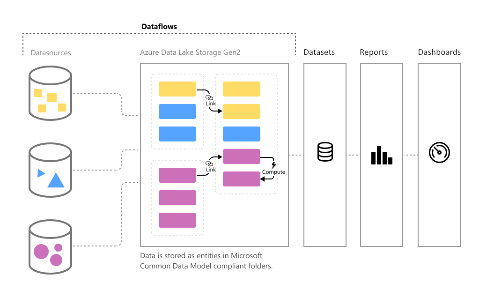

# Inleiding tot gegevensstromen en selfservice voor gegevensvoorbereiding

Hoe meer gegevens, hoe groter de uitdaging om ze om te zetten in goed opgemaakte, bruikbare informatie. We willen gegevens die klaar zijn voor analyse, voor het vullen van visuele elementen, rapporten en dashboards, zodat we grote hoeveelheden gegevens snel kunnen omzetten in bruikbare inzichten. Met de selfservice voor gegevensvoorbereiding voor big data in Power BI transformeert u gegevens tot Power BI-inzichten met slechts een paar klikken.

## Wanneer gegevensstromen gebruiken

Gegevensstromen zijn ontworpen ter ondersteuning van de volgende scenario's:

* Herbruikbare transformatielogica maken die kan worden gedeeld door veel gegevenssets en rapporten in Power BI. Gegevensstromen vergroten de herbruikbaarheid van de onderliggende gegevenselementen, waardoor er geen afzonderlijke verbindingen met uw gegevensbronnen in de cloud of on-premises hoeven te worden gemaakt.

* Maak de gegevens beschikbaar in uw eigen Azure Data Lake Gen 2-opslag, zodat u andere Azure-Services kunt verbinden met de onbewerkte onderliggende gegevens.

* Maak een enkele bron van waarheid door analisten te dwingen om verbinding te maken met de gegevensstromen in plaats van verbinding te maken met de onderliggende systemen, zodat u kunt bepalen welke gegevens worden gebruikt en hoe gegevens worden weergegeven voor de makers van rapporten. U kunt de gegevens ook toewijzen aan definities volgens de industriestandaard, zodat u nette gecureerde weergaven kunt maken, die kunnen samenwerken met andere services en producten in Power Platform.

* Als u met grote gegevensvolumes wilt werken en ETL op schaal wilt uitvoeren, schalen gegevensstromen met Power BI Premium efficiënter en hebt u meer flexibiliteit. Gegevensstromen bieden ondersteuning voor een breed scala aan bronnen in de cloud en on-premises. 

* Voorkom dat analisten rechtstreeks toegang hebben tot de onderliggende gegevensbron. Omdat de makers van rapporten kunnen bouwen op gegevensstromen, is het wellicht handiger om toegang tot de onderliggende gegevensbronnen toe te staan voor slechts enkele personen en vervolgens toegang te bieden tot de gegevensstromen voor analisten die daar bovenop kunnen bouwen. Deze aanpak vermindert de belasting van de onderliggende systemen en zorgt ervoor dat beheerders nauwkeuriger kunnen bepalen wanneer de systemen worden geladen naar aanleiding van vernieuwingen.

Als u een gegevensstroom hebt gemaakt, kunt u Power BI Desktop en de Power BI-service gebruiken om gegevenssets, rapporten, dashboards en apps te maken die gebruikmaken van Common Data Model om diepe inzichten in uw zakelijke activiteiten te krijgen. Het schema voor vernieuwing van de gegevensstroom wordt rechtstreeks beheerd vanuit de werkruimte waarin uw gegevensstroom is gemaakt, net zoals bij uw gegevenssets.

## Volgende stappen
Dit artikel geeft een overzicht van de selfservice voor gegevensvoorbereiding voor big data in Power BI en de vele manieren waarop u deze kunt gebruiken. 

De volgende artikelen bieden meer informatie over gegevensstromen en Power BI:

* [Een gegevensstroom maken](dataflows-create.md)
* [Een gegevensstroom configureren en gebruiken](dataflows-configure-consume.md)
* [Gegevensstroomopslag configureren voor gebruik van Azure Data Lake Gen 2](dataflows-azure-data-lake-storage-integration.md)
* [Premium-functies van gegevensstromen](dataflows-premium-features.md)
* [AI met gegevensstromen](dataflows-machine-learning-integration.md)
* [Beperkingen en overwegingen van gegevensstromen](dataflows-features-limitations.md)

U kunt het overzichtsartikel lezen voor meer informatie over Common Data Model:
* [Overzicht van Common Data Model](/powerapps/common-data-model/overview)