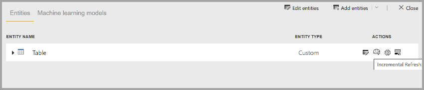

# Premium-functies van gegevensstromen

Gegevensstromen worden ondersteund voor Power BI Pro- en Power BI Premium-gebruikers. Sommige functies zijn alleen beschikbaar met een Power BI Premium-abonnement. In dit artikel worden de Premium-functies en de toepassingen ervan beschreven. 

De volgende functies zijn alleen beschikbaar met Power BI Premium:

* Verbeterde berekeningsengine
* Direct Query
* Berekende entiteiten
* Gekoppelde entiteiten
* Incrementeel vernieuwen

Deze functies worden allemaal gedetailleerd beschreven in de volgende secties.

## De verbeterde berekeningsengine

Dankzij de verbeterde berekeningsengine in Power BI kunnen Power BI Premium-abonnees hun capaciteit gebruiken om het gebruik van gegevensstromen te optimaliseren. Het gebruik van de verbeterde berekeningsengine biedt de volgende voordelen:

* De vernieuwingstijd verkorten die nodig is voor langlopende ETL-stappen over berekende entiteiten, zoals *samenvoegen*, *onderscheiden*, *filteren,*  en*groeperen op*
* DirectQuery-query's uitvoeren op entiteiten

Het inschakelen van de verbeterde berekeningsengine wordt hierna beschreven. U leest er ook antwoorden op veelgestelde vragen.

### De verbeterde berekeningsengine gebruiken

De verbeterde berekeningsengine wordt ingeschakeld op de pagina **capaciteitsinstellingen** in Power BI-service in de sectie **gegevensstromen**. Standaard is de verbeterde berekeningsengine **Uit**. Als u de verbeterde berekeningsengine wilt inschakelen, schakelt u de wisselknop naar **Aan**, zoals weergegeven in de volgende afbeelding, en slaat u de instellingen op. 

> [!IMPORTANT]
> De verbeterde berekeningsengine werkt alleen voor Power BI-capaciteiten van A3 en groter.

Wanneer de verbeterde berekeningsengine is ingeschakeld, keert u terug naar **gegevensstromen** en ziet u een prestatieverbetering in een berekende entiteit die complexe bewerkingen uitvoert, zoals *samenvoegen* of *groeperen op* voor gegevensstromen die zijn gemaakt van bestaande gekoppelde entiteiten met dezelfde capaciteit. 

Als u optimaal gebruik wilt maken van de berekeningsengine, splitst u de ETL-fase op de volgende manier op in twee afzonderlijke gegevensstromen:

* **Gegevensstroom 1**: deze gegevensstroom mag alleen alle vereiste gegevens uit een gegevensbron opnemen en in gegevensstroom 2 plaatsen.
* **Gegevensstroom 2**: voer alle ETL-bewerkingen in deze tweede gegevensstroom uit, maar zorg ervoor dat u verwijst naar gegevensstroom 1, die dezelfde capaciteit moet hebben. Zorg er ook voor dat u bewerkingen uitvoert die eerst kunnen worden gevouwen (filteren, groeperen op, onderscheiden, samenvoegen), voordat u een andere bewerking uitvoert, om ervoor te zorgen dat de berekeningsengine wordt gebruikt.

### Veelgestelde vragen en antwoorden

**Vraag:** Ik heb de verbeterde berekeningsengine ingeschakeld, maar mijn vernieuwingen zijn trager. Hoe kan dat?

**Antwoord**: Als u de verbeterde berekeningsengine inschakelt, zijn er twee mogelijke verklaringen die kunnen leiden tot tragere vernieuwingstijden:

 * Wanneer de verbeterde berekeningsengine is ingeschakeld, is er geheugen vereist om deze goed te laten functioneren. Het geheugen dat beschikbaar is om een vernieuwing uit te voeren, wordt zo gereduceerd, waardoor de kans toeneemt dat de bewerking voor vernieuwen in de wachtrij wordt geplaatst, wat op zijn beurt het aantal gegevensstromen vermindert die tegelijkertijd kunnen worden vernieuwd. Als u dit wilt verhelpen, vergroot u het geheugen dat is toegewezen voor gegevensstromen om ervoor te zorgen dat het beschikbare geheugen voor gelijktijdige gegevensstroomvernieuwingen hetzelfde blijft.

 * Een andere reden voor het vertraagde vernieuwingsproces is dat de berekeningsengine alleen op bestaande entiteiten werkt. Als uw gegevensstroom verwijst naar een gegevensbron die geen gegevensstroom is, ziet u geen verbetering. Er zal geen prestatieverhoging zijn, aangezien in sommige big data-scenario's de eerste inlezing van een gegevensbron langzamer zou zijn omdat de gegevens moeten worden doorgegeven aan de verbeterde berekeningsengine.  

**Vraag:** Ik zie de verbeterde berekeningsengine niet schakelen. Hoe kan dat?

**Antwoord**: De verbeterde berekeningsengine wordt in fasen naar regio's over de hele wereld uitgebracht. We verwachten dat tegen het eind van 2020 alle regio's worden ondersteund.

**Vraag:** Wat zijn de ondersteunde gegevenstypen voor de berekeningsengine?

**Antwoord**: De verbeterde berekeningsengine en gegevensstromen ondersteunen momenteel de volgende gegevenstypen. Als u voor uw gegevensstroom niet een van de volgende gegevenstypen gebruikt, treedt er een fout op tijdens het vernieuwen:

* Datum/tijd
* Decimaal getal
* Tekst
* Geheel getal
* Datum/tijd/zone
* Waar/onwaar
* Datum
* Tijd

## DirectQuery gebruiken met gegevensstromen in Power BI (preview)

U kunt DirectQuery gebruiken om rechtstreeks verbinding te maken met gegevensstromen en tegelijkertijd verbinding maken met uw gegevensstroom zonder dat u de gegevens erin hoeft te importeren. 

Door DirectQuery met gegevensstromen te gebruiken, worden de volgende verbeteringen aangebracht aan uw Power BI- en gegevensstroomprocessen:

* **Vermijd het gebruik van afzonderlijke vernieuwingsschema's**: DirectQuery maakt rechtstreeks verbinding met een gegevensstroom, waardoor het niet meer nodig is om een geïmporteerde gegevensset te maken. Als zodanig betekent het dat als u DirectQuery met uw gegevensstromen gebruikt, u niet langer afzonderlijke vernieuwingsschema's nodig hebt voor de gegevensstroom en de gegevensset om er zeker van te zijn dat uw gegevens worden gesynchroniseerd.

* **Filteren van gegevens**: DirectQuery is handig als u wilt werken met een gefilterde weergave van gegevens in een gegevensstroom. Als u gegevens wilt filteren en u wilt werken met een kleinere subset van de gegevens in uw gegevensstroom, kunt u DirectQuery (en de berekeningsengine) gebruiken om gegevensstroomgegevens te filteren en te werken met de gefilterde subset die u nodig hebt.

### DirectQuery gebruiken voor gegevensstromen

Het gebruik van DirectQuery met gegevensstromen is een preview-functie die beschikbaar is vanaf de versie van Power BI Desktop die in mei 2020 wordt uitgebracht. 

Er zijn ook vereisten voor het gebruik van DirectQuery met gegevensstromen:

* Uw gegevensstroom moet zich in een werkruimte bevinden waarvoor Power BI Premium is ingeschakeld
* De **berekeningsengine** moet zijn ingeschakeld

### DirectQuery inschakelen voor gegevensstromen

De status van de verbeterde berekeningsengine moet Geoptimaliseerd zijn, om uw gegevensstroom beschikbaar te kunnen maken voor toegang door DirectQuery. Stel de nieuwe optie **Instellingen voor de verbeterde berekeningsengine** in op **Aan**, als u DirectQuery wilt inschakelen voor gegevensstromen. In de volgende afbeelding ziet u de instelling die juist is geselecteerd.

Zodra u deze instelling hebt toegepast, moet u de gegevensstroom vernieuwen om de optimalisatie van kracht te laten worden.

### Overwegingen en beperkingen voor DirectQuery

Er zijn enkele bekende beperkingen met betrekking tot DirectQuery en gegevensstromen:

* Tijdens de previewperiode van deze functie, krijgen sommige klanten mogelijk te maken met time-outs of prestatieproblemen als ze DirectQuery met gegevensstromen gebruiken. Tijdens deze previewperiode krijgen deze problemen de nodige aandacht.

* Samengestelde/gemengde modellen met import- en DirectQuery-gegevensbronnen worden momenteel niet ondersteund.

* Grote gegevensstromen kunnen time-outproblemen hebben bij het weergeven van visualisaties. Voor grote gegevensstromen met time-outproblemen moet de Import-modus worden gebruikt.

* Onder de instellingen voor de gegevensbron geeft de gegevensstroomconnector ongeldige referenties weer als u DirectQuery gebruikt. Dit heeft geen invloed op het gedrag en de gegevensset werkt goed. 

## Berekende entiteiten

U kunt **berekeningen in de opslag** uitvoeren wanneer u **gegevensstromen** gebruikt met een Power BI Premium-abonnement. Hierdoor kunt u berekeningen uitvoeren in bestaande gegevensstromen, en worden er resultaten geretourneerd die u in staat stellen om u te focussen op het maken en analyseren van rapporten.

Als u berekeningen in de opslag wilt uitvoeren, moet u eerst de gegevensstroom maken en gegevens verplaatsen naar deze Power BI-gegevensstroomopslag. Zodra u een gegevensstroom hebt die gegevens bevat, kunt u berekende entiteiten maken. Dit zijn entiteiten waarmee berekeningen in de opslag worden uitgevoerd.

### Overwegingen en beperkingen van berekende entiteiten

* Als u werkt met gegevensstromen die zijn gemaakt in het Azure Data Lake Storage Gen2-account van een organisatie, werken gekoppelde en berekende entiteiten alleen goed als de entiteiten zich in hetzelfde opslagaccount bevinden. 

Als best practice bij het uitvoeren van berekeningen op gegevens die worden samengevoegd door on-premises- en cloudgegevens, maakt u een nieuwe gegevensstroom voor elke bron (één voor on-premises en één voor de cloud) en maakt u vervolgens een derde gegevensstroom om deze twee gegevensbronnen samen te voegen of te berekenen.

## Gekoppelde entiteiten

U kunt verwijzen naar bestaande gegevensstromen bij gebruik met een Power BI Premium-abonnement, waarmee u een berekening kunt uitvoeren op deze entiteiten met behulp van berekende entiteiten of u kunt een 'enkele bron van waarheid'-tabel maken die u opnieuw kunt gebruiken in meerdere gegevensstromen.

## Incrementeel vernieuwen

Gegevensstromen kunnen worden ingesteld om incrementeel te vernieuwen om te voorkomen dat alle gegevens bij elke vernieuwing moeten worden opgehaald. Als u dit wilt doen, selecteert u de gegevensstroom en selecteert u vervolgens het pictogram voor incrementeel vernieuwen.

Bij het instellen van incrementele vernieuwing worden er parameters aan de gegevensstroom toegevoegd om het datumbereik te specificeren. Zie het artikel [Incrementeel vernieuwen](https://docs.microsoft.com/power-query/dataflows/incremental-refresh) voor gedetailleerde informatie over het instellen van incrementele vernieuwing.

### Overwegingen voor wanneer incrementeel vernieuwen niet moet worden ingesteld

Stel in de volgende situaties een gegevensstroom niet in op incrementeel vernieuwen:

* Voor gekoppelde entiteiten moet incrementeel vernieuwen niet worden gebruikt als deze naar een gegevensstroom verwijzen. Gegevensstromen bieden geen ondersteuning voor het vouwen van query's (zelfs niet als DirectQuery is ingeschakeld voor de entiteit). 
* Voor gegevenssets die naar gegevensstromen verwijzen, moet incrementeel vernieuwen niet worden gebruikt. Vernieuwingen naar gegevensstromen zouden over het algemeen goed moeten presteren. Als de vernieuwingen langer duren dan verwacht, kunt u overwegen de berekeningsengine en/of de modus DirectQuery te gebruiken.

## Volgende stappen
De volgende artikelen bieden meer informatie over gegevensstromen en Power BI:

* [Inleiding tot gegevensstromen en selfservice voor gegevensvoorbereiding](dataflows-introduction-self-service.md)
* [Een gegevensstroom maken](dataflows-create.md)
* [Een gegevensstroom configureren en gebruiken](dataflows-configure-consume.md)
* [Gegevensstroomopslag configureren voor gebruik van Azure Data Lake Gen 2](dataflows-azure-data-lake-storage-integration.md)
* [AI met gegevensstromen](dataflows-machine-learning-integration.md)
* [Beperkingen en overwegingen van gegevensstromen](dataflows-features-limitations.md)