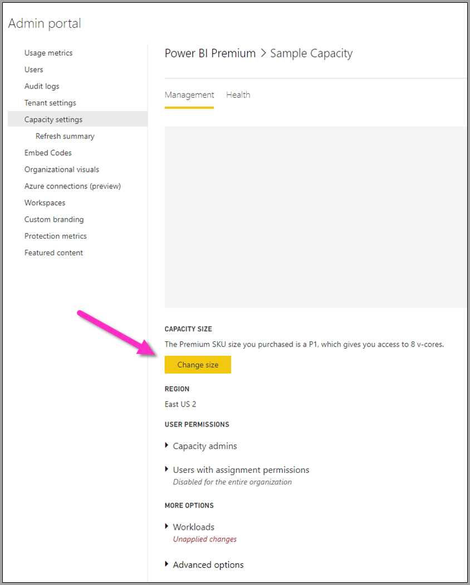

# Power BI Premium-workloads configureren

In uw Power BI Premium-abonnement kunt u gegevensstroomworkloads maken. Power BI gebruikt het concept van *workloads* om Premium-inhoud te beschrijven. Workloads zijn gegevenssets, gepagineerde rapporten, gegevensstromen en AI. Met de workload voor *gegevensstromen* kunt u de zelfservice voor gegevensvoorbereiding voor gegevensstromen gebruiken om gegevens op te nemen, te transformeren, te integreren en te verrijken. Power BI Premium-gegevensstromen worden beheerd in de **Beheerportal**.

In de volgende secties wordt beschreven hoe u gegevensstromen in uw organisatie kunt instellen, hoe u de instellingen ervan kunt aanpassen in uw Premium-capaciteit en krijgt u instructies voor algemeen gebruik.

## Gegevensstromen inschakelen in Power BI Premium

De eerste vereiste om gegevensstromen te gebruiken in uw Power BI Premium-abonnement, is dat u het maken en gebruiken van gegevensstromen voor uw organisatie inschakelt. Selecteer **Tenantinstellingen** in de **Beheerportal** en schakel de schuifregelaar onder **Gegevensstroominstellingen** naar **Ingeschakeld**, zoals wordt weergegeven in de volgende afbeelding.

Nadat u de workload voor gegevensstromen hebt ingeschakeld, wordt deze geconfigureerd met de standaardinstellingen. U kunt deze instellingen naar wens aanpassen. In de volgende stappen leest u waar deze instellingen zijn te vinden en beschrijven we deze. U leest wanneer u de waarden kunt wijzigen om de prestaties van uw gegevensstroom te optimaliseren.

## Gegevensstroominstellingen verfijnen

Zodra gegevensstromen zijn ingeschakeld, kunt u de **Beheerportal** gebruiken om te wijzigen, of verfijnen, hoe gegevensstromen worden gemaakt en hoe ze resources gebruiken in uw Power BI Premium-abonnement. In de volgende stappen ziet u hoe u de gegevensstroominstellingen kunt aanpassen.

1. Selecteer in de **Beheerportal** de optie **Tenantinstellingen** om alle gemaakte capaciteiten weer te geven. Selecteer een capaciteit om de instellingen ervan te beheren.

    

2. Uw Power BI Premium-capaciteit weerspiegelt de beschikbare resources voor uw gegevensstromen. U kunt de grootte van uw capaciteit wijzigen door de knop **Formaat wijzigen** te selecteren, zoals wordt weergegeven in de volgende afbeelding.

    

3. In Instellingen voor capaciteit kunt u de instellingen voor de gegevensstroom configureren door **Workloads** uit te vouwen.

    

4. Ga in de sectie **Workloads** naar het gebied **Gegevensstromen**. In de volgende afbeelding ziet u de instellingen die u kunt gebruiken om het gedrag van de gegevensstroomworkloads voor uw capaciteit te beheren of te verfijnen.

    

In de volgende tabel ziet u een basisbeschrijving van de instellingen voor gegevensstromen.

| **Sectie voor beheerders** | **Naam van de instelling** | **Beschrijving** |
|---------|---------|---------|
| **Capaciteitsgrootte** | **Formaat wijzigen** | De huidige geselecteerde capaciteit wordt weergegeven, met opties om de capaciteit te wijzigen. Als u deze instelling wijzigt, kan de capaciteit omhoog of omlaag worden geschaald. |
| **Workload** | **Maximaal geheugen (%)** | Het maximale percentage beschikbaar geheugen dat door gegevensstromen in een capaciteit kan worden gebruikt. |
| **Workload** | **Verbeterde rekenengine voor gegevensstromen** | Schakel deze optie in voor tot 20x snellere berekening van berekende entiteiten als u grootschalige gegevensvolumes gebruikt.  **U moet de capaciteit opnieuw opstarten om de nieuwe engine te activeren.**  Zie [Verbeterde rekenengine voor gegevensstromen](../../admin/service-admin-premium-workloads.md#enhanced-dataflows-compute-engine) voor meer informatie. |
| **Workload** | **Containergrootte** | De maximumgrootte van de container die door gegevensstromen wordt gebruikt voor elke entiteit in de gegevensstroom. De standaardwaarde is 700 MB. Zie [Containergrootte](../../admin/service-admin-premium-workloads.md#container-size) voor meer informatie. |
| **Workload** | **Geheugen van rekenengine (%)** | Het maximum percentage geheugen dat is toegewezen aan de rekenengine. De standaardwaarde is 30% |

In de volgende secties worden alle instellingen uitgebreid beschreven. U leest ook hoe deze van invloed zijn op de workload van uw gegevensstroom.

### Opties voor gegevensstroomworkloads

Een eenvoudige manier om naar de opties voor gegevensstroomworkloads te kijken, is door middel van een analogie. De *Capaciteitsgrootte*, of het type Power BI Premium-exemplaar dat u hebt, kunt u zien als uw *restaurant*. In uw restaurant hebt u uw *workloadgeheugen*. Dit is uw *keuken*. De *rekenengine* is uw *oven*. En de *container*, ten slotte, is de kwaliteit van uw *chef-kok*. Stelt u zich eens voor dat u een maaltijd voorbereidt voor een groot, belangrijk diner als een manier om de opties voor de gegevensstroomworkload te evalueren. Er komen belangrijke gasten en het diner moet klaar staan om te worden geserveerd op het moment dat ze binnenkomen.

We gebruiken deze restaurantanalogie om de instellingen uit te leggen. We beginnen op het hoogste niveau: uw Premium-capaciteit. Dit is namelijk de eerste keus die u maakt wanneer u Power BI Premium gebruikt.

#### Premium-capaciteit SKU's: de hardware omhoog schalen

Power BI Premium-workloads gebruiken een combinatie van front-end- en back-endcores voor snelle query's over de verschillende typen workloads. In het artikel over [capaciteitsknooppunten](../../admin/service-premium-what-is.md#capacity-nodes) staat een grafiek met de huidige specificaties voor elk van de beschikbare workloadaanbiedingen. Capaciteiten van A3 en hoger kunnen profiteren van de rekenengine, dus als u de verbeterde rekenengine wilt gebruiken, begint u daar - [Capaciteitsknooppunten](../../admin/service-premium-what-is.md#capacity-nodes). 

In onze restaurantanalogie kunt u het kiezen van een capaciteit vergelijken met het kiezen van een kwalitatief beter restaurant. Hoewel het duurder is, kunt u een hoger prestatieniveau verwachten vanwege meer front-endcores, back-endcores en meer geheugen. Wanneer u naar een groter restaurant gaat, is er een grotere keuken met betere chefs-koks, analoog aan upgraden naar een hogere SKU in Power BI Premium, waardoor u de CPU-snelheid kunt verhogen, het geheugen per bewerking kunt vergroten en meer parallellisme kunt toevoegen.

#### Maximaal geheugen: een capaciteit voor gegevensstromen toewijzen 

De instelling **Maximumgeheugenpercentage** is het percentage geheugen buiten het fysieke geheugen om dat beschikbaar is voor de Premium-capaciteit, dat wordt geboden voor gegevensstromenworkloads. U kunt effectief tot de volledige capaciteit voor een gegevensstroomworkload toewijzen. De capaciteit wordt dynamisch geschaald naar behoefte ten opzichte van de toewijzing die u hebt ingesteld. Als u, in onze analogie, uw keuken groter maakt, kunt u meer maaltijden bereiden. Op dezelfde manier kunt u ook de workloadgrootte van uw capaciteit voor gegevensstromen vergroten en meer gegevensstromen toestaan. Hoewel er sprake is van dynamisch resourcebeheer, kunt u met de configuratie-optie *Maximumgeheugenpercentage* 100% van het geheugen toewijzen aan de gegevensstroomworkload. Dit voor het zeldzame geval dat u er zeker van wilt zijn dat het geheugen van de capaciteit beschikbaar is voor de gegevensstroomworkload, in plaats van dat u vertrouwt op resourcebeheer. Teruggrijpend naar onze analogie is dit te vergelijken met ervoor zorgen dat uw keuken zich bezighoudt met het bereiden van een specifieke maaltijd voor een gast, waarbij de volledige keuken zich wijdt aan deze taak. De mogelijkheid om meer toe te wijzen, betekent natuurlijk niet dat het eten beter is, of dat de maaltijden sneller op tafel staan, zoals in de volgende sectie wordt uitgelegd.

#### Containergrootte: problemen met vernieuwen of geen geheugen

We gaan nu de instelling **Containergrootte (Mb)** bespreken. Gegevensstromen gebruiken intern een proces met de naam *mashup-containers* om uw ETL-processen te evalueren. De engine splitst uw querylogica op in deze containers en ze worden parallel verwerkt. Het aantal containers zorgt voor een efficiënte gelijktijdige verwerking en verhoogt de prestaties. Deze containers worden eerst beperkt door de **Capaciteit**, ten tweede door de instelling **Maximumgeheugenpercentage** en vervolgens door de hoeveelheid geheugen die u er specifiek aan toewijst in de containerinstelling, die standaard 700Mb is. Het is dus mogelijk om de hoeveelheid hardwaregeheugen te verhogen en de containergrootte te vergroten, maar hierdoor wordt het aantal parallelle bewerkingen minder en wordt er meer geheugen toegewezen voor het specifieke ETL-proces in uw containers. Het aantal containers wordt beperkt tot driemaal het aantal back-endcores. Dit is belangrijk, omdat u de container niet erg klein kunt maken en tot voorbij dat punt een groot aantal parallelle containers kunt hebben. De minimale grootte van een container is 200 MB. De containergrootte is ook toegewezen aan een queryniveau, wat betekent dat elke query wordt uitgevoerd in een eigen container, behalve wanneer query's verwijzen naar andere query's. In dat geval worden ze vernieuwd als onderdeel van dezelfde container.

We kijken weer naar de analogie: met in de keuken minder koks, die wel meer gefocuste zijn, kunt u veel sneller een maaltijd bereiden, afhankelijk van de soorten bestellingen die worden geplaatst en hoe ingewikkeld de maaltijd is. Het compromis hier is dat er minder chef-koks zijn, maar meer gerichte tijd voor bereiding. Op dezelfde manier kan het vergroten van de containergrootte tot 1200-1500 MB betekenen dat een kleiner aantal complexere ETL-taken (activiteiten zoals aggregaties, samenvoegingen, draaitabellen, rij- of kolombewerkingen), een prestatieverhoging kunnen leveren naarmate er meer geheugen beschikbaar is voor elke container, maar in dat geval vermindert u het aantal containers. Zoals de analogie ook impliceert, kunnen te veel bestellingen de keuken juist vertragen. Zo kunt u ook containergrootte zien: gebruik dit wanneer u wilt dat complexe entiteitsbewerkingen worden voltooid en u bereid bent om parallellisme in te ruilen voor prestatie, want door deze resource te vergroten, wordt het geheugen namelijk toegewezen aan minder containers.

Samenvattend, kunt u de containergrootte het beste optimaliseren op basis van de query's die worden gebruikt. Wanneer u bijvoorbeeld eenvoudig gegevens vanuit een bron naar een entiteit laadt, hoeven er geen gegevens te worden binnengehaald en hoeven er geen bewerkingen te worden uitgevoerd en worden de gegevens alleen maar geladen naar opslag. In een dergelijke situatie wilt u zoveel mogelijk parallellisme, omdat u de snelheid van de laad- en vernieuwingsbewerkingen wilt verhogen. Als u echter meer transformatiebewerkingen toevoegt (complexe filters, samenvoegingen, aggregaties), kan het geheugen veel hoger zijn, omdat we mogelijk enkele van deze transformatiebewerkingen in het geheugen moeten verwerken. Houd er rekening mee dat als er andere gegevensstroombewerkingen worden uitgevoerd op de capaciteit, dit deze bewerkingen kan vertragen en ervoor kan zorgen dat ze in de wachtrij worden geplaatst voor een uitvoeringssleuf. Het bewaken en beheren van gegevensstromen, vernieuwingsprestaties en de volledige capaciteit wordt daarbij ondersteund door de app **Power BI Premium Capacity Metrics**. U kunt de app [Power BI Premium-app voor metrische gegevens van capaciteit](../../admin/service-premium-capacity-optimize.md#what-content-is-using-up-my-capacity) gebruiken om de inhoud op capaciteit te filteren en de metrische gegevens over de prestaties voor inhoud uit de werkruimte controleren. U kunt de prestatiemetrieken en het resourcegebruik per uur controleren voor de afgelopen zeven dagen, voor alle inhoud die in een Premium-capaciteit is opgeslagen. Wat betreft het onderzoeken van de prestaties van gegevensstromen, wordt daarom aanbevolen om met de app te beginnen.

#### Verbeterde rekenengine: een mogelijkheid om de prestaties te verbeteren

In onze analogie is de [verbeterde rekenengine](dataflows-premium-features.md#the-enhanced-compute-engine) te vergelijken met een oven. Power BI gebruikt een rekenengine om uw query's en vernieuwingsbewerkingen te verwerken. De verbeterde rekenengine is een verbetering ten opzichte van de standaardengine. De engine werkt door gegevens naar een SQL-cache te laden en maakt gebruik van SQL om entiteitstransformatie te versnellen, bewerkingen te vernieuwen en DirectQuery-connectiviteit mogelijk te maken. Als we de engines vergelijken met ovens, kunt u, wanneer u de verbeterde oven gebruikt, mogelijk sneller en effectiever maaltijden bereiden. Indien ingesteld op **Aan** of **Geoptimaliseerd** voor berekende entiteiten, kan Power BI, als de bedrijfslogica dat toestaat, gebruikmaken van SQL om de prestaties te versnellen. Wanneer de engine staat ingesteld op **Aan**, hebt u ook DirectQuery-connectiviteit. Zoals blijkt uit de analogie is voor bepaalde maaltijden geen oven nodig of hoeft de over niet te worden gebruikt. U kunt de verbeterde rekenengine op een vergelijkbare manier zien: zorg ervoor dat uw gegevensstroomverbruik op de juiste manier gebruikmaakt van de verbeterde rekenengine.

> [!NOTE]
> De verbeterde rekenengine is nog niet beschikbaar in alle regio's.

## Richtlijnen voor algemene scenario's

In deze sectie vindt u richtlijnen voor veelvoorkomende scenario's voor het gebruik van gegevensstroomworkloads met Power BI Premium.

### Trage vernieuwingstijden

Trage vernieuwingstijden zijn doorgaans een probleem met parallelle uitvoering. Controleer de volgende opties, in de aangegeven volgorde:

1. Een belangrijk concept voor trage vernieuwingstijden is de aard van uw gegevensvoorbereiding. Stelt u zich naar aanleiding van onze eerder uiteengezette restaurantanalogie voor dat de maaltijden al zijn bereid, klaar om te worden geserveerd. In dit scenario kan het eten veel sneller worden bereidt door minimale voorbereidingstijd. En wanneer u uw trage vernieuwingstijden kunt optimaliseren door gebruik te maken van uw gegevensbron die de voorbereiding en uitvoering van querylogica van tevoren doet, moet u dat doen. Wanneer u een relationele database als SQL gebruikt als uw bron, kunt u kijken of de oorspronkelijke query kan worden uitgevoerd op de bron en vervolgens die bronquery gebruiken voor de oorspronkelijke extractiegegevensstroom voor de gegevensbron. Als u geen systeemeigen query kunt gebruiken in het bronsysteem, voert u bewerkingen uit die de [engine voor gegevensstromen kan insluiten in de gegevensbron](/power-query/power-query-folding).

2. Evalueer het verspreiden van vernieuwingstijden op dezelfde capaciteit. Vernieuwingsbewerkingen zijn een proces waarvoor een aanzienlijke rekenkracht vereist is. Met behulp van onze restaurantanalogie kunnen we het verspreiden van vernieuwingstijden vergelijken met het beperken van het aantal gasten in uw restaurant. Net zoals restaurants voor gasten een tafel reserveren en de capaciteit plannen, kunt u ook overwegen om vernieuwingsbewerkingen uit te voeren op momenten wanneer het gebruik niet op het hoogtepunt is. Op die manier kunt u de belasting van de capaciteit verlichten.

3. Verhoog de totale hoeveelheid geheugen die aan de workload is gegeven. U kunt dit zien als de grootte van de keuken. Het verfijnen van deze resource is vergelijkbaar met het aanpassen van het aantal chef-koks dat in de keuken past. Dit doet u door de instelling **Maximumgeheugenpercentage** aan te passen en de waarde te verhogen tot 100%.

4. Verlaag de hoeveelheid geheugen naar de container, waardoor meer containers zijn toegestaan. U kunt dit als volgt zien: in plaats van een beroemde chef-kok als Gordon Ramsey aan te nemen, kunt u ook meerdere goede, maar goedkopere chef-koks aannemen. U hebt dan meer koks in de keuken, maar deze chef-koks kunnen alleen kleinere taken uitvoeren. U hebt dan meer containers, maar minder geheugen.

5. Voer beide stappen hiervoor uit, voor een nog hogere mate van parallellisme, omdat u meer koks en een grotere keuken krijgt.
    
6. Als de stappen in deze sectie niet de gewenste mate van parallellisme bieden, kunt u uw capaciteit upgraden naar een hogere SKU. Volg vervolgens de eerdere stappen in deze sectie opnieuw.

### Uitzonderingen met betrekking tot onvoldoende geheugen

Wanneer u te maken krijgt met **uitzonderingen met betrekking tot onvoldoende geheugen**, moet u de prestaties van de containers en het geheugen verhogen. Voer de volgende stappen uit.

1. Vergroot het geheugen van de container. Dit is vergelijkbaar met het in dienst hebben van één sterrenkok versus meerdere koks, zoals beschreven in de vorige sectie.

2. Vergroot het geheugen voor de workload en meer geheugen voor de container. In onze analogie krijgt u dan een grotere keuken en betere chef-koks.

3. Als deze wijzigingen niet de gewenste mate van parallellisme bieden, overweeg dan een hogere Power BI Premium SKU.

### De rekenengine gebruiken om de prestaties te verbeteren

Voer de volgende stappen uit zodat workloads de rekenengine kunnen activeren en altijd de prestaties verbeteren:

**Voor berekende en gekoppelde entiteiten in dezelfde werkruimte:**

1. In het geval van *gegevensopname* moet u de gegevens zo snel mogelijk in de opslag zien te krijgen, waarbij u alleen filters gebruikt als ze de totale grootte van de gegevensset verlagen. Het is een best practice om uw transformatielogica gescheiden te houden van deze stap en de engine in staat te stellen zich te richten op de initiële verzameling van ingrediënten. Scheid vervolgens uw transformatie en bedrijfslogica in een afzonderlijke gegevensstroom in dezelfde werkruimte, met behulp van gekoppelde of berekende entiteiten. Hierdoor kan de engine uw berekeningen activeren en versnellen. In onze analogie is dit te vergelijken met het bereiden van eten in de keuken; voedselbereiding is over het algemeen een afzonderlijke en aparte stap van het verzamelen van de onbewerkte ingrediënten en een vereiste om het eten in de oven te kunnen zetten. Op dezelfde manier moet uw logica afzonderlijk worden voorbereid voordat deze kan profiteren van de rekenengine.

2. Zorg ervoor dat u de bewerkingen uitvoert die insluiten, zoals samenvoegingen, koppelingen, conversie en [andere](/power-query/power-query-folding#transformations-that-can-achieve-folding).

3. Gegevensstromen bouwen [binnen gepubliceerde richtlijnen en beperkingen](dataflows-features-limitations.md#dataflows-in-premium).

U kunt ook DirectQuery gebruiken.

### Rekenengine is ingeschakeld, maar de prestaties zijn traag

Voer de volgende stappen uit wanneer u scenario's onderzoekt waarin de rekenengine aan is, maar u te maken hebt met tragere prestaties:

1. Beperk berekende en gekoppelde entiteiten die in de werkruimte bestaan.

2. Als de eerste vernieuwing wordt uitgevoerd met de rekenengine ingeschakeld, worden gegevens geschreven in de lake en in de cache. Deze dubbele schrijfbewerking brengt met zich mee dat deze vernieuwingen langzamer zijn.

3. Als u een gegevensstroom hebt die is gekoppeld aan meerdere gegevensstromen, moet u ervoor zorgen dat u de vernieuwingen van de brongegevensstromen plant zodat ze niet allemaal tegelijkertijd vernieuwen.

## Volgende stappen
De volgende artikelen bieden meer informatie over gegevensstromen en Power BI:

* [Inleiding tot gegevensstromen en selfservice voor gegevensvoorbereiding](dataflows-introduction-self-service.md)
* [Een gegevensstroom maken](dataflows-create.md)
* [Een gegevensstroom configureren en gebruiken](dataflows-configure-consume.md)
* [Gegevensstroomopslag configureren voor gebruik van Azure Data Lake Gen 2](dataflows-azure-data-lake-storage-integration.md)
* [AI met gegevensstromen](dataflows-machine-learning-integration.md)
* [Beperkingen en overwegingen van gegevensstromen](dataflows-features-limitations.md)