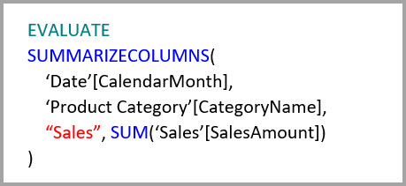

# Aggregaties in Power BI Desktop gebruiken

*Met aggregaties* in Power BI kunt u de grootte van tabellen beperken, zodat u zich op belangrijke gegevens kunt concentreren en de prestaties van query's kunt verbeteren. Met aggregaties kunnen interactieve analyses van big data op manieren worden uitgevoerd, die anders onmogelijk waren en kunnen de kosten van het ontgrendelen van grote gegevenssets voor besluitvorming aanzienlijk worden verminderd.

Enkele voordelen van het gebruik van aggregaties zijn:

- **Betere prestaties van query’s op big data**. Na elke interactie met visuele Power BI-elementen worden DAX-query's naar de gegevensset verzonden. Geaggregeerde gegevens in cache maken gebruik van een fractie van de resources die nodig zijn voor detailgegevens, zodat u big data kunt ontgrendelen die anders ontoegankelijk zouden zijn.
- **Geoptimaliseerde gegevensvernieuwing**. Kleinere cachegroottes zorgen voor een kortere vernieuwingstijd, zodat gegevens sneller beschikbaar zijn voor gebruikers.
- **Evenwichtige architecturen**. Het in cachegeheugen van Power BI kan geaggregeerde query's verwerken, waardoor minder query's in de DirectQuery-modus worden verzonden en u kunt voldoen aan de gelijktijdigheidslimieten. De resterende query's op detailniveau zijn vaak gefilterde query's op transactioneel niveau, die datawarehouses en big data-systemen over het algemeen goed kunnen verwerken.

Driedimensionale gegevensbronnen, zoals datawarehouses en datamarts, kunnen gebruikmaken van [op relatie gebaseerde aggregaties](#aggregation-based-on-relationships). Op Hadoop gebaseerde big data-bronnen gebruiken vaak [aggregaties op basis van GroupBy-kolommen](#aggregation-based-on-groupby-columns). In dit artikel worden voor elk type gegevensbron doorsnee modelleringsverschillen in Power BI beschreven.

## Een samengevoegde tabel maken

Een samengevoegde tabel maken:
1. Stel een nieuwe tabel samen met de velden die u wilt, afhankelijk van uw gegevensbron en -model. 
1. Definieer de aggregaties met het dialoogvenster **Aggregaties beheren**.
1. Wijzig, indien van toepassing, de [opslagmodus](#storage-modes) voor de samengevoegde tabel. 

### Aggregaties beheren

Klik, nadat u de nieuwe tabel met de gewenste velden hebt gemaakt, in het deelvenster **Velden** van een willekeurige weergave van Power BI Desktop met de rechtermuisknop op de tabel en selecteer **Aggregaties beheren**.

In het dialoogvenster **Aggregaties beheren** ziet u een rij voor elke kolom in de tabel, waar u het aggregatiegedrag kunt opgeven. In het volgende voorbeeld worden query's naar de detailtabel **Sales** intern omgeleid naar de aggregatietabel **Sales Agg**. 

De vervolgkeuzelijst **Samenvatting** in het dialoogvenster **Aggregaties beheren** bevat de volgende waarden:
- Count
- GroupBy
- Max
- Min
- Sum
- Aantal tabelrijen

In dit op relaties gebaseerde aggregatievoorbeeld zijn de GroupBy-vermeldingen optioneel. Op DISTINCTCOUNT na zijn ze niet van invloed op aggregatiegedrag en zijn ze voornamelijk bedoeld voor de leesbaarheid. Zonder de GroupBy-vermeldingen worden de aggregaties nog steeds geraakt op basis van de relaties. Dit wijkt af van het [big data-voorbeeld](#aggregation-based-on-groupby-columns) verderop in dit artikel, waarbij de GroupBy-vermeldingen vereist zijn.

Nadat u de gewenste aggregaties hebt gedefinieerd, selecteert u **Alles toepassen**. 

### Validaties

Met het dialoogvenster **Aggregaties beheren** dwingt u de volgende belangrijke validaties af:

- De **Detailkolom** moet hetzelfde gegevenstype hebben als de **Aggregatiekolom**, met uitzondering van de **Samenvattingsfuncties** Aantal en Aantal tabelrijen. Aantal en Aantal tabelrijen zijn alleen beschikbaar voor integere aggregatiekolommen. Hiervoor is geen overeenkomend gegevenstype vereist.
- Gekoppelde aggregaties die betrekking hebben op drie of meer tabellen zijn niet toegestaan. Aggregaties voor **Tabel A** kunnen bijvoorbeeld niet verwijzen naar een **Tabel B** met aggregaties die verwijzen naar een **Tabel C**.
- Dubbele aggregaties waarbij twee vermeldingen dezelfde **Samenvattingsfunctie** gebruiken en naar dezelfde **Detailtabel** en **Detailkolom** verwijzen, zijn niet toegestaan.
- De **Detailtabel** moet de DirectQuery-opslagmodus gebruiken, niet Import.
- Er is geen ondersteuning voor het groeperen op een refererende sleutelkolom die wordt gebruikt door een inactieve relatie en afhankelijk is van de functie USERELATIONSHIP voor aggregatietreffers.

De meeste validaties worden afgedwongen door het uitschakelen van de waarden van de vervolgkeuzelijst en door verklarende tekst weer te geven in de knopinfo, zoals in de volgende afbeelding.

### Aggregatietabellen zijn verborgen

Gebruikers met alleen-lezentoegang tot de gegevensset kunnen geen aggregatietabellen opvragen. Dit voorkomt beveiligingsproblemen bij gebruik van *beveiliging op rijniveau (Row Level Security, RLS)* . Gebruikers en query's verwijzen naar de detailtabel, niet de aggregatietabel, en hoeven niets te weten over de aggregatietabel.

Daarom komen aggregatietabellen niet voor in de **Rapportageweergave**. Als de tabel nog niet is verborgen, dan wordt deze via het dialoogvenster **Aggregaties beheren** ingesteld op verborgen wanneer u **Alles toepassen** selecteert.

### Opslagmodi
De aggregatiefunctie communiceert met opslagmodi op tabelniveau. Power BI-tabellen kunnen gebruikmaken van de opslagmodi *DirectQuery*, *Import* of *Dual*. Met DirectQuery voert u rechtstreeks een query uit op de back-end, terwijl u met Import gegevens in het cachegeheugen opslaat en query's naar de gegevens in de cache verzendt. Alle Power BI Import- en niet-multidimensionale DirectQuery-gegevensbronnen kunnen met aggregaties werken. 

Als u de opslagmodus van een geaggregeerde tabel op Import wilt instellen om query's sneller te laten verlopen, selecteert u de samengevoegde tabel in Power BI Desktop in de weergave **Model**. Vouw in het deelvenster **Eigenschappen** **Geavanceerd** uit, toon de vervolgkeuzelijst van **Opslagmodus** en selecteer **Import**. Houd er rekening mee dat deze actie niet kan worden teruggedraaid. 

Zie het artikel [Opslagmodus beheren in Power BI Desktop](desktop-storage-mode.md) voor meer informatie over tabelopslagmodi.

### RLS voor aggregaties

Als u correct wilt werken voor aggregaties, moeten zowel de aggregatietabel als de detailtabel met RLS-expressies (Row Level Security, beveiliging op rijniveau) worden gefilterd. 

In het volgende voorbeeld werkt de RLS-expressie voor de tabel **Geografie** voor aggregaties, omdat Geografie zich aan de filterzijde bevindt van relaties met zowel de tabel **Sales** als de tabel **Sales Agg**. RLS wordt succesvol toegepast op zowel query's met als zonder treffers in de aggregatietabel.

Met een RLS-expressie voor de tabel **Product** wordt alleen de detailtabel **Sales** gefilterd, niet de samengevoegde tabel **Sales Agg**. Omdat de samenvoegingstabel een andere weergave is van de gegevens in de detailtabel, zou het onveilig zijn om query's uit de aggregatietabel te beantwoorden als het RLS-filter niet kan worden toegepast. Het filteren van alleen de detailtabel wordt niet aanbevolen, omdat gebruikersquery's van deze rol niet profiteren van aggregatietreffers. 

Een RLS-expressie waarmee alleen de aggregatietabel **Sales Agg** zou worden gefilterd en niet de detailtabel **Sales**, is niet toegestaan.

Een RLS-expressie die is toegepast op de detailtabel voor [aggregaties gebaseerd op GroupBy-kolommen](#aggregation-based-on-groupby-columns), kan worden gebruikt om de aggregatietabel te filteren, omdat alle GroupBy-kolommen in de aggregatietabel worden gedekt door de detailtabel. Aan de andere kant kan een RLS-filter voor de samenvoegingstabel niet worden toegepast op de detailtabel en is dus niet toegestaan.

## Aggregatie op basis van relaties

*Aggregaties op basis van relaties* worden meestal gebruikt met dimensionale modellen. Power BI-gegevenssets van datawarehouses en datamarts lijken op ster-/snowflake-schema's met relaties tussen dimensietabellen en feitentabellen.

In het volgende model van een enkele gegevensbron worden de tabellen gebruikt in de DirectQuery-opslagmodus. De feitentabel **Sales** bevat miljarden rijen. Wanneer de opslagmodus van **Sales** voor opslaan in cache zou worden ingesteld op Import, zou dat een aanzienlijke hoeveelheid geheugen gebruiken en leiden tot beheeroverhead.

Maak in plaats daarvan de aggregatietabel **Sales Agg**. Het aantal rijen in de tabel **Sales Agg** is gelijk zijn aan de som van **SalesAmount** gegroepeerd op **CustomerKey**, **DateKey** en **ProductSubcategoryKey**. De tabel **Sales Agg** heeft een hogere granulariteit dan **Sales**. In plaats van miljarden kan het dus miljoenen rijen bevatten, die veel gemakkelijker te beheren zijn.

Als de volgende dimensietabellen het meest worden gebruikt voor de query's met een hoge bedrijfswaarde, kan **Sales Agg** worden gefilterd met behulp van *een-op-veel* of *veel-op-een*-relaties.

- Geografie
- Klant
- Date
- Productsubcategorie
- Productcategorie

De volgende afbeelding geeft een indruk van hoe dit model eruitziet.

In de volgende tabel ziet u de aggregaties voor de tabel **Sales Agg**.

> [!NOTE]
> De tabel **Sales Agg** heeft, net als elke tabel, de flexibiliteit om op verschillende manieren te worden geladen. De aggregatie kan worden uitgevoerd in de brondatabase met ETL/ELT-processen of door de [M-expressie](/powerquery-m/power-query-m-function-reference) voor de tabel. Voor de samengevoegde tabel kan de Import-opslagmodus worden gebruikt met of zonder [incrementeel vernieuwen in Power BI Premium](../admin/service-premium-incremental-refresh.md), of kan DirectQuery worden gebruikt en geoptimaliseerd voor snelle query's met behulp van [columnstore-indexen](/sql/relational-databases/indexes/columnstore-indexes-overview). Deze flexibiliteit maakt evenwichtige architecturen mogelijk die querybelasting kunnen verspreiden om knelpunten te voorkomen.

Als u de opslagmodus van de samengevoegde tabel **Sales agg** wijzigt in **Import** wordt een dialoogvenster geopend, waarin wordt gemeld dat de gerelateerde dimensietabellen kunnen worden ingesteld op de opslagmodus *Dual*. 

Als u de gerelateerde dimensietabellen instelt op Dual, kunnen ze fungeren als Import of als DirectQuery, afhankelijk van de subquery. In het voorbeeld:

- Query's waarmee metrische gegevens van de Importmodustabel **Sales Agg** worden geaggregeerd en gegroepeerd op kenmerk(en) van de gerelateerde Dual-tabellen, kunnen worden geretourneerd uit het cachegeheugen.
- Query's waarmee metrische gegevens van de DirectQuery-tabel **Sales** worden geaggregeerd en gegroepeerd op kenmerk(en) van de gerelateerde Dual-tabellen, kunnen worden geretourneerd in DirectQuery-modus. De querylogica, inclusief de GroupBy-bewerking, wordt doorgegeven aan de brondatabase.

Zie het artikel [Opslagmodus beheren in Power BI Desktop](desktop-storage-mode.md) voor meer informatie over de opslagmodus Dual.

### Reguliere vs. beperkte relaties

Voor aggregatietreffers op basis van relaties zijn reguliere relaties vereist.

Reguliere relaties bevatten onder andere de volgende opslagmoduscombinaties, waarbij beide tabellen afkomstig zijn uit één bron:

| Tabel aan de *veel*-zijden | Tabel aan de *1*-zijde |
| ------------- |----------------------| 
| Dual          | Dual                 | 
| Importeren        | Importeren of Dual       | 
| DirectQuery   | DirectQuery of Dual  | 

Een relatie tussen *meerdere bronnen* wordt alleen als regulier beschouwd als beide tabellen worden ingesteld op Import. Veel-op-veel-relaties worden altijd als beperkt beschouwd.

Voor aggregatietreffers gebaseerd op *meerdere bronnen* die niet afhankelijk zijn van relaties, raadpleegt u [Aggregaties op basis van GroupBy-kolommen](#aggregation-based-on-groupby-columns). 

### Voorbeelden van aggregatiequery's op basis van een relatie

De volgende query raakt de aggregatie, omdat kolommen in de tabel **Date** op de granulariteit zijn die de aggregatie kan raken. In de kolom **SalesAmount** wordt de aggregatie **Sum** gebruikt.

De volgende query raakt de aggregatie niet. Ondanks het feit dat de som van **SalesAmount** wordt aangevraagd, voert de query een GroupBy-bewerking uit op een kolom in de tabel **Product**, die zich niet op de granulariteit bevindt die de aggregatie kan raken. Als u de relaties in het model observeert, kan een productsubcategorie meerdere rijen **Product** hebben. De query zou niet in staat zijn om te bepalen naar welk product moet worden geaggregeerd. In dit geval wordt de query teruggezet op DirectQuery en verzendt een SQL-query naar de gegevensbron.

Aggregaties zijn niet alleen geschikt voor eenvoudige berekeningen die een eenvoudige som uitvoeren. Complexe berekeningen kunnen ook profiteren. Conceptueel gezien wordt een complexe berekening onderverdeeld in subquery's voor elke SUM, MIN, MAX en COUNT, en wordt elke subquery beoordeeld om te bepalen of deze de aggregatie kan raken. Deze logica geldt niet voor alle gevallen vanwege optimalisatie van het queryplan, maar in het algemeen kan die worden toegepast. Het volgende voorbeeld raakt de aggregatie:

De functie COUNTROWS kan profiteren van aggregaties. De volgende query raakt de aggregatie, omdat er een aggregatie **Aantal tabelrijen** is gedefinieerd voor de tabel **Sales**.

De functie AVERAGE kan profiteren van aggregaties. De volgende query raakt de aggregatie, omdat AVERAGE intern wordt gevouwen tot een SUM gedeeld door een COUNT. Omdat de kolom **UnitPrice** aggregaties heeft gedefinieerd voor zowel SUM als COUNT, wordt de aggregatie geraakt.

In sommige gevallen kan de functie DISTINCTCOUNT profiteren van aggregaties. De volgende query raakt de aggregatie omdat er een group by-vermelding is voor **CustomerKey**, die de onderscheidbaarheid van **CustomerKey** in de aggregatietabel behoudt. Deze techniek zou nog steeds de drempelwaarde voor prestaties kunnen bereiken, waarbij meer dan twee tot vijf miljoen afzonderlijke waarden invloed kunnen hebben op de queryprestaties. Het kan echter nuttig zijn in scenario's waarbij er miljarden rijen in de detailtabel staan, maar twee tot vijf miljoen afzonderlijke waarden in de kolom. In dit geval kan de DISTINCTCOUNT sneller worden uitgevoerd dan het scannen van de tabel met miljarden rijen, zelfs als deze in het cachegeheugen zijn opgeslagen.

Time intelligence-functies in DAX zijn geschikt voor aggregatie. Met de volgende query wordt de aggregatie gevonden, omdat de functie DATESYTD een tabel van **CalendarDay**-waarden genereert, en de aggregatietabel zich op een granulatieniveau bevindt dat Group-by-kolommen aan kan in de tabel **Datum**. Dit is een voorbeeld van een tabelwaardefilter voor de functie CALCULATE die kan worden gebruikt met aggregaties.

## Aggregatie op basis van GroupBy-kolommen 

Op Hadoop gebaseerde big data-modellen hebben andere kenmerken dan dimensionale modellen. Om joins tussen grote tabellen te voorkomen, worden in big data-modellen vaak geen relaties gebruikt, maar worden dimensiekenmerken op feitentabellen gedenormaliseerd. U kunt dergelijke big data-modellen ontgrendelen voor interactieve analyses door *aggregaties op basis van GroupBy-kolommen* te gebruiken.

De volgende tabel bevat de numerieke kolom **Movement** die moet worden geaggregeerd. Alle andere kolommen zijn kenmerken waarop moet worden gegroepeerd. De tabel bevat IoT-gegevens en een enorm groot aantal rijen. De opslagmodus is DirectQuery. Vanwege het enorme volume zijn query's op de gegevensbron die worden samengevoegd in de hele gegevensset traag. 

U kunt een aggregatietabel toevoegen, die groepeert op de meeste kenmerken om interactieve analyses op deze gegevensset in te schakelen maar kenmerken van hoge kardinaliteit, zoals lengtegraad en breedtegraad, uitsluit. Dit vermindert het aantal rijen aanzienlijk en is klein genoeg om eenvoudig in een geheugencache te passen. 

U definieert de aggregatietoewijzingen voor de tabel **Driver Activity Agg** in het dialoogvenster **Aggregaties beheren**. 

In aggregaties op basis van GroupBy-kolommen zijn de vermeldingen **GroupBy** niet optioneel. Zonder deze worden de aggregaties niet bereikt. Dit wijkt af van het gebruik van aggregaties op basis van relaties, waarbij de GroupBy-vermeldingen optioneel zijn.

In de volgende tabel ziet u de aggregaties voor de tabel **Driver Activity Agg**.

U kunt de opslagmodus van de geaggregeerde tabel **Driver Activity Agg** instellen op Import.

### Voorbeeld van aggregatiequery GroupBy

De volgende query raakt de aggregatie, omdat de kolom **Activity Date** wordt gedekt door de aggregatietabel. De functie COUNTROWS maakt gebruik van de aggregatie **Aantal tabelrijen**.

Met name voor modellen die filterkenmerken in feitentabellen bevatten, is het een goed idee om aggregaties van **Aantal tabelrijen** te gebruiken. Power BI kan query's indienen bij de gegevensset met behulp van COUNTROWS in gevallen waarin het niet expliciet wordt aangevraagd door de gebruiker. Het filterdialoogvenster geeft bijvoorbeeld het aantal rijen voor elke waarde aan.

## Gecombineerde aggregatietechnieken

U kunt de kolomtechnieken relaties en GroupBy voor aggregaties combineren. Voor aggregaties op basis van relaties kan worden vereist dat de gedenormaliseerde dimensietabellen worden gesplitst in meerdere tabellen. Als dit voor bepaalde dimensietabellen kostbaar of niet praktisch is, dan kunt u voor deze dimensies de benodigde kenmerken repliceren in de aggregatietabel en voor andere relaties gebruiken.

Het volgende model repliceert bijvoorbeeld **Maand**, **Kwartaal**, **Semester** en **Jaar** in de tabel **Sales Agg**. Er is geen relatie tussen **Sales Agg** en de tabel **Datum**, maar er zijn wel relaties met **Klant** en **Productsubcategorie**. De opslagmodus van **Sales Agg** is Import.

In de volgende tabel ziet u de vermeldingen die zijn ingesteld in het dialoogvenster **Aggregaties beheren** voor de tabel **Sales Agg**. De GroupBy-vermeldingen waarbij **Datum** de detailtabel is, zijn verplicht om aggregaties te raken voor query's waarmee de kenmerken van **Datum** worden gegroepeerd. Zoals in het vorige voorbeeld hebben de vermeldingen van **GroupBy** voor **CustomerKey** en **ProductSubcategoryKey** geen invloed op aggregatietreffers, met uitzondering van DISTINCTCOUNT, vanwege de aanwezigheid van relaties.

### Voorbeelden van gecombineerde aggregatiequery's

De volgende query raakt de aggregatie, omdat de aggregatietabel **CalendarMonth** dekt en **CategoryName** toegankelijk is via een-op-veel-relaties. **SalesAmount** gebruikt de aggregatie **SUM**.

De volgende query raakt de aggregatie niet, omdat de aggregatietabel **CalendarDay** niet dekt.

De volgende time-intelligencequery raakt de aggregatie niet, omdat de functie DATESYTD een tabel met **CalendarDay**-waarden genereert en de aggregatietabel **CalendarDay** niet dekt.

## Aggregatieprioriteit

Dankzij aggregatieprioriteit kunnen meerdere aggregatietabellen worden meegenomen door een enkele subquery.

Het volgende voorbeeld is een [samengesteld model](desktop-composite-models.md) met meerdere bronnen:

- De DirectQuery-tabel **Driver Activity** bevat meer dan een miljard rijen met IoT-gegevens afkomstig van een big data-systeem. Het levert drillthrough-query's om afzonderlijke IoT-readings in gecontroleerde filtercontexten weer te geven.
- De tabel **Driver Activity Agg** is een tussenliggende aggregatietabel in de modus DirectQuery. Deze bevat meer dan een miljard rijen in Azure SQL Data Warehouse en is geoptimaliseerd bij de bron met behulp van columnstore-indexen.
- De Import-tabel **Driver Activity Agg2** heeft een hoge granulatie, omdat er weinig group by-kenmerken zijn en de kardinaliteit laag is. Het aantal rijen kan zo laag als duizenden zijn, zodat deze gemakkelijk in een geheugencache passen. Deze kenmerken blijken te worden gebruikt door een hoogwaardig geavanceerd dashboard, zodat query's die ernaar verwijzen zo snel mogelijk zouden moeten zijn.

> [!NOTE]
> DirectQuery-aggregatietabellen die gebruikmaken van een andere gegevensbron van de detailtabel worden alleen ondersteund als de aggregatietabel uit een SQL Server-, Azure SQL- of Azure SQL Data Warehouse-bron komt.

De geheugen-footprint van dit model is relatief klein, maar het ontgrendelt een enorme gegevensset. Het vertegenwoordigt een architectuur met gelijke taakverdeling, omdat deze de querybelasting verspreidt over de onderdelen van de architectuur en ze benut op basis van hun sterke punten.

Het dialoogvenster **Aggregaties beheren** voor **Driver Activity Agg2** stelt het veld **Precedence** in op *10*, hetgeen hoger is dan voor **Driver Activity Agg**. De hogere prioriteitsinstelling houdt in dat query's die gebruikmaken van aggregaties, eerst **Driver Activity Agg2** in aanmerking nemen. Subquery's die niet de granulariteit hebben die kan worden beantwoord door **Driver Activity Agg2**, kijken in plaats daarvan naar **Driver Activity Agg**. Detailquery's die niet kunnen worden beantwoord door een van beide aggregatietabellen, worden omgeleid naar **Driver Activity**.

De tabel die is opgegeven in de kolom **Tabel met details** is **Driver Activity** en niet **Driver Activity Agg**, omdat ketenaggregaties niet zijn toegestaan.

In de volgende tabel ziet u de aggregaties voor de tabel **Driver Activity Agg2**.

## Detecteer of query’s op aggregaties wel of geen hit opleveren

SQL Profiler kan detecteren of query’s worden geretourneerd uit de opslag-engine van het cachegeheugen of door DirectQuery worden gepusht naar de gegevensbron. U kunt hetzelfde proces gebruiken om te detecteren of aggregaties worden geraakt. Zie [Query's op de cache die wel of geen hit opleveren](desktop-storage-mode.md#queries-that-hit-or-miss-the-cache) voor meer informatie. 

SQL Profiler biedt ook de `Query Processing\Aggregate Table Rewrite Query` uitgebreide gebeurtenis.

Het volgende JSON-codefragment toont een voorbeeld van de uitvoer van de gebeurtenis wanneer een aggregatie wordt gebruikt.

- **matchingResult** geeft aan dat de subquery een aggregatie heeft gebruikt.
- **dataRequest** toont de GroupBy-kolom(men) en geaggregeerde kolom(men) die de subquery heeft gebruikt.
- **toewijzing** toont de kolommen in de aggregatietabel waaraan is toegewezen.

## Houd caches gesynchroniseerd

Aggregaties die DirectQuery, Import en/of Dual-opslagmodi combineren, kunnen verschillende gegevens retourneren, tenzij het in cachegeheugen gesynchroniseerd wordt gehouden met de brongegevens. Voorbeeld: bij het uitvoeren van query's wordt er niet geprobeerd om gegevensproblemen te maskeren door DirectQuery-resultaten te filteren zodat deze overeenkomen met de waarden in de cache. Er zijn in de praktijk bewezen technieken om dergelijke problemen bij de bron af te handelen, indien nodig. Prestatieoptimalisaties moeten alleen zodanig worden gebruikt dat u uw bedrijfsvereisten niet in gevaar brengt. Het is uw verantwoordelijkheid om uw gegevensstromen te kennen en uw ontwerp hierop af te stemmen. 

## Volgende stappen

Zie voor meer informatie over samengestelde modellen:

- [Samengestelde modellen in Power BI Desktop gebruiken](desktop-composite-models.md)
- [Veel-op-veel-relaties toepassen in Power BI Desktop](desktop-many-to-many-relationships.md)
- [Opslagmodus in Power BI Desktop beheren](desktop-storage-mode.md)

Raadpleeg voor meer informatie over DirectQuery:

- [Informatie over DirectQuery in Power BI](../connect-data/desktop-directquery-about.md)
- [Power BI-gegevensbronnen](../connect-data/power-bi-data-sources.md)
