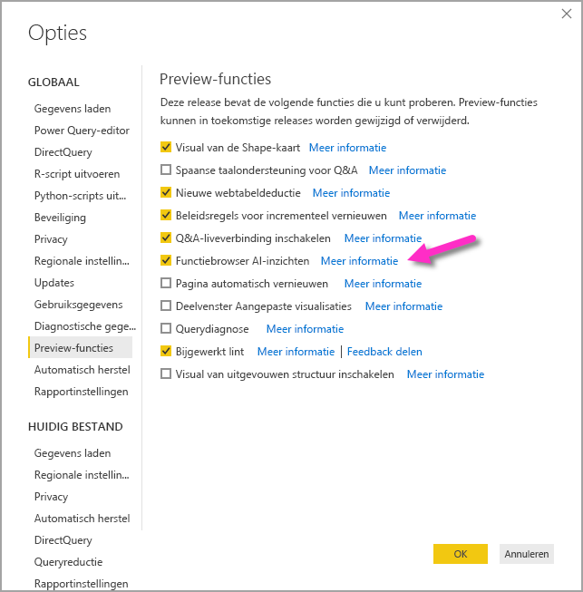
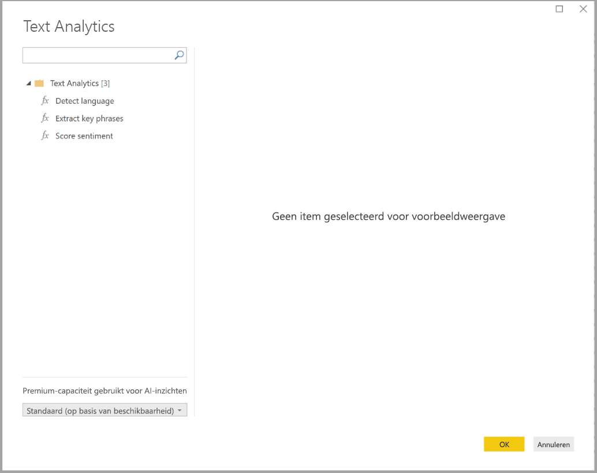
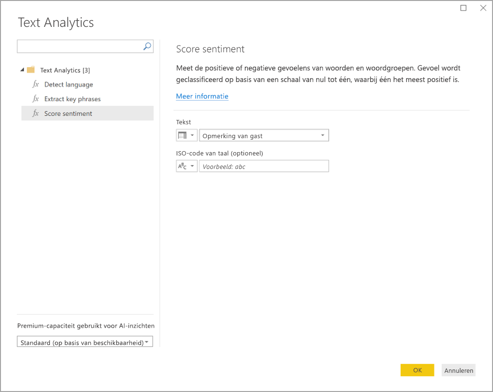
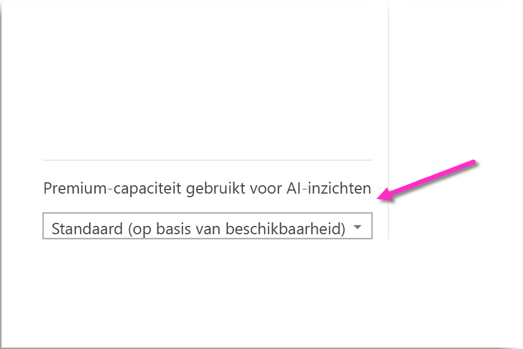
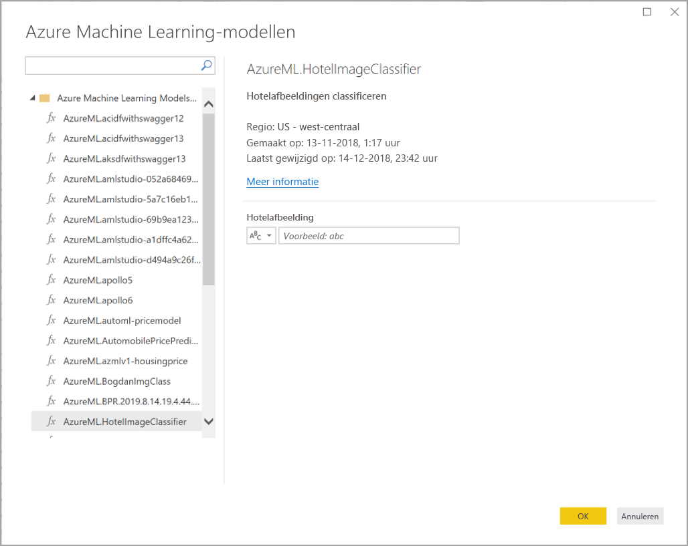

# AI-inzichten gebruiken in Power BI Desktop

In Power BI kunt u AI-inzichten gebruiken om toegang te krijgen tot een verzameling vooraf getrainde machine learning-modellen die kunnen helpen bij het voorbereiden van gegevens. AI-inzichten is toegankelijk vanuit de **Power Query-editor**, en de bijbehorende functies zijn toegankelijk via de tabbladen **Startpagina** en **Kolom toevoegen** in de **Power Query-editor**. 

In dit artikel worden functies beschreven voor Text Analytics en Vision, services die allebei deel uitmaken van Azure Cognitive Services. Daarnaast bevat dit artikel een gedeelte waarin de aangepaste functies van Azure Machine Learning worden beschreven die beschikbaar zijn in Power BI.

## AI-inzichten inschakelen

AI-inzichten werden algemeen beschikbaar gesteld in de Power BI Desktop-versie van juni 2020. Voor eerdere versies van Power BI Desktop moet AI-inzichten in Power BI zijn ingeschakeld door het volgende te selecteren: **Bestand > Opties en instellingen > Opties** en vervolgens **Preview-functies** uit de linkerkolom. In het rechterdeelvenster ziet u de functie **Functiebrowser AI-inzichten**. Schakel het bijbehorende selectievakje **Functiebrowser AI-inzichten** in om de preview-functie in te schakelen. U moet Power BI Desktop opnieuw opstarten om de preview-functie te kunnen gebruiken.

> [!NOTE]
> AI-inzichten is algemeen beschikbaar voor alle versies van Power BI Desktop vanaf de release van juni 2020, en voor die versies hoeft u deze niet als preview-functie in te schakelen.

## Text Analytics en Vision gebruiken

Met Text Analytics en Vision in Power BI kunt u verschillende algoritmen van [Azure Cognitive Services](https://azure.microsoft.com/services/cognitive-services/) toepassen om uw gegevens te verrijken in Power Query.

Op dit moment worden de volgende services ondersteund:

* [Sentimentanalyse](https://docs.microsoft.com/azure/cognitive-services/text-analytics/how-tos/text-analytics-how-to-sentiment-analysis)
* [Sleuteltermextractie](https://docs.microsoft.com/azure/cognitive-services/text-analytics/how-tos/text-analytics-how-to-keyword-extraction)
* [Taaldetectie](https://docs.microsoft.com/azure/cognitive-services/text-analytics/how-tos/text-analytics-how-to-language-detection)
* [Afbeeldingen taggen](https://docs.microsoft.com/azure/cognitive-services/computer-vision/concept-tagging-images) 

De transformaties worden uitgevoerd in de Power BI-service en daarvoor is geen Azure Cognitive Services-abonnement nodig. 

> [!IMPORTANT]
> 
> Voor het gebruik van de functie Text Analytics of Vision is Power BI Premium vereist.

### Text Analytics en Vision inschakelen in Premium-capaciteiten

Cognitive Services worden ondersteund voor de Premium-capaciteitsknooppunten EM2, A2, of P1 en hoger. Voor het uitvoeren van Cognitive Services wordt een afzonderlijke AI-werkbelasting op de capaciteit gebruikt. Tijdens de openbare preview van deze functies (vóór juni 2019) was deze werkbelasting standaard uitgeschakeld. Voordat u Cognitive Services gaat gebruiken in Power BI, moet de AI-werkbelasting worden ingeschakeld in de **capaciteitsinstellingen** van de beheerportal. U kunt de **AI-werkbelasting** inschakelen in de sectie **Werkbelastingen** en de maximale hoeveelheid geheugen definiëren die deze werkbelasting mag gebruiken. De aanbevolen geheugenlimiet is 20%. Door deze limiet te overschrijden, vertraagt de query.

### Beschikbare functies

Deze sectie beschrijft de beschikbare functies in Cognitive Services in Power BI.

#### Taal detecteren

De taaldetectiefunctie evalueert tekstinvoer en retourneert voor elk veld de taal en ISO-id. Deze functie is handig voor gegevenskolommen die willekeurige tekst verzamelen waarvan de taal onbekend is. Als invoer verwacht de functie gegevens in tekstindeling.

Text Analytics herkent maximaal 120 talen. Zie voor meer informatie [Ondersteunde talen](https://docs.microsoft.com/azure/cognitive-services/text-analytics/text-analytics-supported-languages).

#### Sleuteltermen ophalen

De functie **Sleuteltermextractie** evalueert ongestructureerde tekst en retourneert voor elk tekstveld een lijst met sleuteltermen. De functie vereist een tekstveld als invoer en accepteert een optionele invoer voor **Culture info**.

Sleuteltermextractie werkt het beste bij grotere lappen tekst. Dit is het tegenovergestelde van Sentimentanalyse, die beter presteert bij kleinere stukken tekst. Voor de beste resultaten bij beide activiteiten, zou u de invoeren dienovereenkomstig kunnen herstructureren.

#### Gevoel scoren

De functie **Gevoel scoren** evalueert tekstinvoer en retourneert een gevoelsscore voor elk document, variërend van 0 (negatief) tot 1 (positief). Deze functie is handig voor het detecteren van positieve en negatieve gevoelens op sociale media, klantbeoordelingen en discussiefora.

Text Analytics maakt gebruik van een machine learning-classificatiealgoritme voor het genereren van een gevoelsscore tussen 0 en 1. Scores dichter bij 1 duiden op een positief gevoel, scores dichter bij 0 op een negatief gevoel. Het model is vooraf getraind met een uitgebreide hoeveelheid tekst met gevoelsassociaties. Het is momenteel niet mogelijk om uw eigen trainingsgegevens te gebruiken. Het model maakt tijdens de tekstanalyse gebruik van een combinatie aan technieken, waaronder tekstverwerking, woordsoortanalyse, woordplaatsing en woordassociaties. Zie voor meer informatie over het algoritme [Introducing Text Analytics](/archive/blogs/machinelearning/machine-learning-and-text-analytics) (Maak kennis met Text Analytics).

Sentimentanalyse wordt uitgevoerd op het hele invoerveld en niet op een bepaalde entiteit in de tekst. In de praktijk verbetert het scoren van nauwkeurigheid wanneer documenten een of twee zinnen bevatten in plaats van een grote lap tekst. Tijdens een objectiviteitsevaluatie bepaalt het model of een invoerveld als geheel objectief is of gevoel bevat. Een invoerveld dat voornamelijk objectief is, gaat met een score van .50 niet door naar de gevoelsdetectiefase en wordt ook niet verder verwerkt. Voor invoervelden die doorgaan in de pijplijn, genereert de volgende fase een score die hoger of lager is dan .50, afhankelijk van de gevoelswaarde van het invoerveld.

Op dit moment ondersteunt Sentimentanalyse Engels, Duits, Spaans en Frans. Andere talen zijn beschikbaar als preview. Zie voor meer informatie [Ondersteunde talen](https://docs.microsoft.com/azure/cognitive-services/text-analytics/text-analytics-supported-languages).

#### Afbeeldingen taggen

De functie **Afbeeldingen taggen** retourneert tags op basis van meer dan tweeduizend herkenbare objecten, levende wezens, landschappen en acties. Wanneer tags ambigu of niet algemeen bekend zijn, biedt de uitvoer *hints* om de betekenis van de tag in de context van een bekende instelling te duiden. Tags worden niet als taxonomie geordend en er bestaan geen overnamehiërarchieën. Een verzameling inhoudstags vormt de basis voor een *afbeeldingsbeschrijving*, die wordt weergegeven als door mensen leesbare taal in volzinnen.

Na het uploaden van een afbeelding of het specificeren van een afbeeldings-URL, leveren de algoritmen van Computer Vision als output tags die zijn gebaseerd op objecten, levende wezens en acties die in de afbeelding zijn herkend. Niet alleen het belangrijkste onderwerp, bijvoorbeeld een persoon op de voorgrond, maar ook de setting (binnen of buiten), meubels, hulpmiddelen, planten, dieren, accessoires, gadgets enz. kunnen worden getagd.

Als invoer vereist deze functie een afbeeldings-URL of een base 64-veld. Momenteel ondersteunt Afbeeldingen taggen Engels, Spaans, Japans, Portugees en vereenvoudigd Chinees. Zie voor meer informatie [Ondersteunde talen](https://docs.microsoft.com/rest/api/cognitiveservices/computervision/tagimage/tagimage#uri-parameters).

### Text Analytics- of Vision-functies aanroepen in Power Query

Als u uw gegevens wilt verrijken met Text Analytics- of Vision-functies, opent u de **Power Query-editor**. In dit voorbeeld wordt uitgelegd hoe u een score toekent aan het sentiment van een tekst. Dezelfde stappen kunnen worden gebruikt voor het ophalen van sleuteltermen, taaldetectie en het taggen van afbeeldingen.

Selecteer de knop **Text Analytics** op het lint **Startpagina** of **Kolom toevoegen**. U wordt gevraagd u aan te melden.

Als u zich hebt aangemeld, selecteert u in het pop-upvenster de functie die u wilt gebruiken en de gegevenskolom die u wilt transformeren.

Power BI selecteert een Premium-capaciteit om de functie in uit te voeren en de resultaten terug te sturen naar Power BI Desktop. De geselecteerde capaciteit wordt alleen gebruikt voor de functies Text Analytics en Vision tijdens het toepassen en wordt vernieuwd in Power BI Desktop. Zodra het rapport is gepubliceerd, wordt de Premium-capaciteit vernieuwd van de werkruimte waarnaar het rapport is gepubliceerd. U kunt de capaciteit wijzigen die wordt gebruikt voor alle cognitieve services in de vervolgkeuzelijst in de linkerbenedenhoek van het pop-upvenster.

**Cultureinfo** is een optionele invoer om de taal van de tekst te bepalen. In dit veld moet een ISO-code worden ingevoerd. Als invoer voor Cultureinfo kunt u een kolom of een statisch veld gebruiken. In dit voorbeeld is de taal voor de hele kolom als Engels (en) opgegeven. Als u dit veld leeg laat, detecteert Power BI automatisch de taal voordat de functie wordt toepast. Selecteer vervolgens **Toepassen**.

De eerste keer dat u AI-inzichten gebruikt met een nieuwe gegevensbron, wordt u gevraagd om het privacyniveau van uw gegevens in te stellen.

> [!NOTE]
> Het vernieuwen van de gegevensset in Power BI werkt alleen voor gegevensbronnen waarvoor het privacyniveau is ingesteld op openbaar of organisatie.

Nadat de functie is aangeroepen, wordt het resultaat als een nieuwe kolom aan de tabel toegevoegd. De transformatie wordt ook als een toegepaste stap aan de query toegevoegd.

In het geval van het taggen van afbeeldingen en het ophalen van sleuteltermen, kunnen de resultaten uit meerdere waarden bestaan. Elk afzonderlijk resultaat wordt geretourneerd in een duplicaat van de oorspronkelijke rij.

### Een rapport met Text Analytics- of Vision-functies publiceren

Tijdens het bewerken in Power Query en het uitvoeren van vernieuwingen in Power BI Desktop, maken Text Analytics en Vision gebruik van de Premium-capaciteit die is geselecteerd in de Power Query-editor. Nadat het rapport is gepubliceerd naar Power BI, gebruikt het de Premium-capaciteit van de werkruimte waarin het is gepubliceerd.

Rapporten met toegepaste Text Analytics- en Vision-functies moeten worden gepubliceerd naar een werkruimte die zich niet in een Premium-capaciteit bevindt, anders mislukt het vernieuwen van de gegevensset.

### Invloed op een Premium-capaciteit beheren

In de volgende secties wordt beschreven hoe u de invloed van Text Analytics en Vision op de capaciteit kunt beheren.

#### Een capaciteit selecteren

Auteurs van rapporten kunnen de Premium-capaciteit selecteren waarin AI-inzichten moet worden uitgevoerd. Power BI selecteert standaard de eerst gemaakte capaciteit waartoe de gebruiker toegang heeft.

#### Controleren met de Capacity Metrics-app

Eigenaren van een Premium-capaciteit kunnen de impact van de Text Analytics- en Vision-functies op een capaciteit controleren met de [app Power BI Premium Capacity Metrics](../admin/service-admin-premium-monitor-capacity.md). De app biedt gedetailleerde metrische gegevens over de status van de AI-werkbelastingen binnen uw capaciteit. In het bovenste diagram ziet u het geheugenverbruik door AI-werkbelastingen. Beheerders van een Premium-capaciteit kunnen per capaciteit de geheugenlimiet voor de AI-werkbelasting instellen. Wanneer het geheugengebruik de geheugenlimiet bereikt, kunt u overwegen de geheugenlimiet te verhogen of een aantal werkruimten naar een andere capaciteit te verplaatsen.

### Power Query en Power Query Online vergelijken

De Text Analytics- en Vision-functies die worden gebruikt in Power Query en Power Query Online zijn hetzelfde. Dit zijn de enige verschillen tussen de ervaringen:

* Power Query heeft afzonderlijke knoppen voor Text Analytics, Vision en Azure Machine Learning. In Power Query Online zijn deze gecombineerd in één menu.
* In Power Query kan de auteur van een rapport de Premium-capaciteit selecteren die wordt gebruikt om de functies in uit te voeren. Dit is niet nodig in Power Query Online, omdat een gegevensstroom zich daar al in een specifieke capaciteit bevindt.

### Overwegingen en beperkingen van Text Analytics

Er zijn enkele overwegingen en beperkingen waar u rekening mee moet houden bij het gebruik van Text Analytics.

* Incrementeel vernieuwen wordt ondersteund, maar kan prestatieproblemen veroorzaken bij gebruik met query's met AI-inzichten.
* DirectQuery wordt niet ondersteund.

## Azure ML gebruiken

Talloze organisaties gebruiken **Machine Learning-modellen** voor beter inzicht in en nauwkeurige voorspellingen over hun bedrijf. De mogelijkheid om deze modellen te visualiseren in uw rapporten, dashboards en andere analyses en daar inzicht uit op te doen, helpt deze inzichten te verspreiden onder gebruikers in het bedrijf die daar het meest behoefte aan hebben. Power BI maakt het gemakkelijk om de inzichten van modellen in Azure Machine Learning te gebruiken en doet dat door middel van eenvoudige muisbewegingen en -acties.

Een gegevenswetenschapper kan om deze mogelijkheid te gebruiken de BI-analist eenvoudigweg toegang geven tot het Azure ML-model met behulp van de Azure-portal. Vervolgens ontdekt Power Query aan het begin van elke sessie alle modellen waar de gebruiker toegang tot heeft en weergeeft deze als dynamische Power Query-functies. De gebruiker roept deze functies vervolgens aan door ze te openen vanuit het lint in de Power Query-editor, of door de ML-functie rechtstreeks aan te roepen. Ook voegt Power BI toegangsaanvragen automatisch samen wanneer het Azure ML-model wordt aangeroepen voor een set rijen en dat zorgt voor betere prestaties.

Deze functionaliteit wordt alleen ondersteund voor Power BI Desktop, Power BI-gegevensstromen en voor Power Query Online in de Power BI-service.

Raadpleeg [Selfservice voor gegevensvoorbereiding in Power BI](service-dataflows-overview.md) voor meer informatie over gegevensstromen.

Voor meer informatie over Azure Machine Learning raadpleegt u de volgende artikelen:

- Overzicht: [Wat is Azure Machine Learning?](https://docs.microsoft.com/azure/machine-learning/service/overview-what-is-azure-ml)
- Quick Starts en zelfstudies voor Azure Machine Learning: [Documentatie voor Azure Machine Learning](https://docs.microsoft.com/azure/machine-learning/)

### Toegang verlenen tot een Azure ML-model

Als een gebruiker toegang wil tot een Azure ML-model vanuit Power BI, moet deze **leestoegang** hebben tot het Azure-abonnement. Daarnaast moeten ze beschikken over het volgende:

- **Leestoegang** tot de Machine Learning Studio-webservice (klassiek) voor Machine Learning Studio-modellen (klassiek)
- **Leestoegang** tot de Machine Learning-werkruimte voor Machine Learning-modellen

In de stappen in dit gedeelte wordt beschreven hoe een Power BI-gebruiker toegang krijgt tot een model in de Azure ML-service, zodat ze toegang hebben tot dit model als een Power Query-functie. Voor meer informatie raadpleegt u [Toegang beheren met RBAC en de Azure-portal](https://docs.microsoft.com/azure/role-based-access-control/role-assignments-portal).

1. Meld u aan bij [Azure Portal](https://portal.azure.com/).
2. Ga naar de pagina **Abonnementen**. U vindt de pagina **Abonnementen** via de lijst **Alle services** in het linkernavigatiemenu van de Azure-portal.
3. Uw abonnement selecteren
4. Selecteer **Toegangsbeheer (IAM)** en vervolgens de knop **Toevoegen**.
5. Selecteer **Lezer** als de rol. Selecteer de Power BI-gebruiker die u toegang wilt geven tot het Azure ML-model.
6. Selecteer **Opslaan**.
7. Herhaal stap drie tot en met zes om **leestoegang** te verlenen aan de gebruiker voor de specifieke Machine Learning Studio-webservice (klassiek) *of* de Machine Learning-werkruimte waarin het model wordt gehost.

### Schemadetectie voor Machine Learning-modellen

Gegevenswetenschappers gebruiken voornamelijk Python om hun machine learning-modellen voor Machine Learning te ontwikkelen en zelfs te implementeren. In tegenstelling tot de Machine Learning Studio (klassiek), waarmee de taak voor het maken van een schemabestand kan worden geautomatiseerd, moet de gegevenswetenschapper in het geval van Machine Learning het schemabestand expliciet genereren met Python.

Dit schemabestand moet worden opgenomen in de geïmplementeerde webservice voor Machine Learning-modellen. Als u wilt dat het schema voor de webservice automatisch wordt geautomatiseerd, moet u een voorbeeld opgeven van de invoer/uitvoer in het script van de vermelding voor het geïmplementeerd model. Zie de subsectie over het [(optioneel) automatisch genereren van Swagger-schema's in de implementatiemodellen met de Azure Machine Learning Service-documentatie](https://docs.microsoft.com/azure/machine-learning/how-to-deploy-and-where#optional-define-model-web-service-schema). De koppeling bevat het voorbeeldscript van de vermelding met de instructies voor het genereren van schema's.

Met name de functies _@input\_schema_ en _@output\_schema_ in het script van de vermelding verwijzen naar de voorbeeldindelingen van invoer en uitvoer in de variabelen _input\_sample_ en _output\_sample_ en genereren met behulp van deze voorbeelden een OpenAPI-specificatie (Swagger) voor de webservice tijdens de implementatie.

Deze instructies voor het genereren van schema's door het bijwerken van het script van de vermelding moeten ook worden toegepast op modellen die zijn gemaakt met behulp van geautomatiseerde Machine Learning-experimenten via de Azure Machine Learning-SDK.

> [!NOTE]
> Modellen die zijn gemaakt met behulp van de visuele interface van Azure Machine Learning bieden momenteel geen ondersteuning voor het genereren van schema's, maar dat zal in toekomstige releases wel het geval zijn.
> 
### Een Azure ML-model aanroepen in Power Query

U kunt elk Azure ML-model aanroepen waar u toegang tot hebt. Dit kan rechtstreeks vanuit de Power Query-editor. Als u toegang wilt krijgen tot de Azure ML-modellen, selecteert u de knop **Azure Machine Learning** op het lint **Startpagina** of **Kolom toevoegen** in de Power Query-editor.

Alle Azure ML-modellen waar u toegang tot hebt, worden hier vermeld als Power Query-functies. De invoerparameters voor het Azure ML-model worden automatisch toegewezen als parameters van de bijbehorende Power Query-functie.

Als u een Azure ML-model wilt aanroepen, kunt u vanuit het vervolgkeuzemenu een van de geselecteerde kolommen van de entiteit als invoer opgeven. U kunt ook een constante waarde opgeven die als invoer wordt gebruikt door het kolompictogram aan de linkerzijde van de het invoerdialoogvenster in te schakelen.

Selecteer **OK** om een voorbeeld van de uitvoer van het Azure ML-model weer te geven als een nieuwe kolom in de entiteitstabel. U ziet de aanroep aan het model ook als een toegepaste stap voor de query.

Als het model meerdere uitvoerparameters retourneert, worden ze gegroepeerd als een record in de uitvoerkolom. U kunt een kolom uitbreiden om afzonderlijke uitvoerparameters te produceren in afzonderlijke kolommen.

### Overwegingen en beperkingen voor Azure ML

De volgende overwegingen en beperkingen gelden voor Azure ML in Power BI Desktop.

* Modellen die zijn gemaakt met behulp van de visuele interface van Azure Machine Learning bieden momenteel geen ondersteuning voor het genereren van schema's, maar dat zal in toekomstige releases waarschijnlijk wel het geval zijn.
* Incrementeel vernieuwen wordt ondersteund, maar kan prestatieproblemen veroorzaken bij gebruik met query's met AI-inzichten.
* DirectQuery wordt niet ondersteund.

## Volgende stappen

In dit artikel hebt u een overzicht gekregen over hoe u Machine Learning integreert in Power BI Desktop. De volgende artikelen zijn voor u wellicht ook interessant en nuttig.

- [Zelfstudie: Een Machine Learning Studio-model (klassiek) aanroepen in Power BI](../connect-data/service-tutorial-invoke-machine-learning-model.md)
- [Zelfstudie: Cognitive Services gebruiken in Power BI](../connect-data/service-tutorial-use-cognitive-services.md)
- [Cognitive Services in Power BI](service-cognitive-services.md)
- [Azure Machine Learning-integratie in Power BI](service-machine-learning-integration.md)
- [Premium-capaciteiten bewaken met de app](../admin/service-admin-premium-monitor-capacity.md)
- [AI metrics now available in Power BI Premium Capacity Metrics app](https://powerbi.microsoft.com/blog/ai-metrics-now-available-in-power-bi-premium-capacity-metrics-app/)
