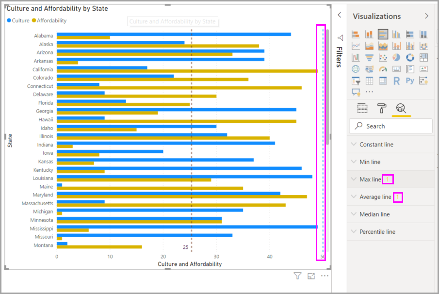

# Het deelvenster Analyse in Power BI Desktop gebruiken

Met het deelvenster **Analyse** in Power BI Desktop kunt u dynamische *referentielijnen* toevoegen aan visuele elementen en de aandacht richten op belangrijke trends of inzichten. Het pictogram en het deelvenster **Analyse** zijn te vinden in het gedeelte **Visualisaties** van Power BI Desktop.

> [!NOTE]
> Het deelvenster **Analyse** wordt alleen weergegeven wanneer u een visueel element op het canvas van Power BI Desktop selecteert.

## Zoeken binnen het deelvenster Analyse

Vanaf de release van Power BI Desktop van februari 2018 (versie 2.55.5010.201 of hoger) kunt u zoeken binnen het deelvenster **Analyse**, dat een subsectie is van het deelvenster **Visualisaties**. Het zoekvak wordt weergegeven wanneer u het pictogram **Analyse** selecteert.

## Het deelvenster Analyse gebruiken

Met het deelvenster **Analyse** kunt u de volgende soorten dynamische referentielijnen maken:

* Constante lijn voor de X-as
* Constante lijn voor de Y-as
* Lijn voor minimum
* Lijn voor maximum
* Lijn voor gemiddelde
* Lijn voor mediaan
* Lijn voor percentiel
* Arcering van symmetrie

> [!NOTE]
> Niet alle lijnen zijn beschikbaar voor alle typen visuals.

In de volgende secties ziet u hoe u het deelvenster **Analyse** en dynamische referentielijnen kunt gebruiken in uw visualisaties.

Voer de volgende stappen uit als u de beschikbare dynamische referentielijnen voor een visual wilt weergeven:

1. Selecteer of maak een visueel element en selecteer vervolgens het pictogram **Analyse** in het gedeelte **Visualisaties**.

    

2. Selecteer het type lijn dat u wilt maken om de bijbehorende opties uit te breiden. In dit geval selecteren we **Lijn voor gemiddelde**.

    

3. Selecteer **+&nbsp;Toevoegen** om een nieuwe lijn te maken. Vervolgens kunt u de lijn een naam geven. Dubbelklik op het tekstvak en voer de naam in.

    U hebt nu allerlei opties voor de lijn. U kunt de **kleur**, het **transparantie**percentage, de **lijnstijl**en de **positie** (in vergelijking met de gegevenselementen van de visual) opgeven. U kunt ook kiezen of u het **gegevenslabel** wilt toevoegen. Als u de afmetingen van de visual wilt opgeven waarop u de regel wilt baseren, selecteert u de vervolgkeuzelijst **Meting**, die automatisch wordt ingevuld met gegevenselementen uit de visual. In dit geval selecteren we **Culture** (Cultuur) als meting, voegen we het label *Average of Culture* (Gemiddelde van cultuur) toe en passen we enkele van de andere opties toe.

    

4. Als u een gegevenslabel wilt weergeven, wijzigt u **Gegevenslabel** van **Uit** in **Aan**. Als u doet dit, krijgt u allerlei extra opties voor uw gegevenslabel.

    

5. Let op het getal dat naast het item **Lijn voor gemiddelde** in het deelvenster **Analyse** wordt weergegeven. Zo weet u hoeveel dynamische lijnen de visual momenteel bevat en van welk type. Als we een **Lijn voor maximum** toevoegen voor **Affordability** (Betaalbaarheid), ziet u dat het deelvenster **Analyse** nu aangeeft dat ook een dynamische referentielijn van het type **Lijn voor maximum** is toegepast op deze visual.

    

Als op de visual die u hebt geselecteerd (in dit geval een **kaart**) geen dynamische referentielijnen kunnen worden toegepast, ziet u het volgende bericht wanneer u het deelvenster **Analyse** selecteert.

U kunt allerlei interessante inzichten benadrukken door dynamische referentielijnen te maken met het deelvenster **Analyse**.

We plannen meer functies en mogelijkheden, zoals uitbreiden op welke visuele elementen dynamische referentielijnen kunnen worden toegepast. Dus kom regelmatig terug om te zien wat er nieuw is.

## Prognose toepassen

Als u tijdgegevens in uw gegevensbron hebt, kunt u de *prognosefunctie* gebruiken. Selecteer een visual en vouw vervolgens de sectie **Prognose** uit in het deelvenster **Analyse**. U kunt allerlei soorten invoer opgeven om de prognose te wijzigen, zoals de **Prognoseduur** of het **Betrouwbaarheidsinterval**. De volgende afbeelding toont een visual van een basislijn waarop prognoses zijn toegepast. Gebruik uw verbeelding (en experimenteer met prognoses) om te zien hoe deze op uw modellen kunnen worden toegepast.

> [!NOTE]
> De functie voor prognoses is alleen beschikbaar voor visuals voor lijndiagrammen.

## Beperkingen

De mogelijkheid om dynamische referentielijnen te gebruiken is gebaseerd op het type visual dat wordt gebruikt. Op de volgende lijsten worden deze beperkingen specifieker beschreven.

U kunt de *constante lijn voor de x-as*, *constante lijn voor de y-as*en *symmetrie-arcering* gebruiken in de volgende visual:

* Spreidingsdiagram

Gebruik van de *constante lijn*, *lijn voor minimum*, *lijn voor maximum*, *lijn voor gemiddelde*, *lijn voor mediaan* en *lijn voor percentiel* is beschikbaar in deze visuals:

* Vlakdiagram
* Gegroepeerd staafdiagram
* Gegroepeerd kolomdiagram
* Lijndiagram
* Spreidingsdiagram

De volgende visuals kunnen alleen een *constante lijn* uit het deelvenster **Analyse** gebruiken:

* Gestapeld vlakdiagram
* Gestapeld staafdiagram
* Gestapelde kolomdiagram
* Watervalgrafiek
* 100% gestapeld staafdiagram
* 100% gestapeld kolomdiagram

De volgende visuals kunnen een *trendlijn* gebruiken als er tijdgegevens zijn:

* Vlakdiagram
* Gegroepeerd kolomdiagram
* Lijndiagram
* Lijndiagram en gegroepeerd kolomdiagram

Het is momenteel niet mogelijk om dynamische lijnen toe te passen op veel visuals, inclusief (maar niet beperkt tot):

* Trechterdiagram
* Lijndiagram en gegroepeerd kolomdiagram
* Lijndiagram en gestapeld kolomdiagram
* Lintgrafiek
* Niet-cartesische visuals, zoals ringdiagram, meter, matrix, cirkeldiagram en tabel

De *percentiellijn* is alleen beschikbaar wanneer geïmporteerde gegevens worden gebruikt in Power BI Desktop of wanneer er live verbinding is met een model op een server waarop **Analysis Service 2016** of hoger, **Azure Analysis Services** of een gegevensset op de Power BI-service wordt uitgevoerd.

## Volgende stappen

U kunt allerlei handelingen uitvoeren met Power BI Desktop. Bekijk de volgende bronnen voor meer informatie over de vele mogelijkheden:

* [What's new in Power BI Desktop](../fundamentals/desktop-latest-update.md) (Wat is er nieuw in Power BI Desktop)
* [Power BI Desktop downloaden](../fundamentals/desktop-get-the-desktop.md)
* [Wat is Power BI Desktop?](../fundamentals/desktop-what-is-desktop.md)
* [Query-overzicht met Power BI Desktop](desktop-query-overview.md)
* [Gegevenstypen in Power BI Desktop](../connect-data/desktop-data-types.md)
* [Gegevens vormgeven en combineren met Power BI Desktop](../connect-data/desktop-shape-and-combine-data.md)
* [Algemene taken uitvoeren in Power BI Desktop](desktop-common-query-tasks.md)
