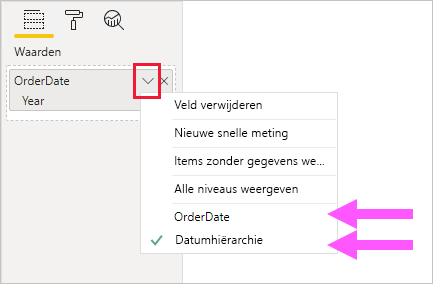
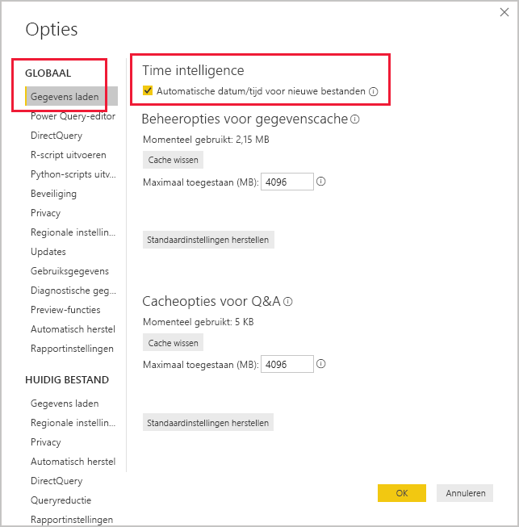

# <a name="apply-auto-datetime-in-power-bi-desktop"></a>Automatische datum/tijd toepassen in Power BI Desktop

Dit artikel is bedoeld voor gegevensmodelleerders die import- of samengestelde modellen in Power BI Desktop ontwikkelen. Hierin wordt de optie _Automatisch datum/tijd_ geïntroduceerd en beschreven.

Automatische datum/tijd is een optie voor het laden van gegevens in Power BI Desktop. Het doel van deze optie is om handige time intelligence-rapportage te ondersteunen op basis van datumkolommen die in een model zijn geladen. Het biedt met name makers van rapporten die uw gegevensmodel gebruiken de mogelijkheid om te filteren, te groeperen en in te zoomen met behulp van kalenderperioden (jaren, kwartalen, maanden en dagen). Belangrijk is dat u deze functionaliteit voor time intelligence niet expliciet hoeft te ontwikkelen.

Als de optie is ingeschakeld, maakt Power BI Desktop een verborgen tabel met automatische datum/tijd voor elke datumkolom, op voorwaarde dat aan alle volgende voorwaarden wordt voldaan:

- De tabelopslagmodus is 'Importeren'
- De kolom is geen berekende kolom
- Het gegevenstype van de kolom is 'datum' of 'datum/tijd'
- De kolom is niet de 'veel'-zijde van een modelrelatie

## <a name="how-it-works"></a>Uitleg

Elke tabel met automatische datum/tijd is in feite een [berekende tabel](desktop-calculated-tables.md) waarmee gegevensrijen worden gegenereerd met behulp van de DAX [CALENDAR](/dax/calendar-function-dax)-functie. Elke tabel bevat ook zes berekende kolommen: **Day**, **MonthNo**, **Month**, **QuarterNo**, **Quarter** en **Year**.

> [!NOTE]
> Kolomnamen en -waarden worden in Power BI omgezet en opgemaakt op basis van de [modeltaal](../fundamentals/supported-languages-countries-regions.md#choose-the-language-for-the-model-in-power-bi-desktop). Als het model bijvoorbeeld is gemaakt met behulp van het Engels, worden er nog steeds maandnamen enzovoort weergegeven in het Engels, zelfs als ze worden weergegeven met een Koreaanse client.

Er wordt in Power BI Desktop ook een relatie gemaakt tussen de kolom **Date** van de tabel met automatische datum/tijd en de datumkolom van het model.

De tabel met automatische datum/tijd bevat volledige kalenderjaren die alle datumwaarden omvatten die zijn opgeslagen in de modeldatumkolom. Als de eerste waarde in de datumkolom bijvoorbeeld 20 maart 2016 is en de meest recente waarde 23 oktober 2019, zal de tabel 1461 rijen bevatten. Elke datum heeft één rij in de vier kalenderjaren 2016 tot 2019. Wanneer het model wordt vernieuwd in Power BI, wordt elke tabel met automatische datum/tijd ook vernieuwd. Op deze manier bevat het model altijd datums die de datumwaarden in de kolom omvatten.

Als het mogelijk zou zijn om de rijen van een tabel met automatische datum/tijd weer te geven, zouden deze er als volgt uitzien:


> [!NOTE]
> De tabellen met automatische datum/tijd worden permanent verborgen, zelfs van modelleerders. Ze kunnen niet worden weergegeven in het deelvenster **Fields** of het modelweergavediagram, en de bijbehorende rijen kunnen niet worden weergegeven in de gegevensweergave. Ook kan er niet rechtstreeks worden verwezen naar de tabel en de kolom door DAX-expressies.
>
> Het is daarnaast niet mogelijk om hiermee te werken wanneer u gebruikmaakt van [Analyseren in Excel](../collaborate-share/service-analyze-in-excel.md) of verbinding maakt met het model met behulp van niet-Power BI rapportontwerpers.

In de tabel wordt ook een hiërarchie gedefinieerd, waarmee u visuals met een inzoompad kunt weergeven via jaar-, kwartaal-, maand- en dagniveau.

Als het mogelijk zou zijn om een tabel met automatische datum/tijd in het modelweergavediagram te zien, zou deze er als volgt uitzien (gerelateerde kolommen zijn gemarkeerd):


## <a name="work-with-auto-datetime"></a>Werken met automatische datum/tijd

Als er een tabel met automatische datum/tijd bestaat voor een datumkolom (en die kolom zichtbaar is), wordt deze kolom door rapportmakers niet als een veld in het deelvenster **Fields** gevonden. In plaats daarvan vinden ze een uitbreidbaar object met de naam van de datumkolom. U kunt dit eenvoudig herkennen omdat het is voorzien van een kalenderpictogram. Wanneer rapportmakers het kalenderobject uitvouwen, vinden ze een hiërarchie met de naam **Datumhiërarchie**. Nadat de hiërarchie is uitgevouwen, treffen ze vier niveaus aan: **Year**, **Quarter**, **Month** en **Day**.


De door de automatische datum/tijd gegenereerde hiërarchie kan op exact dezelfde manier worden gebruikt voor het configureren van een visual als reguliere hiërarchieën kunnen worden gebruikt. Visuals kunnen worden geconfigureerd met behulp van de volledige **Date Hierarchy**-hiërarchie of specifieke niveaus van de hiërarchie.

Er is echter één toegevoegde mogelijkheid die niet wordt ondersteund door reguliere hiërarchieën. Wanneer de hiërarchie van de automatische datum/tijd, of een niveau van de hiërarchie, wordt toegevoegd aan een visual, kunnen rapportmakers schakelen tussen het gebruik van de hiërarchie of de datumkolom. Deze aanpak is zinvol voor sommige visuals wanneer zij alleen de datumkolom en niet de hiërarchie en de bijbehorende niveaus nodig hebben. Zij beginnen met het configureren van het veld met de visual (klik met de rechtermuisknop op het veld met de visual of op de pijl omlaag). Vervolgens gebruiken ze het contextmenu om te schakelen tussen de datumkolom en de datumhiërarchie.



In de laatste plaats kunnen modelberekeningen, geschreven in DAX, _direct_ verwijzen naar een datumkolom of _indirect_ naar de verborgen kolommen van de tabel met automatische datum/tijd.

De formule die in Power BI Desktop is geschreven, kan op de gebruikelijke manier naar een kolomdatum verwijzen. Er moet echter door een speciale uitgebreide syntaxis naar de kolommen van de tabel met automatische datum/tijd worden verwezen. U verwijst eerst naar de datumkolom, en laat dit volgen door een punt (.). Met de functie voor automatisch van de formulebalk kunt u een kolom selecteren in de tabel met automatische datum/tijd.

![Voorbeeld van het invoeren van een DAX-meetexpressie in de formulebalk. In de formule staat tot nu toe Date Count = COUNT(Sales[OrderDate]. en in een lijst voor automatisch aanvullen worden alle zeven kolommen uit de verborgen tabel met automatische datum/tijd weergegeven. Dit zijn de volgende kolommen: Date, Day, Month, MonthNo, Quarter, QuarterNo en Year.](media/desktop-auto-date-time/auto-date-time-dax-auto-complete.png)

In Power BI Desktop kan het volgende in een geldige meetexpressie staan:

```dax
Date Count = COUNT(Sales[OrderDate].[Date])
```

> [!NOTE]
> Deze meetexpressie is geldig in Power BI Desktop, maar heeft niet de juiste DAX-syntaxis. De expressie wordt intern door Power BI Desktop omgezet om te verwijzen naar de echte (verborgen) kolom met automatische datum/tijd.

## <a name="configure-auto-datetime-option"></a>Optie voor automatische datum/tijd configureren

Automatische datum/tijd kan _algemeen_ of voor het _huidige bestand_ worden geconfigureerd. De algemene optie is van toepassing op nieuwe Power BI Desktop-bestanden en kan op elk gewenst moment worden in- of uitgeschakeld. Voor een nieuwe installatie van Power BI Desktop zijn beide opties standaard ingeschakeld.

De optie voor het huidige bestand kan ook op elk gewenst moment worden in- of uitgeschakeld. Wanneer deze optie is ingeschakeld, worden tabellen met automatische datum/tijd gemaakt. Wanneer deze optie is uitgeschakeld, worden tabellen met automatische datum/tijd uit het model verwijderd.

> [!CAUTION]
> Ga voorzichtig te werk als u de optie voor het huidige bestand uitschakelt, omdat hiermee de tabellen met automatische datum/tijd worden verwijderd. Zorg ervoor dat u eventuele beschadigde rapportfilters of visuals die zijn geconfigureerd voor gebruik herstelt.

In Power BI Desktop selecteert u de optie _Bestand > Opties en instellingen > Opties_ en vervolgens selecteert u de pagina **Algemeen** of **Huidig bestand**. Op beide pagina's staat de optie in het gedeelte **Time intelligence**.



## <a name="next-steps"></a>Volgende stappen

Bekijk de volgende resources voor meer informatie over dit artikel:

- [Hulp met automatische datum/tijd in Power BI Desktop](../guidance/auto-date-time.md)
- [Datumtabellen instellen en gebruiken in Power BI Desktop](desktop-date-tables.md)
- Vragen? [Misschien dat de Power BI-community het antwoord weet](https://community.powerbi.com/)
- Suggesties? [Ideeën bijdragen om Power BI te verbeteren](https://ideas.powerbi.com/)
