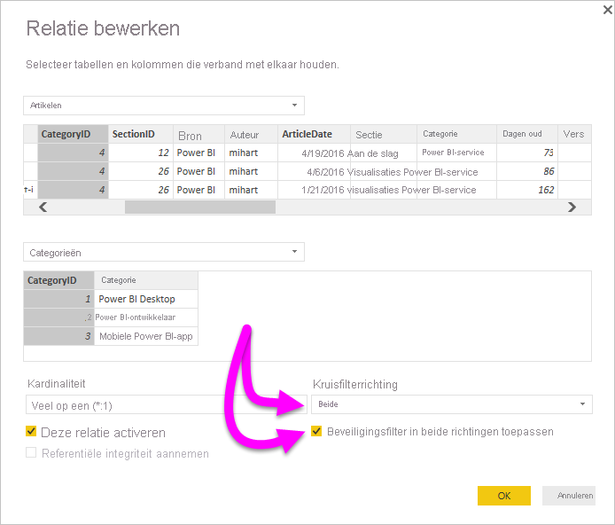

# In twee richtingen kruislings filteren met DirectQuery inschakelen in Power BI Desktop

Bij het filteren van tabellen om de juiste weergave van gegevens te maken, kunnen ontwikkelaars van rapporten en gegevensmodelleerders te maken krijgen met de vraag hoe ze moeten bepalen hoe filters op een rapport moeten worden toegepast. Voorheen bevond de filtercontext van de tabel zich aan één kant van de relatie, maar niet aan de andere. Voor deze methode is vaak een complexe DAX-formule vereist om de gewenste resultaten te verkrijgen.

Met kruislings filteren in twee richtingen hebben ontwikkelaars van rapporten en gegevensmodelleerders nu meer controle over de manier waarop ze filters kunnen toepassen wanneer ze met gerelateerde tabellen werken. Met kruislings filteren in twee richtingen kunnen ze filters toepassen op *beide* kanten van een tabelrelatie. U kunt de filters toepassen door de filtercontext door te voeren naar een tweede gerelateerde tabel aan de andere kant van de tabelrelatie.

## Kruislings filteren in twee richtingen voor DirectQuery inschakelen

U kunt kruislings filteren inschakelen in het dialoogvenster **Relatie bewerken**. Als u kruislings filteren voor een relatie wilt inschakelen, moet u de volgende opties configureren:

* Stel **Richting voor kruislings filteren** in op **Beide**.
* Selecteer **Beveiligingsfilter in beide richtingen toepassen**.

  

> [!NOTE]
> Gebruik *UserPrincipalName* wanneer u DAX-formules voor kruislings filteren in Power BI Desktop maakt. Dit veld is vaak hetzelfde als de aanmeldgegevens van een gebruiker, bijvoorbeeld <em>joe@contoso.com</em> in plaats van *Gebruikersnaam*. Wellicht moet u dus een gerelateerde tabel maken waarin *UserName* (of *EmployeeID*) wordt toegewezen aan *UserPrincipleName*.

Lees het [technische document Kruislings filteren in twee richtingen voor Power BI Desktop](https://download.microsoft.com/download/2/7/8/2782DF95-3E0D-40CD-BFC8-749A2882E109/Bidirectional%20cross-filtering%20in%20Analysis%20Services%202016%20and%20Power%20BI.docx) voor meer informatie en voorbeelden over de werking van kruislings filteren in twee richtingen.

