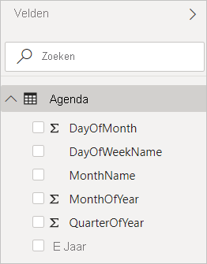
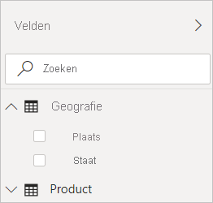
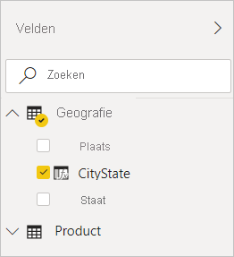

# Berekende kolommen maken in Power BI Desktop
Met berekende kolommen kunt u nieuwe gegevens toevoegen aan een tabel die al in het model is opgenomen. In dit geval laadt u echter geen query's en waarden in de nieuwe kolom van een gegevensbron, maar maakt u een DAX-formule (Data Analysis Expressions) die de waarden van de kolom definieert. In Power BI Desktop worden berekende kolommen gemaakt met behulp van de functie Nieuwe kolom in de **rapportweergave**.

Berekende kolommen die zijn gemaakt in de **rapportweergave** of **gegevensweergave** zijn gebaseerd op gegevens die u al in het model hebt geladen. Dit in tegenstelling tot aangepaste kolommen die zijn gemaakt als onderdeel van een query met behulp van **Aangepaste kolom toevoegen** in de Query Editor. U kunt bijvoorbeeld waarden uit twee verschillende kolommen in twee verschillende maar gerelateerde tabellen samenvoegen, waarden toevoegen of subtekenreeksen extraheren.

Berekende kolommen die u maakt, worden weergegeven in de lijst **Velden**, net zoals andere velden. Ze hebben echter een speciaal pictogram dat de waarden weergeeft. Dit is het resultaat van een formule. U kunt de uw kolommen elke naam geven die u wilt en ze toevoegen aan een rapportvisualisatie, net zoals elk ander veld.

 
Berekende kolommen berekenen resultaten met behulp van DAX, een formuletaal die is bedoeld om te werken met relationele gegevens, zoals in Power BI Desktop. DAX bevat een bibliotheek met meer dan 200 functies, operatoren en constructies. Deze biedt zodoende een uitgebreide flexibiliteit bij het maken van formules voor het berekenen van resultaten voor vrijwel elke gegevensanalyse. Zie [DAX-basisbeginselen in Power BI Desktop](desktop-quickstart-learn-dax-basics.md) voor meer informatie over DAX.

DAX-formules zijn vergelijkbaar met Excel-formules. In feite heeft DAX veel functies die Excel ook heeft. DAX-functies zijn echter bedoeld om te werken met gegevens die interactief zijn gesegmenteerd of gefilterd in een rapport, zoals in Power BI Desktop. In Excel kunt u een voor elke rij in een tabel een andere formule hebben. Wanneer u in Power BI een DAX-formule voor een nieuwe kolom maakt, wordt een resultaat berekend voor elke rij in de tabel. Kolomwaarden worden herberekend indien nodig, zoals wanneer de onderliggende gegevens worden vernieuwd en de waarden zijn gewijzigd.

## Hier volgt een voorbeeld
Jeff, een verzendmanager bij Contoso, wil een rapport maken met het aantal verzendingen naar verschillende plaatsen. Jeff heeft de tabel **Geografie** met afzonderlijke velden voor de plaats en provincie. Maar Jeff wil dat in hun rapporten de plaats en staat worden weergegeven als één waarde in dezelfde rij. De tabel **Geografie** van Jeff beschikt nu niet over het gewenste veld.

Maar met een berekende kolom kan Jeff de plaatsen uit de kolom **Plaats** en de staten uit de kolom **Staat** samenvoegen.

Jeff klikt met de rechtermuisknop op de tabel **Geografie** en klikt vervolgens op **Nieuwe kolom**. Jeff voert de volgende DAX-formule in de formulebalk in:

Met deze formule wordt simpelweg een nieuwe kolom met de naam **CityState** gemaakt. Voor elke rij in de tabel **Geografie** worden de waarden uit de kolom **Plaats** opgehaald en wordt er een komma en een spatie toegevoegd. Vervolgens worden de waarden in de kolom **Staat** aan de nieuwe kolom toegevoegd.

Nu heeft Jeff het gewenste veld.

Jeff kan het veld nu toevoegen aan het rapportcanvas, samen met het aantal verzendingen. Jeff heeft nu zeer snel en met een minimale inspanning een veld **CityState** dat aan bijna elk type visualisatie kan worden toegevoegd. Wanneer Jeff een nieuwe kaart maakt, weet Power BI Desktop al hoe het de plaats- en staatwaarden moet lezen in de nieuwe kolom.

## Volgende stappen
We hebben hier slechts een korte inleiding over berekende kolommen gegeven. Bekijk de volgende resources voor meer informatie:

* Als u een voorbeeldbestand wilt downloaden en stapsgewijs wilt leren hoe u meer kolommen maakt, raadpleegt u [Zelfstudie: Berekende kolommen maken in Power BI Desktop](desktop-tutorial-create-calculated-columns.md)

* Zie [DAX-basisbeginselen in Power BI Desktop](desktop-quickstart-learn-dax-basics.md) voor meer informatie over DAX.

* Zie de sectie **Aangepaste kolommen** maken in [Algemene querytaken in Power BI Desktop](desktop-common-query-tasks.md) voor meer informatie over de kolommen die u als onderdeel van een query maakt.  

