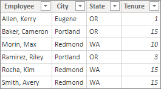
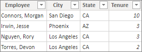
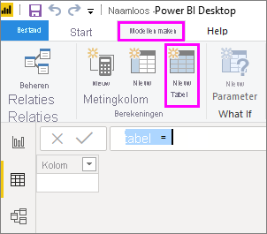
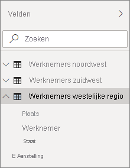

# <a name="create-calculated-tables-in-power-bi-desktop"></a>Berekende tabellen maken in Power BI Desktop
In de meeste gevallen kunt u tabellen maken door gegevens te importeren in het model vanuit een externe gegevensbron. Met *berekende tabellen* kunt u nieuwe tabellen toevoegen op basis van gegevens die u reeds in het model hebt geladen. U laadt echter geen query's en waarden in de kolommen van uw nieuwe tabel vanuit een gegevensbron, maar u maakt een [DAX-formule (Data Analysis Expressions)](/dax/index) waarmee u de waarden van de tabel definieert.

DAX is een formuletaal voor relationele gegevens, zoals in Power BI Desktop. DAX bevat een bibliotheek met meer dan 200 functies, operatoren en constructies. Het biedt zodoende een uitgebreide flexibiliteit bij het maken van formules voor het berekenen van resultaten voor vrijwel elke gegevensanalyse. Berekende tabellen zijn het beste voor tussenliggende berekeningen en gegevens die u wilt opslaan als onderdeel van het model in plaats van op elk gewenst moment te worden berekend of als onderdeel van een query. U kunt bijvoorbeeld kiezen om een *UNION*- of *CROSSJOIN*-bewerking op twee bestaande tabellen uit te voeren.

Net als andere Power BI Desktop-tabellen kunnen berekende tabellen relaties met andere tabellen hebben. Kolommen in de berekende tabel bevatten gegevenstypen en opmaak en kunnen deel uitmaken van een gegevenscategorie. U kunt uw kolommen elke naam geven die u wilt en deze toevoegen aan een rapportvisualisatie, net zoals elk ander veld. Berekende tabellen worden opnieuw berekend als een van de tabellen waaruit gegevens worden opgehaald, worden vernieuwd of bijgewerkt, tenzij de tabel gebruikmaakt van gegevens uit een tabel die DirectQuery gebruikt. In dat geval worden de wijzigingen in de tabel pas weergegeven wanneer de gegevensset is vernieuwd. Als DirectQuery moet worden gebruikt voor een tabel, is het raadzaam om de berekende tabel ook in DirectQuery op te nemen.

## <a name="create-a-calculated-table"></a>Een berekende tabel maken

U maakt berekende tabellen met behulp van de functie **Nieuwe tabel** in de rapportweergave of gegevensweergave van Power BI Desktop.

Stel, u bent een personeelsmanager met een tabel **Werknemers noordwest** en een tabel **Werknemers zuidwest**. U wilt deze twee tabellen combineren in één tabel met de naam **Werknemers regio west**.

**Werknemers noordwest**

 

**Werknemers zuidwest**

 

Selecteer in Rapportweergave of Gegevensweergave in Power BI Desktop in de groep **Berekeningen** op het tabblad **Modelleren** de optie **Nieuwe tabel**. Het is gemakkelijker om deze stap uit te voeren vanuit Gegevensweergave omdat u dan direct de nieuwe berekende tabel kunt zien.

 

Voer op de formulebalk de volgende formule in:

```dax
Western Region Employees = UNION('Northwest Employees', 'Southwest Employees')
```

Er wordt een tabel met de naam **Werknemers regio west** gemaakt en deze wordt net als alle andere tabellen weergegeven in het deelvenster **Velden**. U kunt relaties met andere tabellen maken, berekende kolommen en metingen toevoegen en de velden toevoegen aan rapporten, net als bij elke andere tabel.

 

 

## <a name="functions-for-calculated-tables"></a>Functies voor berekende tabellen

U kunt berekende tabellen definiëren met een DAX-expressie waarmee een tabel wordt geretourneerd, inclusief een eenvoudige verwijzing naar een andere tabel. Bijvoorbeeld:

```dax
New Western Region Employees = 'Western Region Employees'
```

In dit artikel wordt slechts een korte inleiding over berekende tabellen gegeven. U kunt berekende tabellen met DAX gebruiken om veel analytische problemen op te lossen. Hier volgen enkele van de meest voorkomende DAX-tabelfuncties die u kunt gebruiken:

* DISTINCT
* VALUES
* CROSSJOIN
* UNION
* NATURALINNERJOIN
* NATURALLEFTOUTERJOIN
* INTERSECT
* CALENDAR
* CALENDARAUTO

Zie de [Naslag voor DAX-functies](/dax/dax-function-reference) voor deze en andere DAX-functies waarmee tabellen worden geretourneerd.

