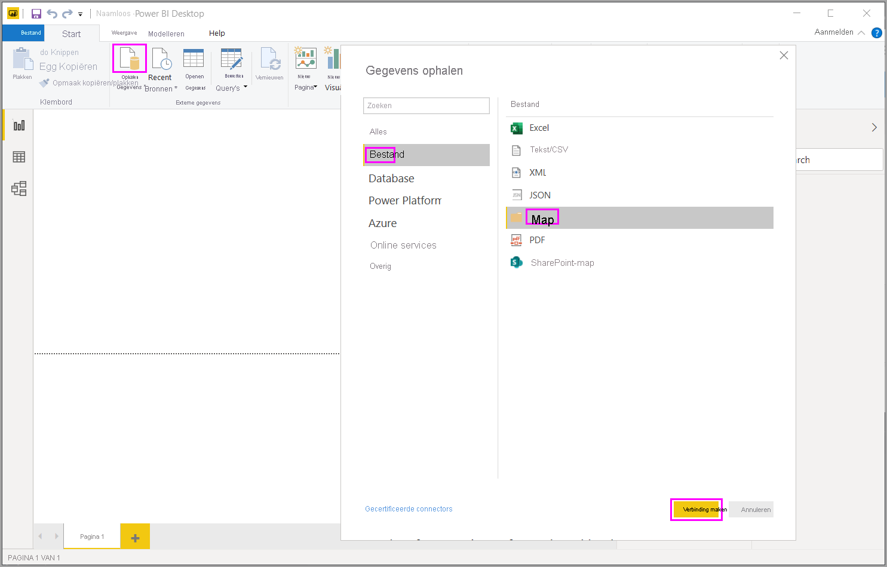
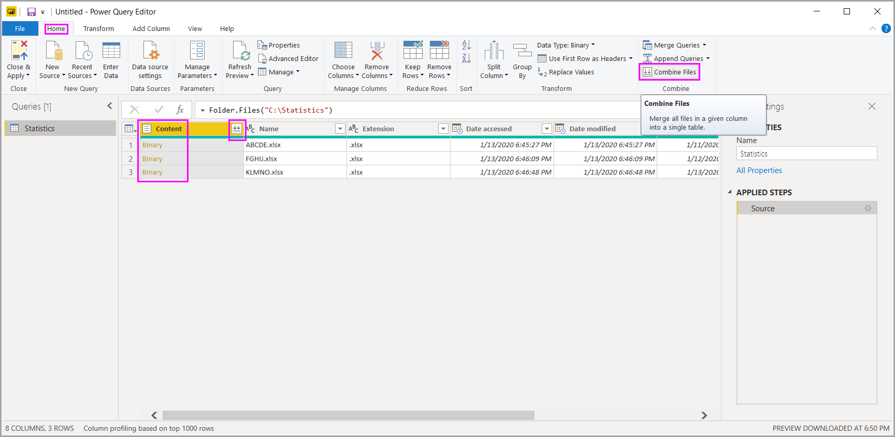

# Bestanden (binaire) combineren in Power BI Desktop

Hier volgt een krachtige methode voor het importeren van gegevens in **Power BI Desktop**: Als u meerdere bestanden met hetzelfde schema hebt, kunt u deze combineren in één logische tabel. Deze populaire methode is nu handiger en uitgebreider.

Selecteer **Gegevens ophalen** en kies **Bestand** > **Map**. Selecteer vervolgens **Verbinding maken** om het proces van het combineren van bestanden vanuit dezelfde map te starten.

Voer het pad naar de map in en selecteer **OK**. Selecteer vervolgens **Gegevens transformeren** om de bestanden in de map te bekijken in Power Query Editor.

## Gedrag van het combineren van bestanden

Als u binaire bestanden wilt combineren in Power Query Editor, selecteert u **Inhoud** (het eerste kolomlabel), en selecteert u **Start** > **Bestanden combineren**. U kunt ook gewoon het pictogram **Bestanden combineren** selecteren naast **Inhoud**.

De transformatie *Bestanden combineren* werkt als volgt:

* Met de transformatie Bestanden combineren wordt elk invoerbestand geanalyseerd om de juiste bestandsindeling te bepalen, bijvoorbeeld *tekst*,*Excel-werkmap* of *JSON-bestand*.
* Met de transformatie kunt u uit het eerste bestand een specifiek object, zoals een Excel-werkmap, selecteren om te extraheren.
  
  
* Met de transformatie Bestanden combineren worden vervolgens automatisch deze acties uitgevoerd:
  
  * Er wordt een voorbeeldquery gemaakt waarmee alle vereiste extractiestappen in één bestand worden uitgevoerd.
  * Er wordt een *functiequery* gemaakt waarmee de (binaire) bestandsinvoer in parameters wordt uitgedrukt voor de *voorbeeldquery*. De voorbeeldquery en de functiequery worden gekoppeld, zodat de wijzigingen aan de voorbeeldquery in de functiequery worden weerspiegeld.
  * De *functiequery* wordt toegepast op de oorspronkelijke query met binaire invoerbestanden, zoals de query *Map*. De functiequery wordt toegepast voor binaire invoerbestanden op elke rij. Vervolgens wordt de resulterende gegevensextractie uitgebreid als kolommen op het hoogste niveau.

    

> [!NOTE]
> Het bereik van uw selectie in een Excel-werkmap is van invloed op het gedrag van het combineren van binaire bestanden. U kunt bijvoorbeeld een specifiek werkblad selecteren om dat werkblad te combineren of de hoofdmap selecteren om het volledige bestand te combineren. Als u een map selecteert, worden de bestanden in die map gecombineerd. 

Dankzij het gedrag van Bestanden combineren kunt u eenvoudig alle bestanden in een bepaalde map combineren, als deze hetzelfde bestandstype en dezelfde structuur (zoals dezelfde kolommen) hebben.

Bovendien kunt u eenvoudig aanvullende transformaties of extractiestappen toepassen door de automatisch gemaakte voorbeeldquery te wijzigen, zonder dat u zich zorgen hoeft te maken over het wijzigen of maken van aanvullende stappen voor een functiequery. Wijzigingen aan de voorbeeldquery worden automatisch gegenereerd in de gekoppelde functiequery.

## Volgende stappen

Met Power BI Desktop kunt u verbinding maken met allerlei soorten gegevens. Bekijk de volgende resources voor meer informatie over gegevensbronnen:

* [Wat is Power BI Desktop?](../fundamentals/desktop-what-is-desktop.md)
* [Gegevensbronnen in Power BI Desktop](../connect-data/desktop-data-sources.md)
* [Gegevens vormgeven en combineren met Power BI Desktop](../connect-data/desktop-shape-and-combine-data.md)
* [Connect to CSV files in Power BI Desktop](../connect-data/desktop-connect-csv.md) (Verbinding met CSV-bestanden maken in Power BI Desktop)
* [Enter data directly into Power BI Desktop](../connect-data/desktop-enter-data-directly-into-desktop.md) (Rechtstreeks gegevens in Power BI Desktop invoeren)
