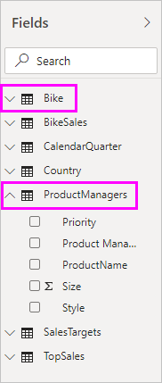
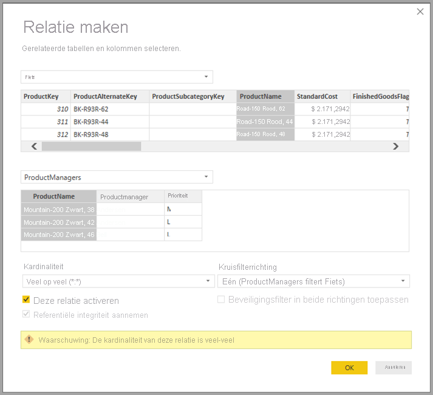
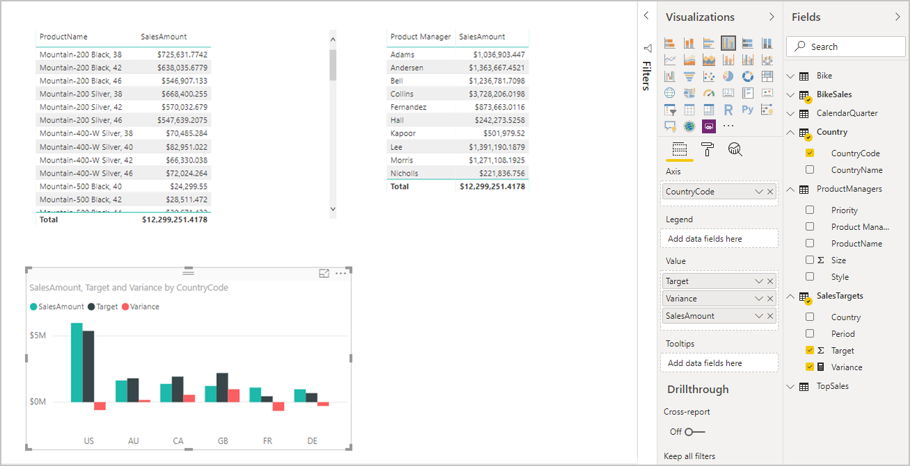

# Samengestelde modellen in Power BI Desktop gebruiken

Eerder werden geen andere gegevensverbindingen, hetzij DirectQuery-verbindingen of importverbindingen, toegestaan als u in Power BI Desktop een DirectQuery gebruikte in een rapport. Met de introductie van samengestelde modellen is deze beperking verdwenen. U kunt zonder problemen elke gewenste combinatie van gegevensverbindingen uit meer dan één DirectQuery-verbinding of importverbinding opnemen in een rapport.

De voorziening Samengestelde modellen in Power BI Desktop bestaat uit drie gerelateerde functies:

* **Samengestelde modellen**: Hierdoor kunnen voor een rapport twee of meer gegevensverbindingen van verschillende brongroepen worden gebruikt, zoals een of meer DirectQuery-verbindingen en een importeerverbinding, twee of meer DirectQuery-verbindingen of elke combinatie daarvan. Dit artikel bevat een uitgebreide beschrijving van samengestelde modellen.

* **Veel-op-veel-relaties**: Met samengestelde modellen kunt u *veel-op-veel-relaties* tussen tabellen tot stand brengen. Door deze aanpak hoeven tabellen geen unieke waarden meer te bevatten. Ook zijn eerdere tijdelijke oplossingen niet meer nodig, zoals de introductie van nieuwe tabellen om relaties tot stand te brengen. Zie [Veel-op-veel-relaties toepassen in Power BI Desktop](desktop-many-to-many-relationships.md) voor meer informatie.

* **Opslagmodus**: U kunt nu opgeven met welke visualisaties wordt gezocht in back-endgegevensbronnen. Visuals waarvoor geen query is vereist, worden geïmporteerd zelfs als ze zijn gebaseerd op DirectQuery. De functie helpt de prestaties te verbeteren en de back-end minder te belasten. Eerder werden zelfs voor eenvoudige visualisaties, zoals slicers, query's geïnitieerd voor back-endbronnen. Zie [Opslagmodus beheren in Power BI Desktop](desktop-storage-mode.md) voor meer informatie.

## Samengestelde modellen gebruiken

Als u de functie voor samengestelde modellen hebt ingeschakeld, kunt u verbinding maken met verschillende soorten gegevensbronnen wanneer u Power BI Desktop of de Power BI-service gebruikt. U kunt deze gegevensverbindingen op een aantal manieren maken:

* Door gegevens in Power BI te importeren. Dit is de meest voorkomende manier om gegevens te verkrijgen.
* Door rechtstreeks verbinding met de gegevens in de oorspronkelijke opslagplaats te maken via DirectQuery. Zie [DirectQuery in Power BI gebruiken](../connect-data/desktop-directquery-about.md) voor meer informatie over DirectQuery.

Als u DirectQuery gebruikt, kunt u met samengestelde modellen een Power BI-model maken, zoals één *.pbix*-bestand in Power BI Desktop, waarmee u een of beide van de volgende acties kunt uitvoeren:

* Gegevens uit een of meer DirectQuery-bronnen combineren.
* Gegevens uit DirectQuery-bronnen combineren en gegevens importeren.

Als u samengestelde modellen gebruikt, kunt bijvoorbeeld een model bouwen waarin de volgende typen gegevens worden gecombineerd:

* Verkoopgegevens van een zakelijke datawarehouse.
* Gegevens over de verkoopdoelen uit de SQL Server-database van een afdeling.
* Gegevens die zijn geïmporteerd vanuit een spreadsheet.

Een model waarin gegevens uit meerdere DirectQuery-bronnen worden gecombineerd of waarin DirectQuery-gegevens worden gecombineerd met geïmporteerde gegevens, wordt een samengesteld model genoemd.

U kunt relaties tussen tabellen maken, zoals u altijd al kon, zelfs wanneer deze tabellen afkomstig zijn uit verschillende bronnen. Alle relaties tussen verschillende bronnen worden gemaakt met een kardinaliteit van veel-op-veel, ongeacht de werkelijke kardinaliteit. U kunt deze wijzigen in een-op-veel, veel-op-een-of een-op-een. Welk kardinaliteit u ook instelt, relaties tussen verschillende bronnen vertonen verschillend gedrag. U kunt geen DAX-functies (Data Analysis Expressions) gebruiken om waarden aan de `one`-zijde op te halen vanuit de `many`-zijde. Mogelijk ziet u ook invloed op de prestaties ten opzichte van veel-op-veel-relaties binnen dezelfde bron.

> [!NOTE]
> In de context van samengestelde modellen vormen alle geïmporteerde tabellen in feite één bron, ongeacht de werkelijke onderliggende gegevensbronnen.

## Voorbeeld van een samengesteld model

Voor een voorbeeld van een samengesteld model moet u bijvoorbeeld denken aan een rapport dat via DirectQuery is verbonden met een zakelijke datawarehouse in SQL Server. Zoals u in de volgende afbeelding kunt zien, bevat de datawarehouse in dit geval gegevens over **Sales by Country**, **Quarter** en **Bike (Product)** :

U kunt nu eenvoudige visualisaties bouwen door velden uit deze bron te gebruiken. In de volgende afbeelding ziet u de totale omzet per *ProductName* voor een geselecteerd kwartaal.

Maar wat als u een Office Excel-spreadsheet hebt met gegevens over de productmanager die is toegewezen aan elk product en de marketingprioriteit? Als u **Sales Amount** per **Product Manager** wilt weergeven, is het mogelijk dat u deze lokale gegevens niet kunt toevoegen aan de datawarehouse van het bedrijf. Of duurt dit mogelijk maanden.

Het is misschien mogelijk om die verkoopgegevens te importeren uit de datawarehouse in plaats van DirectQuery te gebruiken. De verkoopgegevens kunnen vervolgens worden gecombineerd met de gegevens die u hebt geïmporteerd uit de spreadsheet. Dit is echter een absurde aanpak om redenen die juist tot het gebruik van DirectQuery hebben geleid. Mogelijke redenen:

* Een combinatie van de beveiligingsregels die worden afgedwongen in de onderliggende bron.
* De noodzaak om de meest recente gegevens te kunnen bekijken.
* Het grote aantal gegevens.

In dit geval komen samengestelde modellen goed van pas. Met samengestelde modellen kunt u via DirectQuery verbinding maken met het datawarehouse en vervolgens **Gegevens ophalen** gebruiken voor aanvullende bronnen. In dit voorbeeld brengen we eerst de DirectQuery-verbinding met het zakelijke datawarehouse tot stand. We gebruiken **Gegevens ophalen**, kiezen **Excel** en navigeren vervolgens naar de spreadsheet met lokale gegevens. Tot slot importeren we de spreadsheet met de *productnamen*, de toegewezen **salesmanager** en de **prioriteit**.  

In de lijst **Velden** worden twee tabellen weergegeven: de oorspronkelijke tabel **Bike** van SQL Server en de nieuwe tabel **ProductManagers**. De nieuwe tabel bevat de gegevens die zijn geïmporteerd uit Excel.

Als we nu naar de **relatieweergave** in Power BI Desktop gaan, zien we een extra tabel met de naam **ProductManagers**.

We moeten deze tabellen nu relateren aan de andere tabellen in het model. Zoals altijd maken we een relatie tussen de tabel **Bike** uit SQL Server en de geïmporteerde tabel **ProductManagers**. Dit is de relatie tussen **Bike[ProductName]** en **ProductManagers[ProductName]** . Zoals eerder is aangegeven, moeten alle relaties die via de bron verlopen, de standaardkardinaliteit veel-op-veel hebben.

Zodra de relatie tot stand is gebracht, wordt deze zoals verwacht weergegeven in de **relatieweergave** in Power BI Desktop.

We kunnen nu visuals maken door de velden in de lijst **Velden** te gebruiken. Als u op deze manier te werk gaat, worden gegevens uit meerdere bronnen probleemloos samengevoegd. In de volgende afbeelding wordt bijvoorbeeld het totale *verkoopbedrag* voor iedere *productmanager* weergegeven:

In het volgende voorbeeld van een veelvoorkomend geval wordt een *dimensietabel*, zoals **Product** of **Customer**, uitgebreid met extra gegevens die zijn geïmporteerd vanuit een andere bron. Het is voor tabellen ook mogelijk DirectQuery te gebruiken om verbinding met verschillende bronnen te maken. Stel dat,voortbordurend op ons voorbeeld, **SalesTargets** per **Country** en **Period** zijn opgeslagen in een afzonderlijke database van de afdeling. Zoals gebruikelijk kunt u **Gegevens ophalen** gebruiken om verbinding te maken met deze gegevens, zoals wordt weergegeven in de volgende afbeelding:

Zoals we eerder hebben gedaan, kunnen we relaties instellen tussen de nieuwe tabel en andere tabellen in het model en vervolgens visuals maken waarin de tabelgegevens worden gecombineerd. Laten we nog eens naar de **relatieweergave** kijken, waar we de nieuwe relaties hebben gemaakt:

De volgende afbeelding is gebaseerd op de nieuwe gegevens en de relaties die we hebben gemaakt. De visual linksonder toont het totale *verkoopbedrag* versus het *doel* en de berekening van de afwijking toont het verschil. De gegevens voor **Sales Amount** en **Target** zijn afkomstig uit twee verschillende SQL Server-databases.

## De opslagmodus instellen

Elke tabel in een samengesteld model heeft een opslagmodus die aangeeft of de tabel is gebaseerd op DirectQuery of Importeren. De opslagmodus kan worden weergegeven en gewijzigd in het deelvenster **Eigenschappen**. Als u de opslagmodus wilt weergeven, klikt u met de rechtermuisknop op een tabel in de lijst **Velden** en selecteert u vervolgens **Eigenschappen**. In de volgende afbeelding wordt de opslagmodus voor de tabel **SalesTargets** weergegeven.

De opslagmodus kan ook worden bekeken in de knopinfo voor elke tabel.

Voor een Power BI Desktop-bestand (een *.pbix-bestand*) met enkele tabellen uit DirectQuery en enkele importtabellen wordt op de statusbalk de opslagmodus **Gemengd** weergegeven. U kunt op de desbetreffende term in de statusbalk klikken om alle tabellen eenvoudig over te zetten naar Importeren.

Zie het artikel [Opslagmodus beheren in Power BI Desktop](desktop-storage-mode.md) voor meer informatie over de opslagmodus.  

> [!NOTE]
> U kunt de modus voor *gemengde* opslag in Power BI Desktop en in de Power BI-service gebruiken.

## Berekende tabellen

U kunt berekende tabellen toevoegen aan een model waarvoor DirectQuery wordt gebruikt. De Data Analysis Expressions (DAX) waarmee de berekende tabel wordt gedefinieerd, kan verwijzen naar geïmporteerde of DirectQuery-tabellen of een combinatie van beide.

Berekende tabellen worden altijd geïmporteerd en de gegevens in deze tabellen worden vernieuwd wanneer de tabellen worden vernieuwd. Als een berekende tabel naar een DirectQuery-tabel verwijst, geven de visuals die naar de DirectQuery-tabel verwijzen, altijd de meest recente waarden weer in de onderliggende bron. Visuals die naar de berekende tabel verwijzen, bevatten echter de waarden op het moment dat de berekende tabel voor het laatst is vernieuwd.

## Gevolgen voor de beveiliging

Samengestelde modellen hebben invloed op de beveiliging. Een query die wordt verzonden naar de ene gegevensbron kan gegevenswaarden bevatten die zijn opgehaald uit een andere bron. In het voorgaand voorbeeld wordt met de visual waarin het **(verkoopbedrag)** per **Productmanager** wordt weergegeven, een SQL-query verzonden naar de relationele Sales-database. Deze SQL-query kan de namen bevatten van de productmanagers en hun bijbehorende producten.

Het gevolg is dat gegevens die zijn opgeslagen in de spreadsheet, nu worden opgenomen in een query die wordt verzonden naar de relationele database. Als het vertrouwelijke gegevens betreft, moet u rekening houden met de gevolgen voor de beveiliging. U moet met name rekening houd met de volgende punten:

* Een beheerder van de database die traceringen of auditlogboeken kan weergeven, kan deze informatie bekijken, zelfs zonder machtigingen voor de gegevens in de oorspronkelijke bron. In dit voorbeeld heeft de beheerder machtigingen voor het Excel-bestand nodig.

* De versleutelingsinstellingen moeten worden overwogen. U wilt voorkomen dat u informatie via een versleutelde verbinding ophaalt bij de ene bron en deze vervolgens per ongeluk opneemt in een query die via een niet-versleutelde verbinding wordt verzonden naar een andere bron.

Er wordt een waarschuwing in Power BI Desktop weergegeven wanneer u een samengesteld model maakt, zodat u niet vergeet om rekening te houden met de gevolgen voor de beveiliging.  

Als een auteur daarnaast *Table1* uit *Model A* toevoegt aan een samengesteld model (laten we dit *Model C* noemen), kunnen gebruikers die een rapport bekijken dat op basis van *Model C* is gebouwd, een query uitvoeren op **elke tabel** in *Model A* die niet door RLS wordt beschermd.

Om vergelijkbare redenen moet u voorzichtig zijn met het openen van een Power BI Desktop-bestand dat is verzonden via een niet-vertrouwde bron. Als het bestand samengestelde modellen bevat, wordt de informatie die iemand ophaalt met de referenties van de gebruiker die het bestand opent, als onderdeel van de query verzonden naar een andere gegevensbron. De informatie kan worden weergegeven door de kwaadwillende auteur van het Power BI Desktop-bestand. Er wordt een waarschuwing in Power BI Desktop weergegeven wanneer u een Power BI Desktop-bestand met meerdere bronnen voor het eerst opent. Deze waarschuwing is vergelijkbaar met de waarschuwing die u ziet wanneer u een bestand opent dat systeemeigen SQL-query's bevat.  

## Gevolgen voor de prestaties  

Als u DirectQuery gebruikt, moet u altijd rekening houden met de prestaties. Het is met name belangrijk om ervoor te zorgen dat de back-endbron voldoende resources heeft om gebruikers een goede ervaring te bieden. Een goede ervaring betekent dat de visuals binnen vijf seconden worden vernieuwd. Zie [Over het gebruik van DirectQuery in Power BI](../connect-data/desktop-directquery-about.md) voor meer informatie over prestaties.

Wanneer u samengestelde modellen gebruikt, zijn er een paar extra punten met betrekking tot de prestaties waarmee u rekening moet houden. Eén visual kan ertoe leiden dat er query's naar meerdere bronnen worden verzonden, waarbij de resultaten van de ene query worden doorgegeven aan een andere query. Deze situatie kan resulteren in de volgende uitvoeringsscenario's:

* **Een SQL-query die een groot aantal letterlijke waarden bevat**: Als een visual bijvoorbeeld het totale **verkoopbedrag** voor een set geselecteerde **productmanagers** aanvraagt, moet eerst worden achterhaald welke **producten** door deze productmanagers worden beheerd. Deze reeks moet plaatsvinden voordat er een SQL-query via de visual wordt verzonden met een `WHERE`-component waarin alle product-id's zijn opgenomen.

* **Een SQL-query die wordt uitgevoerd op een lager granulariteitsniveau, waarbij de gegevens later lokaal worden samengevoegd**: Naarmate er steeds meer **Products** voldoen aan de filtercriteria voor **Product Manager**, is het niet meer efficiënt of niet haalbaar om alle producten op te nemen in een `WHERE`-component. In plaats hiervan kunt u een query uitvoeren op de relationele bron op het lagere niveau van **Products**, en de resultaten vervolgens lokaal aggregeren. Als de kardinaliteit van **Products** groter is dan een limiet van 1 miljoen, mislukt de query.

* **Meerdere SQL query's, één per groep op waarde**: Wanneer de aggregatie gebruikmaakt van **DistinctCount** en is gegroepeerd op basis van een kolom uit een andere bron, en als de externe bron geen ondersteuning biedt voor het efficiënt doorgeven van een groot aantal letterlijke waarden die de groepering definiëren, moet er één SQL-query per groep op waarde worden verzonden.

   Een visual waarin een unieke telling van **CustomerAccountNumber** (uit de SQL Server-tabel) per **Product Managers** (geïmporteerd uit de spreadsheet) moet worden weergegeven, moet details doorgeven uit de tabel **Product Managers** in de query die is verzonden naar SQL Server. Via andere bronnen (bijvoorbeeld Redshift) is dit niet haalbaar. In plaats hiervan wordt er dan één SQL-query per **Sales Manager** verzonden tot een praktische limiet, waarna de query mislukt.

Elk van deze scenario's heeft specifieke gevolgen voor de prestaties en de exacte details verschillen per gegevensbron. Hoewel de kardinaliteit van de kolommen die worden gebruikt in de relatie tussen de twee bronnen, laag blijft (een paar duizend), mag dit niet van invloed zijn op de prestaties. Naarmate deze kardinaliteit groeit, moet u meer aandacht besteden aan de impact op de resulterende prestaties.

Het gebruik van veel-op-veel-relaties betekent bovendien dat afzonderlijke query's moeten worden verzonden naar de onderliggende gegevensbron voor elk totaal- of subtotaalniveau, in plaats van de gedetailleerde waarden lokaal te aggregeren. Een eenvoudige tabelvisual met totalen zou twee SQL-query's in plaats van één verzenden.

## Beperkingen en overwegingen

Er gelden een aantal beperkingen voor deze release van samengestelde modellen:

Op dit moment wordt [incrementeel vernieuwen](../admin/service-premium-incremental-refresh.md) alleen ondersteund voor samengestelde modellen die verbinding maken met gegevensbronnen van SQL, Oracle en Teradata.

De volgende (multidimensionale) Live Connect-bronnen kunnen niet worden gebruikt met samengestelde modellen:

* SAP HANA
* SAP Business Warehouse
* SQL Server Analysis Services
* Power BI-gegevenssets
* Azure Analysis Services

Als u met behulp van DirectQuery verbinding maakt met deze multidimensionale bronnen, is het niet mogelijk om verbinding te maken met een andere DirectQuery-bron of deze te combineren met importgegevens.

De bestaande beperkingen van DirectQuery gelden nog steeds wanneer u samengestelde modellen gebruikt. Veel van deze beperkingen gelden nu per tabel, al naargelang de opslagmodus van de tabel. Zo kan een berekende kolom in een importtabel verwijzen naar andere tabellen, maar kan een berekende kolom in een DirectQuery-tabel nog steeds alleen verwijzen naar kolommen in dezelfde tabel. Andere beperkingen gelden voor het model als geheel, als een van de tabellen in het model DirectQuery gebruikt. De functies Snelle inzichten en Q&A zijn bijvoorbeeld niet beschikbaar voor een model als een van de tabellen in het model de opslagmodus DirectQuery heeft.

## Volgende stappen

Zie de volgende artikelen voor meer informatie over samengestelde modellen en DirectQuery:

* [Veel-op-veel-relaties in Power BI Desktop](desktop-many-to-many-relationships.md)
* [Opslagmodus in Power BI Desktop](desktop-storage-mode.md)
* [DirectQuery in Power BI gebruiken](../connect-data/desktop-directquery-about.md)
* [Gegevensbronnen die worden ondersteund door DirectQuery in Power BI](../connect-data/power-bi-data-sources.md)
* [DirectQuery gebruiken voor Power BI-gegevenssets en Azure Analysis Services (preview-versie)](../connect-data/desktop-directquery-datasets-azure-analysis-services.md)
