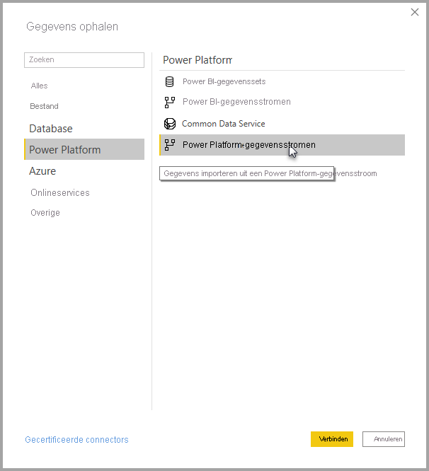

# Verbinding maken met gegevens die zijn gemaakt met Power Platform-gegevensstromen in Power BI Desktop
In **Power BI Desktop** kunt u verbinding maken met gegevens die zijn gemaakt door **Power Platform-gegevensstromen**, zoals met elke andere gegevensbron in Power BI Desktop.

Met de connector voor **Power Platform-gegevensstromen** kunt u verbinding maken met de entiteiten die zijn gemaakt met gegevensstromen in de Power BI-service. 

## Overwegingen en beperkingen

U moet een recente versie van **Power BI Desktop** uitvoeren om de **connector voor Power Platform-gegevensstromen** te gebruiken. U kunt altijd [Power BI Desktop downloaden](../fundamentals/desktop-get-the-desktop.md) en op uw computer installeren om ervoor te zorgen dat u de meest recente versie hebt.  

> [!NOTE]
> Voor de vorige versie van de connector voor Power Platform-gegevensstromen moest u een MEZ-bestand downloaden en opslaan in een map. Huidige versies van **Power BI Desktop** omvatten de connector voor Power Platform-gegevensstromen. Hierdoor is dit bestand niet meer vereist en kan het conflicten veroorzaken met de meegeleverde versie van de connector. Als u dit MEZ-bestand handmatig in een map hebt geplaatst, *moet* u het gedownloade MEZ-bestand verwijderen uit de map **Documenten > Power BI Desktop > Aangepaste connectors** om conflicten te voorkomen. 

## Desktopprestaties
**Power BI Desktop** wordt lokaal uitgevoerd op de computer waarop het is geïnstalleerd. De opnameprestaties van gegevensstromen worden bepaald door een aantal factoren. Deze factoren omvatten de grootte van de gegevens, de CPU en RAM van de computer, netwerkbandbreedte, afstand van het datacenter, en andere factoren.

U kunt de prestaties van gegevensopname voor gegevensstromen verbeteren. Als de opgenomen gegevens bijvoorbeeld te groot zijn om met **Power BI Desktop** te worden beheerd op de computer, kunt u gekoppelde en berekende entiteiten in gegevensstromen gebruiken om de gegevens (binnen gegevensstromen) samen te voegen en alleen de vooraf voorbereide en samengevoegde gegevens opnemen. 

Op deze manier wordt de verwerking van grote aantallen gegevens online uitgevoerd in gegevensstromen, in plaats van lokaal in het actieve exemplaar van **Power BI Desktop**. Met deze aanpak kunnen in Power BI Desktop kleinere aantallen gegevens worden opgenomen, en blijft het werken met gegevensstromen responsief en snel.

## Overwegingen en beperkingen

De meeste gegevensstromen bevinden zich in de Power BI-service-tenant. Gebruikers van **Power BI Desktop** hebben echter geen toegang tot gegevensstromen die zijn opgeslagen in het Azure Data Lake Storage Gen2-account, tenzij ze eigenaar zijn van de gegevensstroom of ze expliciet geautoriseerd zijn voor de CDM-map van de gegevensstroom. Kijk eens naar de volgende situatie:

1.  Anna maakt een nieuwe werkruimte en configureert deze zodanig dat er gegevensstromen kunnen worden opgeslagen in de data lake van de organisatie.
2.  Ben, die ook lid is van de werkruimte die Anna heeft gemaakt, wil Power BI Desktop en de gegevensstroomconnector gebruiken om gegevens op te halen uit de gegevensstroom die Anna heeft gemaakt.
3.  Ben krijgt een foutmelding omdat hij niet als geautoriseerde gebruiker is toegevoegd aan de CDM-map van de gegevensstroom in de data lake.

    

Om dit probleem op te lossen, moeten aan Ben leesmachtigingen voor de CDM-map en de bijbehorende bestanden worden verleend. Meer informatie over het verlenen van toegang tot de CDM-map vindt u in [dit artikel](./service-dataflows-azure-data-lake-integration.md).

## Volgende stappen
U kunt allerlei interessante dingen doen met Power Platform-gegevensstromen. Bekijk de volgende resources voor meer informatie:

* [Self-service data prep with dataflows](service-dataflows-overview.md) (Selfservice voor gegevensvoorbereiding met gegevensstromen)
* [Gegevensstromen maken en gebruiken in Power BI](service-dataflows-create-use.md)
* [Berekende entiteiten gebruiken in Power BI Premium (preview)](service-dataflows-computed-entities-premium.md)
* [Gegevensstromen gebruiken met on-premises gegevensbronnen (preview)](service-dataflows-on-premises-gateways.md)
* [Resources voor ontwikkelaars voor Power Platform-gegevensstromen (preview)](service-dataflows-developer-resources.md)

Raadpleeg de volgende artikelen voor meer informatie over integratie met Azure Data Lake Storage Gen2:

* [Integratie van gegevensstromen en Azure Data Lake (preview)](service-dataflows-azure-data-lake-integration.md)
* [Gegevensstroominstellingen voor werkruimten configureren (preview)](service-dataflows-configure-workspace-storage-settings.md)
* [Een CDM-map aan Power BI toevoegen als een gegevensstroom (preview)](service-dataflows-add-cdm-folder.md)
* [Verbinding maken met Azure Data Lake Storage Gen2 voor gegevensstroomopslag (preview)](service-dataflows-connect-azure-data-lake-storage-gen2.md)

Er zijn ook artikelen over **Power BI Desktop** die u misschien nuttig vindt:

* [Data Sources in Power BI Desktop](../connect-data/desktop-data-sources.md) (Gegevensbronnen in Power BI Desktop)
* [Shape and Combine Data with Power BI Desktop](../connect-data/desktop-shape-and-combine-data.md) (Gegevens vormgeven en combineren met Power BI Desktop)
* [Enter data directly into Power BI Desktop](../connect-data/desktop-enter-data-directly-into-desktop.md) (Rechtstreeks gegevens in Power BI Desktop invoeren)