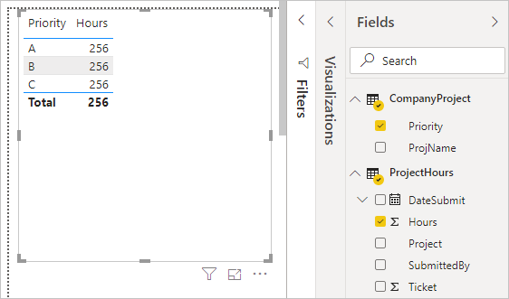
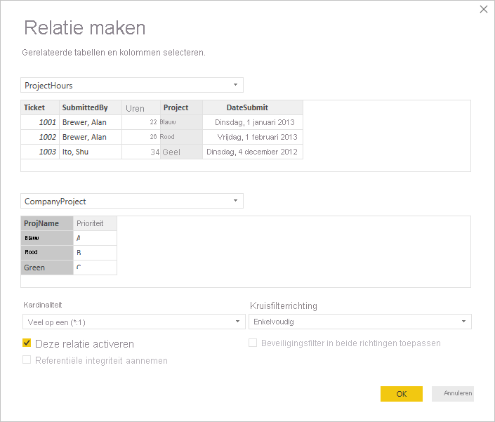
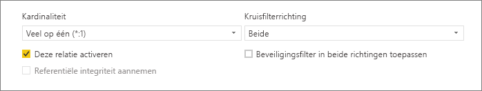
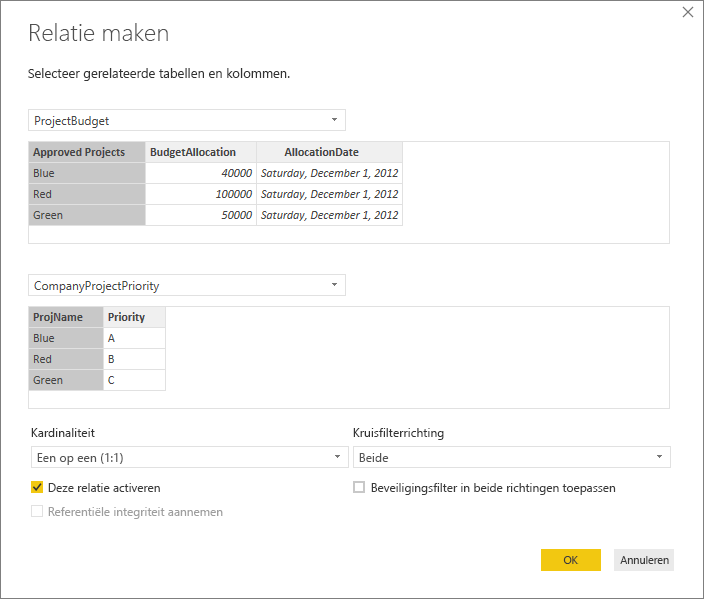
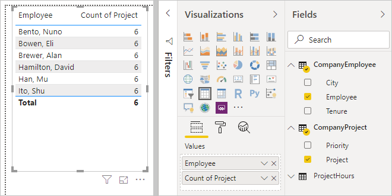
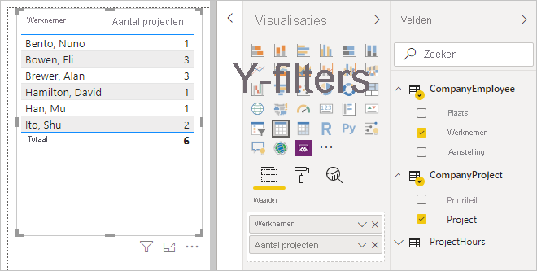
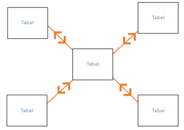
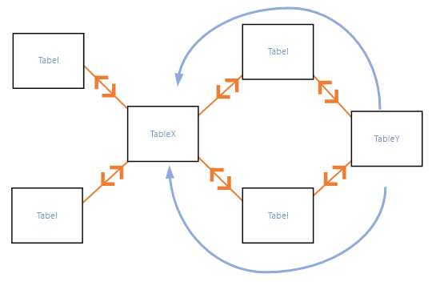
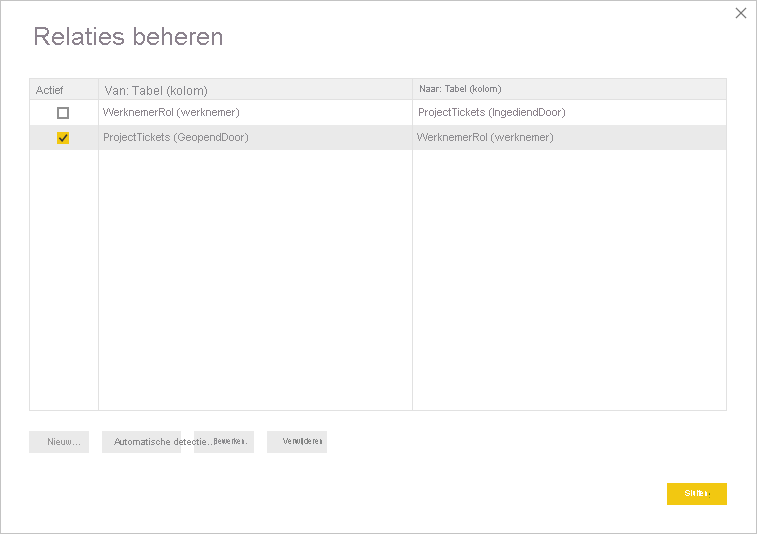
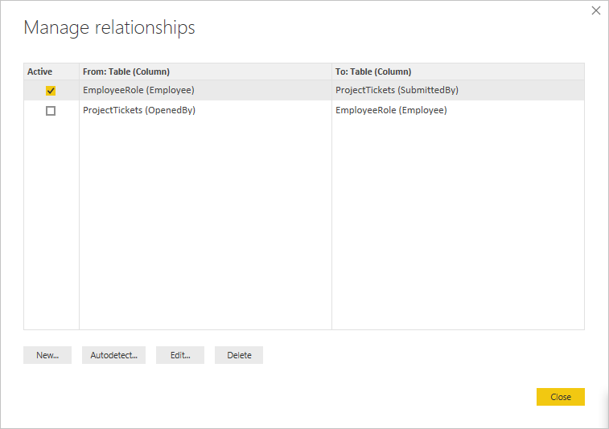

# Relaties maken en beheren in Power BI Desktop
Wanneer u meerdere tabellen importeert, gaat u waarschijnlijk analyses uitvoeren met gegevens uit de tabellen. Relaties tussen deze tabellen zijn nodig om nauwkeurig resultaten te berekenen en de juiste gegevens in uw rapporten weer te geven. Met Power BI Desktop is het maken van deze relaties eenvoudig. In de meeste gevallen hoeft u niets te doen. De functie Autodetectie doet het voor u. In sommige gevallen moet u echter mogelijk zelf relaties maken of moet u enkele wijzigingen in een relatie aanbrengen. Hoe dan ook is het belangrijk om relaties in Power BI Desktop te begrijpen en te weten hoe u ze maakt en bewerkt.

## Autodetectie tijdens laden
Als u query's uitvoert op twee of meer tabellen tegelijk, probeert Power BI Desktop tijdens het laden van de gegevens relaties te zoeken en te maken. De relatieopties **Kardinaliteit**, **Richting voor kruislings filteren** en **Deze relatie activeren** zijn automatisch ingesteld. Power BI Desktop kijkt naar kolomnamen in de tabellen waarop u query's toepast, om te bepalen of er mogelijke relaties zijn. Als dat het geval is, worden de relaties automatisch gemaakt. Als Power BI Desktop niet met grote zekerheid kan vaststellen of er een overeenkomst is, wordt er geen relatie gemaakt. U kunt echter nog steeds het dialoogvenster **Relaties beheren** gebruiken om handmatig relaties te maken of te bewerken.

## Een relatie maken met automatische detectie
Selecteer op het tabblad **Start** de optie **Relaties beheren** \> **Autodetectie**.

## Handmatig een relatie maken
1. Selecteer op het tabblad **Start** de optie **Relaties beheren** \> **Nieuw**.

2. Selecteer in het dialoogvenster **Relatie maken** een tabel in de vervolgkeuzelijst voor de eerste tabel. Selecteer de kolom die u in de relatie wilt gebruiken.

3. Selecteer in de vervolgkeuzelijst voor de tweede tabel de andere tabel die u voor de relatie wilt gebruiken. Selecteer de andere kolom die u wilt gebruiken en klik vervolgens op **OK**.

   

Power BI Desktop configureert standaard automatisch de opties **Kardinaliteit** (richting), **Richting voor kruislings filteren** en **Deze relatie activeren** voor uw nieuwe relatie. U kunt deze instellingen indien nodig wijzigen. Zie [Inzicht in extra opties](#understanding-additional-options) voor meer informatie.

Als geen van de tabellen die voor de relatie zijn geselecteerd, unieke waarden bevat, ziet u de volgende fout: *Een van de kolommen moet unieke waarden bevatten*. Ten minste één tabel in een relatie *moet* over een specifieke, unieke lijst sleutelwaarden beschikken. Dit is een algemene vereiste voor alle databasetechnologieën op basis van relaties. 

Als deze fout optreedt, zijn er verschillende manieren om het probleem te verhelpen:

* Gebruik **Dubbele waarden verwijderen** om een kolom met unieke waarden te maken. Het nadeel van deze benadering is dat er mogelijk informatie verloren gaat bij het verwijderen van dubbele rijen. Vaak wordt een sleutel (rij) met een goede reden gedupliceerd.
* Voeg een tussenliggende tabel op basis van de lijst afzonderlijke sleutelwaarden toe aan het model. Deze tabel wordt dan gekoppeld aan beide oorspronkelijke kolommen in de relatie.

Zie dit [blogbericht](/archive/blogs/cansql/relationships-in-power-bi-fixing-one-of-the-columns-must-have-unique-values-error-message) voor meer informatie.

## Een relatie bewerken
1. Selecteer op het tabblad **Start** de optie **Relaties beheren**.

2. Selecteer in het dialoogvenster **Relaties beheren** de relatie en selecteer vervolgens **Bewerken**.

## Extra opties configureren
Wanneer u een relatie maakt of bewerkt, kunt u extra opties configureren. Standaard configureert Power BI Desktop automatisch extra opties op basis van een schatting die voor elke relatie anders kan zijn op basis van de gegevens in de kolommen.

### Kardinaliteit
De optie **Kardinaliteit** kan een van de volgende instellingen hebben:

**Veel-op-een (\*:1)** : een veel-op-een-relatie is het meest voorkomende standaardtype relatie. Dit betekent dat de kolom in de ene tabel meer dan één exemplaar van een waarde kan hebben en dat de andere, gerelateerde tabel, vaak de opzoektabel genoemd, slechts één exemplaar van een waarde heeft.

**Een-op-een (1:1)** : in een een-op-een-relatie heeft de kolom in de ene tabel slechts één exemplaar van een bepaalde waarde en heeft de andere, gerelateerde tabel slechts één exemplaar van een bepaalde waarde.

**Een-op-veel (1:*)** : in een een-op-veel-relatie heeft de kolom in de ene tabel slechts één exemplaar van een bepaalde waarde en kan de andere, gerelateerde tabel meer dan een exemplaar van een waarde hebben.

**Veel-op-veel (\*:\*)** : bij samengestelde modellen kunt u een veel-op-veel-relatie tussen tabellen tot stand brengen, waardoor de vereisten voor unieke waarden in tabellen niet meer gelden. Ook zijn eerdere tijdelijke oplossingen niet meer nodig, zoals de introductie van nieuwe tabellen om relaties tot stand te brengen. Zie [Relaties met een veel-op-veel-kardinaliteit](./desktop-many-to-many-relationships.md) voor meer informatie. 

Zie [Inzicht in extra opties](#understanding-additional-options) voor meer informatie over wanneer de kardinaliteit moet worden gewijzigd.

### Kruisfilterrichting
De optie **Richting voor kruislings filteren** kan de volgende instellingen hebben:

**Beide**: voor filterdoeleinden worden beide tabellen behandeld alsof ze één tabel vormen. De instelling **Beide** werkt goed bij één tabel met een aantal opzoektabellen eromheen. Een voorbeeld is een tabel van de actuele verkoop met een opzoektabel voor afdelingen. Deze configuratie wordt vaak een configuratie met een stervormig schema genoemd (een centrale tabel met verschillende opzoektabellen). Als u twee of meer tabellen hebt die ook opzoektabellen hebben (met een aantal gemeenschappelijke opzoektabellen), kunt u de instelling **Beide** beter niet gebruiken. We gaan door met het vorige voorbeeld. Stel dat u ook een tabel voor verkoopbudget hebt die het beoogde budget voor elke afdeling bevat. Daarnaast is de afdelingstabel gekoppeld aan de verkoop- en de budgettabel. Vermijd de instelling **Beide** voor dit type configuratie.

**Enkel**: de meestgebruikte standaardrichting. Hierbij worden filterkeuzen in gekoppelde tabellen toegepast op de tabel waarin de waarden worden samengevoegd. Als u een Power Pivot in een Excel 2013-gegevensmodel of een eerder gegevensmodel importeert, hebben alle relaties één richting. 

Zie [Inzicht in extra opties](#understanding-additional-options) voor meer informatie over wanneer de kruisfilterrichting moet worden gewijzigd.

### Deze relatie activeren
Wanneer deze optie is ingeschakeld, fungeert de relatie als de actieve standaardrelatie. In gevallen waarbij er meer dan één relatie tussen twee tabellen bestaat, helpt de actieve relatie Power BI Desktop om automatisch visualisaties te maken die beide tabellen bevatten.

Zie [Inzicht in extra opties](#understanding-additional-options) voor meer informatie over wanneer een bepaalde relatie moet worden geactiveerd.

## Inzicht in relaties
Als u een relatie tussen twee tabellen tot stand hebt gebracht, kunt u in beide tabellen met de gegevens werken alsof ze één tabel vormen. Zo hoeft u zich niet druk te maken om relatiegegevens of het samenvoegen van tabellen tot één tabel voordat u ze importeert. In veel gevallen kan Power BI Desktop automatisch relaties voor u maken. Als Power BI Desktop echter niet met een hoge mate van zekerheid kan vaststellen dat er een relatie tussen twee tabellen bestaat, wordt er niet automatisch een relatie gemaakt. In dat geval moet u dit doen. 

We doen even een korte zelfstudie om meer inzicht te krijgen in hoe relaties werken in Power BI Desktop.

>[!TIP]
>U kunt deze les zelf afronden: 
>
> 1. Kopieer de volgende tabel **ProjectHours** naar een Excel-werkblad (behalve de titel), selecteer alle cellen en selecteer vervolgens **Invoegen** \> **Tabel**. 
> 2. Klik in het dialoogvenster **Tabel maken** op **OK**. 
> 3. Selecteer een tabelcel, selecteer **Tabelontwerp** \> **Tabelnaam** en voer vervolgens *ProjectHours* in. 
> 4. Doe hetzelfde voor de tabel **CompanyProject**. 
> 5. Importeer de gegevens met behulp van **Gegevens ophalen** in Power BI Desktop. Selecteer de twee tabellen als gegevensbron en selecteer vervolgens **Laden**.

De eerste tabel, **ProjectHours**, is een overzicht van werktickets met het aantal uren dat een persoon aan een bepaald project heeft gewerkt. 

**ProjectHours**

| **Ticket** | **SubmittedBy** | **Hours** | **Project** | **DateSubmit** |
| ---:|:--- | ---:|:--- | ---:|
| 1001 |Brewer, Alan |22 |Blauw |1/1/2013 |
| 1002 |Brewer, Alan |26 |Rood |2/1/2013 |
| 1003 |Ito, Shu |34 |Geel |12/4/2012 |
| 1004 |Brewer, Alan |13 |Oranje |1/2/2012 |
| 1005 |Bowen, Eli |29 |Paars |01-10-2013 |
| 1006 |Bento, Nuno |35 |Groen |2/1/2013 |
| 1007 |Hamilton, David |10 |Geel |01-10-2013 |
| 1008 |Han, Mu |28 |Oranje |1/2/2012 |
| 1009 |Ito, Shu |22 |Paars |2/1/2013 |
| 1010 |Bowen, Eli |28 |Groen |10/1/2013 |
| 1011 |Bowen, Eli |9 |Blauw |10/15/2013 |

Deze tweede tabel, **CompanyProject**, is een lijst met projecten met een toegewezen prioriteit: A, B of C. 

**CompanyProject**

| **ProjName** | **Priority** |
| --- | --- |
| Blauw |A |
| Rood |B |
| Groen |C |
| Geel |C |
| Paars |B |
| Oranje |C |

U ziet dat elke tabel een projectkolom bevat. Elke kolom heeft een net iets andere naam, maar de waarden lijken hetzelfde te zijn. Dat is belangrijk en we komen er zo op terug.

Nu we de twee tabellen in een model hebben geïmporteerd, gaan we een rapport maken. Het eerste dat we willen ophalen, is het aantal uren dat is ingediend per projectprioriteit. Daarvoor selecteren we **Priority** en **Hours** in het deelvenster **Velden**.

Als u de tabel in het rapportcanvas bekijkt, ziet u dat het aantal uur 256 is voor elk project. Dit is ook het totale aantal. Dit getal is duidelijk niet juist. Hoe kan dat? Dit komt doordat we niet een totaalaantal van waarden uit één tabel kunnen berekenen (**Hours** in de tabel **Project**) en dit kunnen delen door waarden in een andere tabel (**Priority** in de tabel **CompanyProject**) zonder dat er een relatie tussen deze twee tabellen bestaat.

Daarom gaan we een relatie tussen deze twee tabellen maken.

Weet u nog, die kolommen in beide tabellen met een projectnaam, maar met waarden die op elkaar lijken? We gebruiken deze twee kolommen om een relatie tussen de tabellen te maken.

Waarom deze kolommen? Als we kijken naar de kolom **Project** in de tabel **ProjectHours**, zien we waarden zoals blauw, rood, geel, oranje enzovoort. Er zijn zelfs meerdere rijen die dezelfde waarde hebben. We hebben veel kleurwaarden voor **Project**.

In de kolom **ProjName** in de tabel **CompanyProject** zien we dat er maar één van elk van de kleurwaarden voor de projectnaam is. Elke kleurwaarde in deze tabel is uniek, en dat is belangrijk, omdat we een relatie tussen deze twee tabellen kunnen maken. In dit geval een veel-op-een-relatie. Bij een veel-op-een-relatie moet ten minste één kolom in een van de tabellen unieke waarden bevatten. Er zijn enkele aanvullende opties voor sommige relaties die we later bekijken. We gaan nu een relatie maken tussen de projectkolommen in beide tabellen.

### De nieuwe relatie maken
1. Selecteer **Relaties beheren** op het tabblad **Start**.
2. Selecteer in **Relaties beheren** de optie **Nieuw** om het dialoogvenster **Relatie maken** te openen, waarin u de tabellen, kolommen en eventuele extra instellingen voor de relatie kunt selecteren.
3. Selecteer in de eerste vervolgkeuzelijst **ProjectHours** als de eerste tabel en selecteer vervolgens de kolom **Project**. Deze zijde is de *veel*-zijde van de relatie.
4. In de tweede vervolgkeuzelijst is **CompanyProject** vooraf geselecteerd als de tweede tabel. Selecteer de kolom **ProjName**. Deze zijde is de *een*-zijde van de relatie. 
5. Accepteer de standaardwaarden voor de relatieopties en selecteer **OK**.

   

6. Klik in het dialoogvenster **Relaties beheren** op **Sluiten**.

We moeten er eerlijkheidshalve wel even bij zeggen dat u deze relatie op de moeilijke manier hebt gemaakt. U had gewoon **Autodetectie** in het dialoogvenster **Relaties beheren** kunnen selecteren. Autodetectie had de relatie automatisch voor u gemaakt bij het laden van de gegevens als beide kolommen dezelfde naam hadden gehad. Maar daar zit natuurlijk geen uitdaging in.

Kijk nu nog eens naar de tabel in het rapportcanvas.

Dat ziet er een stuk beter uit, toch?

Als we uren optellen per **Priority**, zoekt Power BI Desktop naar elk exemplaar van de unieke kleurwaarden in de opzoektabel **CompanyProject** en vervolgens naar elk exemplaar van die waarden in de tabel **ProjectHours**, waarna het totale aantal voor elke unieke waarde wordt berekend.

Dat was makkelijk. Met Autodetectie gaat het waarschijnlijk nog veel eenvoudiger.

## Inzicht in extra opties
Wanneer een relatie is gemaakt, met Autodetectie of handmatig, configureert Power BI Desktop automatisch extra opties op basis van de gegevens in de tabellen. Deze extra relatieopties bevinden zich in het laagste gedeelte van de dialoogvensters **Relatie maken** en **Relatie bewerken**.

 

Deze opties worden meestal automatisch door Power BI ingesteld; u hoeft hier niets aan te veranderen. Er zijn echter enkele situaties mogelijk waarin u deze opties zelf wilt configureren.

## Relaties automatisch bijwerken

U kunt instellen hoe Power BI relaties in uw rapporten en modellen behandelt en automatisch aanpast. Selecteer hiervoor **Bestand** > **Opties en instellingen** > **Opties** in Power BI Desktop en selecteer vervolgens **Gegevens laden** in het linkerdeelvenster. U ziet nu de opties voor **Relaties**.

   

Er zijn drie opties die kunnen worden geselecteerd en ingeschakeld: 

- **Relaties uit gegevensbronnen importeren tijdens de eerste keer laden**: Deze optie is standaard ingeschakeld. Wanneer de optie is ingeschakeld, controleert Power BI op relaties die zijn gedefinieerd in uw gegevensbron, zoals relaties tussen een refererende sleutel en een primaire sleutel in uw datawarehouse. Als dergelijke relaties bestaan, worden deze gespiegeld in het Power BI-gegevensmodel wanneer u gegevens voor het eerst laadt. Met deze optie kunt u snel aan de slag met uw model en hoeft u deze relaties niet eerst zelf te vinden of te definiëren.

- **Relaties bijwerken of verwijderen tijdens het vernieuwen van gegevens**: Deze optie is standaard uitgeschakeld. Als u de optie inschakelt, controleert Power BI op wijzigingen in gegevensbronrelaties wanneer uw gegevensset wordt vernieuwd. Als deze relaties zijn gewijzigd of worden verwijderd, spiegelt Power BI deze wijzigingen in het eigen gegevensmodel, door relaties bij te werken of te verwijderen.

   > [!WARNING]
   > Als u beveiliging op rijniveau gebruikt die afhankelijk is van de gedefinieerde relaties, wordt afgeraden deze optie te selecteren. Als u een relatie verwijdert die nodig is voor uw instellingen voor beveiliging op rijniveau, wordt uw model mogelijk minder veilig. 

- **Nieuwe relaties automatisch detecteren na het laden van gegevens**: Deze optie wordt beschreven in [Autodetectie tijdens laden](#autodetect-during-load). 

## Toekomstige updates voor de gegevens vereisen een andere kardinaliteit
Power BI Desktop kan normaal gesproken automatisch de beste kardinaliteit voor de relatie bepalen. Als u de automatische instelling wilt overschrijven omdat u weet dat de gegevens in de toekomst veranderen, kunt u deze wijzigen in het besturingselement **Kardinaliteit**. Hieronder volgt een voorbeeld waarin een andere kardinaliteit moet worden geselecteerd.

De tabel **CompanyProjectPriority** bevat een lijst met alle bedrijfsprojecten en de bijbehorende prioriteit. De tabel **ProjectBudget** bevat de projecten waarvoor een budget is goedgekeurd.

**CompanyProjectPriority**

| **ProjName** | **Priority** |
| --- | --- |
| Blauw |A |
| Rood |B |
| Groen |C |
| Geel |C |
| Paars |B |
| Oranje |C |

**ProjectBudget**

| **Approved Projects** | **BudgetAllocation** | **AllocationDate** |
|:--- | ---:| ---:|
| Blauw |40,000 |12/1/2012 |
| Rood |100,000 |12/1/2012 |
| Groen |50.000 |12/1/2012 |

Als we een relatie maken tussen de kolom **Approved Projects** in de tabel **ProjectBudget** en de kolom **ProjectName** in de tabel **CompanyProjectPriority**, stelt Power BI automatisch **Kardinaliteit** in op **Een-op-een (1:1)** en **Richting voor kruislings filteren** op **Beide**. 

 

Power BI maakt deze instellingen omdat volgens Power BI Desktop dit de beste combinatie van de twee tabellen is:

| **ProjName** | **Priority** | **BudgetAllocation** | **AllocationDate** |
|:--- | --- | ---:| ---:|
| Blauw |A |40,000 |12/1/2012 |
| Rood |B |100.000 |12/1/2012 |
| Groen |C |50,000 |12/1/2012 |
| Geel |C |  |  |
| Paars |B |  |  |
| Oranje |C |  |  |

Er is een een-op-een-relatie tussen de twee tabellen omdat er geen herhaalde waarden zijn in de kolom **ProjName** van de gecombineerde tabel. De kolom **ProjName** is uniek, omdat elke waarde slechts één keer voorkomt. Daardoor kunnen de rijen van de twee tabellen rechtstreeks zonder duplicatie worden gecombineerd.

Maar stel dat u weet dat de gegevens worden gewijzigd de volgende keer dat u ze vernieuwd. Een vernieuwde versie van de tabel **ProjectBudget** bevat nu extra rijen voor de blauwe en rode projecten:

**ProjectBudget**

| **Approved Projects** | **BudgetAllocation** | **AllocationDate** |
| --- | ---:| ---:|
| Blauw |40,000 |12/1/2012 |
| Rood |100,000 |12/1/2012 |
| Groen |50.000 |12/1/2012 |
| Blauw |80,000 |6/1/2013 |
| Rood |90,000 |6/1/2013 |

 De beste combinatie van de twee tabellen ziet er met deze extra rijen nu als volgt uit: 

| **ProjName** | **Priority** | **BudgetAllocation** | **AllocationDate** |
| --- | --- | ---:| ---:|
| Blauw |A |40,000 |12/1/2012 |
| Rood |B |100.000 |12/1/2012 |
| Groen |C |50,000 |12/1/2012 |
| Geel |C |  |  |
| Paars |B |  |  |
| Oranje |C |  |  |
| Blauw |A |80000 |6/1/2013 |
| Rood |B |90000 |6/1/2013 |

In deze nieuwe gecombineerde tabel bevat de kolom **ProjName** herhaalde waarden. De twee oorspronkelijke tabellen hebben geen één-op-éénrelatie meer zodra de tabel wordt vernieuwd. Omdat in dit geval toekomstige updates ertoe leiden dat de kolom **ProjName** dubbele waarden krijgt, kunt u de **kardinaliteit** het beste op **Veel-op-een (\*:1)** instellen, met de *veel*-zijde op **ProjectBudget** en de *een*-zijde op **CompanyProjectPriority**.

## Richting voor kruislings filteren aanpassen voor een complexe reeks tabellen en relaties
Voor de meeste relaties wordt de richting voor kruislings filteren ingesteld op **Beide**. Er zijn echter enkele minder gebruikelijke gevallen waarin u van de standaardinstelling wilt afwijken, bijvoorbeeld als u een model vanuit een oudere versie van Power Pivot wilt importeren, waarbij elke relatie op één richting is ingesteld. 

Met de instelling **Beide** kan Power BI Desktop alle aspecten van de gekoppelde tabellen behandelen alsof ze bij één tabel horen. Er zijn echter enkele situaties waarin Power BI Desktop de kruisfilterrichting van een relatie niet op **Beide** kan instellen en tegelijkertijd een ondubbelzinnige set standaardinstellingen kan bieden voor rapportagedoeleinden. Als de kruisfilterrichting van een relatie niet op **Beide** wordt ingesteld, komt dit meestal omdat er anders dubbelzinnigheid zou ontstaan. Als de standaardinstelling voor kruislings filteren niet handig is, kunt u het filteren op een bepaalde tabel of op **Beide** instellen.

Kruislings filteren in één richting werkt in de meeste gevallen. Als u een model uit Power Pivot in Excel 2013 of eerder hebt geïmporteerd, worden alle relaties op één richting ingesteld. Eén richting betekent dat filterkeuzes in gekoppelde tabellen worden toegepast op de tabel waarin waarden worden samengevoegd. Kruislings filteren kan soms lastig te begrijpen zijn. Daarom volgt hier een voorbeeld.

Als u kruislings filteren in één richting gebruikt, kunt u bij een rapport met een overzicht van de projecturen ervoor kiezen om samen te vatten (of te filteren) op de tabel **CompanyProject** en de kolom **Priority** of de tabel **CompanyEmployee** en de kolom **City**. U kunt echter niet het aantal werknemers per project tellen (een minder gebruikelijke opdracht). U krijgt een kolom met waarden die allemaal hetzelfde zijn. In het volgende voorbeeld is de kruisfilterrichting van beide relaties ingesteld op één richting: in de richting van de tabel **ProjectHours**. Bij **Waarden** is het veld **Project** ingesteld op **Aantal**:

 

De filterspecificatie wordt overgebracht van **CompanyProject** naar **ProjectHours** (zoals weergegeven in de volgende afbeelding), maar niet naar **CompanyEmployee**. 

 

Als u de kruisfilterrichting echter instelt op **Beide**, werkt het wel. De instelling **Beide** zorgt ervoor dat de filterspecificatie naar **CompanyEmployee** kan worden overgebracht.

 

Wanneer de kruisfilterrichting op **Beide** is ingesteld, wordt het rapport correct weergegeven:

 

Kruislings filteren in beide richtingen is geschikt voor een patroon van relaties tussen tabellen zoals het bovenstaande patroon. Dit schema wordt meestal een stervormig schema genoemd en ziet er als volgt uit:

 

De kruisfilterrichting werkt niet goed met een meer algemeen patroon dat vaak geldt voor databases, zoals in dit diagram:

 

Als u een dergelijk tabelpatroon hebt, met lussen, kan kruislings filteren een reeks dubbelzinnige relaties vormen. Als u bijvoorbeeld een veld van TableX optelt en vervolgens filtert op een veld in TableY, is het niet duidelijk hoe het filter moet worden toegepast: via de bovenste of onderste tabel. Een veelvoorkomend voorbeeld voor dit type patroon is wanneer TableX een verkooptabel is met actuele gegevens en TableY budgetgegevens bevat. In dat geval zijn de tabellen in het midden opzoektabellen die door beide tabellen worden gebruikt, zoals Division of Region. 

Net als bij actieve/inactieve relaties staat Power BI Desktop niet toe dat een relatie wordt ingesteld op **Beide** als er daardoor dubbelzinnigheid in rapporten ontstaat. U kunt deze situatie op verschillende manieren afhandelen. Dit zijn de twee meestgebruikte manieren:

* Verwijder relaties of stel ze in als inactief om dubbelzinnigheid te verminderen. Vervolgens kunt u kruislings filteren voor een relatie mogelijk op **Beide** instellen.
* Haal een tabel twee keer op (de tweede keer met een andere naam) om lussen te voorkomen. Hierdoor wordt het patroon van relaties vergelijkbaar met een stervormig schema. Bij een stervormig schema kunnen alle relaties op **Beide** worden ingesteld.

## Verkeerde actieve relatie
Wanneer Power BI Desktop automatisch relaties maakt, wordt er soms meer dan één relatie tussen twee tabellen aangetroffen. In een dergelijk geval wordt maar een van de relaties als actief ingesteld. De actieve relatie fungeert als de standaardrelatie, zodat Power BI Desktop automatisch een visualisatie voor u kan maken wanneer u velden uit twee verschillende tabellen kiest. In sommige gevallen is de automatisch geselecteerde relatie echter de verkeerde. Gebruik het dialoogvenster **Relaties beheren** om een relatie als actief of inactief in te stellen. U kunt ook de actieve relatie instellen in het dialoogvenster **Relatie bewerken**. 

Power BI Desktop staat slechts één actieve relatie tegelijk tussen twee tabellen toe om ervoor te zorgen dat er een standaardrelatie is. Daarom moet u eerst de huidige relatie als inactief instellen en kunt u vervolgens de gewenste relatie op actief instellen.

Hier volgt een voorbeeld. De eerste tabel is **ProjectTickets** en de tweede tabel is **EmployeeRole**.

**ProjectTickets**

| **Ticket** | **OpenedBy** | **SubmittedBy** | **Hours** | **Project** | **DateSubmit** |
| ---:|:--- |:--- | ---:|:--- | ---:|
| 1001 |Perham, Tom |Brewer, Alan |22 |Blauw |1/1/2013 |
| 1002 |Roman, Daniel |Brewer, Alan |26 |Rood |2/1/2013 |
| 1003 |Roth, Daniel |Ito, Shu |34 |Geel |12/4/2012 |
| 1004 |Perham, Tom |Brewer, Alan |13 |Oranje |1/2/2012 |
| 1005 |Roman, Daniel |Bowen, Eli |29 |Paars |01-10-2013 |
| 1006 |Roth, Daniel |Bento, Nuno |35 |Groen |2/1/2013 |
| 1007 |Roth, Daniel |Hamilton, David |10 |Geel |01-10-2013 |
| 1008 |Perham, Tom |Han, Mu |28 |Oranje |1/2/2012 |
| 1009 |Roman, Daniel |Ito, Shu |22 |Paars |2/1/2013 |
| 1010 |Roth, Daniel |Bowen, Eli |28 |Groen |10/1/2013 |
| 1011 |Perham, Tom |Bowen, Eli |9 |Blauw |10/15/2013 |

**EmployeeRole**

| **Employee** | **Role** |
| --- | --- |
| Bento, Nuno |Project Manager |
| Bowen, Eli |Project Lead |
| Brewer, Alan |Project Manager |
| Hamilton, David |Project Lead |
| Han, Mu |Project Lead |
| Ito, Shu |Project Lead |
| Perham, Tom |Project Sponsor |
| Roman, Daniel |Project Sponsor |
| Roth, Daniel |Project Sponsor |

Er bestaan hier eigenlijk twee relaties:
- Tussen **Employee** in de tabel **EmployeeRole** en **SubmittedBy** in de tabel **ProjectTickets**.
- Tussen **OpenedBy** in de tabel **ProjectTickets** en **Employee** in de tabel **EmployeeRole**.

 

Als we beide relaties aan het model toevoegen (**OpenedBy** eerst), wordt in het dialoogvenster **Relaties beheren** weergegeven dat **OpenedBy** actief is:

 

Als we vervolgens een rapport maken dat de velden **Role** en **Employee** uit **EmployeeRole** gebruikt, en het veld **Hours** uit **ProjectTickets** in een tabelvisualisatie in het rapportcanvas, worden er alleen projectsponsoren weergegeven omdat zij de enigen zijn die een projectticket hebben geopend.

 

We kunnen de actieve relatie wijzigen en **SubmittedBy** in plaats van **OpenedBy** ophalen. Schakel in **Relaties beheren** de relatie van **ProjectTickets(OpenedBy)** naar **EmployeeRole(Employee)** uit en schakel vervolgens de relatie **EmployeeRole(Employee)** naar **Project Tickets(SubmittedBy)** in.

## Al uw relaties bekijken in de weergave Relatie
Soms heeft uw model meerdere tabellen en complexe relaties tussen deze tabellen. De weergave **Relatie** in Power BI Desktop bevat alle relaties in het model, de bijbehorende richting en de kardinaliteit in een eenvoudig en aanpasbaar diagram. 

Zie [Werken met de relatieweergave in Power BI Desktop](desktop-relationship-view.md) voor meer informatie.