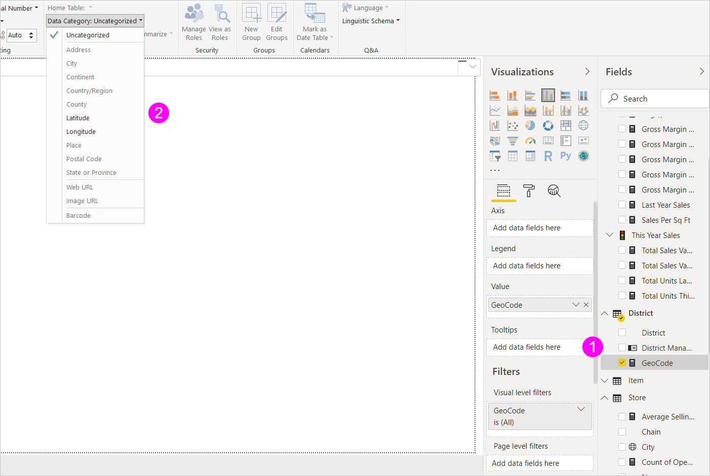

# Gegevenscategorieën opgeven in Power BI Desktop
In Power BI Desktop kunt u de *gegevenscategorie* voor een kolom opgeven, zodat Power BI Desktop weet hoe de waarden ervan moeten worden behandeld in een visualisatie.

Als in Power BI Desktop gegevens worden geïmporteerd, wordt andere informatie opgehaald dan de gegevens zelf, zoals de tabel- en kolomnamen, en of de gegevens een primaire sleutel zijn. Met die informatie doet Power BI Desktop enkele veronderstellingen over hoe u een goede standaardervaring kunt krijgen bij het maken van een visualisatie.
Wanneer een kolom bijvoorbeeld numerieke waarden bevat, wilt u deze waarschijnlijk op een bepaalde manier aggregeren zodat de kolom in Power BI Desktop in het gebied **Waarden** van het deelvenster **Visualisaties** wordt geplaatst. Of, voor een kolom met datum-/tijdwaarden in een lijndiagram, wordt in Power BI Desktop aangenomen dat u deze waarschijnlijk als een tijdhiërarchie-as wilt gebruiken.

Maar een aantal gevallen vormt een grotere uitdaging, zoals geografie. Bekijk de volgende tabel uit een Excel-werkblad:

Moet Power BI Desktop de codes in de kolom **GeoCode** behandelen als een afkorting voor een land of een Amerikaanse staat?  Dat is niet duidelijk omdat een code zoals deze beide kan betekenen. AL kan bijvoorbeeld staan voor Alabama of Albanië, AR kan staan voor Arkansas of Argentinië, en CA kan staan voor Californië of Canada. Het maakt een verschil wanneer we ons GeoCode-veld op een kaart plaatsen. 

Moet Power BI Desktop een afbeelding van de wereld weergeven waarin landen zijn gemarkeerd? Of moet er een afbeelding van de Verenigde Staten worden weergegeven waarin de staten zijn gemarkeerd?  Voor gegevens zoals deze kunt u een gegevenscategorie opgeven. Gegevenscategorisatie biedt een verdere verfijning van de informatie die Power BI Desktop kan gebruiken om de beste visualisaties te verstrekken.  

**Een gegevenscategorie opgeven**

1. Selecteer in de **rapportweergave** of **gegevensweergave** in de lijst **Velden** het veld dat u op een andere categorisatie wilt sorteren.
2. Selecteer op het lint in het gedeelte **Eigenschappen** van het tabblad **Model maken** de vervolgkeuzepijl naast **Gegevenscategorie**.  In deze lijst worden de gegevenscategorieën weergegeven die u kunt kiezen voor uw kolom. Sommige selecties zijn mogelijk uitgeschakeld als ze niet werken met het huidige gegevenstype van uw kolom.  Als een kolom bijvoorbeeld van het gegevenstype Datum/tijd is, staat Power BI Desktop u niet toe om geografische gegevenscategorieën te kiezen. 
3. Selecteer de gewenste categorie.

   

Mogelijk hebt u ook interesse voor informatie over [geografische filters voor mobiele Power BI-apps](desktop-mobile-geofiltering.md).