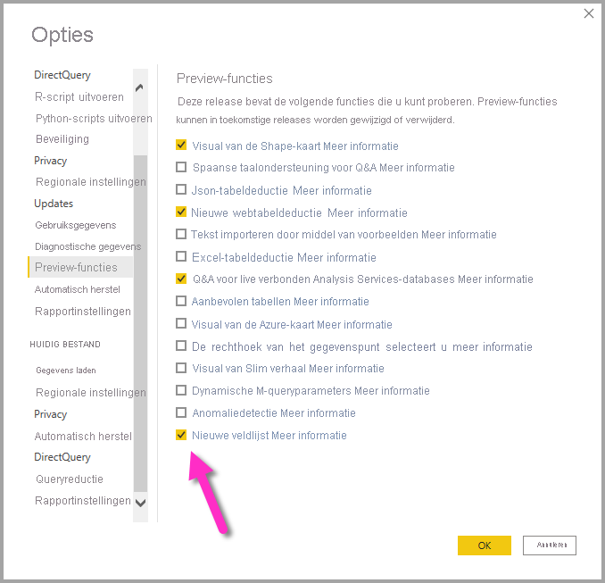
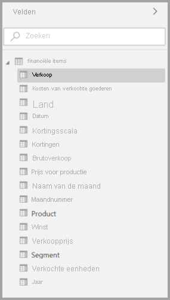
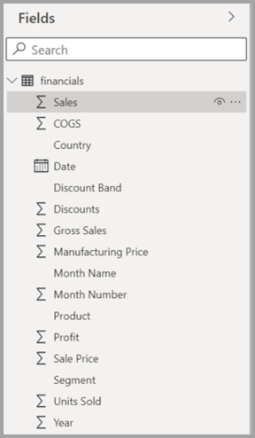
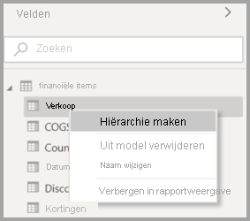
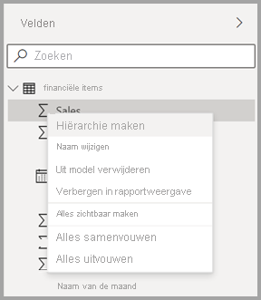
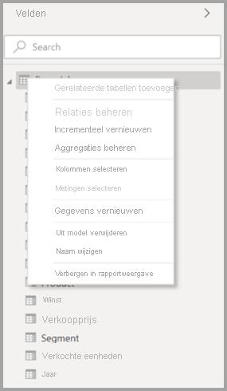
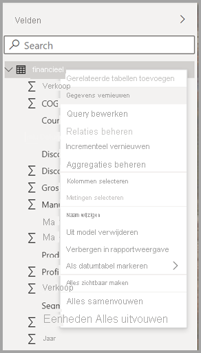
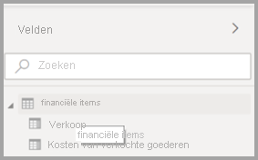
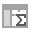

# De lijst met velden in Power BI Desktop (preview) gebruiken

Vanaf de update van november 2020 worden de lijsten met **velden** in de weergaven van modellen, gegevens en rapporten in Power BI Desktop samengevoegd. Het samenvoegen van deze weergaven zorgt voor consistentie voor de functionaliteit en de gebruikersinterface (UI) in de verschillende weergaven en maakt het mogelijk de feedback van de klant te behandelen.

Wijzigingen die u zult opmerken in de verschillende weergaven zijn onder andere:

* Pictogrammen
* Zoekfunctionaliteit
* Contextmenu-items
* Vergelijkbaar gedrag bij slepen en neerzetten
* Knopinfo
* Verbeterde toegankelijkheid

De intentie is om de bruikbaarheid van Power BI Desktop te verbeteren. De wijzigingen hebben minimale impact op uw normale gegevenswerkstroom.

## Nieuwe lijst met velden (preview-versie)

De samengevoegde lijst met velden begint met de weergave **Model** en wordt vervolgens ingeschakeld voor andere weergaven. U kunt de samengevoegde veldweergave in Power BI Desktop inschakelen door naar **Bestand > Opties en instellingen > Opties** te gaan en **Preview-functies** in het linkerdeelvenster te selecteren. Schakel in de sectie Preview-functies het selectievakje in naast de **lijst met nieuwe velden**.

U wordt gevraagd om Power BI Desktop opnieuw op te starten om de selectie van kracht te laten worden.

## Wijzigingen in lijst met velden

De lijstwijzigingen worden in de onderstaande tabellen weergegeven. 

|**Oorspronkelijke lijst met velden (modelweergave)**  | **Nieuwe lijst met velden (modelweergave)**  |
|:---------:|:---------:|
|**Oorspronkelijk** |**Nieuw** |
|**Pictogrammen en UI**       ||
|     |    |
|**Contextmenu - Veld**       ||
|     |    |
|**Contextmenu - Tabel**       ||
|     |    |
|**Knopinfo**       ||
|     |    |

Er zijn ook nieuwe pictogrammen voor lijsten met velden. De volgende tabel bevat de oorspronkelijke pictogrammen en hun nieuwe equivalent en biedt een korte beschrijving van elk van deze pictogrammen. 

|Oorspronkelijk pictogram  |Nieuw pictogram  |Beschrijving  |
|:---------:|:---------:|:---------|
|     |           |Map in de lijst Velden         |
|     |         |Numeriek veld: Numerieke velden zijn aggregaties die bijvoorbeeld kunnen worden opgeteld of waarvoor een gemiddelde kan worden berekend. Aggregaties worden samen met de gegevens geïmporteerd en zijn gedefinieerd in het gegevensmodel waarop uw rapport is gebaseerd. Zie [Aggregates in Power BI reports](../create-reports/service-aggregates.md) (Aggregaties in Power BI-rapporten) voor meer informatie.         |
|     |         |Berekende kolom met een niet-numeriek gegevenstype: Een nieuwe niet-numerieke kolom die u maakt met een DAX-formule (Data Analysis Expressions) waarmee de waarden van de kolom worden gedefinieerd. Meer informatie over [berekende kolommen](desktop-calculated-columns.md).        |
|     |          |Numerieke berekende kolom: Een nieuwe kolom die u maakt met een DAX-formule (Data Analysis Expressions) waarmee de waarden van de kolom worden gedefinieerd. Meer informatie over [berekende kolommen](desktop-calculated-columns.md).         |
|     |          |Meting: Een meting heeft een eigen, in code vastgelegde formule. U kunt de berekening in een rapportweergave niet wijzigen. Een som kan bijvoorbeeld alleen maar een som zijn. De waarden worden niet opgeslagen in een kolom. Ze worden ter plekke berekend, uitsluitend op basis van de locatie ervan in een visual. Lees [Informatie over metingen](desktop-measures.md) voor meer informatie.         |
|     |         |Meetgroep.         |
|     |         |KPI: Een visuele aanwijzing waarmee de voortgang naar een meetbaar doel wordt aangegeven. Meer informatie over [KPI-visuals (Key Performance Indicator)](../visuals/power-bi-visualization-kpi.md).         |
|     |           |Hiërarchie van velden: Selecteer de pijl om de velden in de hiërarchie weer te geven. Bekijk deze Power BI-video op YouTube over [het maken van en werken met hiërarchieën](https://www.youtube.com/watch?v=q8WDUAiTGeU) voor meer informatie.         |
|     |         |Geografische gegevens: Deze locatievelden kunnen worden gebruikt om kaartvisualisaties te maken.         |
|     |          |Identiteitsveld: Velden met dit pictogram zijn unieke velden die zijn ingesteld op het weergeven van alle waarden, ook als deze duplicaten bevatten. Als uw gegevens bijvoorbeeld records bevatten voor twee verschillende mensen met de naam 'Robin Smith', wordt elk record als uniek beschouwd. Deze worden niet samengevoegd.         |
|     |          |Parameter: Stel parameters in om delen van uw rapporten en gegevensmodellen (zoals een queryfilter, een gegevensbronverwijzing of een metingsdefinitie) te laten afhangen van een of meer parameterwaarden. Zie deze Power BI-blogpost over [queryparameters](https://powerbi.microsoft.com/blog/deep-dive-into-query-parameters-and-power-bi-templates/) voor meer informatie.         |
|     |         |Agendadatumveld met een ingebouwde datumtabel.         |
|     |          |Berekende tabel: Een tabel die is gemaakt met een DAX-formule (Data Analysis Expressions) op basis van gegevens die al in het model zijn geladen. Deze kunnen het beste worden gebruikt voor tussentijdse berekeningen en gegevens die u als onderdeel van het model wilt opslaan.         |
|     |         |Waarschuwing: Een berekend veld met een fout. De syntaxis van de DAX-expressie kan bijvoorbeeld onjuist zijn.         |
|     |         |Groep: De waarden in deze kolom zijn gebaseerd op het groeperen van waarden uit een andere kolom door gebruik te maken van de functie voor groepen en opslaglocaties. Meer informatie over [het gebruiken van groepering en opslaglocaties](../create-reports/desktop-grouping-and-binning.md).         |
| geen oorspronkelijk pictogram    |          |Detectiemeting wijzigen: Wanneer u een pagina configureert voor automatische paginavernieuwing, kunt u de optie [Detectiemeting wijzigen](../create-reports/desktop-grouping-and-binning.md) configureren waarop een query wordt uitgevoerd om te bepalen of de rest van de visuals van een pagina moet worden bijgewerkt.         |

## Volgende stappen

Wellicht bent u ook geïnteresseerd in de volgende artikelen:

* [Berekende kolommen maken in Power BI Desktop](desktop-calculated-columns.md)
* [Use grouping and binning in Power BI Desktop](../create-reports/desktop-grouping-and-binning.md) (Groeperen en binning in Power BI Desktop gebruiken)
* [Rasterlijnen en Uitlijnen op raster gebruiken in Power BI Desktop-rapporten](../create-reports/desktop-gridlines-snap-to-grid.md)

