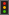
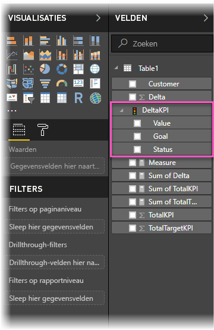
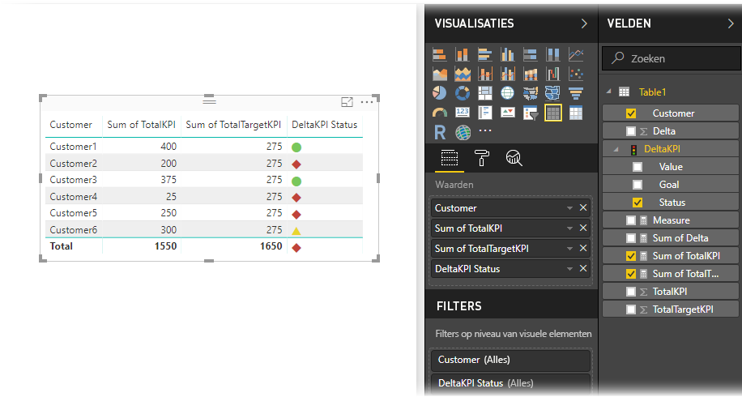

# KPI's importeren en weergeven in Power BI
Met **Power BI Desktop** kunt u KPI's importeren en weergeven in tabellen, matrices en kaarten.

Volg deze stappen om KPI's te importeren en weer te geven.

1. Begin met een Excel-werkmap die een Power Pivot-model en KPI's bevat. In deze oefening wordt een werkmap met de naam *KPIs* gebruikt.

1. Importeer het Excel-werkboek in Power BI met behulp van **Bestand -> Importeren -> Inhoud van Excel-werkmap**. U kunt ook [leren hoe u werkmappen importeert](../connect-data/desktop-import-excel-workbooks.md). 

1. Na het importeren in Power BI verschijnt uw KPI in het deelvenster **Velden**, gemarkeerd met het pictogram. Als u een KPI in uw rapport wilt gebruiken, moet u de inhoud ervan uitbreiden en de velden **Waarde**, **Doel** en **Status** zichtbaar maken.

    
 
1. Geïmporteerde KPI's kunnen het best worden gebruikt in de standaardvisualisatietypen, zoals **Tabel**. Power BI bevat ook het visualisatietype **KPI**, dat alleen mag worden gebruikt voor het maken van nieuwe KPI's.
   
    

Zo eenvoudig werkt dat. U kunt KPI's gebruiken om trends, voortgang of andere belangrijke indicatoren te markeren.
